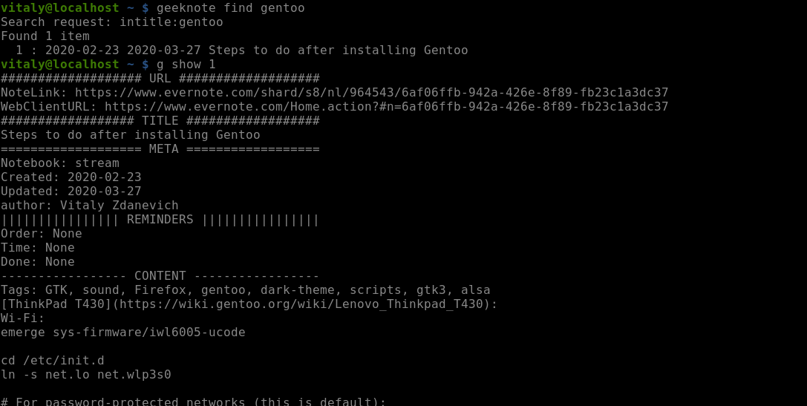
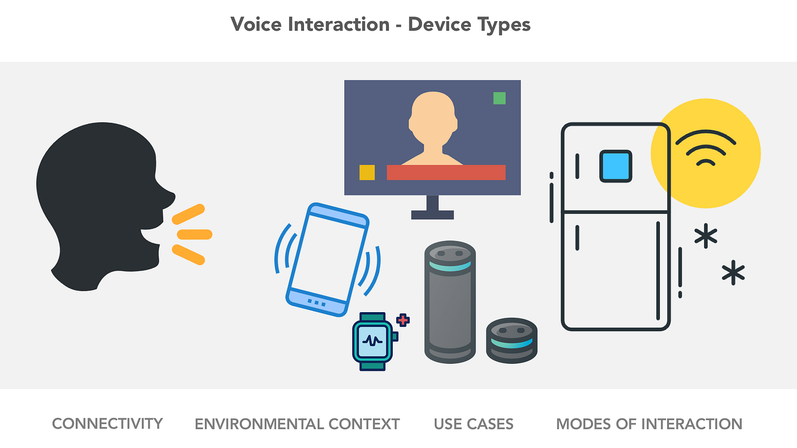
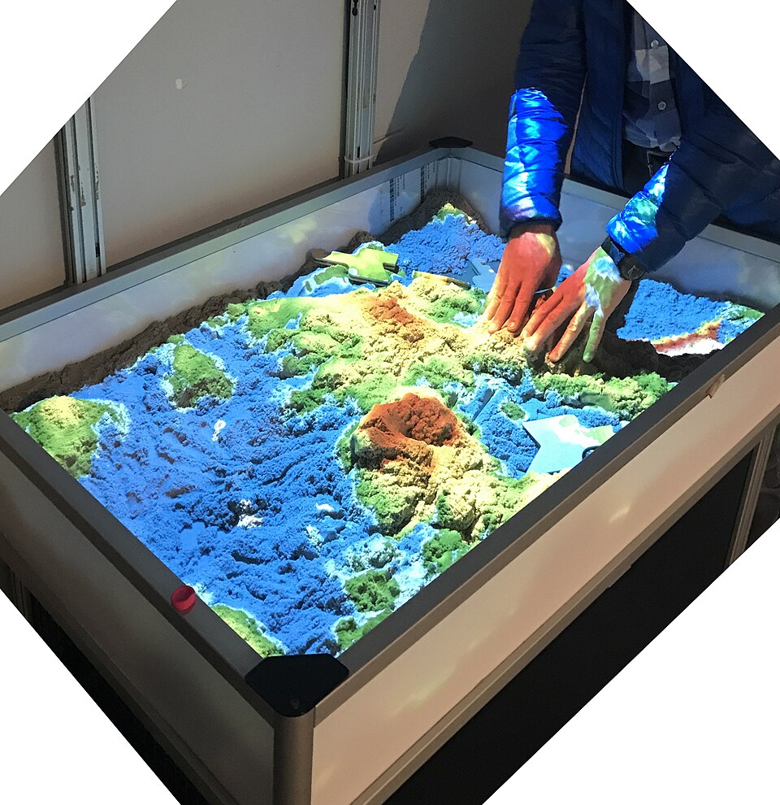
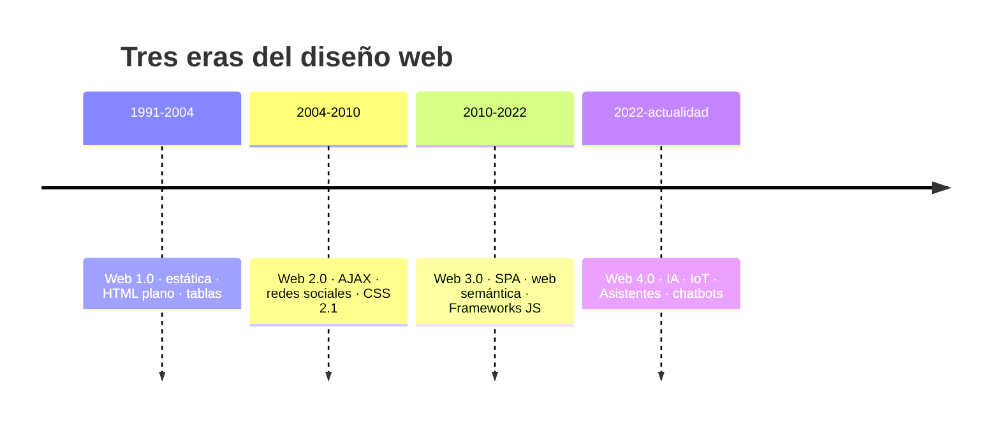
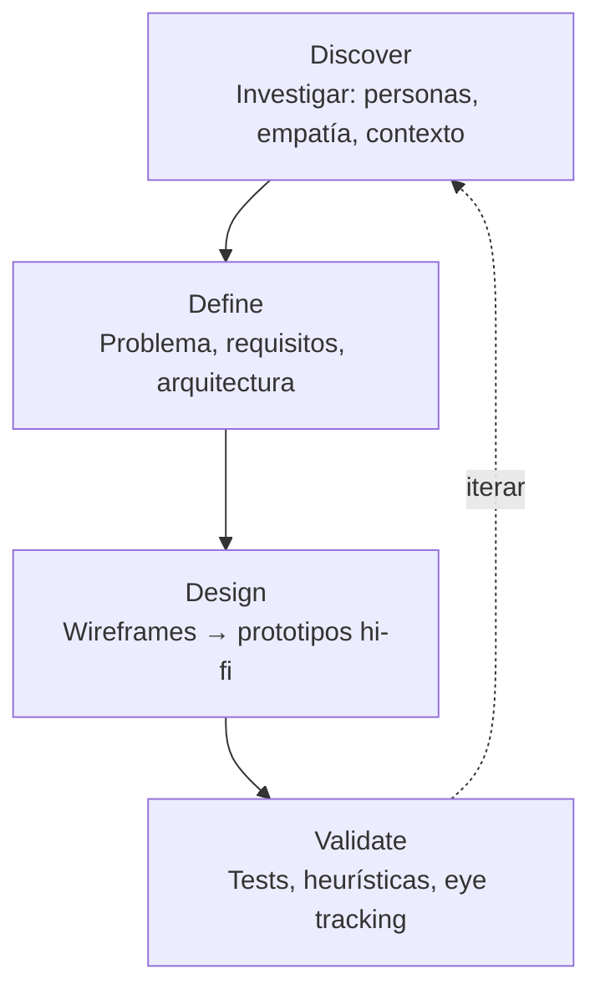

# Diseño de Interfaces Web

## Unidad 1 · Introducción al Diseño de Interfaces Web

**Módulo 0615 · Diseño de Interfaces Web**  
CFGS Desarrollo de Aplicaciones Web (DAW)

---

## Objetivos de aprendizaje · I

- <span class="fragment">Definir el concepto de **interfaz web**, clasificar sus tipos y comprender su evolución histórica</span>
- <span class="fragment">Distinguir entre **usabilidad, UX y UI**: responsabilidades y límites de cada disciplina</span>
- <span class="fragment">Aplicar la **comunicación visual** y la **teoría de la percepción (Gestalt)** a páginas web sencillas</span>
- <span class="fragment">Analizar críticamente **interfaces reales** identificando los principios visuales empleados y su impacto en la experiencia</span>

Note: Los siete objetivos se reparten entre teoría (1-4), práctica (5) y evaluación (6-7). El objetivo 7 es transversal a todo el curso: cualquier decisión de diseño habrá de justificarse con argumentos técnicos, perceptivos o funcionales, nunca con "me gusta". Pregunta para el aula: ¿cuántas veces habéis elegido un color o una fuente "porque sí"?

---

## Objetivos de aprendizaje · II

- <span class="fragment">Construir **prototipos visuales** en HTML y CSS que apliquen los principios de diseño estudiados</span>
- <span class="fragment">Evaluar la **accesibilidad y usabilidad** aplicando las pautas de **DCU** conforme a la norma **ISO 9241-210**</span>
- <span class="fragment">Justificar las decisiones de diseño adoptadas con criterios **técnicos, perceptivos y funcionales**</span>

<div style="font-size: 0.8rem; text-align: left;">
<span class="mini">Vinculación con los RA oficiales del módulo 0615 (RD 405/2023, BOE; currículo DAW en Andalucía): <strong>RA1</strong> planifica la interfaz · <strong>RA2</strong> crea interfaces homogéneas definiendo y aplicando estilos · <strong>RA4</strong> integra contenido multimedia · <strong>RA5</strong> desarrolla interfaces accesibles · <strong>RA6</strong> desarrolla interfaces amigables (usabilidad).</span>
</div>

Note: Esta unidad alimenta cinco Resultados de Aprendizaje del módulo, desde planificar hasta evaluar accesibilidad y usabilidad. Señalad que RA2 (estilos) ya empieza aquí con los ejemplos CSS comentados, aunque se profundizará en la Unidad 8. Recordad que defender propuestas ante el grupo se valora como competencia comunicativa.

---

## Motivación inicial

<span class="fragment">El cerebro forma una **primera impresión visual en ~50 ms**… sin leer ni un solo texto.</span>

<span class="fragment">¿Por qué Google transmite confianza con casi nada, y Amazon nos deja escanear miles de productos sin perdernos?</span>

<span class="fragment">No es magia: son **principios de percepción** aplicados con criterio.</span>

Note: En esos 50 milisegundos no leemos: percibimos formas, colores, agrupaciones y contrastes. Podéis abrir dos webs muy distintas (p. ej., Google y una tienda recargada) y pedir al aula que diga qué siente antes de leer nada. Ese "sentimiento" es precisamente lo que esta unidad aprende a diseñar.

---

## ¿Qué es una interfaz web?

<span class="fragment">Capa mediadora entre el **sistema** (servidores, bases de datos, lógica de negocio) y la **persona usuaria** (navegador).</span>

<span class="fragment">Traduce operaciones complejas en elementos comprensibles: botones, formularios, menús, iconos, tipografías y colores.</span>

<div style="display: grid; grid-template-columns: 1fr 1fr; gap: 0.6rem; font-size: 1rem; text-align: left;">
  <div class="fragment"><strong>Navegación</strong><br>menús, breadcrumbs, búsqueda, paginación</div>
  <div class="fragment"><strong>Contenido</strong><br>texto, imágenes, vídeo, tablas, gráficos, mapas</div>
  <div class="fragment"><strong>Interacción</strong><br>botones, formularios, toggles, sliders, modales, tooltips</div>
  <div class="fragment"><strong>Retroalimentación</strong><br>cargas, progreso, notificaciones, hover, alertas de error</div>
</div>

Note: La interfaz no es solo la pantalla: es la frontera completa de comunicación entre persona y sistema. Pedid ejemplos de cada componente en apps que usen a diario. El de retroalimentación suele ser el más olvidado por estudiantes: si el sistema no responde, la persona cree que la interfaz está rota.

---

## Tipos de interfaces

<div style="font-size: 2rem;">

| Tipo | Base | Presencia web |
|------|------|---------------|
| **CLI** | Texto puro | npm, git, ssh, gestión de servidores |
| **GUI** | Metáfora del escritorio | Dominante: Xerox PARC (1973) → Macintosh (1984) |
| **NUI** | Interacción directa | touchstart/touchmove/touchend, swipe, pinch-zoom |
| **VUI** | Voz | Alexa, Google Assistant, Siri |
| **TUI** | Tangible | Sintetizador MIDI, maqueta con movimiento |
| **Conversacional** | Voz | ChatGPT, Gemini |


</div>

<span class="fragment">La GUI gobierna la web; la NUI la usamos a diario en el móvil; la VUI crece con los asistentes virtuales.</span>

Note: Aunque la GUI domina, la CLI sigue viva en nuestro día a día profesional: npm, git, ssh. La NUI ya la practicamos todos los días con gestos táctiles. Pregunta para el aula: ¿qué interfaz usaríais si no pudierais tocar ninguna pantalla ni hablar?

---

## Tipos de interfaces

<div style="display: grid; grid-template-columns: .25fr 1fr .25fr 1fr .25fr 1fr; gap: 0.6rem; font-size: 1.5rem; text-align: left;">

<div class="fragment">
<mark>GUI</mark>
</div>

<div class="fragment">

</div>

<div class="fragment">
<mark>CLI</mark>
</div>

<div class="fragment">

</div>

<div class="fragment">
<mark>VUI</mark>
</div>

<div class="fragment">

</div>

<div class="fragment">
<mark>NUI</mark>
</div>

<div class="fragment">

</div>

<div class="fragment">
<mark>TUI</mark>
</div>

<div class="fragment">

</div>

</div>

---

## Evolución del diseño web



<span class="fragment">Cada era cambia la mentalidad: **mostrar** información → **participar** → **anticiparse** con datos e IA.</span>

Note: Tres eras, tres mentalidades. La línea no es perfecta: hoy convivimos con tecnologías de las tres eras en la misma sesión de navegación. Aprovechad para situar cronológicamente a vuestros propios primeros recuerdos de internet.

---

## Las eras, en detalle

<div style="font-size: 0.85rem;">

| | **Web 1.0** (1991-2004) | **Web 2.0** (2004-2010) | **Web 3.0** (2010-2022) | **Web 4.0** (2022-hoy) |
|---|---|---|---|---|
| Tecnología | HTML plano, table-based layout, 56 kbps | AJAX, CSS 2.1, contenido UGC | SPA, IA tradicional, blockchain | IA Generativa (LLMs), Agentes autónomos, Web Espacial (XR) |
| Estética | Colores planos, fuentes de sistema (Arial, Times, Courier) | Degradados, reflejos, sombras, esquinas redondeadas | Limpio, espacios generosos, mobile-first | Interfaces conversacionales (CUI), UI generada dinámicamente, diseño predictivo |
| Hitos | Google (1998), Yahoo! | WordPress, Facebook, Twitter, YouTube | React, Vue, Angular | ChatGPT, Copilot, modelos open-source en local, frameworks impulsados por IA |
| Conceptos | Solo lectura | Usabilidad (Jakob Nielsen), UX (Donald Norman) | Flexbox, Grid, clamp(), min() | Container Queries, View Transitions, CSS Nesting, Simbiosis humano-máquina |

</div>

<span class="fragment">2024: **más del 60% del tráfico web mundial** proviene de dispositivos móviles.</span>

Note: Fijaros en el salto de 1.0 a 2.0: de "solo lectura" a "participación". Jakob Nielsen acuñó "usabilidad" y Donald Norman popularizó "experiencia de usuario" durante la era 2.0. El dato del 60% de tráfico móvil en 2024 justifica el enfoque mobile-first que veremos a continuación.

---

## Responsive y PWA
<div style="font-size: 1.85rem;">

- <span class="fragment"><strong>Responsive</strong> (Ethan Marcotte, 2010): rejillas flexibles (%) + medios flexibles + <em>media queries</em></span>
- <span class="fragment"><strong>Mobile-first</strong> (Luke Wroblewski): diseñar primero para la pantalla pequeña y añadir complejidad hacia arriba</span>
- <span class="fragment"><strong>PWA</strong> (impulsadas por Google desde 2015): service workers + manifiesto web (JSON) + HTTPS</span>
- <span class="fragment">Resultado: **instalables, offline, notificaciones push** — convergencia web / app nativa</span>
- <span class="fragment">Ejemplos: Twitter Lite, Pinterest, Uber, Spotify Web Player</span>

</div>

Note: Ethan Marcotte acuñó "responsive" en 2010 y Luke Wroblewski "mobile-first". Las PWAs borran la frontera entre web y app nativa. Reto práctico para casa: abrid spotify.com o pinterest.com en el móvil y probad a instalarlos como aplicación.

---

## DCU · ISO 9241-210

<div style="font-size: 1.85rem;">
<span class="fragment">Filosofía y metodología que sitúa a la **persona usuaria en el centro** de todas las decisiones de diseño.</span>

<span class="fragment">Norma internacional: *Ergonomics of human-system interaction — Human-centred design for interactive systems*.</span>

- <span class="fragment">Basarse en una **comprensión explícita** de usuarios, tareas y entornos (entrevistas, observación contextual, encuestas, tests A/B)</span>
- <span class="fragment"><strong>Participación activa</strong> de las personas usuarias durante todo el proceso</span>
- <span class="fragment">Decisiones impulsadas por **evaluaciones centradas en usuarios**, no en opiniones del equipo</span>


</div>

Note: ISO 9241-210 es la norma de referencia internacional para el DCU, y sus seis principios no son opiniones: son requisitos auditables. Insistid en el principio iterativo: diseñar "de una vez" es la causa número uno de productos que nadie usa.

---

## DCU · ISO 9241-210

<div style="font-size: 1.85rem;">
<span class="fragment">Filosofía y metodología que sitúa a la **persona usuaria en el centro** de todas las decisiones de diseño.</span>

<span class="fragment">Norma internacional: *Ergonomics of human-system interaction — Human-centred design for interactive systems*.</span>

- <span class="fragment">Proceso **iterativo**: cada ciclo de prototipado y evaluación mejora el siguiente</span>
- <span class="fragment">Abordar la **experiencia completa**: emoción, estética y hedonismo, no solo eficiencia</span>
- <span class="fragment">Equipo **multidisciplinar**: diseño, psicología cognitiva, ingeniería, antropología, marketing</span>

</div>

Note: ISO 9241-210 es la norma de referencia internacional para el DCU, y sus seis principios no son opiniones: son requisitos auditables. Insistid en el principio iterativo: diseñar "de una vez" es la causa número uno de productos que nadie usa.

---

## Fases del proceso DCU



<div style="font-size: 0.8rem; text-align: left;">
<strong>Técnicas:</strong> personas, mapas de empatía, journey maps, card sorting, tree testing, tests moderados/no moderados, 10 heurísticas de Nielsen, test de 5 segundos, embudos.<br>
<strong>Beneficios:</strong> menos rediseños tardíos · menos costes de soporte · más conversión y retención · satisfacción y fidelización · menos errores · cumplimiento de accesibilidad.
</div>

Note: Las cuatro fases no son lineales: el bucle de iteración es lo esencial. Cada técnica citada la volveremos a ver en profundidad en unidades posteriores. Pregunta: ¿qué fase suelen saltarse los equipos con prisa? Normalmente la investigación.

---

## UI vs UX

<div style="font-size: 1.5rem;">

| | **UI** (User Interface) | **UX** (User Experience) |
|---|---|---|
| Es | La capa visual, la "piel" del producto | La vivencia global: emoción + utilidad |
| Incluye | Color, tipografía, iconos, espaciado, estados, animaciones | Arquitectura de información, flujos, velocidad, claridad, accesibilidad, confianza |
| Entregas | Mockups hi-fi, design systems, assets (SVG, WebP, woff2) | Personas, wireframes, tests de usabilidad |

</div>

<span class="fragment">Relación **simbiótica**: bella pero inutilizable = fracaso UX; funcional pero descuidada = desconfianza.</span>

<span class="fragment">Massimo Vignelli: *"Si puedes diseñar una cosa, puedes diseñar todo."</span>

Note: UI es parte de UX, no lo contrario. La cita de Vignelli resume la visión holística: el diseño integra psicología cognitiva, estética, tecnología y negocio. Buena UX sin buena UI es imposible, y viceversa.

---

## Responsabilidades UI / UX

<div style="display: grid; grid-template-columns: 1fr 1fr; gap: 0.6rem; font-size: 1.8rem; text-align: left;">
  <div class="fragment"><strong>Diseñador UI</strong><br>· Design systems y librerías de componentes<br>· Reglas de espaciado y alineación<br>· Familias y escalas tipográficas<br>· Paletas con ratios de contraste WCAG<br>· Iconografía coherente + microinteracciones<br>· Mockups hi-fi (Figma) y entrega de assets</div>
  <div class="fragment"><strong>Diseñador UX</strong><br>· Investigación: entrevistas, encuestas, observación<br>· Personas y escenarios de uso<br>· Arquitectura de la información (card sorting, tree testing)<br>· Flujos de usuario y mapas de navegación<br>· Wireframes de baja fidelidad<br>· Planificar y moderar tests de usabilidad</div>
</div>

Note: En la industria estos roles a menudo recaen en la misma persona, pero las competencias son distintas. Fijaros en los formatos de entrega del UI (SVG, WebP, woff2): ese es el puente con el desarrollo. Y el UX tiene una responsabilidad ética: defender al usuario frente a presiones de negocio.

---

## Comunicación visual · Elementos

<div style="display: grid; grid-template-columns: 1fr 1fr; gap: 0.6rem; font-size: 1.8rem; text-align: left;">
  <div class="fragment"><strong>Punto</strong><br>Unidad mínima: píxel, marcador, indicador de notificación</div>
  <div class="fragment"><strong>Línea</strong><br>Bordes, separadores, guías; horizontal = calma, vertical = fuerza, diagonal = dinamismo</div>
  <div class="fragment"><strong>Forma</strong><br>El modelo de caja CSS; círculo = unidad, cuadrado = estabilidad, triángulo = tensión</div>
  <div class="fragment"><strong>Textura</strong><br>Simulada con patrones, degradados y sombras (box-shadow, text-shadow)</div>
  <div class="fragment"><strong>Espacio</strong><br>margin y padding; elemento activo: agrupa, separa, jerarquiza, da respiro</div>
  <div class="fragment"><strong>Color</strong><br>Máximo impacto emocional; primer atributo que percibe el ojo</div>
</div>

Note: Seis elementos, seis mensajes. El espacio es el que menos valoran los principiantes: no es lo que falta, es lo que organiza. Pregunta rápida: ¿qué elemento tiene más impacto emocional? (Color.) ¿Y cuál da estructura? (Espacio y línea.)

---

## Gestalt · Fundamentos

- <span class="fragment">Escuela alemana, principios del s. XX: **Max Wertheimer, Wolfgang Köhler y Kurt Koffka**</span>
- <span class="fragment">Premisa: el cerebro percibe **totalidades organizadas**, no sumas de partes</span>
- <span class="fragment">*"El todo es más que la suma de las partes"</span>
- <span class="fragment">Consecuencia: la persona usuaria no ve elementos aislados, construye **agrupaciones, jerarquías y patrones** mentalmente</span>
- <span class="fragment">Implicación: una interfaz bien agrupada **se entiende sin explicarse**</span>

Note: Gestalt nació en Alemania a principios del siglo XX. La idea clave: el cerebro no suma píxeles, construye totalidades. Por eso no hay que "explicar" una interfaz bien agrupada: se entiende sola. Es la base científica de todo lo que viene en esta unidad.

---

## Leyes de la Gestalt · I

<div style="display: grid; grid-template-columns: 1fr 1fr; gap: 0.6rem; font-size: 1.8rem; text-align: left;">
  <div class="fragment"><strong>Proximidad</strong><br>Lo cercano se percibe como grupo; el espaciado entre grupos > dentro de cada grupo; label pegado a su campo</div>
  <div class="fragment"><strong>Semejanza</strong><br>Mismos atributos visuales = misma familia; la ruptura deliberada señala la acción principal</div>
  <div class="fragment"><strong>Continuidad</strong><br>El ojo sigue trayectorias suaves: menús alineados, puntos de slider, líneas de tiempo</div>
  <div class="fragment"><strong>Cierre</strong><br>El cerebro completa formas incompletas: flecha de FedEx, barras de carga, pestañas activas</div>
</div>

Note: Cuatro leyes que usaréis a diario. Proximidad: el espaciado agrupa sin bordes. Semejanza: romperla a propósito comunica importancia. Continuidad: alinear guía la mirada. Cierre: la flecha oculta entre la E y la x de FedEx es el ejemplo clásico. Pedid al aula que encuentre una de estas leyes en la web que tengan abierta.

---

## Leyes de la Gestalt · II

<div style="display: grid; grid-template-columns: 1fr 1fr; gap: 0.6rem; font-size: 1.8rem; text-align: left;">
  <div class="fragment"><strong>Figura-fondo</strong><br>La escena se divide en figura (atención) y fondo; base de la legibilidad y los ratios WCAG; modales con overlay oscuro; jarrón de Rubin</div>
  <div class="fragment"><strong>Destino común</strong><br>Lo que se mueve junto, se percibe junto: carruseles, menús desplegables, animaciones sincronizadas</div>
  <div class="fragment" style="grid-column: span 2;"><strong>Experiencia (buena forma)</strong><br>Las convenciones previas guían la percepción: logo arriba-izquierda → inicio · lupa = búsqueda · hamburguesa = menú móvil · subrayado azul = enlace · carrito arriba-derecha · corazón = favorito. Violentarlas genera fricción.</div>
</div>

Note: Figura-fondo es la base del contraste WCAG: sin figura clara no hay legibilidad. El jarrón de Rubin demuestra que la relación puede invertirse: cuidado con fondos ruidosos. La ley de experiencia nos obliga a respetar convenciones: mover el logo o el carrito sin motivo obliga al usuario a "desaprender".

---

## Principios visuales · Unidad y Jerarquía

<div style="display: grid; grid-template-columns: 1fr 1fr; gap: 0.6rem; font-size: 1.8rem; text-align: left;">
  <div class="fragment"><strong>Unidad</strong>: un solo sistema<br>· 3-5 colores principales + neutros<br>· 1-2 familias tipográficas<br>· Iconografía consistente (trazo, esquinas)<br>· Espaciado en escala de múltiplos de 4 px (4·8·16·32·64)<br>· Referencias: Material Design, IBM Carbon, Atlassian</div>
  <div class="fragment"><strong>Jerarquía</strong>: ordenar por importancia<br>· Tamaño: lo grande domina<br>· Color: lo vibrante atrae<br>· Posición: arriba/izquierda (lectura occidental)<br>· Espacio en blanco: rodeado = importante<br>· Tipografía: negrita, mayúsculas<br>· Profundidad: sombra y superposición</div>
</div>

Note: Unidad sin jerarquía es monotonía; jerarquía sin unidad es caos. La escala de 4 px es el estándar de facto (Material Design trabaja con 8 dp). Pregunta: ¿cuál de las técnicas de jerarquía es la más barata de aplicar? Tamaño y espacio en blanco: cero coste de implementación.

---

## Principios visuales · Equilibrio y Contraste

<div style="display: grid; grid-template-columns: 1fr 1fr; gap: 0.6rem; font-size: 0.8rem; text-align: left;">
  <div class="fragment"><strong>Equilibrio</strong>: distribuir el peso visual (tamaño, color, posición, complejidad, aislamiento)<br>· <strong>Simétrico</strong>: eje especular → formalidad, orden (corporativo, lujo)<br>· <strong>Asimétrico</strong>: pesos equivalentes distintos → dinamismo (creativo)<br>· <strong>Radial</strong>: alrededor de un punto → movimiento circular</div>
  <div class="fragment"><strong>Contraste</strong>: diferencia que guía la atención (color, tamaño, forma, textura, tipografía, posición, densidad)<br>· **WCAG 2.1 · AA:** 4.5:1 texto normal · 3:1 texto grande (&gt;18 px o 14 px bold)<br>· **WCAG 2.1 · AAA:** 7:1 · 4.5:1</div>
</div>

Note: El peso visual depende de tamaño, color, posición, complejidad y aislamiento. Simétrico = formalidad; asimétrico = dinamismo. Y recordad los números WCAG 2.1: 4.5:1 para texto normal y 3:1 para texto grande en nivel AA. Verificad siempre con el WebAIM Contrast Checker.

---

## Principios visuales · Proporción y Ritmo

<div style="display: grid; grid-template-columns: 1fr 1fr; gap: 0.6rem; font-size: 0.8rem; text-align: left;">
  <div class="fragment"><strong>Proporción</strong>: relación de tamaños<br>· Proporción áurea **1:1.618** (número φ)<br>· Contenedor ↔ barra lateral, cabecera ↔ contenido<br>· Escala tipográfica: cada nivel ≈ 1,6× el anterior</div>
  <div class="fragment"><strong>Ritmo</strong>: repetición que guía la mirada<br>· <strong>Regular</strong>: cuadrícula idéntica (catálogos)<br>· <strong>Alterno</strong>: zigzag texto/imagen (portfolios)<br>· <strong>Progresivo</strong>: crescendo de tamaño (planes de precios)</div>
</div>

Note: La proporción áurea no es mágica, pero genera escalas cómodas: cada encabezado unas 1,6 veces el anterior. El ritmo es lo que diferencia un catálogo ordenado (regular), un portfolio vivo (alterno) y una página de precios (progresivo). Tres patrones, tres sensaciones distintas.

---

## Ejemplo 1 · Proximidad en un formulario

<span class="fragment">El **espaciado** comunica la agrupación: sin bordes ni fondos.</span>

```css
/* Entre grupos: 1.5rem · Dentro del grupo: 0.75rem */
.grupo-campo      { margin-bottom: 1.5rem; }
.campo            { margin-bottom: 0.75rem; }
.campo:last-child { margin-bottom: 0; }

label { display: block; font-weight: 600; margin-bottom: 0.375rem; }
input { width: 100%; padding: 0.75rem 1rem; border: 2px solid #e2e8f0;
        border-radius: 8px; }
input:focus { border-color: #667eea;
              box-shadow: 0 0 0 3px rgba(102, 126, 234, .2); }
```

<div style="font-size: 0.8rem; text-align: left;">Grupos del formulario: <strong>datos personales</strong> (nombre, apellidos, teléfono) · <strong>datos de acceso</strong> (email, contraseña, confirmar)</div>

Note: La clave no son los valores exactos sino la RELACIÓN: 1.5rem entre grupos frente a 0.75rem dentro. Activad DevTools y poned ambos márgenes a 1rem: la estructura desaparece. Eso demuestra que el espaciado comunica, no decora.

---

## Ejemplo 2 · Semejanza en tarjetas

<span class="fragment">Misma estructura, sombra y tipografía = misma familia.</span>

<span class="fragment">La **ruptura** deliberada señala el plan recomendado.</span>

```css
.plan { background: #fff; border-radius: 12px; padding: 2rem;
        box-shadow: 0 4px 6px rgba(0, 0, 0, .07); }

/* Ruptura de semejanza: borde + escala */
.plan.destacado { border: 2px solid #667eea; transform: scale(1.03); }
.plan.destacado .boton-plan { background: #667eea; color: #fff; }
```

Note: Comentad la clase .destacado en DevTools y observad cómo las tres tarjetas quedan idénticas y se pierde la recomendación. La ruptura solo funciona porque el resto obedece a la semejanza. Regla: primero coherencia, después excepción justificada.

---

## Ejemplo 3 · Gestalt en una sección hero

<span class="fragment">Cuatro leyes a la vez: figura-fondo, proximidad, semejanza y cierre.</span>

```css
/* Figura-fondo: overlay oscuro garantiza legibilidad */
.hero { background: linear-gradient(135deg, rgba(30, 30, 60, .85),
                          rgba(10, 10, 30, .7)),
        url('foto.jpg') center/cover; }
.hero h1 { font-size: clamp(2.25rem, 5vw, 3.5rem); color: #fff; }

/* Semejanza: botones gemelos, diferenciados solo por color */
.boton { padding: .875rem 2rem; border-radius: 8px; font-weight: 600; }
```

Note: Aquí trabajan cuatro leyes en sinergia: el overlay convierte el texto en figura, la proximidad agrupa texto y botones, la semejanza une ambos botones y el cierre + destino común crea la flecha de scroll. Jugad con la opacidad del overlay: por debajo de cierto punto la legibilidad se rompe.

---

## Ejemplo 4 · Jerarquía visual en un artículo

<span class="fragment">Cinco niveles construidos solo con **tamaño, color y espacio**.</span>

```css
h1         { font-size: 2.5rem; font-weight: 800; color: #111; }   /* nivel 1 */
.metadatos { font-size: .8rem; color: #999; letter-spacing: 1.5px; } /* nivel 2 */
.entradilla{ font-size: 1.25rem; font-style: italic; color: #666; }  /* nivel 3 */
p          { font-size: 1.1rem; }                                   /* base */
blockquote { border-left: 4px solid #667eea; background: #f0f0ff; }  /* ruptura */
```

Note: Cambiad el título a 1rem en DevTools y veréis colapsar toda la jerarquía en un segundo. Recordad el dato de apertura: 50 ms para la primera impresión; la jerarquía decide exactamente dónde cae esa mirada.

---

## Caso real · Google Search

<span class="fragment">Minimalismo extremo desde 1998: **funcional, no estético**.</span>

- <span class="fragment"><strong>Figura-fondo:</strong> fondo blanco puro; la figura (logo, campo, botones) destaca sin ambigüedad</span>
- <span class="fragment"><strong>Jerarquía</strong> en tres niveles: logo → campo de búsqueda → botones</span>
- <span class="fragment"><strong>Equilibrio simétrico</strong> respecto al eje vertical: estabilidad y confianza</span>
- <span class="fragment"><strong>Proporción:</strong> campo de ~584 px (40-45% del ancho); estudios internos: más ancho sugería "formulario complejo"</span>
- <span class="fragment"><strong>Unidad:</strong> colores corporativos solo en el logo, resto gris, una fuente, múltiplos de 4 px</span>
- <span class="fragment"><strong>Experiencia:</strong> lupa y micrófono, convenciones que Google ayudó a fijar</span>

Note: Google elimina hasta el último elemento decorativo: cada pieza quitada reduce la carga cognitiva y acelera la tarea principal. Antes de añadir cualquier elemento a una interfaz, preguntad si ayuda de verdad o solo añade ruido visual.

---

## Caso real · Amazon

<span class="fragment">El extremo opuesto: **densidad máxima, orquestada**.</span>

- <span class="fragment"><strong>Código cromático:</strong> rojo = precio · amarillo = valoración · azul = enlace · naranja = compra</span>
- <span class="fragment"><strong>Proximidad:</strong> cada producto es una tarjeta; espaciado interno reducido, externo amplio</span>
- <span class="fragment"><strong>Semejanza:</strong> misma estructura en todas las fichas → escaneo rápido de catálogos</span>
- <span class="fragment"><strong>Contraste:</strong> botón de compra de alto impacto; tests A/B que mueven millones de dólares</span>
- <span class="fragment"><strong>Posición serial:</strong> primacía y recencia → patrocinados al inicio, recomendaciones al final</span>
- <span class="fragment"><strong>Chunking:</strong> unidades discretas comparables, nunca un muro de texto</span>

Note: Amazon demuestra que densidad no es sinónimo de caos: chunking + proximidad + semejanza permiten escanear cientos de productos. El código cromático es un idioma que el usuario aprende en segundos. Y el efecto de posición serial explica por qué lo patrocinado va arriba y las recomendaciones, abajo.

---

## Caso real · Airbnb

<span class="fragment">Rediseño de 2014: **diseño emocional + DCU documentado**.</span>

- <span class="fragment"><strong>Foto a plena anchura:</strong> vende el viaje antes que cualquier texto</span>
- <span class="fragment"><strong>Tipografía Cereal</strong> (diseñada a medida): curvas = cercanía y hospitalidad</span>
- <span class="fragment"><strong>Coral #FF5A5F</strong> dosificado al mínimo: logo, CTA principal y favoritos</span>
- <span class="fragment"><strong>Espacio en blanco generoso:</strong> comunica calidad, no cantidad</span>
- <span class="fragment"><strong>Bélo (ley de cierre):</strong> una forma sugiere A + pin + corazón + persona</span>
- <span class="fragment"><strong>DCU real:</strong> etnografía en casas, journey maps, prototipos en papel antes de código</span>

Note: Airbnb diseña emociones: la foto a plena anchura comunica la promesa del producto antes que ningún texto. El coral se dosifica al mínimo para golpear más fuerte. Su DCU incluye investigación etnográfica en casas reales: el usuario no es una hipótesis, es una persona visitable.

---

## Actividad en clase · Análisis Gestalt

<div style="font-size: 0.9rem; text-align: left;">
<strong>Objetivo:</strong> observación crítica de interfaces reales identificando las leyes de la Gestalt.<br>
<strong>Formato:</strong> parejas · 3 sitios proyectados (Netflix, Wikipedia, GitHub) · 30 min por sitio.<br>
<strong>Ficha de análisis:</strong> proximidad · semejanza · figura-fondo · continuidad · cierre.<br>
<strong>Entregable:</strong> ficha por sitio con capturas anotadas señalando gráficamente cada ley.<br>
<strong>Duración:</strong> 90 minutos.
</div>

<div style="font-size: 0.8rem; text-align: left;">
<span class="mini">Más actividades guiadas: rediseño de un formulario mal diseñado (120 min) · landing simétrica vs asimétrica con cuestionario a 3 compañeros (180 min) · evaluación heurística con los 10 principios de Nielsen y gravedad 0-4 (120 min).</span>
</div>

Note: El entregable exige capturas ANOTADAS: señalar con precisión dónde vive cada ley. Si no podéis señalarlo en la captura, no lo habéis identificado de verdad. Repartid Netflix, Wikipedia y GitHub entre los grupos y circulad resolviendo dudas.

---

## Actividades propuestas

<div style="display: grid; grid-template-columns: 1fr 1fr; gap: 0.6rem; font-size: 0.8rem; text-align: left;">
  <div class="fragment"><strong>1. Línea del tiempo interactiva</strong><br>6 hitos (1991 → IA); el propio diseño evoluciona con cada era. Nota ponderada: 25/20/25/20/10.</div>
  <div class="fragment"><strong>2. Auditoría DCU de una web local</strong><br>Discover → Define → Design → Validate. Informe ≥1500 palabras · 2 semanas.</div>
  <div class="fragment"><strong>3. Galería de principios</strong><br>6 secciones demostrativas con controles JS (checkboxes, sliders, radio).</div>
  <div class="fragment"><strong>4. Duelo UI/UX de competidoras</strong><br>P. ej., Netflix vs HBO Max. PDF ≥2000 palabras · parejas.</div>
</div>

<div style="font-size: 0.8rem; text-align: left;">
<span class="mini">Ampliación: diseño especulativo (BCI, WebXR, zero UI, "calm technology" de Mark Weiser) · Design Sprint de Google Ventures (Jake Knapp): Map → Sketch → Decide → Prototype → Test, con crazy 8s · Design System propio documentado.</span>
</div>

Note: Cuatro proyectos para elegir según vuestro ritmo, todos con criterios de evaluación públicos. Las ampliaciones (Design Sprint, design system propio) están pensadas para quien quiera ir más allá. Recordad que en la auditoría DCU el wireframe se valida con personas reales, no con la opinión del grupo.

---

## Buenas prácticas

- <span class="fragment">✅ **Proximidad antes que bordes:** el espaciado agrupa; bordes y fondos son el último recurso</span>
- <span class="fragment">✅ **Escala de espaciado 4/8 px** y solo múltiplos: prohibidos 7, 13 o 23 px</span>
- <span class="fragment">✅ **Contraste intencionado:** cada diferencia debe comunicar algo (rojo = acción destructiva, nunca decoración)</span>
- <span class="fragment">✅ **Mobile-first como filosofía:** si funciona a 320 px, funciona en cualquier pantalla</span>
- <span class="fragment">✅ **Testea con 5 usuarios:** ≈85% de los problemas (Nielsen); 3 rondas de 5 > 1 ronda de 15</span>

Note: Cinco hábitos que os ahorrarán revisiones infinitas. El más potente es el último: 5 usuarios revelan aproximadamente el 85% de los problemas, y añadir más tiene retorno decreciente. Y la escala de 4/8 px: prohibíos escribir 13px o 23px, vuestro yo futuro os lo agradecerá.

---

## Errores frecuentes

- <span class="fragment">❌ **Sesgo estético ("Dribbble-ization"):** bonito ≠ usable; la belleza es consecuencia de la claridad</span>
- <span class="fragment">❌ **Suponer que el usuario lee todo:** las páginas se escanean, no se leen</span>
- <span class="fragment">❌ **Síndrome del árbol de Navidad:** máximo 3-5 colores + neutros y 2 familias tipográficas</span>
- <span class="fragment">❌ **Horror vacui:** el espacio en blanco es un elemento activo que agrupa y jerarquiza</span>
- <span class="fragment">❌ **Diseñar sin observar usuarios reales:** 3-5 personas reales > semanas de debate interno</span>

Note: Cinco trampas clásicas del primer año. El horror vacui merece especial atención: el espacio generoso de Apple comunica calidad, mientras que la saturación comunica descarte. Y el peor de todos es decidir sin mirar a nadie: observad 3-5 personas reales antes de debatir en equipo.

---

## Resumen · Conceptos clave

- <span class="fragment">🎯 Interfaz = frontera de comunicación: **navegación + contenido + interacción + retroalimentación**</span>
- <span class="fragment">🎯 Tres eras: **Web 1.0** (estática) → **Web 2.0** (participación, AJAX) → **Web 3.0** (SPA, IA); responsive y PWA</span>
- <span class="fragment">🎯 **DCU (ISO 9241-210):** 6 principios, 4 fases iterativas, equipo multidisciplinar</span>
- <span class="fragment">🎯 **UI ⊂ UX:** relación simbiótica inseparable</span>
- <span class="fragment">🎯 **Gestalt** (Wertheimer, Köhler, Koffka): 7 leyes que explican cómo percibimos</span>
- <span class="fragment">🎯 **6 principios visuales:** unidad, jerarquía, equilibrio, contraste, proporción, ritmo</span>
- <span class="fragment">🎯 **WCAG 2.1:** 4.5:1 / 3:1 (AA) · 7:1 / 4.5:1 (AAA)</span>
- <span class="fragment">🎯 Objetivo final: **mirada crítica y criterio fundamentado**, no memorización</span>

Note: Si solo recordáis una cosa: la Gestalt explica CÓMO percibimos y los seis principios explican CÓMO organizamos. No son curiosidades académicas: cada regla se traduce a CSS concreto, como hemos visto en los ejemplos. El objetivo de la unidad es una mirada crítica permanente, no memorizar definiciones.

---

## Recursos clave

<div style="display: grid; grid-template-columns: 1fr 1fr; gap: 0.6rem; font-size: 0.75rem; text-align: left;">
  <div><strong>Lecturas de referencia</strong><br>Krug · <em>Don't Make Me Think</em> (2014)<br>Norman · <em>The Design of Everyday Things</em> (2013)<br>Lidwell, Holden y Butler · <em>Universal Principles of Design</em> (125 principios, 2010)<br>Lupton · <em>Thinking with Type</em> (2011)<br>Marcotte · <em>Responsive Web Design</em> (2011)<br>Wroblewski · <em>Mobile First</em> (2012)</div>
  <div><strong>Normas y herramientas</strong><br>ISO 9241-210:2019 · WCAG 2.1 (W3C)<br>Figma · Coolors · Adobe Color<br>WebAIM Contrast Checker · NNgroup<br>Google Fonts · Awwwards<br>Vídeos: Jon Yablonski "The Laws of UX" · Scott Klemmer (Stanford) HCI</div>
</div>

Note: Krug y Norman son lecturas de referencia del sector; "Universal Principles of Design" reúne 125 principios con ejemplos visuales. Para trabajar mañana mismo: Coolors para paletas, WebAIM para contrastes y Awwwards para analizar tendencias. Todo gratuito, incluido el plan de Figma para estudiantes.

---

## Próximos pasos

<span class="fragment">A continuación: **Unidad 2 · Psicología del Diseño**</span>

- <span class="fragment">Atención, memoria y carga cognitiva: por qué el cerebro hace lo que hace</span>
- <span class="fragment">Leyes psicológicas de la interacción persona-ordenador (p. ej., ley de Hick)</span>
- <span class="fragment">De la percepción (Gestalt) a la conducta real del usuario</span>

<div style="font-size: 0.8rem; text-align: left;"><span class="mini">Antes de la próxima sesión: entregad la actividad elegida y traed anotadas dos interfaces que os hayan frustrado esta semana.</span></div>

Note: La próxima unidad profundiza en la psicología detrás de estas decisiones: por qué el cerebro agrupa, prioriza y olvida. Traed anotadas dos interfaces que os hayan frustrado esta semana: las analizaremos con el nuevo marco teórico.

---

## ¿Preguntas?

Unidad 1 · Introducción al Diseño de Interfaces Web

0615 · DAW · Curso 2025/2026

Note: Cierre de la unidad. Recoged dudas sobre actividades y entregas antes de pasar a Psicología del Diseño. Recordad la frase de Steve Krug: un buen diseño es aquel que no necesita ser explicado.
