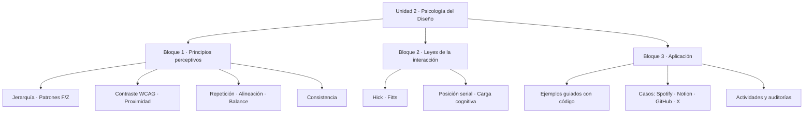
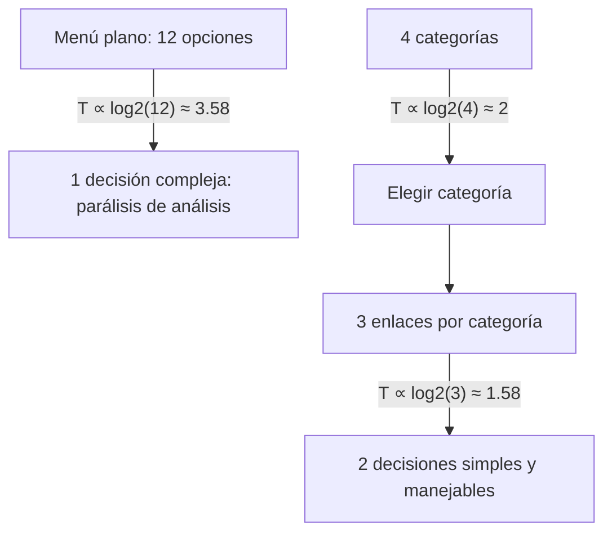
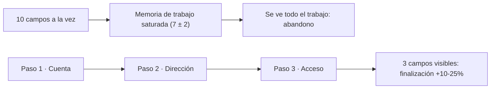

# Diseño de Interfaces Web

## Unidad 2 · Psicología del Diseño

**Módulo 0615 · Diseño de Interfaces Web**  
CFGS Desarrollo de Aplicaciones Web (DAW)

---

## Objetivos de aprendizaje I

<ul style="font-size: 0.95rem;">
  <li><span class="fragment">Aplicar los principios de **jerarquía, contraste, proximidad, repetición, alineación y balance**, justificando cada decisión con fundamentos psicológicos y perceptivos</span></li>
  <li><span class="fragment">Comprender y aplicar las leyes de la interacción persona-ordenador: **Hick, Fitts, efecto de posición serial y carga cognitiva**</span></li>
  <li><span class="fragment">Analizar interfaces reales (**Spotify, Notion, GitHub, Twitter/X**) identificando qué principios se aplican y su impacto en la experiencia de usuario</span></li>
</ul>

Note: Los tres primeros objetivos son analíticos: primero se comprende el porqué perceptivo y luego se busca evidencia en productos reales. Pregunta para abrir la sesión: ¿cuántas veces habéis dimensionado un botón o un menú sin poder explicar por qué?

---

## Objetivos de aprendizaje II

<ul style="font-size: 0.95rem;">
  <li><span class="fragment">Construir diseños que **minimicen la carga cognitiva**, faciliten la toma de decisiones y reduzcan la fricción en la interacción</span></li>
  <li><span class="fragment">Seleccionar y aplicar **patrones de diseño** justificados mediante leyes psicológicas y principios perceptivos</span></li>
  <li><span class="fragment">Evaluar críticamente la **consistencia interna y externa** de una interfaz y proponer mejoras basadas en principios psicológicos</span></li>
</ul>

Note: El objetivo 6 conecta directamente con el resultado de aprendizaje RA5 del módulo (desarrolla interfaces web accesibles): zonas táctiles según Fitts y contraste mínimo según WCAG son accesibilidad motriz y cognitiva. Todo lo visto en esta unidad tiene evaluación asociada.

---

## Motivación inicial

<div style="font-size: 1rem; text-align: left;">

<span class="fragment"><strong>Spotify gestiona millones de canciones… pero su navegación móvil se reduce a 3 pestañas.</strong></span>

<br>

<span class="fragment">¿Por qué recordamos mejor lo primero y lo último de una lista?</span>

<span class="fragment">¿Por qué un botón de 30 px se pulsa mal aunque «se vea elegante»?</span>

<br>

<span class="fragment"><span class="mini">Cada decisión de diseño tiene consecuencias psicológicas medibles: diseñar sin estos principios es construir un puente sin conocer la física.</span></span>

</div>

Note: Lanzad las preguntas antes de mostrar nada y dejad que respondan. La clave es que la psicología no es un adorno académico: explica por qué Spotify funciona y por qué vuestros propios proyectos a veces no. En el ejemplo 3 el alumnado sentirá físicamente la ley de Fitts alternando botones pequeños y grandes en su propio móvil.

---

## Mapa de la unidad



Note: Este es el mapa de ruta de la unidad: principios perceptivos, leyes cuantitativas y aplicación con código y casos reales. Las leyes aportan fórmulas predictivas; los principios, criterio funcional. Aconsejad al alumnado fotografiarse esta diapositiva como checklist de autoevaluación al terminar la semana.

---

## Jerarquía visual

Organiza los elementos **por orden de importancia**: qué es relevante, dónde mirar primero y qué acciones están disponibles.

<ul style="font-size: 0.9rem;">
  <li><span class="fragment"><strong>Tamaño:</strong> el indicador más poderoso; lo grande se percibe importante</span></li>
  <li><span class="fragment"><strong>Color:</strong> lo vibrante y saturado atrae frente a lo neutro</span></li>
  <li><span class="fragment"><strong>Posición:</strong> arriba-izquierda = máxima jerarquía (lectura occidental)</span></li>
  <li><span class="fragment"><strong>Espacio en blanco:</strong> rodear un elemento le otorga peso</span></li>
</ul>

Note: Las técnicas se usan combinadas, nunca aisladas: tamaño y posición trabajando juntos multiplican el efecto. Pregunta para el aula: mirad la última web que visitasteis, ¿cuál fue el primer elemento que vuestro ojo encontró? Si no era el que el diseñador quería, la jerarquía ha fallado.

---

## Patrones de escaneo visual

Trayectoria típica de la mirada, medida con **eye-tracking** por el **Nielsen Norman Group**.

<div style="display: grid; grid-template-columns: 1fr 1fr; gap: 0.6rem; font-size: 0.8rem; text-align: left;">
  <div class="fragment"><strong>Patrón F</strong> · contenido textual<br>1ª línea horizontal completa → 2ª línea más corta → barrido vertical por el margen izquierdo.</div>
  <div class="fragment"><strong>Patrón Z</strong> · landing pages<br>Arriba-izquierda → diagonal descendente → abajo-derecha, donde debe ir la llamada a la acción.</div>
</div>

<span class="fragment" style="font-size: 0.85rem;">La información más importante debe colocarse en las **dos primeras líneas del F**.</span>

Note: Regla práctica: si tu mensaje principal no está en la zona superior izquierda ni en la primera línea, probablemente nadie lo vea. En las landings, el botón de acción va siempre abajo-derecha, al final del recorrido Z.

---

## Contraste

Diferencia perceptible entre elementos. Sin contraste, la interfaz es plana y difícil de navegar; además es **requisito de accesibilidad** (baja visión, cataratas, daltonismo, fatiga visual).

<div style="font-size: 0.9rem;">

| Ratio WCAG 2.1 | Texto normal | Texto grande (&gt;18px o &gt;14px en negrita) |
|---|---|---|
| **AA** (mínimo exigible) | **4.5 : 1** | **3 : 1** |
| **AAA** (máxima exigencia) | 7 : 1 | 4.5 : 1 |

</div>

<span class="fragment" style="font-size: 0.85rem;">Tipos manipulables: <strong>color, tamaño, forma y tipografía</strong>. Verificación: **WebAIM Contrast Checker** · **Stark** (Figma/Sketch/XD) · panel de Accesibilidad de Chrome DevTools.</span>

Note: Si todo es colorido, nada destaca: un único elemento de color vibrante domina la atención (ver caso GitHub). El nivel AA es exigible legalmente en muchos países, así que 4.5:1 en texto normal no es negociable. Verificad siempre con herramienta: el ojo humano es un pésimo medidor de contraste.

---

## Proximidad

Ley de la Gestalt: los elementos **cerca unos de otros se perciben como grupo**. Comunica relaciones sin bordes, fondos ni iconos.

<ul style="font-size: 0.9rem;">
  <li><span class="fragment">Regla de oro: el espacio <em>dentro</em> de un grupo &lt; el espacio <em>entre</em> grupos</span></li>
  <li><span class="fragment">En formularios: la etiqueta debe estar más cerca de su campo que del campo anterior</span></li>
  <li><span class="fragment">El espacio en blanco es un **elemento activo**: agrupa, separa, jerarquiza y da respiro</span></li>
  <li><span class="fragment">Implementación: escala de espaciado con base **8 px** y solo múltiplos (8, 16, 24, 32…)</span></li>
</ul>

Note: Fallo clásico: la etiqueta «Nombre» queda asociada al campo de email porque el espaciado se invirtió, y el usuario rellena el campo equivocado. El espaciado no es decoración, es semántica. Implementadlo como escala de variables CSS desde el día uno.

---

## Repetición

La consistencia en colores, tipografías, formas y espaciados crea **unidad** y reduce la carga cognitiva: lo aprendido en una pantalla se transfiere a la siguiente sin reaprender.

<ul style="font-size: 0.9rem;">
  <li><span class="fragment">Fundamento de los **Design Systems**: Material Design (Google), Carbon (IBM), Atlassian, Shopify</span></li>
  <li><span class="fragment">Componentes reutilizables: botones, tarjetas, formularios, paleta y escala tipográfica</span></li>
  <li><span class="fragment">No implica monotonía: la **variación controlada** mantiene el interés sin romper la coherencia</span></li>
</ul>

Note: Cualquier proyecto, por pequeño, necesita su mini sistema: estilo de botón, de tarjeta y de formulario documentados. En la actividad de ampliación construiremos un mini Design System donde cada patrón documenta el principio psicológico que lo justifica.

---

## Alineación

Ningún elemento se coloca **de forma arbitraria**: cada uno debe conectar visualmente con al menos otro, creando líneas invisibles que guían la mirada y transmiten orden.

<div style="display: grid; grid-template-columns: 1fr 1fr; gap: 0.6rem; font-size: 0.8rem; text-align: left;">
  <div class="fragment"><strong>Izquierda:</strong> la más natural en lenguas occidentales; borde limpio que ancla la mirada.</div>
  <div class="fragment"><strong>Centro:</strong> para titulares y mensajes cortos; dificulta la legibilidad en textos largos.</div>
  <div class="fragment"><strong>Derecha:</strong> datos numéricos en tablas; genera tensión visual asimétrica.</div>
  <div class="fragment"><strong>Justificada:</strong> bordes rectos a ambos lados, pero espaciados irregulares entre palabras.</div>
</div>

<span class="fragment" style="font-size: 0.85rem;">Herramienta fundamental para implementarla: **CSS Grid**.</span>

Note: Consejo práctico: superponed retículas sobre capturas o activad guías en Figma para detectar desalineaciones. Una sola línea invisible rota resta profesionalidad a toda la página, aunque nadie sepa decir por qué.

---

## Balance

Distribución del **peso visual** de los elementos: tamaño, color, posición, complejidad y aislamiento.

<div style="display: grid; grid-template-columns: 1fr 1fr; gap: 0.6rem; font-size: 0.8rem; text-align: left;">
  <div class="fragment"><strong>Simétrico:</strong> transmite estabilidad y formalidad (banca, instituciones).</div>
  <div class="fragment"><strong>Asimétrico:</strong> transmite dinamismo y creatividad (marcas jóvenes, estudios creativos).</div>
</div>

<span class="fragment" style="font-size: 0.85rem;">Existe también el **balance radial**, equilibrando alrededor de un centro. La elección debe alinearse con la **personalidad de la marca** y las expectativas de la audiencia.</span>

Note: Preguntad siempre qué transmite la composición: un banco con balance asimétrico extremo genera desconfianza, y una startup con simetría absoluta puede parecer burocrática. El equilibrio comunica antes que cualquier palabra.

---

## Consistencia

El principio **más importante desde el punto de vista de la UX**: permite transferir el aprendizaje entre pantallas.

<ul style="font-size: 0.9rem;">
  <li><span class="fragment"><strong>Interna:</strong> coherencia dentro del mismo producto (componentes y comportamientos idénticos)</span></li>
  <li><span class="fragment"><strong>Externa:</strong> coherencia con las convenciones del resto de productos y del sistema operativo</span></li>
  <li><span class="fragment">El valor de la **familiaridad**: las personas confían en las interfaces predecibles</span></li>
  <li><span class="fragment">Los **sistemas de diseño** son su herramienta principal</span></li>
</ul>

Note: Distinción clave para el examen: interna = coherencia dentro de mi producto; externa = coherencia con el ecosistema. GitHub gana consistencia externa usando la terminología de Git (commit, push, merge, fork) sin reinventarla, y su curva de aprendizaje cae a casi cero.

---

## Ley de Hick

El tiempo de decisión **aumenta logarítmicamente** con el número de opciones:

<span class="fragment" style="font-size: 1rem;"><strong>T = b × log₂(n + 1)</strong></span>

<ul style="font-size: 0.9rem;">
  <li><span class="fragment">Cada opción adicional en un menú incrementa el tiempo de procesamiento</span></li>
  <li><span class="fragment">Solución: **categorización jerárquica** (15 enlaces → 4 categorías de 3-4 enlaces)</span></li>
  <li><span class="fragment"><strong>Divulgación progresiva:</strong> mostrar inicialmente solo las opciones más utilizadas</span></li>
</ul>

Note: El cerebro prefiere dos decisiones fáciles a una difícil: aunque la suma matemática sea comparable, la carga percibida cambia radicalmente. Lo cuantificamos con números en la siguiente diapositiva.

---

## Hick en la práctica: 12 opciones vs 4 × 3



<span class="fragment" style="font-size: 0.85rem;">Misma complejidad matemática (≈ 3.58), **experiencia subjetiva muy distinta**.</span>

Note: Cronometrad a dos voluntarios localizando «Webinars» en ambas versiones: casi siempre gana la categorización, y la sensación de esfuerzo es menor. Lo importante no es cuántas opciones hay, sino cómo se presentan.

---

## Ley de Fitts

El tiempo para alcanzar un objetivo depende de su **distancia (D)** y su **tamaño (W)**:

<span class="fragment" style="font-size: 1rem;"><strong>T = a + b × log₂(2D / W + 1)</strong></span>

<ul style="font-size: 0.9rem;">
  <li><span class="fragment">Objetivos **grandes y cercanos** = interacción rápida y precisa</span></li>
  <li><span class="fragment">Apple: **44 × 44 pt** mínimos en iOS · Google: **48 × 48 dp** en Material Design</span></li>
  <li><span class="fragment">Mobile: las acciones frecuentes van a la **zona del pulgar** (mitad inferior central)</span></li>
  <li><span class="fragment"><span class="mini">Directrices calibradas para la yema del dedo índice adulto (10-14 mm)</span></span></li>
</ul>

Note: Paul Fitts formuló esta ley en 1954 y sigue vigente: no es una opinión estética, es una ley psicomotriz validada experimentalmente durante décadas. En el ejemplo 3 se experimenta directamente en el móvil, caminando incluso.

---

## Efecto de posición serial

La posición de un elemento en una secuencia determina su probabilidad de recuerdo.

<div style="display: grid; grid-template-columns: 1fr 1fr; gap: 0.6rem; font-size: 0.8rem; text-align: left;">
  <div class="fragment"><strong>Primacía:</strong> los primeros elementos de la lista se recuerdan mejor.</div>
  <div class="fragment"><strong>Recencia:</strong> los últimos elementos también se recuerdan bien.</div>
</div>

<ul style="font-size: 0.9rem;">
  <li><span class="fragment">Los elementos **intermedios** son los peor recordados</span></li>
  <li><span class="fragment">Aplicación: lo importante al **inicio** de menús y listas; CTAs y promociones estratégicas al **final**</span></li>
</ul>

Note: Truco para listas largas: anclar favoritos al inicio y mostrar los elementos más recientes al top, como hace Notion en su barra lateral. El medio de la lista es zona muerta: no pongáis ahí nada crítico.

---

## Carga cognitiva

La memoria de trabajo tiene capacidad limitada: **7 ± 2 elementos** (Miller). Cada elemento a percibir, recordar o procesar consume recursos de esa memoria.

<ul style="font-size: 0.9rem;">
  <li><span class="fragment"><strong>Chunking:</strong> agrupar la información en unidades manejables</span></li>
  <li><span class="fragment"><strong>Fragmentar</strong> procesos complejos en pasos secuenciales</span></li>
  <li><span class="fragment"><strong>Reconocer</strong> en lugar de recordar</span></li>
  <li><span class="fragment">Usar **convenciones familiares** y dar **retroalimentación inmediata**</span></li>
  <li><span class="fragment">Formularios: cada campo adicional incrementa la carga de forma **no lineal**</span></li>
</ul>

Note: Teoría de Sweller aplicada a interfaces: la memoria de trabajo no es un contenedor ilimitado. Dato de impacto: los formularios paso a paso pueden aumentar las conversiones un 10-25% respecto a los monolíticos. La barra de progreso no es ornamento, es motivación medible.

---

## Formularios: monolítico vs paso a paso



Note: En el formulario largo, el usuario ve todo el trabajo que le queda y se desanima antes de empezar. Al fragmentar, cada paso cabe en la memoria de trabajo y la barra de progreso aporta sensación de avance.

---

## Ejemplo 1 · Patrón F en un blog

Página de blog diseñada para aprovechar el patrón de escaneo F.

```css
/* 1ª línea F: el título ocupa toda la anchura */
h1 { font-size: 2.2rem; font-weight: 800; margin-bottom: 0.75rem; }

/* 2ª línea F: metadatos + entradilla */
.metadatos { font-size: 0.8rem; color: #999; text-transform: uppercase; }
.entradilla { font-size: 1.2rem; font-style: italic; border-bottom: 1px solid #e0e0e0; }

/* Barrido vertical: anclas de escaneo en el margen izquierdo */
h2 { font-size: 1.35rem; font-weight: 700; margin-top: 2rem; }
p strong { color: #111; }

/* Ruptura del patrón para capturar atención */
blockquote { border-left: 4px solid #667eea; background: #f0f4ff; padding: 1rem 1.5rem; }
```

Note: Práctica sugerida: leed la página con calma y luego escaneadla en 5 segundos anotando qué retenéis. Retendréis justo lo que cae en las zonas del F: título, entradilla y primeras palabras en negrita de cada párrafo.

---

## Ejemplo 2 · Navegación según Hick

Comparativa: 12 opciones planas frente a 4 categorías de 3 enlaces.

```html
<!-- ❌ 12 opciones planas: T ∝ log2(12) ≈ 3.58 -->
<nav>
  <a>Inicio</a> <a>Servicios web</a> <a>Apps móviles</a>
  <a>Consultoría</a> <a>Blog</a> <a>Guías</a>
  <a>Webinars</a> <a>Contacto</a> <a>Soporte</a> <a>FAQ</a>
</nav>

<!-- ✅ 4 categorías x 3 enlaces: 2 decisiones simples -->
<nav>
  <div class="cat"><span>Empresa</span>
    <a>Inicio</a> <a>Sobre nosotros</a> <a>Historia</a>
  </div>
  <div class="cat"><span>Servicios</span>
    <a>Web</a> <a>Apps</a> <a>Consultoría</a>
  </div>
  <!-- Recursos · Ayuda -->
</nav>
```

Note: Comprobadlo en el navegador: la versión plana produce ansiedad de elección y la categorizada se percibe manejable, aunque la complejidad matemática sea comparable. Dos decisiones fáciles valen más que una difícil.

---

## Ejemplo 3 · Fitts en mobile

Simulación de pantalla de 375 px: botones de 30 px frente a 44 px.

```css
/* ❌ W = 30 px: Índice de Dificultad alto, más errores */
.boton-malo { width: 30px; height: 30px; border-radius: 6px; }

/* ✅ W = 44 px: cumple la directriz de Apple iOS */
.boton-bueno {
  width: 44px; height: 44px;
  border-radius: 12px;
  background: #667eea; color: #fff;
  transition: transform 0.15s;
}
.boton-bueno:active { transform: scale(0.92); } /* feedback inmediato */
```

<span class="fragment" style="font-size: 0.85rem;">Google exige **48 × 48 dp** en Material Design. Con W pequeño, el usuario acaba pulsando el texto en lugar del botón.</span>

Note: Abrid esta página en el móvil y alternad ambos botones, incluso caminando: el de 30 px falla sistemáticamente. La ley de Fitts se siente en el dedo antes de entenderse en la fórmula.

---

## Ejemplo 4 · Formulario paso a paso

De 10 campos monolíticos a 3 pasos de 3-4 campos.

```html
<!-- ✅ Solo 3 campos visibles por paso -->
<div class="paso-indicador">
  <div class="paso completado"></div>
  <div class="paso completado"></div>
  <div class="paso activo"></div>
</div>
<p class="etiqueta-paso">Paso 3 de 3 · Datos de acceso</p>

<label>Contraseña</label>
<input type="password" placeholder="Mínimo 8 caracteres">
<button>Crear cuenta</button>
```

```css
.paso { flex: 1; height: 4px; background: #e2e8f0; border-radius: 2px; }
.paso.activo { background: #667eea; }
.paso.completado { background: #48bb78; }
```

Note: La barra de progreso comunica avance y eleva la tasa de finalización un 10-25%. Recordad: el usuario no debe ver todo el trabajo que le queda, solo el siguiente paso.

---

## Caso real · Spotify

<ul style="font-size: 0.85rem;">
  <li><span class="fragment"><strong>Jerarquía por tamaño y posición:</strong> portada central dominante; controles anclados abajo, en zona de pulgar (Fitts)</span></li>
  <li><span class="fragment"><strong>Consistencia interna extrema:</strong> play siempre igual, portadas siempre cuadradas, artistas siempre enlaces</span></li>
  <li><span class="fragment"><strong>Hick:</strong> millones de canciones → **3 pestañas** en móvil (Inicio, Buscar, Tu Biblioteca)</span></li>
  <li><span class="fragment"><strong>Modo oscuro (#121212):</strong> figura-fondo; las portadas emergen como figura sobre el lienzo neutro</span></li>
  <li><span class="fragment"><strong>Carga cognitiva:</strong> Discover Weekly sustituye 80 millones de canciones por **30 recomendaciones** personalizadas</span></li>
</ul>

<span class="fragment" style="font-size: 0.8rem;">Lección: la complejidad del backend no se transfiere a la interfaz.</span>

Note: Lección central: simplificar no es eliminar funciones, es presentarlas en el momento adecuado. Pedid que identifiquen en la app real cada uno de los cinco puntos: es el caso más completo de la unidad.

---

## Caso real · Notion

<ul style="font-size: 0.85rem;">
  <li><span class="fragment"><strong>Divulgación progresiva:</strong> lienzo en blanco; las opciones aparecen al escribir «/»</span></li>
  <li><span class="fragment"><strong>Jerarquía puramente tipográfica:</strong> tamaño, peso y color; sin bordes ni sombras excesivas</span></li>
  <li><span class="fragment"><strong>Posición serial:</strong> favoritos anclados al inicio (primacía) y recientes al top (recencia)</span></li>
  <li><span class="fragment"><strong>Variación controlada:</strong> espaciado uniforme + acento sutil por bloque (azul bases de datos, verde tareas)</span></li>
  <li><span class="fragment"><strong>Plantillas:</strong> eliminan la carga cognitiva de «¿cómo estructuro esto?»</span></li>
</ul>

<span class="fragment" style="font-size: 0.8rem;">Lección: no limita lo que puedes hacer, sino cuándo aparece cada opción.</span>

Note: El equilibrio entre potencia y simplicidad es el tema central de este caso. Buen debate para el aula: ¿es compatible la flexibilidad casi ilimitada con la baja carga cognitiva?

---

## Caso real · GitHub

<ul style="font-size: 0.85rem;">
  <li><span class="fragment"><strong>Fitts:</strong> Pull requests, Issues, Actions y Projects arriba, con áreas clicables amplias</span></li>
  <li><span class="fragment"><strong>Contraste como jerarquía:</strong> el botón verde «Code» es el único color vibrante de la cabecera</span></li>
  <li><span class="fragment"><strong>Consistencia externa:</strong> terminología Git nativa (commit, push, merge, fork) → curva de aprendizaje ≈ 0</span></li>
  <li><span class="fragment"><strong>Repetición:</strong> visor de código con altura, fuente monoespaciada y numeración uniformes</span></li>
  <li><span class="fragment"><strong>Chunking:</strong> pestañas Conversation / Commits / Files changed en cada Pull Request</span></li>
</ul>

<span class="fragment" style="font-size: 0.8rem;">Lección: para usuarios expertos, eficiencia sobre novedad.</span>

Note: Los desarrolladores no quieren sorpresas, quieren predecibilidad y memoria muscular para repetir tareas cientos de veces al día. Es el contrapunto perfecto a Spotify: misma disciplina, audiencias distintas.

---

## Caso real · Twitter/X

<ul style="font-size: 0.85rem;">
  <li><span class="fragment"><strong>Primacía:</strong> el tweet fijado aparece siempre primero en el perfil</span></li>
  <li><span class="fragment"><strong>Jerarquía por tweet:</strong> autor arriba-izquierda → mensaje central de mayor tamaño → interacciones grises abajo</span></li>
  <li><span class="fragment"><strong>Contraste emocional:</strong> el corazón rojo activo destaca sobre los iconos grises</span></li>
  <li><span class="fragment"><strong>Feedback inmediato:</strong> contador de 280 caracteres; naranja con menos de 20 restantes, rojo al exceder</span></li>
  <li><span class="fragment"><strong>Patrón F en el timeline:</strong> avatares alineados a la izquierda, recorrido confirmado por eye-tracking</span></li>
</ul>

<span class="fragment" style="font-size: 0.8rem;">Lección: incluso en feeds dinámicos con UGC hacen falta jerarquía y gestión de la carga.</span>

Note: Cuanto más contenido dinámico, más importantes son estos principios para evitar el caos visual. El contador de caracteres es retroalimentación inmediata en estado puro: el usuario no tiene que contar, la interfaz le dice.

---

## Actividades en clase

<div style="font-size: 0.9rem;">

| Actividad | Desarrollo | Entregable | Tiempo |
|---|---|---|---|
| **Medición de la Ley de Fitts** | Por parejas: cronometrar clics en botones de 24/32/48/64 px a distintas distancias y comparar con la fórmula | Tabla de tiempos reales vs teóricos + análisis | 60 min |
| **Rediseño de menú (Hick)** | Agrupar 20 enlaces en ≤ 3 niveles, implementarlo en HTML/CSS y probar con 3 compañeros | Código + tabla de tiempos + justificación | 120 min |
| **Carga cognitiva en un registro** | Auditar y cuantificar (escala 1-5) un proceso real; rediseñarlo con chunking y valores por defecto | Informe + wireframes rediseñados | 150 min |

</div>

Note: En la actividad 1 registrad también la frustración subjetiva: los fallos con botones pequeños se notan antes de que el tiempo los refleje. En la 3, recordad etiquetar claramente los campos y marcar los opcionales. Se valorará especialmente la reflexión sobre las implicaciones para el diseño táctil.

---

## Actividades propuestas (autónomas)

<div style="display: grid; grid-template-columns: 1fr 1fr; gap: 0.6rem; font-size: 0.8rem; text-align: left;">
  <div class="fragment"><strong>Calculadora visual de Fitts</strong><br>Sliders de W y D → Índice de Dificultad, animación del cursor y recomendaciones en tiempo real. JS vanilla, responsive.<br><span class="mini">25% fórmula · 25% interfaz · 25% utilidad pedagógica · 25% código</span></div>
  <div class="fragment"><strong>Auditoría de consistencia de una app</strong><br>Color, tipografía, espaciado, interacción y consistencia externa. Informe ≥ 1500 palabras con capturas anotadas e infracciones priorizadas.</div>
  <div class="fragment"><strong>Test A/B de formularios</strong><br>Alta vs baja carga cognitiva con ≥ 10 personas: tiempo de completitud, errores y satisfacción (1-5). Análisis de medias comparativas.</div>
  <div class="fragment"><strong>Ampliación</strong><br>Mini Design System con patrones Hick, Fitts, carga y consistencia · eye-tracking simulado (Reddit, Wikipedia, BBC) · leyes emergentes: <span class="mini">Jakob, Tesler, Von Restorff, Zeigarnik, Pareto</span></div>
</div>

Note: La calculadora de Fitts es la propuesta de mayor valor: obliga a implementar la fórmula en JavaScript y a traducir números en recomendaciones de diseño accionables. Para la auditoría, elegid una app que uséis a diario: cuanto más la conocéis, más fácil detectar sus inconsistencias.

---

## Buenas prácticas

<ul style="font-size: 0.9rem;">
  <li><span class="fragment">✅ **Mide tus zonas táctiles:** mínimo 44 × 44 px (Apple) o 48 × 48 dp (Google); inspéctalas con DevTools</span></li>
  <li><span class="fragment">✅ **Divulgación progresiva por defecto:** ante la duda, muestra pocas opciones y un camino claro hacia más</span></li>
  <li><span class="fragment">✅ **Agrupa por proximidad antes que por bordes:** escala 4/8/16/32/48 px; entre grupos &gt; dentro de grupo</span></li>
  <li><span class="fragment">✅ **Checklist de consistencia:** revisa botones, formularios, errores y pantallas antes de dar la interfaz por terminada</span></li>
  <li><span class="fragment">✅ **Formularios como conversaciones:** pasos lógicos, tono cercano, solo los campos necesarios, indicador de progreso</span></li>
</ul>

Note: Cinco hábitos que separan lo amateur de lo profesional. La checklist de consistencia es la de mayor retorno por minuto invertido: cinco minutos recorriendo todos los botones detecta la mayoría de las inconsistencias. Y recordad: divulgar progresivamente no es ocultar funcionalidad, es ordenar su aparición.

---

## Errores frecuentes

<ul style="font-size: 0.85rem;">
  <li><span class="fragment">❌ **Menús sobrecargados:** docenas de enlaces «porque más opciones es mejor» → parálisis de decisión y abandono</span></li>
  <li><span class="fragment">❌ **Botones pequeños «elegantes»:** 28 × 28 px es objetivamente difícil de pulsar; Fitts no es una opinión estética</span></li>
  <li><span class="fragment">❌ **Forzar a recordar entre pantallas:** pedir de nuevo el email en el paso 3; la interfaz debe recordar por el usuario, no al revés</span></li>
  <li><span class="fragment">❌ **Romper la consistencia externa «para ser original»:** la originalidad va en la identidad visual, no en los patrones de interacción</span></li>
  <li><span class="fragment">❌ **Formularios sin gestión de carga:** 12-15 campos sin agrupar, sin obligatorios marcados, sin validación en tiempo real → abandono</span></li>
</ul>

Note: El tercer error es el más insidioso: parece inocente («solo confirmamos el email»), pero consume memoria de trabajo en el peor momento. Reconocer, nunca recordar.

---

## Resumen · Conceptos clave

<ul style="font-size: 0.85rem;">
  <li><span class="fragment">🎯 **7 principios perceptivos:** jerarquía, contraste, proximidad, repetición, alineación, balance, consistencia</span></li>
  <li><span class="fragment">🎯 **Hick:** T = b × log₂(n + 1) → categorizar y divulgar progresivamente</span></li>
  <li><span class="fragment">🎯 **Fitts:** T = a + b × log₂(2D / W + 1) → grandes y cercanos; 44 × 44 / 48 × 48</span></li>
  <li><span class="fragment">🎯 **Posición serial:** primacía + recencia; el medio de la lista es zona muerta</span></li>
  <li><span class="fragment">🎯 **Carga cognitiva:** 7 ± 2 elementos; chunking, pasos, reconocer en vez de recordar</span></li>
  <li><span class="fragment">🎯 **WCAG 2.1:** AA 4.5:1 (texto normal) · AAA 7:1 · texto grande 3:1 / 4.5:1</span></li>
  <li><span class="fragment">🎯 **Casos reales:** Spotify, Notion, GitHub y Twitter/X aplican todo esto a escala masiva</span></li>
</ul>

Note: Si solo recordáis esto: siete principios perceptivos, dos fórmulas (Hick y Fitts), la regla 7 ± 2 y los ratios WCAG. Repasad las fórmulas con casos numéricos: saldrán en el examen aplicadas a menús y botones concretos.

---

## Próximos pasos

<div style="font-size: 1rem; text-align: left;">

<span class="fragment"><strong>Unidad 3 · Color y Tipografía</strong></span>

<br>

<span class="fragment">Del ratio WCAG a la paleta real:</span>

<span class="fragment" style="font-size: 0.85rem;">paletas y armonías · escalas tipográficas y jerarquía con fuentes · contraste cromático aplicado</span>

<br>

<span class="fragment" style="font-size: 0.85rem;">Todo lo construido esta semana será la base del sistema visual del producto.</span>

</div>

Note: La próxima unidad toma el contraste estudiado aquí (los ratios) y lo convierte en paletas y escalas tipográficas reales. Traed vuestras dudas sobre los ejemplos de esta unidad: serán el punto de partida del análisis de Stripe, Apple y Notion.

---

## ¿Preguntas?

<span style="font-size: 1rem;">Unidad 2 · Psicología del Diseño</span><br>

**0615 · DAW · Curso 2025/2026**

Note: Cerrad con el nombre de la unidad y el curso. Para profundizar: Jon Yablonski, Laws of UX (O'Reilly), y Sweller, Ayres y Kalyuga, Cognitive Load Theory (Springer, 2011). Quien pueda explicar por qué Spotify funciona con tres pestañas ha dominado la unidad.
