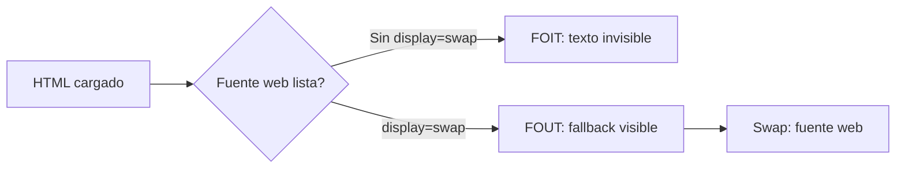

# Diseño de Interfaces Web

## Unidad 3 · Color y Tipografía

**Módulo 0615 · Diseño de Interfaces Web**  
CFGS Desarrollo de Aplicaciones Web (DAW)

---

## Objetivos de aprendizaje I

<ul style="font-size: 0.95rem;">
  <li><span class="fragment">Aplicar la **teoría del color**: armonías, contraste WCAG y accesibilidad para personas con daltonismo</span></li>
  <li><span class="fragment">Distinguir los modelos **RGB** e **HSL** en CSS y elegir el adecuado en cada contexto</span></li>
  <li><span class="fragment">Crear y documentar **paletas completas** (primarios, secundarios, acento, neutros, semánticos) con variables CSS</span></li>
  <li><span class="fragment">Clasificar las **familias tipográficas** por anatomía, historia y función comunicativa</span></li>
</ul>

Note: Estos cuatro objetivos abren la unidad y se corresponden con el bloque de color. Fijaros en el tercero: una paleta no es un conjunto de colores sueltos, sino un sistema documentado con variables CSS. Pregunta para el aula: ¿cuántos colores creéis que usa realmente una interfaz profesional? Casi siempre muchos menos de lo que imaginamos.

---

## Objetivos de aprendizaje II

<ul style="font-size: 0.95rem;">
  <li><span class="fragment">Implementar **escalas tipográficas responsivas** con `clamp()` y unidades relativas</span></li>
  <li><span class="fragment">Integrar **Google Fonts** optimizando la carga (`font-display`, `preconnect`)</span></li>
  <li><span class="fragment">Establecer **ritmo vertical** y limitar el ancho de línea (60-75 caracteres)</span></li>
  <li><span class="fragment">Analizar críticamente interfaces reales: **Stripe, Apple y Notion**</span></li>
</ul>

Note: Los objetivos 5 a 8 son el núcleo técnico de la unidad: todo se implementa en hojas de estilo externas, que es justo lo que pide el RA2 (crea interfaces homogéneas definiendo y aplicando estilos). El objetivo 8 nos invita al análisis crítico: diseccionaremos tres productos reales y justificaremos por qué funcionan. Recordad que todo lo que veáis hoy es verificable con DevTools y herramientas gratuitas.

---

## Motivación inicial

<div style="font-size: 1rem; text-align: left;">

<span class="fragment" style="font-size: 1.2rem;"><strong>¿Por qué Stripe inspira confianza, Apple se siente premium y Notion resulta cercano?</strong></span>

<br>

<span class="fragment">Misma tecnología HTML… decisiones distintas de **color** y **tipografía**.</span>

<span class="fragment">El color y la tipografía comunican identidad, jerarquía y emoción <em>antes</em> de leer una sola palabra.</span>

<span class="fragment"><span class="mini">Y ojo: ~8% de los hombres y 0,5% de las mujeres tienen alguna forma de daltonismo. Diseñar sin pensarlo = excluir.</span></span>

</div>

Note: Lanzad esta pregunta antes de mostrar nada y dejad que respondan. La clave es que color y tipografía no son decoración: son el vehículo principal de comunicación de la interfaz. El dato del 8% de daltonismo masculino conviene subrayarlo: es una parte significativa de la audiencia, no un caso marginal. Cerraremos la unidad volviendo a esta misma pregunta.

---

## Mapa de la unidad

```mermaid
graph TD
    U[Unidad 3 · Color y Tipografía] --> B1[Bloque 1 · COLOR]
    U --> B2[Bloque 2 · TIPOGRAFÍA]
    B1 --> C1[Círculo cromático y armonías]
    B1 --> C2[Modelos RGB / HSL]
    B1 --> C3[Contraste WCAG y daltonismo]
    B1 --> C4[Paletas con variables CSS]
    B2 --> T1[Anatomía y clasificación]
    B2 --> T2[Escala tipográfica y clamp()]
    B2 --> T3[Ritmo vertical]
    B2 --> T4[Google Fonts y pairing]
```

Note: Este es el mapa de ruta de la unidad. El bloque 1 va de la teoría (círculo cromático, armonías) a la implementación (variables CSS). El bloque 2 va de la anatomía de la letra a sistemas tipográficos responsivos completos. Aconsejad al alumnado fotografiarse esta diapositiva: les servirá como checklist de autoevaluación al terminar la semana.

---

## Círculo cromático

<ul style="font-size: 0.9rem;">
  <li><span class="fragment"><strong>Primarios:</strong> rojo, amarillo, azul (modelo tradicional de pintor) · rojo, verde, azul (modelo digital RGB)</span></li>
  <li><span class="fragment"><strong>Secundarios:</strong> mezcla de dos primarios → verde, naranja, violeta</span></li>
  <li><span class="fragment"><strong>Terciarios:</strong> primario + secundario adyacente → rojo-naranja, amarillo-verde, azul-violeta</span></li>
  <li><span class="fragment">Es la herramienta base para entender relaciones entre colores y construir **armonías**</span></li>
</ul>

Note: Insistid en la diferencia entre el círculo RYB tradicional (el de los pintores) y el RGB digital: en pantalla los primarios son rojo, verde y azul. Los secundarios salen de mezclar dos primarios en proporciones iguales; los terciarios, de un primario con un secundario adyacente. Ejercicio rápido: pedid que nombren el terciario entre rojo y naranja (rojo-naranja) y el entre azul y violeta (azul-violeta).

---

## Armonías cromáticas

<div style="font-size: 0.9rem;">

| Armonía | Relación en el círculo | Efecto |
|---|---|---|
| Complementaria | Opuestos (azul/naranja) | Máximo contraste, llama la atención |
| Análoga | Adyacentes | Calma, cohesión, naturaleza |
| Triádica | 3 colores equidistantes | Vibrante y equilibrada |
| Monocromática | Un matiz, varias S/L | Elegancia, sofisticación |
| Compl. dividida | Color + vecinos de su opuesto | Alto contraste, menos tensión |
| Tetrádica | 4 colores (2 pares opuestos) | Rica; necesita un color dominante |

</div>

<span class="fragment" style="font-size: 0.8rem;">La complementaria da el mayor impacto visual, pero en grandes superficies puede resultar agresiva: usar con moderación.</span>

Note: Cada armonía produce un efecto emocional distinto: complementaria para impacto, análoga para calma, triádica para vitalidad, monocromática para elegancia. Consejo práctico: en un proyecto real partid del color primario de marca y derivad el resto con una de estas reglas — eso es exactamente lo que automatizan Adobe Color y Paletton. Ninguna armonía es "mejor": depende del mensaje y la audiencia.

---

## Modelos de color: RGB vs HSL

<div style="font-size: 0.9rem;">

| | RGB | HSL |
|---|---|---|
| Naturaleza | Aditivo (luz), nativo de pantallas | Intuitivo para humanos |
| Parámetros | R, G, B: 0-255 | H: 0-360° · S: 0-100% · L: 0-100% |
| Sintaxis CSS | `#RRGGBB`, `rgb()`, `rgba()` | `hsl(h, s%, l%)` |
| Punto fuerte | Compatibilidad con herramientas de diseño | Generar variaciones variando S y L |
| Ideal para | Comunicar valores exactos | Construir escalas y paletas |

</div>

<span class="fragment" style="font-size: 0.85rem;">"Quiero un azul más claro" → en HSL: bajar saturación y subir luminosidad. En RGB: ajustar 3 canales a la vez.</span>

Note: El ejemplo práctico que justifica HSL: razonar sobre variaciones de un color. "Un azul más claro" es una sola operación mental en HSL; en RGB hay que mover tres canales simultáneamente. Regla de pulgar: hexadecimal/RGB para comunicar valores exactos con el equipo de diseño, HSL para razonar variaciones y construir escalas sistemáticamente.

---

## Contraste WCAG 2.1

<span class="fragment" style="font-size: 0.85rem;">Ratio = <code>(L1 + 0.05) / (L2 + 0.05)</code> → rango de 1:1 (sin contraste) a 21:1 (negro sobre blanco)</span>

<div style="font-size: 0.9rem;">

| Nivel | Texto normal | Texto grande (&gt;18px o 14px negrita) |
|---|---|---|
| **AA** (mínimo exigible en muchos países) | **4.5:1** | **3:1** |
| **AAA** (máxima exigencia) | 7:1 | 4.5:1 |

</div>

<span class="fragment" style="font-size: 0.85rem;">Verificación: **WebAIM Contrast Checker** · **Stark** (Figma/Sketch/XD) · **Chrome DevTools** (iconos ✓/✗ en el panel de estilos)</span>

Note: El nivel AA es el mínimo legalmente exigible en muchos países, así que 4.5:1 en texto normal no es negociable. El texto grande (más de 18px o 14px en negrita) relaja el umbral a 3:1. Subrayad que el ojo humano es un pésimo medidor de contraste: se adapta a la luz ambiental y no puede cuantificar ratios. Siempre se verifica con herramienta, nunca "a ojo".

---

## Daltonismo: no uses solo el color

<div style="display: grid; grid-template-columns: 1fr 1fr; gap: 0.6rem; font-size: 0.8rem; text-align: left;">
  <div class="fragment"><strong>Afectación:</strong> ~8% hombres · ~0,5% mujeres</div>
  <div class="fragment"><strong>Tipos:</strong> protanopia (rojo) · deuteranopia (verde) · tritanopia (azul, rara) · acromatopsia</div>
  <div class="fragment"><strong>Protanopia/deuteranopia:</strong> confunden rojos, verdes y marrones</div>
  <div class="fragment"><strong>Principio:</strong> nunca transmitir información <em>solo</em> con color</div>
  <div class="fragment"><strong>Complementos:</strong> iconos (✓/✗), texto descriptivo, patrones, cambios de forma</div>
  <div class="fragment"><strong>Simular:</strong> Chrome DevTools → Rendering → Emulate vision deficiencies</div>
</div>

Note: La deuteranopia es la más común: rojo y verde se perciben como marrones/beiges similares, por eso la validación solo con borde rojo/verde falla para muchas personas. Haced ahora mismo la simulación en DevTools (Rendering → Emulate vision deficiencies) mirando una interfaz con estados tipo semáforo. El principio es simple: el color refuerza el mensaje, nunca lo transporta solo.

---

## Paletas de color profesionales

<ul style="font-size: 0.85rem;">
  <li><span class="fragment"><strong>Primarios:</strong> 1-2 colores de marca (logotipo, elementos clave)</span></li>
  <li><span class="fragment"><strong>Secundarios:</strong> complementan a los primarios, menor jerarquía</span></li>
  <li><span class="fragment"><strong>Acento:</strong> vibrante, solo 5-10% de la interfaz (CTA principal, precios)</span></li>
  <li><span class="fragment"><strong>Neutros:</strong> la base; 8-12 escalones de #FFFFFF a #000000</span></li>
  <li><span class="fragment"><strong>Semánticos:</strong> success (verde) · error (rojo) · warning (amarillo/naranja) · info (azul)</span></li>
</ul>

<span class="fragment" style="font-size: 0.8rem;">Cada semántico lleva <strong>2 variantes</strong>: clara (fondo) + oscura (texto). Implementación: `:root` + nomenclatura `--color-{categoria}-{variante}`.</span>

Note: La cifra del 5-10% para el acento es orientativa: si el acento aparece por todas partes, deja de ser acento. Los neutros son la verdadera columna vertebral de la interfaz: con 8-12 escalones cubrimos fondos, bordes y textos secundarios. Y cada color semántico necesita sus dos variantes —clara para fondo, oscura para texto—, porque de lo contrario el propio mensaje incumple contraste.

---

## Psicología del color

<div style="display: grid; grid-template-columns: 1fr 1fr; gap: 0.6rem; font-size: 0.8rem; text-align: left;">
  <div class="fragment"><strong style="color:#2563eb;">Azul</strong> — confianza, seguridad, profesionalidad (Facebook, LinkedIn, PayPal, Amex)</div>
  <div class="fragment"><strong style="color:#dc2626;">Rojo</strong> — urgencia, pasión, peligro (CTAs urgentes, ofertas limitadas)</div>
  <div class="fragment"><strong style="color:#16a34a;">Verde</strong> — naturaleza, crecimiento, salud, éxito (bienestar, finanzas verdes)</div>
  <div class="fragment"><strong style="color:#ea580c;">Naranja</strong> — entusiasmo, creatividad, calidez (CTAs con energía, sin urgencia)</div>
</div>

<span class="fragment" style="font-size: 0.8rem;">⚠ No es universal: en culturas orientales el blanco se asocia al luto; en Occidente, a la pureza. Audiencia global = investigar significados por mercado.</span>

Note: Estas asociaciones pertenecen a la cultura occidental y no son universales: en culturas orientales el blanco se vincula al luto. Si el producto apunta a una audiencia global, investigad el significado de los colores elegidos en los mercados objetivo. Pregunta para el aula: ¿por qué domina el azul en banca y tecnología? Porque evoca estabilidad y confianza, crítica en sectores donde el usuario maneja dinero.

---

## Herramientas de color

<div style="display: grid; grid-template-columns: 1fr 1fr; gap: 0.6rem; font-size: 0.8rem; text-align: left;">
  <div class="fragment"><strong>Coolors</strong> — genera paletas (barra espaciadora), bloquea colores</div>
  <div class="fragment"><strong>Adobe Color</strong> — reglas de armonía, extrae paletas de imágenes</div>
  <div class="fragment"><strong>Paletton</strong> — armonías con previsualización en mockups</div>
  <div class="fragment"><strong>WebAIM Contrast Checker</strong> — el verificador de referencia</div>
  <div class="fragment"><strong>Stark</strong> — plugin Figma/Sketch/XD: contraste + daltonismo</div>
  <div class="fragment"><strong>Khroma</strong> — IA que aprende tus preferencias cromáticas</div>
</div>

<span class="fragment" style="font-size: 0.8rem;">Flujo: generar (Coolors/Adobe) → verificar contraste (WebAIM) → simular daltonismo (DevTools/Stark) → documentar con variables CSS</span>

Note: El flujo de trabajo recomendado: generar candidatas en Coolors o Adobe Color, verificar cada par texto/fondo con WebAIM, simular daltonismo en DevTools o Stark y documentar todo como variables CSS. Khroma es interesante como curiosidad tecnológica. Ninguna herramienta sustituye la verificación final de contraste: la herramienta propone, el criterio dispone.

---

## Anatomía tipográfica

<ul style="font-size: 0.85rem;">
  <li><span class="fragment"><strong>Línea base:</strong> línea invisible sobre la que se asientan las letras</span></li>
  <li><span class="fragment"><strong>Altura x:</strong> altura de minúsculas sin ascendentes; grande = más legible en tamaños pequeños; pequeña = elegante pero fatigosa en cuerpo</span></li>
  <li><span class="fragment"><strong>Ascendentes</strong> (d, h, l) sobresalen por encima · <strong>descendentes</strong> (g, p, q) cuelgan bajo la base</span></li>
  <li><span class="fragment"><strong>Serif:</strong> remates en los trazos; tradición y formalidad; guían el ojo en textos largos impresos</span></li>
  <li><span class="fragment"><strong>Sans-serif:</strong> moderna y limpia; mejor renderizado en pantallas de baja resolución → predominante en web</span></li>
</ul>

Note: La altura x es el concepto clave: una x-height grande hace que la fuente parezca mayor y lea mejor en tamaños pequeños (ideal móvil); una pequeña es elegante pero agota en cuerpo de texto. Las serifas históricamente guiaban el ojo en imprenta, pero en pantallas de baja resolución las sans-serif se renderizan más limpias — de ahí su dominio en interfaces digitales.

---

## Clasificación tipográfica

<div style="display: grid; grid-template-columns: 1fr 1fr; gap: 0.6rem; font-size: 0.8rem; text-align: left;">
  <div class="fragment"><strong>SERIF</strong><br>· Tradicional: Garamond (s. XV, caligrafía)<br>· Transicional: Times New Roman, Baskerville (s. XVIII)<br>· Moderna/didona: Bodoni (s. XIX, contraste extremo)<br>· Egipcia/slab: Rockwell (impacto publicitario)</div>
  <div class="fragment"><strong>SANS-SERIF</strong><br>· Grotesca: Akzidenz-Grotesk (1ª comercial, s. XIX)<br>· Humanista: Gill Sans, Frutiger (calidez, texto continuo)<br>· Geométrica: Futura, Century Gothic (formas puras)</div>
</div>

<span class="fragment" style="font-size: 0.8rem;"><strong>Otras:</strong> Display (titulares grandes) · Script (decorativo breve, nunca lectura) · Monospace (código, terminal)</span>

Note: Esta clasificación es vocabulario, no dogma: saber que Bodoni es una didona de contraste extremo ayuda a describir y defender elecciones. El hilo histórico orienta: Garamond (siglo XV), transicionales (XVIII), Bodoni (XIX) y Akzidenz-Grotesk como primera sans-serif comercial. La monospace es la elección natural para mostrar código en interfaces de desarrollo.

---

## Escalas tipográficas

<ul style="font-size: 0.9rem;">
  <li><span class="fragment">Conjunto de tamaños con <strong>relación matemática constante</strong> entre niveles → adiós a los tamaños "a ojo"</span></li>
  <li><span class="fragment"><strong>Cuarto mayor (1.333):</strong> incrementos moderados → interfaces densas en información</span></li>
  <li><span class="fragment"><strong>Quinta perfecta (1.5):</strong> incrementos notables → densidad media</span></li>
  <li><span class="fragment"><strong>Proporción áurea (1.618):</strong> incrementos generosos → home y marketing con mucho espacio en blanco</span></li>
</ul>

<span class="fragment" style="font-size: 0.8rem;">Previsualiza proporciones antes de escribir CSS: type-scale.com</span>

Note: La escala garantiza que todos los textos de la interfaz estén armónicamente relacionados, evitando la arbitrariedad de elegir tamaños a ojo. La elección depende de la densidad: 1.333 para dashboards llenos de datos, 1.5 para interfaces generales, 1.618 para páginas de marketing con espacio en blanco. Type Scale permite previsualizar cada proporción antes de tocar una línea de CSS.

---

## clamp(): tipografía fluida

```css
/* clamp(mínimo, preferido, máximo) */
h1 {
  font-size: clamp(1.8rem, 1.4rem + 1.8vw, 3rem);
}

p {
  font-size: clamp(0.95rem, 0.85rem + 0.3vw, 1.1rem);
}
```

<ul style="font-size: 0.85rem;">
  <li><span class="fragment"><strong>Mínimo:</strong> pantallas muy pequeñas · <strong>preferido:</strong> basado en vw · <strong>máximo:</strong> pantallas grandes</span></li>
  <li><span class="fragment">Ejemplo h1: 320px → 1.8rem · 1200px → 3rem · intermedio → escala proporcional</span></li>
  <li><span class="fragment">Sin media queries: una sola línea de CSS, transición continua</span></li>
</ul>

Note: clamp() es la alternativa moderna a las media queries para tipografía: mínimo para pantallas pequeñas, preferido basado en vw y máximo para pantallas grandes. Con el ejemplo, el h1 mide 1.8rem a 320px y 3rem a 1200px, escalando de forma continua entre ambos. Haced que redimensionen la ventana del navegador en directo: verán fluidez total, sin saltos bruscos.

---

## Ritmo vertical

<ul style="font-size: 0.85rem;">
  <li><span class="fragment">Consistencia en el espaciado vertical = sensación de orden y profesionalidad</span></li>
  <li><span class="fragment"><strong>line-height 1.4-1.6</strong> para cuerpo de texto, <em>sin unidades</em> (se hereda proporcionalmente)</span></li>
  <li><span class="fragment">&lt;1.3: las líneas se tocan · &gt;1.8: el párrafo pierde cohesión</span></li>
  <li><span class="fragment">Espaciados en múltiplos de la unidad base (<strong>8px</strong>): 16 / 24 / 32 / 48px</span></li>
  <li><span class="fragment"><strong>Grid baseline:</strong> 16px × 1.5 = 24px = 3 × 8px → el texto "encaja" en la rejilla</span></li>
</ul>

Note: El ritmo vertical rara vez se nota cuando está bien ejecutado, pero su ausencia grita amateurismo de inmediato. El número mágico es 8px como unidad base: con font-size de 16px y line-height 1.5, cada línea ocupa 24px, es decir 3 × 8px, y el texto encaja naturalmente en la rejilla. Todos los márgenes y paddings deben ser múltiplos de 8px y documentarse como variables CSS.

---

## Google Fonts: rendimiento

```html
<link rel="preconnect" href="https://fonts.googleapis.com">
<link rel="preconnect" href="https://fonts.gstatic.com" crossorigin>
<link href="https://fonts.googleapis.com/css2?family=Inter:wght@400;700&display=swap"
      rel="stylesheet">
```



<span class="fragment" style="font-size: 0.8rem;">+1400 familias gratuitas · cargar solo los pesos necesarios (400, 700) · FOUT &gt;&gt; FOIT en usabilidad</span>

Note: Sin font-display, el navegador puede ocultar el texto hasta que llega la fuente web (FOIT): página en blanco varios segundos en conexiones lentas. Con display=swap, el usuario lee de inmediato con la fuente de sistema y la web se intercambia al llegar (FOUT), mucho más usable. Cargad también solo los pesos que uséis de verdad: 400 y 700, no la familia completa.

---

## Pairing tipográfico

<ul style="font-size: 0.9rem;">
  <li><span class="fragment">Combinar 2+ familias que funcionen juntas; <strong>máx. 2 familias por proyecto</strong></span></li>
  <li><span class="fragment">Clásico seguro: <strong>serif en titulares + sans-serif en cuerpo</strong> (o viceversa)</span></li>
  <li><span class="fragment">Dos sans-serif con suficiente contraste: geométrica (titulares) + humanista (cuerpo)</span></li>
  <li><span class="fragment">Clave: bastante <strong>diferentes</strong> para crear contraste, con el mismo <strong>"espíritu"</strong> (proporciones, peso visual)</span></li>
</ul>

<span class="fragment" style="font-size: 0.8rem;">¿Necesitas más variedad? Explora pesos dentro de la misma familia (light, regular, medium, bold, black) antes de añadir otra.</span>

Note: La combinación clásica y más segura es serif para titulares y sans-serif para cuerpo. La clave del buen pairing es el equilibrio: las fuentes deben ser suficientemente diferentes para crear jerarquía, pero compartir "espíritu" —proporciones, peso visual— para no chocar. Y recordad el límite duro: máximo dos familias por proyecto; antes de añadir una tercera, explorad los pesos de las existentes.

---

## Tipografía responsive

<div style="display: grid; grid-template-columns: 1fr 1fr; gap: 0.6rem; font-size: 0.8rem; text-align: left;">
  <div class="fragment"><strong>em</strong> — relativa al font-size del padre; espaciados que escalan con el texto</div>
  <div class="fragment"><strong>rem</strong> — relativa a la raíz &lt;html&gt; (16px por defecto)</div>
  <div class="fragment"><strong>vw</strong> — 1vw = 1% del ancho de la ventana</div>
  <div class="fragment"><strong>clamp()</strong> — fluido entre mín/máx, sin breakpoints</div>
</div>

<span class="fragment" style="font-size: 0.85rem;"><strong>Ancho de línea óptimo: 60-75 caracteres.</strong> Líneas largas = el ojo se pierde; cortas = flujo roto.</span>

```css
p { max-width: 65ch; margin: 0 auto; } /* ch = anchura del "0" */
```

Note: La medida de 60-75 caracteres es uno de los hallazgos más estudiados de la tipografía: líneas más largas hacen que el ojo pierda el sitio al volver a la siguiente; más cortas rompen el flujo con saltos excesivos. La unidad ch es perfecta porque referencia la anchura del "0" de la fuente actual: max-width: 65ch se adapta solo a cualquier tipografía. En un monitor de 27 pulgadas, el texto a ancho completo supera los 200 caracteres por línea.

---

## Propiedades CSS tipográficas

<div style="display: grid; grid-template-columns: 1fr 1fr; gap: 0.6rem; font-size: 0.8rem; text-align: left;">
  <div class="fragment"><strong>Estructura:</strong> font-family · font-size · font-weight · font-style</div>
  <div class="fragment"><strong>Ritmo:</strong> line-height (sin unidades!) · letter-spacing</div>
  <div class="fragment"><strong>Tratamiento:</strong> text-transform · text-decoration</div>
  <div class="fragment"><strong>Composición:</strong> text-align</div>
</div>

```css
h1 {
  font-family: 'Playfair Display', Georgia, serif;
  font-size: clamp(2rem, 4vw, 3rem);
  font-weight: 700;
  letter-spacing: -0.5px;
  line-height: 1.15;
}
```

Note: Son las propiedades de uso diario. Dos avisos importantes: line-height debe ir sin unidades (1.5, no 24px) para que escale cuando el font-size cambie con clamp(); y font-family debe terminar siempre en una familia genérica (serif, sans-serif, monospace) como último recurso. El letter-spacing negativo (-0.5px) es habitual en titulares grandes para apretarlos.

---

## Ejemplo · Paleta con variables CSS

```css
:root {
  /* Primario: escala 50-900 */
  --color-primary-100: #dbeafe;
  --color-primary-500: #3b82f6; /* base */
  --color-primary-700: #1d4ed8;
  /* Neutros: 10 pasos */
  --color-neutral-0:   #ffffff;
  --color-neutral-500: #64748b;
  --color-neutral-900: #0f172a;
  /* Semánticos: fondo claro + texto oscuro */
  --color-success-100: #dcfce7;
  --color-success-700: #15803d;
  --color-error-100:   #fee2e2;
  --color-error-700:   #b91c1c;
}
.btn   { background: var(--color-primary-500); }
.alert { background: var(--color-success-100);
         color: var(--color-success-700); }
```

<span class="fragment" style="font-size: 0.8rem;">Cambiar el primario de azul a verde = editar `:root` una vez; toda la interfaz se actualiza.</span>

Note: Este es el esqueleto mínimo de una paleta profesional: primario con escala, neutros de 10 pasos y semánticos con doble variante. La nomenclatura --color-{categoria}-{variante} documenta las decisiones de diseño en el propio código. La gran ventaja frente a valores literales dispersos: si la marca cambia el primario, se modifica :root y toda la interfaz se actualiza automáticamente.

---

## Ejemplo · Verificación de contraste

```css
/* Cumple AAA: ratio 15.4:1 */
.cumple-aaa { background: #1e293b; color: #ffffff; }

/* Cumple AA: ratio 5.5:1 */
.cumple-aa  { background: #64748b; color: #ffffff; }

/* NO cumple: ratio 2.1:1 */
.no-cumple  { background: #f1f5f9; color: #94a3b8; }

/* Corrección: oscurecer el texto → 9.1:1 (AAA) */
.corregido  { background: #f1f5f9; color: #334155; }
```

<span class="fragment" style="font-size: 0.8rem;">Negro sobre blanco = 21:1 (máximo teórico). Corregir suele ser trivial: oscurecer texto o fondo, sin rediseñar.</span>

Note: Negro sobre blanco es el máximo teórico: 21:1. Las combinaciones que fallan (2.1:1 y 1.3:1) serían ilegibles a plena luz solar o para personas con baja visión. La buena noticia es que la corrección suele ser trivial: oscurecer el texto o el fondo resuelve el problema sin cambiar el diseño. Pedid al alumnado que calcule ellos mismos los ratios corregidos en WebAIM.

---

## Ejemplo · Daltonismo en formularios

```css
/* INCORRECTO: solo el color del borde */
.solo-color input.error   { border-color: #ef4444; }
.solo-color input.success { border-color: #22c55e; }

/* CORRECTO: color + icono + texto */
.msg.error   { background: #fee2e2; color: #b91c1c; } /* ✗ + mensaje */
.msg.success { background: #dcfce7; color: #166534; } /* ✓ + mensaje */
```

<span class="fragment" style="font-size: 0.8rem;">Con deuteranopia, ambos bordes parecen marrón similar → formulario inutilizable. Con icono + texto, el estado se entiende siempre.</span>

Note: Simulad la deuteranopia en DevTools sobre la versión incorrecta: ambos bordes aparecen como marrones similares y el formulario se vuelve inutilizable. Añadir icono y texto crea tres canales redundantes: aunque falle el color, la forma y el texto transmiten el estado. Es el error más repetido en proyectos de alumnado, y el más fácil de evitar con disciplina.

---

## Ejemplo · Google Fonts + pairing

```html
<link rel="preconnect" href="https://fonts.googleapis.com">
<link rel="preconnect" href="https://fonts.gstatic.com" crossorigin>
<link href="https://fonts.googleapis.com/css2?family=Playfair+Display:wght@400;700&family=Source+Sans+3:wght@400;600;700&display=swap"
      rel="stylesheet">
```

```css
h1 { font-family: 'Playfair Display', Georgia, serif; }
p  { font-family: 'Source Sans 3', system-ui, sans-serif; }
```

<span class="fragment" style="font-size: 0.8rem;">Serif elegante en titulares + sans-serif humanista en cuerpo · solo pesos 400/700 · ~45KB woff2 · ~150-250ms en 4G · fallbacks: Georgia / Segoe UI</span>

Note: Playfair Display aporta elegancia editorial a los titulares; Source Sans 3, con su generosa altura x, garantiza lectura cómoda en el cuerpo. Los detalles técnicos importan: preconnect reduce la latencia, display=swap evita el FOIT y cargar solo los pesos 400 y 700 mantiene la descarga en unos 45KB woff2, alrededor de 150-250ms en conexión 4G.

---

## Caso real · Stripe

<ul style="font-size: 0.85rem;">
  <li><span class="fragment">Fintech: pagos, APIs y facturación convertidos en experiencia sofisticada</span></li>
  <li><span class="fragment">Azul índigo <strong>#635BFF</strong>: profesionalidad y confianza (crítico al manejar dinero)</span></li>
  <li><span class="fragment">Fondos blancos con degradados sutiles (#f6f9fc) + neutros muy controlados</span></li>
  <li><span class="fragment">Un único acento + restricción cromática → interfaz serena, precisa</span></li>
  <li><span class="fragment">Sans-serif (antes Camphor, propietaria) · escala cercana a la proporción áurea</span></li>
</ul>

<span class="fragment" style="font-size: 0.8rem;">Lección: menos es más. Se reconoce un producto de Stripe sin ver su logotipo.</span>

Note: Stripe demuestra que menos es más: un único índigo potente, fondos blancos y neutros controlados crean una interfaz más profesional que cualquier paleta recargada. Su coherencia cromática y tipográfica es tal que reconocerías un producto de Stripe sin ver el logotipo. Pregunta para el aula: ¿qué pasaría si Stripe usara cinco colores de acento? Ruido visual y pérdida de confianza.

---

## Caso real · Apple

<ul style="font-size: 0.85rem;">
  <li><span class="fragment">Minimalismo radical: blanco puro #FFFFFF o negro puro #000000</span></li>
  <li><span class="fragment">El color proviene de las <strong>fotos del producto</strong>, no de la interfaz → el producto es el héroe</span></li>
  <li><span class="fragment">Acentos con moderación quirúrgica (azul para enlaces)</span></li>
  <li><span class="fragment"><strong>SF Pro:</strong> sans-serif propia, humanista-geométrica, calibrada al píxel para pantalla</span></li>
  <li><span class="fragment">Titulares &gt;64px (4rem) negrita vs cuerpo 17-19px → contraste de ritmo poderoso</span></li>
</ul>

<span class="fragment" style="font-size: 0.8rem;">Lección: la interfaz casi desaparece para dejar brillar al producto.</span>

Note: El caso Apple demuestra que el diseño cromático más efectivo no es el que usa más colores, sino el que usa los colores correctos en el lugar correcto. La interfaz casi desaparece: blanco o negro puros, y el color entra por las fotografías del producto. En tipografía, SF Pro fue diseñada internamente y calibrada al píxel para legibilidad en pantalla a todos los tamaños.

---

## Caso real · Notion

<ul style="font-size: 0.85rem;">
  <li><span class="fragment">Color como <strong>herramienta funcional</strong> para organizar información, no como marca</span></li>
  <li><span class="fragment">Paleta pastel para callouts: saturación y luminosidad bajas → coherencia pese a la variedad</span></li>
  <li><span class="fragment">Personalización libre (páginas rojas, azules, verdes) sin caos cromático</span></li>
  <li><span class="fragment">Inter (web) / SF Pro (macOS) · H1-H3 con jerarquía clara · line-height 1.5</span></li>
  <li><span class="fragment">Tres estilos de fuente a elegir: Default, Serif, Mono</span></li>
</ul>

<span class="fragment" style="font-size: 0.8rem;">Lección: coherencia ≠ mismos colores; coherencia = variables limitadas (misma S/L, varía solo el matiz).</span>

Note: Notion invierte la lógica de Stripe y Apple: el color es una herramienta funcional para que el usuario codifique información visualmente. Que la personalización no genere caos se debe a que todos los pasteles comparten baja saturación y luminosidad: solo varía el matiz. Esa es la lección profunda: la coherencia no exige usar siempre los mismos colores, sino limitar las variables.

---

## Actividad en clase

<div style="font-size: 0.85rem; text-align: left;">

<strong>Objetivo:</strong> construir una paleta de color profesional con variables CSS y verificar su accesibilidad.

<br>

<span class="fragment"><strong>Formato:</strong> individual · ~90 min · editor + DevTools + Coolors/WebAIM</span>

<br>

<span class="fragment"><strong>Pasos:</strong></span>

<span class="fragment" style="font-size: 0.8rem;">1. Escala de 9 variantes del primario asignado (50-900) · 2. Neutros de 8 pasos · 3. Cuatro semánticos con variantes clara/oscura · 4. `:root` con nomenclatura `--color-{cat}-{var}` · 5. Página demo con todas las variantes · 6. Ratios verificados en WebAIM</span>

<br>

<span class="fragment"><strong>Entregable:</strong> HTML + CSS externo con variables y tabla de ratios AA/AAA documentada</span>

</div>

<span class="fragment" style="font-size: 0.8rem;">Evaluación (20% c/u): nomenclatura · progresión de la escala · semánticos · verificación WCAG · calidad visual</span>

Note: El color primario lo asigna el docente, distinto para cada persona, para forzar trabajar con un color no elegido. El entregable combina técnica (variables bien nombradas, escalas progresivas) y accesibilidad (ratios verificados y documentados). Evaluación repartida al 20% por criterio: nomenclatura, progresión de la escala, semánticos, verificación WCAG y calidad visual de la página demo.

---

## Buenas prácticas

<ul style="font-size: 0.9rem;">
  <li><span class="fragment">✅ Define la paleta con <strong>variables CSS desde el día 1</strong>: pensar en sistema, no en elementos</span></li>
  <li><span class="fragment">✅ <strong>Verifica el contraste</strong> antes de aprobar cualquier color: el ojo no es un medidor fiable</span></li>
  <li><span class="fragment">✅ Máximo <strong>2 familias tipográficas</strong> por proyecto; variedad con pesos, no con fuentes</span></li>
  <li><span class="fragment">✅ <strong>clamp()</strong> para tipografía fluida en lugar de media queries (salvo cambios drásticos de layout)</span></li>
  <li><span class="fragment">✅ <strong>Alternativas al color</strong> siempre que la información sea crítica (icono + texto + patrón)</span></li>
</ul>

Note: Cinco hábitos que separan lo amateur de lo profesional. El primero obliga a pensar en sistema desde el primer día. El cuarto merece matices: clamp() para tipografía fluida, pero las media queries siguen siendo necesarias para cambios drásticos de layout, como pasar de una a dos columnas. El quinto es el fallo más repetido en auditorías reales: errores comunicados solo con color.

---

## Errores frecuentes

<ul style="font-size: 0.85rem;">
  <li><span class="fragment">❌ Colores puros (#FF0000, #00FF00, #0000FF): vibran en pantalla y producen halos cromáticos → usar #E53E3E, #38A169, #3182CE</span></li>
  <li><span class="fragment">❌ Más de 2 familias tipográficas, o serif de poca altura x para texto de cuerpo</span></li>
  <li><span class="fragment">❌ `line-height: 24px` con unidades en vez de `1.5` sin unidades (no escala con clamp())</span></li>
  <li><span class="fragment">❌ Texto a ancho completo en monitores grandes: &gt;200 caracteres por línea → `max-width: 65ch`</span></li>
  <li><span class="fragment">❌ Paletas "a ojo" sin verificar daltonismo ni contraste, y sin documentar con variables</span></li>
</ul>

Note: Los colores puros vibran en pantalla y generan aberración cromática en los bordes: en diseño profesional ningún canal debería estar en 0 o 255 salvo blanco y negro. El error de line-height con unidades es sutil: 24px no escala cuando el font-size cambia con clamp(), mientras que 1.5 mantiene siempre la proporción. Y la paleta "a ojo" ignora al 8% de hombres y 0,5% de mujeres con daltonismo.

---

## Resumen · Conceptos clave

<ul style="font-size: 0.85rem;">
  <li><span class="fragment">🎯 Círculo cromático y armonías: base de toda decisión cromática</span></li>
  <li><span class="fragment">🎯 RGB para pantallas · HSL para generar variaciones</span></li>
  <li><span class="fragment">🎯 WCAG: AA 4.5:1 / 3:1 · AAA 7:1 / 4.5:1 — siempre verificado con herramienta</span></li>
  <li><span class="fragment">🎯 Nunca solo color: icono + texto + patrón</span></li>
  <li><span class="fragment">🎯 Paleta como sistema: primario, secundario, acento, neutros, semánticos → variables CSS</span></li>
  <li><span class="fragment">🎯 Escalas (1.333 / 1.5 / 1.618) + clamp() = tipografía fluida sin breakpoints</span></li>
  <li><span class="fragment">🎯 Ritmo vertical: line-height 1.4-1.6 sin unidades + rejilla de 8px</span></li>
  <li><span class="fragment">🎯 Google Fonts: preconnect + font-display: swap + solo pesos necesarios</span></li>
  <li><span class="fragment">🎯 Casos: Stripe (restricción) · Apple (minimalismo) · Notion (color funcional) → coherencia</span></li>
</ul>

Note: Si solo recordáis esto: paletas como sistemas documentados, ratios WCAG verificados con herramienta, nunca color solo, clamp() para escalas fluidas y ritmo basado en 8px. Los tres casos de estudio muestran filosofías distintas —restricción, minimalismo, color funcional— unidas por un denominador común: la coherencia. Ninguno usa color o tipografía de forma arbitraria.

---

## Próximos pasos

<div style="font-size: 1rem; text-align: left;">

<span class="fragment" style="font-size: 1.2rem;"><strong>Unidad 4 · Guías de Estilo y Design Systems</strong></span>

<br>

<span class="fragment">Documentaremos paleta y tipografía en una guía de estilo reutilizable:</span>

<span class="fragment" style="font-size: 0.85rem;">tokens de color y tipo · documentación para equipos · consistencia entre productos</span>

<br>

<span class="fragment" style="font-size: 0.85rem;">Todo lo construido esta semana pasará de "página diseñada" a "sistema del producto".</span>

</div>

Note: La próxima unidad toma todo lo construido aquí —paleta, escala tipográfica, ritmo— y lo formaliza en una guía de estilo y design system: tokens, documentación y reutilización en equipo. Ese es el puente entre diseñar una página y construir un producto. Traed vuestra paleta de la actividad de hoy: será el punto de partida de la unidad 4.

---

## ¿Preguntas?

<span style="font-size: 1rem;">Unidad 3 · Color y Tipografía</span><br>

**0615 · DAW · Curso 2025/2026**

Note: Cerrad con el nombre de la unidad y el curso. Si queda tiempo, volved a la pregunta inicial: ¿podéis explicar ahora por qué Stripe inspira confianza y Apple se siente premium? Quien pueda responderlo con argumentos de color y tipografía ha dominado la unidad.
