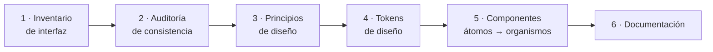

# Diseño de Interfaces Web

## Unidad 4 · Guías de Estilo y Design Systems

**Módulo 0615 · Diseño de Interfaces Web**  
CFGS Desarrollo de Aplicaciones Web (DAW)

---

## Objetivos de aprendizaje I

- <span class="fragment">Identificar y aplicar los principios de guías de estilo y design systems</span>
- <span class="fragment">Diferenciar una guía de estilo tradicional de un design system moderno</span>
- <span class="fragment">Analizar críticamente sistemas consolidados: Material Design, HIG de Apple, Ant Design</span>
- <span class="fragment">Extraer sus principios rectores y aplicarlos en contextos reales</span>

Note:
Enfatizad la diferencia conceptual entre guía de estilo y design system: es el hilo conductor de toda la unidad. Pregunta al aula: ¿alguien ha trabajado en un proyecto donde dos personas crearon dos botones distintos para la misma acción? Ese desajuste es exactamente lo que esta unidad resuelve.

---

## Objetivos de aprendizaje II

- <span class="fragment">Construir un design system propio: inventario → tokens → implementación técnica</span>
- <span class="fragment">Implementar con variables CSS, SASS o Styled Components</span>
- <span class="fragment">Documentar con herramientas profesionales (Storybook, Zeroheight)</span>
- <span class="fragment">Justificar decisiones por consistencia, escalabilidad, accesibilidad y mantenibilidad</span>

<div style="font-size: 0.8rem;">
<span class="fragment"><b>Vínculo con el currículo oficial (módulo 0615, RD 405/2023):</b> RA2 «crea interfaces web homogéneas definiendo y aplicando estilos» —las guías de estilo y los design systems son su herramienta—, conectado con RA1 (planificación) y RA5 (accesibilidad).</span>
</div>

Note:
Esta unidad hace de puente entre planificación (RA1) e implementación (RA2): los tokens son el nexo metodológico. La accesibilidad (RA5) se integra desde la base del sistema, no como parche posterior. El RA2 es el resultado principal: crear interfaces homogéneas aplicando guías de estilo y sistemas de diseño justificando su uso en cada caso.

---

## Motivación inicial

<div style="display: grid; grid-template-columns: 1fr 1fr; gap: 0.6rem; font-size: 0.8rem; text-align: left;">
<div class="fragment"><b>2014 · Google:</b> Gmail, Calendar, Drive y Maps con identidades visuales distintas. Fragmentación total.</div>
<div class="fragment"><b>Hoy:</b> todos comparten superficies, sombras, movimiento y paletas. ¿Qué cambió?</div>
</div>

<span class="fragment" style="font-size: 1rem;"><b>Pregunta al aula:</b> ¿y si en vuestro proyecto cada pantalla tuviera botones de 36px, 40px y 44px?</span>

Note:
Antes de 2014 cada producto de Google tenía su propia identidad visual: Gmail con rojos y grises, Calendar con colores vibrantes sin jerarquía, Drive minimalista de líneas finas. La fragmentación diluía la marca. Pregunta: ¿cuántos tamaños de botón distintos habéis contado en vuestras prácticas o proyectos anteriores?

---

## ¿Qué es una guía de estilo?

- <span class="fragment">Documento vivo con las reglas, estándares y convenciones del producto</span>
- <span class="fragment">Garantiza coherencia visual y funcional en todas las pantallas</span>
- <span class="fragment"><b>Fuente única de verdad</b> para diseñadores y desarrolladores</span>
- <span class="fragment">Cubre identidad visual <i>y</i> experiencia de usuario</span>

Note:
La guía de estilo es la fuente única de verdad: cuando diseñador y desarrollador discrepan sobre cómo debe verse algo, la guía arbitra. Insistid en que es un documento vivo: si cambia la marca, cambia la guía. No es un PDF que se archiva.

---

## Elementos de una guía de estilo

<div style="display: grid; grid-template-columns: 1fr 1fr; gap: 0.6rem; font-size: 0.8rem; text-align: left;">
<div class="fragment"><b>Paleta de colores</b><br>primarios, secundarios, semánticos (éxito, error, aviso, info), neutros · HEX/RGB/HSL + contraste</div>
<div class="fragment"><b>Tipografía</b><br>familias, escala (tamaños, pesos, interlineados), reglas por nivel jerárquico</div>
<div class="fragment"><b>Iconografía</b><br>estilo (lineal, sólido, dual tone), tamaños estandarizados, áreas de seguridad</div>
<div class="fragment"><b>Espaciado y grid</b><br>escala base 4px u 8px · columnas, calles y márgenes por breakpoint</div>
<div class="fragment"><b>Tono de voz</b><br>textos de interfaz, estilo fotográfico e ilustración</div>
<div class="fragment"><b>Movimiento y marca</b><br>animaciones, microinteracciones, uso del logotipo</div>
</div>

Note:
Repasad cada bloque preguntando por qué importa: el contraste de color afecta a WCAG, la escala de espaciado evita paddings aleatorios, el tono de voz unifica mensajes de error y estados vacíos. Pregunta: ¿qué elemento creéis que más se descuida en proyectos reales? (Suelen ser el tono de voz y las microinteracciones)

---

## Tokens de diseño: la unidad atómica

- <span class="fragment">Abstracción más pequeña de una decisión de diseño: par <b>nombre-valor</b></span>
- <span class="fragment">Definidos en formato agnóstico (<b>JSON / YAML</b>)</span>
- <span class="fragment">Se transforman por plataforma: CSS (web) · XML (Android) · Swift (iOS)</span>
- <span class="fragment">Evolución natural de las variables CSS/SASS tradicionales</span>

Note:
Los tokens son la evolución natural de las variables CSS/SASS: portables y agnósticos de plataforma. Un mismo JSON puede generar CSS, XML para Android o Swift para iOS. Es la pieza que conecta el diseño en Figma con el código.

---

## Tres capas de tokens

```css
/* Global (primitivo): sin significado */
--blue-500: #1976D2;
--spacing-4: 16px;

/* Semántico (alias): añade función */
--color-primary-500: var(--blue-500);

/* Componente: contexto concreto */
--button-primary-background: var(--color-primary-500);
--button-primary-text: var(--color-white);
```

<span class="fragment" style="font-size: 0.85rem;">Un cambio en un token global se propaga automáticamente a todos los componentes que lo referencian.</span>

Note:
Haced hincapié en la propagación: cambiar --blue-500 actualiza toda la aplicación sin tocar ningún componente. Esa es la magia de las tres capas. Pregunta: ¿qué pasaría si el botón primario usara directamente #2196F3 en vez del token?

---

## Nomenclatura e implementación

- <span class="fragment">Convención estructurada: <code>categoría-propiedad-variante-estado</code></span>
- <span class="fragment">Ej.: <code>color-background-button-primary-hover</code></span>
- <span class="fragment">Anidamiento JSON: cientos o miles de tokens navegables</span>
- <span class="fragment">En web: <b>CSS Custom Properties</b> — dinámicas y redefinibles por contexto</span>
- <span class="fragment"><span class="mini">Houdini · API Properties and Values: propiedades personalizadas con tipo, valor inicial y herencia explícitos</span></span>

Note:
La nomenclatura responde a «¿para qué sirve?», no a «¿qué valor tiene?»: si la marca pasa de azul a verde, --color-blue-500 se convierte en un nombre mentiroso. En web se implementan con CSS Custom Properties; Houdini (Properties and Values API) permitirá registrarlas con tipo y herencia explícitos.

---

## Guía de estilo vs. design system

<div style="font-size: 0.9rem;">
<table>
<thead>
<tr><th></th><th>Guía de estilo</th><th>Design system</th></tr>
</thead>
<tbody>
<tr><td>Naturaleza</td><td>Documento de referencia estático</td><td>Ecosistema vivo</td></tr>
<tr><td>Incluye</td><td>Principios, reglas, ejemplos</td><td>Documentación + componentes funcionales</td></tr>
<tr><td>Código</td><td>No proporciona</td><td>Librerías, tokens, herramientas</td></tr>
<tr><td>Gobernanza</td><td>—</td><td>Proceso de contribución y revisión</td></tr>
<tr><td>Botón primario</td><td>«Azul, redondeo 4px»</td><td><code>&lt;Button variant="primary" /&gt;</code> + docs + tests</td></tr>
</tbody>
</table>
</div>

Note:
La frase clave: la guía dice «los botones primarios son azules con redondeo de 4px»; el design system entrega el componente listo para usar, con documentación, tests y variantes accesibles. Pregunta: ¿vuestro equipo actual trabaja con una guía, con un sistema, o con ninguno?

---

## Beneficios cuantificables

<div style="display: grid; grid-template-columns: 1fr 1fr; gap: 0.6rem; font-size: 0.8rem; text-align: left;">
<div class="fragment"><b>Velocidad</b><br>−25 % a −50 % en el desarrollo de nuevas funcionalidades</div>
<div class="fragment"><b>Consistencia</b><br>mismo lenguaje visual entre equipos y productos; menos deuda de diseño</div>
<div class="fragment"><b>Escalabilidad</b><br>crecimiento orgánico vía contribución y revisión</div>
<div class="fragment"><b>Accesibilidad</b><br>ARIA, contraste y navegación por teclado integrados por defecto</div>
</div>

Note:
El dato estrella es la reducción del 25 % al 50 % en el tiempo de desarrollo de nuevas funcionalidades. Además elimina inconsistencias entre productos y acelera la incorporación de nuevos miembros al equipo. Pedid que lo contrasten con sus experiencias en prácticas.

---

## Material Design · Google (2014)

- <span class="fragment"><b>Metáfora del material:</b> capas de papel e tinta digital en espacio 3D — sombras, deslizamiento, tacto</span>
- <span class="fragment"><b>Audaz, gráfico e intencional:</b> jerarquías tipográficas marcadas, espacios generosos, color con intención comunicativa</span>
- <span class="fragment"><b>El movimiento da significado:</b> animaciones como herramienta comunicativa, no adorno</span>

Note:
Material Design nació en 2014, coincidiendo con Android 5.0 Lollipop, como respuesta a la fragmentación visual de los productos de Google. La metáfora del papel e tinta da un modelo mental inmediato: superficies que proyectan sombras y se deslizan unas sobre otras, pero nunca se atraviesan.

---

## Material Design · elementos clave

- <span class="fragment">Superficies primaria/secundaria con elevaciones estandarizadas (sombras + scrim)</span>
- <span class="fragment">Paleta en escala numérica <b>50 → 900</b>; acentos <b>A100 · A200 · A400 · A700</b></span>
- <span class="fragment">Patrones: <b>ripple effect</b>, shared element transitions, transformaciones de contenedor</span>
- <span class="fragment">Evolución: <b>Material You (Material 3)</b> — paletas dinámicas generadas desde el wallpaper</span>

Note:
Recordad la escala cromática 50-900 con acentos A100-A700: es la base del algoritmo de Material You, que genera paletas dinámicas desde el wallpaper del dispositivo (Android 12+). El ripple effect nace en el punto exacto del toque: movimiento con significado, no adorno.

---

## Human Interface Guidelines · Apple

- <span class="fragment"><b>Claridad:</b> texto legible a cualquier tamaño, iconos precisos, adornos sutiles y funcionales</span>
- <span class="fragment"><b>Deferencia:</b> la UI cede el protagonismo al contenido — translúcidez, blur gaussiano, bordes difuminados</span>
- <span class="fragment"><b>Profundidad:</b> capas sutiles, parallax y desenfoque; curvas de aceleración naturales</span>
- <span class="fragment">Patrones: Tab Bar, Navigation Controller, Modales, Action Sheets, Menús Contextuales</span>

Note:
La deferencia es lo más característico de Apple: la interfaz se desvanece, se vuelve translúcida y cede el protagonismo al contenido. Comparad con Material: allí la profundidad se logra con sombras proyectadas; aquí con translucidez, parallax y blur gaussiano. Pregunta: ¿dónde habéis visto el glass effect de Apple?

---

## Ant Design · Alibaba

- <span class="fragment">Nace para unificar decenas de productos empresariales internos de Alibaba</span>
- <span class="fragment">Cuatro valores: <b>Natural</b> (fluidez) · <b>Certain</b> (predecibilidad) · <b>Meaningful</b> (propósito) · <b>Growing</b> (evolución)</span>
- <span class="fragment"><b>+60 componentes React</b> de producción: ProTable, ProForm, ProLayout</span>
- <span class="fragment">Personalización por tokens con CSS-in-JS (@ant-design/cssinjs; antes Less)</span>

Note:
Ant Design es el referente empresarial: tablas densas, formularios extensos, flujos multietapa y dashboards. Nació como herramienta interna de Alibaba y se liberó como open source en 2015 (versión React en 2017). Sus cuatro valores en inglés —Natural, Certain, Meaningful, Growing— merecen memorizarse.

---

## Los tres grandes comparados

<div style="font-size: 0.9rem;">
<table>
<thead>
<tr><th></th><th>Material Design</th><th>HIG (Apple)</th><th>Ant Design</th></tr>
</thead>
<tbody>
<tr><td>Origen</td><td>Google · 2014</td><td>Apple · plataformas propias</td><td>Alibaba · 2015 (React 2017)</td></tr>
<tr><td>Enfoque</td><td>Consumo multiplataforma</td><td>Excelencia estética centrada en el contenido</td><td>Producto empresarial</td></tr>
<tr><td>Profundidad</td><td>Sombras proyectadas</td><td>Translucidez y parallax</td><td>Datos densos: tablas, formularios, dashboards</td></tr>
<tr><td>Firma</td><td>Ripple, elevación</td><td>Blur, glass effect</td><td>ProTable, ProForm, ProLayout</td></tr>
</tbody>
</table>
</div>

Note:
Usad la tabla para un debate rápido: ¿cuál elegiríais para una app bancaria (Ant Design), para un producto de consumo multiplataforma (Material) y para una app iOS nativa (HIG)? No hay respuesta universal: el contexto manda.

---

## Crear tu propio design system



Note:
Este proceso es metódico y comienza mucho antes de escribir una sola línea de código. El orden importa: sin inventario no hay auditoría, sin principios no hay tokens coherentes. Prohibid saltaros pasos: es el error número uno que veremos en errores frecuentes.

---

## Pasos 1-2 · Inventario y auditoría

- <span class="fragment"><b>Inventario:</b> capturas de cada vista y estado; etiquetar elementos recurrentes (botones, campos, tarjetas, modales…)</span>
- <span class="fragment"><b>Auditoría de consistencia:</b> detectar divergencias sobre el inventario</span>
  - <span class="fragment"><span class="mini">botones de 36px y 40px · mismo color con HEX distintos · espaciados sin escala reconocible</span></span>
- <span class="fragment">Revela la <b>deuda de diseño</b>: el argumento más potente para justificar la inversión</span>

Note:
La auditoría suele revelar mucha más deuda de diseño de la que el equipo percibía: botones de 36px y 40px, el mismo color con tres HEX distintos, espaciados sin escala. Esos hallazgos son el argumento económico más potente para justificar la inversión en un design system.

---

## Pasos 3-6 · De principios a documentación

- <span class="fragment"><b>Principios:</b> específicos, accionables y memorables («Mobile first», «Accesible por defecto», «≤ 2KB por componente»)</span>
- <span class="fragment"><b>Tokens:</b> globales → semánticos → de componente, con tabla de decisiones</span>
- <span class="fragment"><b>Componentes:</b> átomos (botón, input) → moléculas (campo con error) → organismos (tabla, formulario)</span>
- <span class="fragment"><b>Documentación:</b> propósito, variantes, código, accesibilidad, rendimiento y cuándo <b>NO</b> usarlo</span>

Note:
Cita obligatoria: «un sistema de diseño no documentado es un sistema de diseño muerto». La terminología átomos/moléculas/organismos viene de Atomic Design (Brad Frost). Los buenos principios son accionables: «ningún componente añade más de 2KB al bundle» se puede verificar; «ser bonitos» no.

---

## Implementación · CSS Custom Properties

```css
:root {
  --color-primary-500: #2196F3;
  --spacing-4: 1rem;
}

[data-theme="dark"] {
  --color-primary-500: #64B5F6;
}

.btn-primary {
  background: var(--color-primary-500);
}
```

- <span class="fragment">Dinámicas: modificables en runtime con JavaScript</span>
- <span class="fragment">Herencia en cascada; redefinibles por contexto o media query</span>
- <span class="fragment">Ideales para temas claro/oscuro y alto contraste</span>

Note:
Las Custom Properties ganan a las variables SASS en un punto clave: son dinámicas en runtime. Con JavaScript podéis cambiar el tema al vuelo y redefinirlas dentro de media queries. Por eso son la base natural de temas claro/oscuro.

---

## Otras estrategias de implementación

<div style="display: grid; grid-template-columns: 1fr 1fr; gap: 0.6rem; font-size: 0.8rem; text-align: left;">
<div class="fragment"><b>SASS/SCSS</b><br>funciones, mixins, bucles y condicionales · compila a CSS estático<br><span class="mini">Mejor estrategia híbrida: SASS en compilación + Custom Properties en runtime</span></div>
<div class="fragment"><b>Styled Components (CSS-in-JS)</b><br>estilos en JS asociados a componentes React<br><span class="mini">ThemeProvider inyecta tokens por contexto · dependencia de runtime</span></div>
<div class="fragment"><b>CSS Modules</b><br>ámbito local con hash de clase: sin colisiones ni guerras de especificidad</div>
<div class="fragment"><b>Combinación habitual</b><br>tokens globales en Custom Properties + módulos por componente</div>
</div>

Note:
No hay estrategia perfecta: SASS aporta potencia de compilación pero genera CSS estático; Styled Components da dinamismo total a cambio de dependencia de runtime; CSS Modules equilibra aislamiento y rendimiento. La combinación híbrida (SASS en compilación + Custom Properties en runtime) suele ser la más efectiva en producción.

---

## Ejemplo guiado 1 · Paleta como tokens

```css
:root {
  /* Globales (primitivos) */
  --color-blue-500: #2196F3;
  --color-gray-50:  #FAFAFA;
  --color-green-500:#4CAF50;
  --color-red-500:  #F44336;

  /* Semánticos (alias) */
  --color-primary-500: var(--color-blue-500);
  --color-text-primary: var(--color-gray-900);
  --color-success-main: var(--color-green-500);
  --color-error-main:   var(--color-red-500);

  /* Componente */
  --button-primary-background: var(--color-primary-500);
  --button-primary-text:       var(--color-text-on-primary);
}
```

<span class="fragment" style="font-size: 0.85rem;">Cambiar la marca de azul a verde = editar UNA línea en la capa semántica.</span>

Note:
Ejercicio mental: cambiad --color-primary-500 a var(--color-green-500) y observad qué pasa con botones, enlaces y badges. Una línea editada, toda la aplicación actualizada. Eso es arquitectura de tokens.

---

## Ejemplo guiado 2 · Sistema tipográfico

```css
:root {
  --font-family-primary: 'Inter', sans-serif;
  --font-weight-bold: 700;

  /* Escala base móvil (factor 1.2) */
  --font-size-base: 1rem;      /* 16px */
  --font-size-lg:   1.25rem;   /* 20px */
  --font-size-2xl:  1.875rem;  /* 30px */
  --font-size-4xl:  3rem;      /* 48px */

  --line-height-tight: 1.25;
  --line-height-normal: 1.5;
}

@media (min-width: 768px) {
  :root {
    --font-size-2xl: 2.5rem;   /* 40px */
    --font-size-4xl: 4rem;     /* 64px */
  }
}
```

<span class="fragment" style="font-size: 0.85rem;">Escala modular + <code>rem</code>: respeta la preferencia de fuente del usuario (WCAG 1.4.4).</span>

Note:
La escala usa factores modulares (1.2 en móvil, 1.333 perfect fourth en escritorio) y rem como unidad: así respetáis la preferencia de tamaño de fuente del usuario (WCAG 1.4.4, redimensionamiento al 200 %). Las clases .heading-1, .body-text o .caption consumen tokens, nunca valores duros.

---

## Ejemplo guiado 3 · Sistema de botones

```css
.btn {
  display: inline-flex;
  align-items: center;
  gap: var(--spacing-2);
  padding: var(--spacing-2) var(--spacing-4);
  height: 40px;
  border-radius: 6px;
  transition: all 0.2s ease-in-out;
}

.btn:focus-visible {
  box-shadow: 0 0 0 3px var(--color-border-focus);
}

.btn--primary {
  background: var(--button-primary-background);
  color: var(--button-primary-text);
}

.btn--sm { --button-height: 32px; }
.btn--lg { --button-height: 48px; }
```

<span class="fragment" style="font-size: 0.85rem;">Variantes BEM: primary · secondary · ghost · danger — tamaños sm/md/lg — estados hover, focus y disabled.</span>

Note:
Observad el patrón: una clase base .btn compartida + modificadores BEM por variante y tamaño. El focus-visible solo aparece con navegación por teclado: accesibilidad sin ruido visual. Pregunta: ¿por qué :focus-visible y no :focus?

---

## Botones en HTML (BEM)

```html
<button class="btn btn--primary btn--md" type="button">
  Guardar cambios
</button>

<button class="btn btn--secondary btn--md" type="button">
  <svg class="btn__icon" aria-hidden="true"></svg>
  Ver detalles
</button>

<button class="btn btn--danger btn--sm" type="button" disabled>
  Eliminar cuenta
</button>

<div class="btn-group" role="group" aria-label="Acciones">
  <button class="btn btn--secondary btn--sm">Editar</button>
  <button class="btn btn--danger btn--sm">Eliminar</button>
</div>
```

Note:
HTML semántico y simple: clase base + modificador de variante + modificador de tamaño. Los botones solo-icono llevan aria-label porque no tienen texto visible. El grupo de botones usa role="group" con etiqueta accesible.

---

## Ejemplos 4-6 · Espaciado, cards y formularios

```css
/* 4 · Espaciado (base 4px) + grid 12 columnas */
:root {
  --spacing-4: 1rem;     /* 16px · gutter */
  --spacing-6: 1.5rem;   /* 24px · padding card */
  --grid-columns: 12;
  --grid-max-width: 1200px;
  --grid-breakpoint-lg: 992px;
}

/* 5 · Card */
.card {
  background: var(--card-background);
  border-radius: var(--card-border-radius);
  box-shadow: var(--card-shadow);
}

/* 6 · Formulario con validación */
.form-input.is-invalid {
  border-color: var(--input-border-error);
}
```

<span class="fragment" style="font-size: 0.85rem;">Breakpoints 576 / 768 / 992 / 1200 / 1400px · Cards con media 16:9 y 4:3 · Formularios con estados valid/error, checkbox y radio personalizados.</span>

Note:
Tres ejemplos condensados: espaciado en escala de 4px (16px = gutter estándar, 24px = padding de card), grid de 12 columnas con cinco breakpoints, y formularios con estados is-valid/is-invalid. Todo consume tokens: ningún valor duro.

---

## Caso real · Google

- <span class="fragment"><b>Gmail (2014, con Android 5.0 Lollipop):</b> superficies elevadas, FAB rojo de composición, swipe para archivar</span>
- <span class="fragment"><b>Drive:</b> fichas con elevación, menús con ripple, transiciones compartidas lista ↔ cuadrícula</span>
- <span class="fragment"><b>Calendar:</b> paletas adaptativas de Material You — colores extraídos del wallpaper (Android 12+)</span>
- <span class="fragment"><b>Maps:</b> implementación selectiva — la capa cartográfica mantiene su propia jerarquía</span>

Note:
La lección de Maps es oro puro: un design system debe ser flexible. La capa cartográfica mantiene su jerarquía propia mientras la barra de búsqueda y las fichas adoptan Material. Consistencia del sistema vs. especificidad del producto: esa tensión la gestionaréis en el proyecto integrado.

---

## Caso real · Apple

- <span class="fragment"><b>Notas:</b> gana funciones (Pencil, escaneo, etiquetas) sin perder minimalismo; SF Symbols (iOS 13) y jerarquía San Francisco</span>
- <span class="fragment"><b>Salud:</b> deferencia aplicada — los datos son protagonistas; contenedores translúcidos «glass effect»</span>
- <span class="fragment"><b>Safari iOS 15:</b> barra de direcciones abajo, tras estudios de usabilidad con pantallas grandes</span>

Note:
Las HIG no son dogma: Safari movió la barra de direcciones abajo en iOS 15 tras estudios de usabilidad con pantallas cada vez más grandes. Notas ganó funciones durante años sin perder minimalismo gracias a SF Symbols y la jerarquía San Francisco. En Salud, la deferencia: los datos son los protagonistas absolutos.

---

## Caso real · Alibaba

- <span class="fragment">Cientos de equipos, decenas de apps internas: una misma tabla con <b>15 implementaciones</b> distintas</span>
- <span class="fragment">Ant Design: de semanas a minutos por tabla (ordenación, filtrado, paginación, modo oscuro)</span>
- <span class="fragment"><b>Ant Design Pro:</b> scaffold completo — layout, routing, permisos, i18n, dashboards</span>
- <span class="fragment">v5: migración Less → CSS-in-JS con compatibilidad hacia atrás (white-labeling)</span>

Note:
El caso de gobernanza más instructivo: la migración Less → CSS-in-JS en v5 fue controvertida pero necesaria para white-labeling, y se gestionó con compatibilidad hacia atrás y documentación detallada. Un design system exitoso necesita procesos de evolución tan buenos como componentes.

---

## Actividad en clase

<div style="display: grid; grid-template-columns: 1fr 1fr; gap: 0.6rem; font-size: 0.8rem; text-align: left;">
<div class="fragment"><b>Objetivo</b><br>Auditar una interfaz existente y extraer sus tokens de diseño implícitos</div>
<div class="fragment"><b>Formato</b><br>Parejas · captura de un dashboard analítico + Figma/cuentagotas</div>
<div class="fragment"><b>Tiempo</b><br>~45 min (20 min extracción + 25 min formalización)</div>
<div class="fragment"><b>Entregable</b><br><code>tokens.css</code> con las 3 capas y nomenclatura <code>categoría-propiedad-variante-estado</code></div>
</div>

<span class="fragment" style="font-size: 0.85rem;">Para ampliar: tema oscuro con <code>prefers-color-scheme</code> + toggle en localStorage · Button documentado en Storybook (≥ 8 historias).</span>

Note:
Criterios de evaluación: ≥80 % de tokens identificados, nomenclatura correcta, tres capas bien organizadas, tokens.css funcional y decisiones documentadas. Actividades propuestas fuera del aula: migración de una web real a tokens, generación algorítmica de paletas (estilo Material 3) y propuesta de DS para el proyecto integrado.

---

## Buenas prácticas

- <span class="fragment">✅ Single source of truth: tokens en un único lugar canónico (JSON/YAML)</span>
- <span class="fragment">✅ Semantic naming: nombrar por función («¿para qué sirve?»), no por valor</span>
- <span class="fragment">✅ Documentación viva sincronizada con el código (Storybook)</span>
- <span class="fragment">✅ Accesibilidad WCAG 2.1 AA desde el diseño: contraste 4.5:1 / 3:1, foco visible, ARIA, zoom 200 %</span>
- <span class="fragment">✅ Versionado SemVer riguroso: MAJOR / MINOR / PATCH</span>
- <span class="fragment">✅ Gobernanza: design system team + proceso de contribución documentado</span>

Note:
Insistid en el semantic naming: --color-primary-500 sobrevive a un cambio de marca; --color-blue-500 miente. Y en gobernanza: sin design system team y proceso de contribución documentado, el sistema muere. axe-core en el pipeline CI/CD detecta regresiones de accesibilidad antes de producción.

---

## Errores frecuentes

- <span class="fragment">❌ Empezar por el código sin tokens ni principios (paddings 16/20/24px aleatorios)</span>
- <span class="fragment">❌ Componentes hiperespecíficos: mejor <code>Card</code> + <code>Chart</code> que <code>DashboardCard</code></span>
- <span class="fragment">❌ Rigidez: exponer props/slots/tokens razonables para cubrir casos diversos</span>
- <span class="fragment">❌ Accesibilidad como parche tardío: refactorizaciones profundas y regresiones</span>
- <span class="fragment">❌ Sin documentación: el sistema muere por abandono y fragmentación</span>
- <span class="fragment">❌ Tratarlo como proyecto con fecha fin: es un producto vivo</span>

Note:
El error más devastador es empezar por el código: componentes que parecen coherentes individualmente pero no encajan entre sí (paddings 16/20/24px aleatorios). Y el estratégico: tratar el sistema como proyecto con fecha fin. Seis meses después, obsoleto y abandonado en favor de soluciones puntuales.

---

## Resumen · Conceptos clave

- <span class="fragment">🎯 Guía de estilo = documento de reglas · Design system = ecosistema con componentes, tokens y gobernanza</span>
- <span class="fragment">🎯 Tokens en 3 capas: global → semántico → componente; un cambio se propaga a todo</span>
- <span class="fragment">🎯 Tres referentes: Material (material/movimiento) · HIG (claridad/deferencia/profundidad) · Ant (empresa)</span>
- <span class="fragment">🎯 Proceso: inventario → auditoría → principios → tokens → componentes → documentación</span>
- <span class="fragment">🎯 Implementación: Custom Properties, SASS, CSS-in-JS, CSS Modules · −25/50 % de tiempo</span>
- <span class="fragment">🎯 Herramientas: Storybook · Figma Tokens · Style Dictionary · Zeroheight</span>

Note:
Cerrad repitiendo la cadena completa: inventario → auditoría → principios → tokens → componentes → documentación. Si os quedáis una sola idea: un cambio en un token global se propaga a toda la interfaz. Eso justifica la inversión.

---

## Próximos pasos

- <span class="fragment">Siguiente unidad: <b>Unidad 5 · Figma Profesional</b></span>
- <span class="fragment">Daréis forma visual a estos tokens: prototipos, auto-layout y bibliotecas de componentes</span>
- <span class="fragment"><span class="mini">Para repasar: m3.material.io · developer.apple.com/design/human-interface-guidelines · ant.design · designtokens.org</span></span>

Note:
En la Unidad 5 daréis forma visual a estos tokens con Figma Profesional: prototipos, auto-layout y bibliotecas de componentes. La conexión directa: las variables de Figma (colecciones light/dark) equivalen a vuestros tokens semánticos. Recursos recomendados: m3.material.io, developer.apple.com/design/human-interface-guidelines, ant.design y designtokens.org.

---

## ¿Preguntas?

Unidad 4 · Guías de Estilo y Design Systems

0615 · DAW · Curso 2025/2026

Note:
Dejad 5 minutos para preguntas. Si nadie pregunta, lanzad la pregunta retadora: «¿construiríais un design system propio o usaríais uno público como Ant Design? Justificadlo». Cerrad recordando el hilo conductor: tokens, consistencia y gobernanza.
