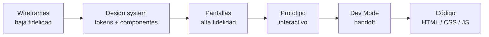
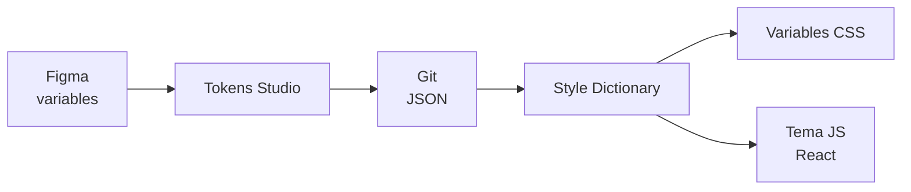
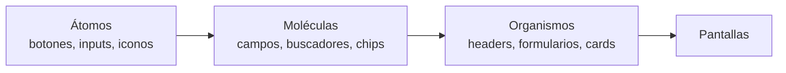

# Diseño de Interfaces Web

## Unidad 5 · Figma Profesional

**Módulo 0615 · Diseño de Interfaces Web**  
CFGS Desarrollo de Aplicaciones Web (DAW)

---

## Objetivos de aprendizaje I

- <span class="fragment">Dominar Figma desde la perspectiva del **desarrollador frontend**, no del diseñador gráfico</span>
- <span class="fragment">Extraer valores precisos: colores, tipografías, espaciados y dimensiones</span>
- <span class="fragment">Navegar con soltura por la interfaz: paneles, atajos y canvas infinito</span>
- <span class="fragment">Crear y manipular **frames** con constraints y Auto Layout</span>

Note: El enfoque es el del desarrollador que debe interpretar especificaciones de diseño y traducirlas a código. Pregunta para el aula: ¿cuántos habéis abierto ya Figma al menos una vez?

---

## Objetivos de aprendizaje II

- <span class="fragment">Construir **componentes reutilizables** con variantes y propiedades</span>
- <span class="fragment">Organizar **bibliotecas** de componentes compartidas entre proyectos</span>
- <span class="fragment">Crear **prototipos interactivos** que comuniquen la intención de diseño antes de codificar</span>
- <span class="fragment">Usar **Dev Mode** para extraer CSS, medidas y assets exportables</span>
- <span class="fragment">Comprender cómo se estructuran los **design tokens** en Figma</span>
- <span class="fragment">Diseñar de forma autónoma una interfaz completa: wireframe → prototipo high-fi</span>

Note: El último objetivo es integrador y se evalúa en el proyecto final de la unidad. Todo lo que veáis hoy —naming, organización, atomic design— aparece ahí.

---

## Motivación inicial

**¿Y si el diseñador cambia un color… y tú sigues programando el anterior?**

- <span class="fragment">Caso real: rediseño de **Microsoft Teams (2023)**, ejecutado íntegramente en Figma</span>
- <span class="fragment">Cientos de pantallas, miles de componentes, decenas de diseñadores trabajando a la vez</span>
- <span class="fragment">El desarrollador abre el enlace y siempre ve la **versión más reciente**</span>
- <span class="fragment">Adiós a archivos descargados, versiones desincronizadas y "¿tú tienes el último?"</span>

Note: La desincronización entre el archivo de diseño y lo que veía el desarrollador era uno de los mayores puntos de fricción del flujo tradicional. Con Figma desaparece: no hay que descargar nada ni gestionar versiones. Preguntad en clase qué usabais antes para el handoff.

---

## Figma: un cambio de paradigma

- <span class="fragment">Primera herramienta profesional **100 % en el navegador** (2016)</span>
- <span class="fragment">Colaboración en tiempo real: todos en el mismo archivo (el "Google Docs" del diseño)</span>
- <span class="fragment">Modelo **freemium**: cuenta gratuita suficiente para todo el curso</span>
- <span class="fragment">Cubre todo el espectro: wireframes low-fi → prototipos interactivos high-fi</span>
- <span class="fragment"><strong>Dev Mode</strong> (2023): vista pensada específicamente para desarrolladores</span>

<div style="font-size: 0.9rem;">

| Criterio | Figma | Sketch | Adobe XD |
|---|---|---|---|
| Plataforma | Navegador (Win/Mac/Linux) | Solo macOS | App nativa |
| Colaboración | Tiempo real, nativa | Plugins (Abstract) | Limitada |
| Versión del diseño | Siempre la última, por enlace | Sincronización manual | Sincronización manual |
| Precio | Freemium | De pago | Suscripción |

</div>

Note: En 2016 parecía arriesgado frente a competidores consolidados; terminó siendo su ventaja competitiva decisiva. Dato práctico: Adobe dejó de invertir en XD a finales de 2024, lo que consolida a Figma como estándar de facto.

---

## Recorrido por la interfaz

<div style="display: grid; grid-template-columns: 1fr 1fr; gap: 0.6rem; font-size: 0.8rem; text-align: left;">

<div class="fragment"><strong>🖼️ Canvas</strong><br>Lienzo infinito, sin límites de página. Exploraciones, moodboards y versiones descartadas conviven en los márgenes.</div>

<div class="fragment"><strong>🛠️ Barra superior</strong><br>Selección (V), Frame (F), formas (R/O/L), pluma (P), texto (T), mano (H), comentarios y presentación.</div>

<div class="fragment"><strong>📑 Panel izquierdo</strong><br>Páginas y jerarquía de capas. Lo que está arriba en el panel está <em>al frente</em> visualmente (a diferencia de Photoshop).</div>

<div class="fragment"><strong>⚙️ Panel derecho (contextual)</strong><br>Pestañas <strong>Design</strong>, <strong>Prototype</strong> y <strong>Dev Mode</strong>. Abajo, panel de <strong>Assets</strong> con componentes y bibliotecas.</div>

</div>

Note: El orden de capas de Figma es más intuitivo para quien viene del desarrollo web: capa arriba en el panel = delante en el canvas. En Photoshop ocurre justo lo contrario.

---

## Atajos imprescindibles

<div style="font-size: 0.85rem;">

| Atajo | Acción | Atajo | Acción |
|---|---|---|---|
| V | Selección | Shift+A | Auto Layout |
| F | Frame | Ctrl+Alt+K | Crear componente |
| R / O / L | Rectángulo / Elipse / Línea | Alt + arrastrar | Instancia (duplicar) |
| P | Pluma | Shift+E | Pestaña Prototype |
| T | Texto | Shift+D | Dev Mode |
| H | Mano (navegar canvas) | Alt + hover | Medir distancias |

</div>

<span class="mini">Memoriza primero V, F, T, Shift+A y Ctrl+Alt+K: cubren el 80 % del trabajo diario.</span>

Note: Los atajos multiplican la velocidad de diseño. Reto para la próxima sesión: crear un frame, un botón con Auto Layout y convertirlo en componente usando solo el teclado cuando sea posible.

---

## Frames vs Grupos

- <span class="fragment"><strong>Frame</strong>: la unidad fundamental del diseño</span>
  - <span class="fragment">Sistema de coordenadas propio y <strong>clip content</strong></span>
  - <span class="fragment">Referencia para constraints y Auto Layout</span>
  - <span class="fragment">Anidable → refleja la estructura HTML real</span>
- <span class="fragment"><strong>Grupo</strong>: mera agrupación visual</span>
  - <span class="fragment">Sin constraints, sin Auto Layout, sin recorte</span>
- <span class="fragment">Regla de oro: si un elemento <strong>contiene</strong> a otros → frame, no grupo</span>

<div style="font-size: 0.85rem;">

| Preset | Tamaño | Breakpoint recomendado |
|---|---|---|
| iPhone 14 | 390 × 844 px | Móvil (375 px) |
| iPad Pro 11 | 834 × 1194 px | Tablet (768 px) |
| Desktop 1440 | 1440 × 1024 px | Escritorio (1440 px) |

</div>

Note: Comenzad siempre con frames de los tres breakpoints principales: os obliga a pensar en responsive desde el inicio, no al final. Un frame equivale conceptualmente a un contenedor HTML.

---

## Constraints: la intención responsive

- <span class="fragment">Definen cómo se comporta un hijo cuando el frame padre cambia de tamaño</span>
- <span class="fragment">Opciones: Left, Right, Center, Scale, Top, Bottom y combinaciones</span>
- <span class="fragment">Ejemplo: botón de envío → <strong>Right + Bottom</strong> (siempre en la esquina inferior derecha)</span>

<div style="font-size: 0.9rem;">

| Constraint en Figma | Equivalente CSS |
|---|---|
| Left + Right, ancho fijo | `margin: 0 auto; width: Xpx` |
| Left + Right, escala (Scale) | `width: 100%` |
| Top + Bottom | `height: 100%` |

</div>

Note: Los constraints permiten extraer del diseño no solo valores estáticos sino la intención responsive completa. Pregunta: ¿qué constraint pondrías a un logo centrado que debe mantenerse centrado al redimensionar?

---

## Auto Layout: el motor de flexibilidad

- <span class="fragment">Aplica reglas tipo **CSS Flexbox** al contenido de un frame</span>
- <span class="fragment">Se activa con <strong>Shift+A</strong></span>
- <span class="fragment">Dirección: horizontal (fila) o vertical (columna)</span>
- <span class="fragment"><strong>Gap</strong> = propiedad CSS `gap`; padding por lado o uniforme</span>
- <span class="fragment">Eje principal = `justify-content` · eje secundario = `align-items`</span>

```css
/* Auto Layout horizontal, gap 16, padding 24 */
display: flex;
flex-direction: row;
gap: 16px;
padding: 24px;
align-items: center;
```

Note: La correspondencia con Flexbox es tan directa que Dev Mode genera este CSS automáticamente. Si domináis Flexbox, ya domináis Auto Layout: solo cambia el vocabulario.

---

## Modos de redimensionado y wrap

<div style="display: grid; grid-template-columns: 1fr 1fr 1fr; gap: 0.6rem; font-size: 0.8rem; text-align: left;">

<div class="fragment"><strong>Fixed</strong><br>Tamaño fijo en píxeles.<br><span class="mini">≈ `width: 120px`</span></div>

<div class="fragment"><strong>Hug contents</strong><br>Se ajusta al contenido.<br><span class="mini">≈ `width: fit-content`</span></div>

<div class="fragment"><strong>Fill container</strong><br>Ocupa todo el espacio disponible.<br><span class="mini">≈ `flex: 1`</span></div>

</div>

- <span class="fragment"><strong>Wrap</strong> (finales de 2023): los elementos fluyen a la siguiente línea, como `flex-wrap: wrap`</span>
- <span class="fragment">Ideal para chips, etiquetas y grids de tarjetas adaptativos</span>
- <span class="fragment">Horizontal + Fill en hijos ≈ columnas flexibles tipo `auto-fill` de CSS Grid</span>

Note: Prueba rápida en clase: cambiad el texto de un botón Hug contents y observad cómo se reajusta solo. Ese comportamiento es exactamente el que esperáis del CSS real.

---

## Sistema de variables

- <span class="fragment">Lanzado en **junio de 2023** (conferencia Config): design tokens nativos en Figma</span>
- <span class="fragment">Valores reutilizables aplicables a rellenos, bordes, tipografías, radios y espaciados</span>

<div style="font-size: 0.85rem;">

| Tipo | Almacena | Uso típico |
|---|---|---|
| Color | HEX/RGB con alpha | Rellenos, bordes, efectos |
| Number | px, rem, % | Dimensiones, spacing, radios |
| String | Texto | Etiquetas, contenidos dinámicos |
| Boolean | Verdadero/falso | Mostrar u ocultar capas |

</div>

- <span class="fragment"><strong>Locales</strong>: solo en el archivo actual (exploraciones rápidas)</span>
- <span class="fragment"><strong>Publicadas</strong>: biblioteca compartida, fuente única de verdad; notifican actualizaciones</span>

Note: Las variables publicadas funcionan igual que los componentes compartidos: cambias el valor en el origen y todos los archivos consumidores reciben aviso. Definidlas al inicio del proyecto, no al terminar.

---

## Modos: theming y escenarios

- <span class="fragment"><strong>Modos</strong>: conjuntos alternativos de valores para las mismas variables</span>
- <span class="fragment">Caso canónico: tema **Light** (`#FFFFFF`) / **Dark** (`#1A1A1A`)</span>
- <span class="fragment">Al cambiar el modo, todo lo que usa variables se actualiza al instante</span>

<div style="display: grid; grid-template-columns: 1fr 1fr; gap: 0.6rem; font-size: 0.8rem; text-align: left;">

<div class="fragment"><strong>Densidad</strong><br>Modo Compact (spacing reducido) vs Comfortable (generoso).</div>

<div class="fragment"><strong>Idiomas</strong><br>Modos ES / EN / FR con variables de string.</div>

<div class="fragment"><strong>White-label</strong><br>Cambiar la paleta corporativa por cliente.</div>

<div class="fragment"><strong>Resoluciones</strong><br>Ajustar tamaños de fuente y espaciados por dispositivo.</div>

</div>

Note: Los modos convierten las variables en herramienta de exploración, no solo de consistencia. Reto: diseñad un componente que funcione en Light y Dark sin duplicar ninguna capa.

---

## Componentes: maestro e instancias

- <span class="fragment">Creación: seleccionar objetos → <strong>Create component</strong> (<code>Ctrl+Alt+K</code>)</span>
- <span class="fragment"><strong>Maestro</strong> (rombos rellenos) → <strong>instancias</strong> (rombo vacío): propagación unidireccional</span>
- <span class="fragment"><strong>Overrides</strong>: personalización local de la instancia que no afecta al maestro</span>
- <span class="fragment">Ejemplo: tarjeta con imagen, título y precio editables; layout y tipografía vinculados</span>
- <span class="fragment">Cambiar la tipografía del maestro actualiza todas las instancias sin override</span>

<div style="font-size: 0.85rem;">

| Propiedad | Para qué sirve |
|---|---|
| Variante | Elegir entre versiones del componente |
| Texto | Exponer capas de texto editables |
| Boolean | Mostrar/ocultar elementos (p. ej. icono opcional) |
| Instance swap | Sustituir un subcomponente por otro |

</div>

Note: Los overrides son la frontera entre copiar-pegar y un sistema de componentes real. Pregunta: ¿qué elementos de una tarjeta de producto sobreescribiríais y cuáles dejaríais vinculados?

---

## Variantes: nomenclatura slash

- <span class="fragment">Agrupan componentes relacionados en un único conjunto con propiedades seleccionables</span>
- <span class="fragment">Formato: <code>Propiedad=Valor</code> separada por barra</span>
- <span class="fragment">Ejemplos: <code>Button/Size=Small</code> · <code>Button/Variant=Primary</code> · <code>Button/State=Default</code></span>
- <span class="fragment">Varias propiedades → Figma genera la <strong>matriz de combinaciones</strong></span>
- <span class="fragment"><strong>Combine as variants</strong>: Figma analiza los nombres y crea los desplegables</span>
- <span class="fragment">Cualquier instancia cambia de combinación desde el panel derecho</span>

<span class="mini">Cálculo mental: Size (3) × Variant (3) × State (4) = 36 combinaciones gestionables desde un solo componente.</span>

Note: La nomenclatura slash no es cosmética: es lo que permite a Figma inferir las propiedades. Un nombre mal puesto y perdéis el control automático de variantes.

---

## Bibliotecas de componentes

- <span class="fragment"><strong>Publicar</strong> en el equipo → consumo desde cualquier archivo</span>
- <span class="fragment">Flujo de actualizaciones: cambio en el origen → notificación en consumidores</span>
- <span class="fragment">Soporte de <strong>branching</strong> y control de versiones</span>
- <span class="fragment">Escalado por niveles (caso Microsoft Teams):</span>
  - <span class="fragment"><strong>Core</strong>: tokens + átomos (botones, inputs, iconos, colores)</span>
  - <span class="fragment"><strong>Components</strong>: moléculas específicas del producto</span>
  - <span class="fragment"><strong>Templates</strong>: layouts predefinidos de pantalla</span>

Note: Sin bibliotecas, cada proyecto reinventa el botón. Con ellas, un cambio de marca se propaga a toda la organización. Es la manifestación práctica del RA2 (interfaces homogéneas mediante estilos y sistemas de diseño).

---

## Prototipado interactivo

- <span class="fragment">Transforma diseños estáticos en experiencias simuladas</span>
- <span class="fragment">Se configura en la pestaña <strong>Prototype</strong> (<code>Shift+E</code>)</span>
- <span class="fragment">Cada conexión = <strong>trigger</strong> + <strong>acción</strong> + <strong>animación</strong></span>
- <span class="fragment">Valida flujos, transiciones y microinteracciones <em>antes de escribir código</em></span>
- <span class="fragment">Botón <strong>Play</strong> (triángulo) → presentación a pantalla completa</span>

Note: El prototipo es el contrato entre diseño y desarrollo: alinea expectativas de todos los stakeholders y reduce cambios costosos de última hora.

---

## Triggers y acciones

<div style="display: grid; grid-template-columns: 1fr 1fr; gap: 0.6rem; font-size: 0.8rem; text-align: left;">

<div class="fragment"><strong>Triggers</strong><br>On click · On hover · On press · On drag · Mouse enter/leave · After delay · While hovering/pressing · On tap · On touch down/up</div>

<div class="fragment"><strong>Acciones</strong><br>Navigate to · Open/Swap/Close overlay · Scroll to · Back · Open link · <strong>Set variable</strong></div>

</div>

- <span class="fragment"><strong>Overlays</strong>: modales y capas superpuestas sin salir del frame</span>
- <span class="fragment"><strong>Set variable</strong>: lógica condicional básica en tiempo de prototipo</span>

Note: Con Set variable podéis simular cosas como habilitar un botón de envío cuando el formulario se completa. Es la puerta de entrada a la lógica en prototipos.

---

## Animaciones entre frames

- <span class="fragment"><strong>Instant</strong>: sin transición</span>
- <span class="fragment"><strong>Dissolve</strong>: fundido cruzado</span>
- <span class="fragment"><strong>Smart Animate</strong>: analiza objetos con el <em>mismo nombre</em> en ambos frames y anima los cambios (posición, tamaño, opacidad, color)</span>
- <span class="fragment"><strong>Move in / Move out</strong> y <strong>Slide in / out</strong>: deslizados direccionales</span>
- <span class="fragment">Curva: ease in, ease out, ease in-out, linear · duración en milisegundos</span>

<span class="mini">Clave de Smart Animate: nombres de capa consistentes entre frames. Sin nombre idéntico, no hay animación.</span>

Note: Smart Animate es la animación más potente y la que más impacto produce en demos. Pero recordad: el nombre de la capa es parte del prototipo, no un detalle menor.

---

## Interactive components

- <span class="fragment">Encapsulan el comportamiento de prototipo dentro de las <strong>variantes</strong> de un componente</span>
- <span class="fragment">Ejemplo: botón con variantes Default → Hover → Pressed → Disabled y conexiones entre ellas</span>
- <span class="fragment">La instancia lleva la interactividad integrada, sin configurar conexiones frame a frame</span>
- <span class="fragment">Consistencia de comportamiento en toda la interfaz</span>
- <span class="fragment">Reduce drásticamente el trabajo de prototipado</span>

Note: En el caso del banco español, el teclado numérico de PIN fue un interactive component con variante por dígito pulsado: se definió una vez y funcionó en todas las pantallas.

---

## El flujo completo en Figma



Note: Este es el recorrido que haréis en el proyecto final. Cada fase tiene su entrega: no saltéis fases, porque cada una valida algo que la siguiente da por bueno.

---

## Dev Mode: del diseño al código

- <span class="fragment">Icono <code>&lt;/&gt;</code> o <code>Shift+D</code>: el panel derecho pasa a modo técnico</span>
- <span class="fragment">Dimensiones, posición y distancias (medición con <code>Alt</code> + hover: líneas rojas)</span>
- <span class="fragment">Tipografía completa: familia, tamaño, peso, line-height, letter-spacing, color</span>
- <span class="fragment">Código generado: <strong>CSS, Tailwind y SwiftUI</strong></span>
- <span class="fragment">Representación visual del Auto Layout: dirección, gap, paddings, resizing</span>
- <span class="fragment">Assets exportables por capa: PNG, SVG…</span>
- <span class="fragment"><strong>Properties</strong>: muestra los tokens por nombre, no el valor crudo</span>

Note: Dev Mode cierra el círculo diseño-código. Consejo: documentad las especificaciones ANTES de implementar, no mientras. Veremos el ejercicio completo en la actividad 4.

---

## Caso real · Microsoft Teams (2023)

- <span class="fragment">Rediseño completo ejecutado **íntegramente en Figma** por un equipo global distribuido</span>
- <span class="fragment">Páginas por área funcional: Chat, Canales, Calendario, Llamadas, Archivos, Configuración</span>
- <span class="fragment">Bibliotecas en 3 niveles: <strong>Core</strong> / <strong>Teams Components</strong> / <strong>Templates</strong></span>
- <span class="fragment">Auto Layout intensivo: de 1920 px a 1024 px, todos los componentes se reajustan solos</span>
- <span class="fragment">Handoff 100 % vía Dev Mode + archivo de <strong>"Redlines"</strong> con edge cases y accesibilidad</span>

Note: Demuestra la escalabilidad de Figma: cientos de pantallas y miles de componentes sin perder el control. Los Redlines capturan lo que el diseño visual no puede comunicar: comportamientos, errores y accesibilidad.

---

## Caso real · Startup fintech española

- <span class="fragment">Gestión de gastos empresariales: <strong>2 diseñadores + 4 desarrolladores</strong></span>
- <span class="fragment">Atomic Design en páginas: <strong>Tokens / Átomos / Moléculas / Organismos</strong></span>
- <span class="fragment">Tokens: paleta, escala tipográfica, espaciado (múltiplos de 4 px, de 4 a 128), sombras</span>
- <span class="fragment">Todo vinculado a variables de Figma → fuente única de verdad</span>



Note: Un equipo diminuto operando un design system profesional. El pipeline de CI/CD garantiza que un cambio de token en Figma llega al paquete npm publicado sin intervención manual.

---

## Caso real · App bancaria para usabilidad

- <span class="fragment">Prototipo high-fi <strong>antes de escribir una línea de código</strong></span>
- <span class="fragment"><strong>+80 frames</strong>: onboarding, login, dashboard, transferencias, Bizum, tarjetas, perfil</span>
- <span class="fragment">Interactive components intensivos:</span>
  - <span class="fragment">Teclado numérico con variante por dígito de PIN (0–4 y error)</span>
  - <span class="fragment">Formularios con estados de validación en tiempo real</span>
  - <span class="fragment">Listas: loading (skeleton), vacío, con datos, error</span>
- <span class="fragment"><strong>15 usuarios</strong>, sesiones moderadas con tareas guiadas ("transfiere 50 € a María")</span>
- <span class="fragment">Comentarios sobre el archivo → iteración en horas · <strong>3 ciclos</strong> prototipo-test-iteración</span>

Note: Las tareas guiadas revelan problemas que ninguna revisión interna detecta. Tres rondas de iteración antes de desarrollar redujeron drásticamente los cambios de última hora en implementación.

---

## Ejemplo guiado · Sistema de botones

1. <span class="fragment">Texto "Button" (Inter Medium 14 px, blanco) → <code>Shift+A</code></span>
2. <span class="fragment">Padding 24/12 · fill <code>#2563EB</code> · sombra (0, 2, blur 4, 30 %) · radio 8 px</span>
3. <span class="fragment">Width y Height → <strong>Hug contents</strong></span>
4. <span class="fragment"><code>Ctrl+Alt+K</code> → renombrar <code>Button/Size=Medium/Variant=Primary/State=Default</code></span>
5. <span class="fragment">Duplicados: Large (padding 32/16) y Small (16/8, 12 px)</span>
6. <span class="fragment">Secondary (transparente + stroke 2 px <code>#2563EB</code>) y Danger (<code>#DC2626</code>)</span>
7. <span class="fragment"><strong>Combine as variants</strong> → desplegables Size / Variant / State</span>

<span class="mini">Resultado: 7 botones distintos gestionados como UN componente con 3 propiedades.</span>

Note: Probadlo vosotros: cambiad la tipografía del maestro y verificad que todas las instancias sin override se actualizan. Eso es un sistema, no copiar-pegar.

---

## Ejemplo guiado · Card de producto

- <span class="fragment">Imagen 320 × 180 + contenido: título (18 Semibold), categoría (12 mayús.), descripción (14), precio (24 Bold <code>#2563EB</code>), botón</span>
- <span class="fragment">Auto Layout vertical interno: gap 12 px, padding 20 px</span>
- <span class="fragment"><strong>Componentes anidados</strong>: el botón es una instancia del sistema anterior</span>
- <span class="fragment">Propiedades: <strong>Text</strong> (título, categoría, descripción, precio) + <strong>Instance swap</strong> (botón)</span>
- <span class="fragment">Variantes: <code>Card/Layout=Vertical</code> / <code>Card/Layout=Horizontal</code></span>
- <span class="fragment">Stroke 1 px <code>#E5E7EB</code> + sombra sutil (0, 2, blur 8, negro 8 %)</span>

Note: El instance swap permite que cada card muestre la variante de botón que quiera sin tocar la estructura. Componer organismos a partir de átomos es exactamente así.

---

## Actividad en clase · Landing TaskFlow

- <span class="fragment"><strong>Objetivo</strong>: landing SaaS completa en 3 breakpoints (390 / 834 / 1440 px)</span>
- <span class="fragment"><strong>Formato</strong>: individual, en clase · <strong>Entregable</strong>: archivo Figma + 5 equivalencias Figma↔CSS documentadas</span>
- <span class="fragment">Secciones: hero, características, precios, testimonios, CTA final, footer</span>
- <span class="fragment">Grid de 12 columnas: gutter 24 px · márgenes 80 / 40 / 16 px</span>
- <span class="fragment">Auto Layout en todas las secciones + constraints verificados</span>
- <span class="fragment">Elementos repetidos → componentes reutilizables</span>

<div style="font-size: 0.8rem;">

| Criterio | Puntos | Criterio | Puntos |
|---|---|---|---|
| Breakpoints + grids | 1,5 | Constraints correctas | 2 |
| Auto Layout | 2 | Equivalencias Figma-CSS | 1,5 |
| Componentes | 1,5 | Coherencia visual | 1,5 |

</div>

Note: Trabajad los tres frames en paralelo desde el minuto uno. Verificad el responsive arrastrando el borde derecho del frame Desktop: si algo no reacciona, falta constraint.

---

## Actividades propuestas

<div style="display: grid; grid-template-columns: 1fr 1fr; gap: 0.6rem; font-size: 0.8rem; text-align: left;">

<div class="fragment"><strong>📚 App de biblioteca</strong><br>Responsive, 5 pantallas (buscador, ficha, reserva multipaso, perfil, dashboard admin). Componentes con variantes + 10 decisiones justificadas en comentarios.</div>

<div class="fragment"><strong>🌓 Temas claro/oscuro</strong><br>EduDS con modos Light/Dark, dos frames demo y exportación JSON → Style Dictionary o CSS Custom Properties con tutorial.</div>

<div class="fragment"><strong>♿ Auditoría de accesibilidad</strong><br>Plugin Stark: contraste WCAG AA/AAA, simulación de daltonismo, targets táctiles ≥ 44 × 44 px, jerarquía de encabezados. Informe + 5 correcciones implementadas.</div>

<div class="fragment"><strong>🛒 Checkout ecommerce</strong><br>Mega menú, filtros, galería, carrito, checkout multipaso, confirmación. Interactive components + Smart Animate en todas las transiciones.</div>

</div>

Note: Para la auditoría necesitáis instalar Stark desde la Figma Community. Recordad: 44 × 44 px es el tamaño mínimo de toque en móvil, no una sugerencia estética.

---

## Actividades de ampliación

- <span class="fragment"><strong>Sincronización bidireccional Figma ↔ código</strong>: Tokens Studio + GitHub + Style Dictionary (CSS y SCSS); probar el cambio en ambos sentidos</span>
- <span class="fragment"><strong>Plugin propio</strong> (TypeScript + Figma Plugin API): generador de paletas, grids responsive, validador de naming… con UI configurable</span>
- <span class="fragment"><strong>Proyecto final evaluable (15 pts)</strong>:</span>
  - <span class="fragment">Investigación + 6 wireframes low-fi validados informalmente</span>
  - <span class="fragment">Design system con variables, átomos y moléculas</span>
  - <span class="fragment">High-fi en 3 breakpoints + prototipo con 3 flujos completos</span>
  - <span class="fragment">Auditoría Stark + documentación de handoff + vídeo de 3–5 min</span>

Note: El proyecto final integra toda la unidad y es la pieza central de la evaluación. Empezad por el design system: es el cuello de botella que más tiempo consume.

---

## Buenas prácticas

- <span class="fragment">✅ Páginas descriptivas con emoji: 🎨 Design System · 📱 Mobile · 💻 Desktop · 📋 Archive</span>
- <span class="fragment">✅ Que cualquiera se oriente en el archivo en <strong>menos de 30 segundos</strong></span>
- <span class="fragment">✅ Naming slash en componentes; nombres semánticos en capas (<code>icon-left</code>, nunca <code>Rectangle 47</code>)</span>
- <span class="fragment">✅ <strong>Grid de 8 puntos</strong>: múltiplos de 8 px (4 px para ajustes finos) · nudge = 8 px</span>
- <span class="fragment">✅ <strong>Atomic Design</strong>: componer pantallas a partir de organismos existentes</span>
- <span class="fragment">✅ Auto Layout como norma, no excepción · comentarios para edge cases y comportamientos</span>



Note: Los nombres consistentes son cruciales también para Smart Animate: detecta automáticamente elementos con el mismo nombre en frames distintos. El 8pt grid se aplica igual en diseño que en desarrollo.

---

## Errores frecuentes

- <span class="fragment">❌ Grupos en lugar de frames: comportamiento impredecible al redimensionar</span>
- <span class="fragment">❌ Posicionamiento absoluto en vez de Auto Layout: traducir "Submit" → "Enviar" rompe el diseño</span>
- <span class="fragment">❌ Componentes separados por variante ("Button Primary", "Button Secondary"…) en vez de un conjunto</span>
- <span class="fragment">❌ Diseñar solo a 1440 px y asumir "ya se adaptará en desarrollo"</span>
- <span class="fragment">❌ Valores hardcodeados: cambiar el color primario exige tocar 40 componentes</span>
- <span class="fragment">❌ Prototipos imposibles de implementar: animaciones sin equivalente en CSS o en el framework</span>

Note: Cada uno de estos errores se convierte en deuda en el handoff. Pregunta para el aula: ¿cuál de ellos habéis visto en un diseño que os han entregado para programar?

---

## Resumen · Conceptos clave

- <span class="fragment">🎯 Figma: navegador, tiempo real, freemium — estándar de la industria</span>
- <span class="fragment">🎯 Frame ≈ contenedor HTML · constraints = intención responsive</span>
- <span class="fragment">🎯 Auto Layout ≈ Flexbox: gap, padding, justify/align</span>
- <span class="fragment">🎯 Fixed / Hug / Fill ≈ px / fit-content / flex: 1</span>
- <span class="fragment">🎯 Variables = design tokens nativos · modos = theming</span>
- <span class="fragment">🎯 Componentes + variantes + bibliotecas = sistema escalable</span>
- <span class="fragment">🎯 Smart Animate vive y muere por los nombres de capa</span>
- <span class="fragment">🎯 Dev Mode: CSS, medidas, assets y tokens por nombre</span>
- <span class="fragment">🎯 Correlación directa: Figma ↔ HTML, CSS, Flexbox, Custom Properties, Web Components</span>

Note: Los fundamentos de Figma son espejo de los conceptos web: aprender uno refuerza el otro. Repasad esta diapositiva antes del proyecto final.

---

## Próximos pasos

- <span class="fragment"><strong>Unidad 6 · Arquitectura de la Información</strong></span>
- <span class="fragment">Cómo organizar el contenido y la navegación <em>antes</em> de diseñar pantallas</span>
- <span class="fragment">User flows, mapas del sitio y etiquetado</span>
- <span class="fragment">Los diseños de Figma que habéis creado se estructurarán según esa arquitectura</span>

Note: Una interfaz preciosa con mala arquitectura de información fracasa igual. La próxima unidad dibuja el mapa; con esta ya tenéis las herramientas para construir sobre él.

---

## ¿Preguntas?

Unidad 5 · Figma Profesional

0615 · DAW · Curso 2025/2026

Note: Cierre de la unidad. Recordad: el proyecto final evaluable está abierto y el design system es por donde conviene empezar esta semana.
