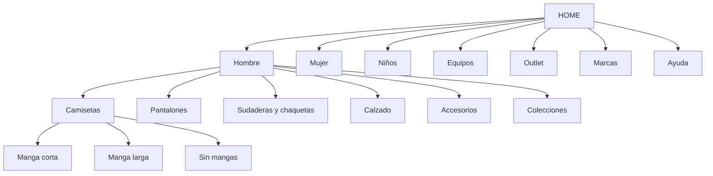
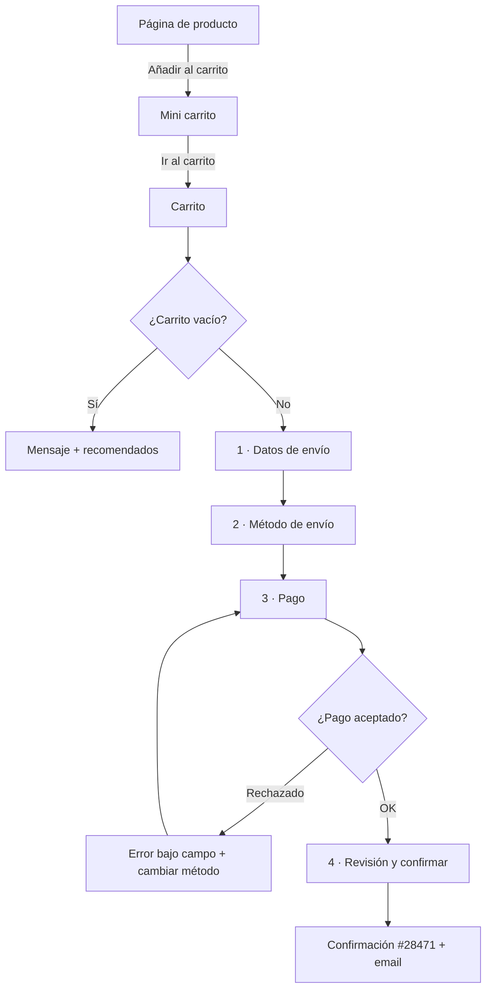

# Diseño de Interfaces Web

## Unidad 6 · Arquitectura de la Información

**Módulo 0615 · Diseño de Interfaces Web**  
CFGS Desarrollo de Aplicaciones Web (DAW)

---

## Objetivos de aprendizaje I

- <span class="fragment">Diseñar la **estructura informativa** de sitios web y aplicaciones</span>
- <span class="fragment">Organizar, **etiquetar** y estructurar contenidos con el mínimo esfuerzo cognitivo</span>
- <span class="fragment">Que el usuario **encuentre lo que busca** y comprenda lo que encuentra</span>
- <span class="fragment">Dominar las herramientas fundamentales de la AI</span>
- <span class="fragment">Comprender la relación entre **AI, usabilidad y UX**</span>

Note: La arquitectura de la información es la fase de planificación previa a cualquier diseño visual o implementación técnica. Pregunta al aula: ¿cuántos sitios habéis abandonado este mes por no encontrar lo que buscabais? Eso es un fallo de AI, no de diseño visual.

---

## Objetivos de aprendizaje II

- <span class="fragment">Elaborar un **sitemap** completo de la estructura jerárquica</span>
- <span class="fragment">Crear **wireframes** de baja, media y alta fidelidad</span>
- <span class="fragment">Diseñar **user flows** que modelen los recorridos del usuario</span>
- <span class="fragment">Construir **mapas de navegación** entre secciones</span>
- <span class="fragment">Justificar decisiones con criterios objetivos: <span class="mini">necesidades del usuario + objetivos de negocio</span></span>

Note: Estos cuatro entregables son exactamente lo que pide el Resultado de Aprendizaje 1 del módulo 0615: planificar la interfaz y documentar la estructura de la información. También alimentan el RA2 (coherencia con la guía de estilo), el RA5 (accesibilidad) y el RA6 (usabilidad).

---

## Motivación: ¿por qué abandonamos una web?

<span class="fragment">Llegas a un sitio nuevo. Sin darte cuenta te preguntas:</span>

1. <span class="fragment"><strong>¿Dónde estoy?</strong> — ¿en qué parte del sitio me encuentro?</span>
2. <span class="fragment"><strong>¿Qué hay aquí?</strong> — ¿qué ofrece esta página?</span>
3. <span class="fragment"><strong>¿A dónde puedo ir?</strong> — ¿qué opciones de navegación tengo?</span>

<span class="fragment">Si no responden en segundos: <strong>desorientación → frustración → abandono</strong>.</span>

Note: Las tres preguntas son el modelo mental inconsciente de todo usuario primerizo. Una buena AI responde antes de que el usuario tenga que pensarlas activamente. Casos como Amazon o la Sede Electrónica están diseñados alrededor de estas tres preguntas.

---

## ¿Qué es la Arquitectura de la Información?

<span style="font-size: 1rem;"><strong>Disciplina que organiza, estructura y etiqueta</strong> los contenidos digitales para que el usuario encuentre información y complete tareas de forma efectiva.</span>

- <span class="fragment"><strong>1975</strong> · Richard Saul Wurman acuña el término: «el estudio de la organización de la información para permitir que otros la encuentren»</span>
- <span class="fragment"><strong>1998</strong> · Rosenfeld y Morville publican <em>Information Architecture for the World Wide Web</em></span>
- <span class="fragment">«El libro del oso polar» (ilustración de su portada) establece la AI como disciplina fundamental del diseño web</span>

Note: Antes de 1998 la AI era un concepto difuso; el libro de Rosenfeld y Morville (4ª edición en 2015, con Jorge Arango) es la referencia canónica. Anécdota útil para el aula: el apodo «libro del oso polar» viene de la ilustración de la portada original.

---

## AI y UX: la analogía del edificio

<div style="display: grid; grid-template-columns: 1fr 1fr; gap: 0.6rem; font-size: 0.8rem; text-align: left;">
  <div class="fragment"><strong>AI = planos de planta</strong><br>Dónde está cada habitación, cómo se conectan los pasillos, dónde están las escaleras.</div>
  <div class="fragment"><strong>Interacción = fontanería y electricidad</strong><br>Cómo funcionan grifos e interruptores.</div>
  <div class="fragment"><strong>Diseño visual = decoración interior</strong><br>Colores, muebles, iluminación.</div>
  <div class="fragment"><strong>UX = el edificio completo</strong><br>Toda la experiencia: emoción, estética, interacción.</div>
</div>

<span class="fragment" style="font-size: 0.9rem;">Sin buenos planos, el edificio es <strong>inhabitable</strong>, por muy bonito que sea.</span>

Note: La UX abarca la totalidad de la experiencia (emocional, estética, interactiva); la AI se centra solo en la dimensión estructural: cómo se organiza, nombra y conecta la información. Insistid en que la AI no compite con el diseño visual: lo hace posible.

---

## Los cuatro pilares de la AI

<div style="display: grid; grid-template-columns: 1fr 1fr; gap: 0.6rem; font-size: 0.8rem; text-align: left;">
  <div class="fragment"><strong>1 · Organización</strong><br>¿Cómo agrupamos los contenidos?</div>
  <div class="fragment"><strong>2 · Etiquetado</strong><br>¿Cómo los nombramos?</div>
  <div class="fragment"><strong>3 · Navegación</strong><br>¿Cómo nos movemos entre ellos?</div>
  <div class="fragment"><strong>4 · Búsqueda</strong><br>¿Cómo los localizamos por consulta?</div>
</div>

<span class="fragment" style="font-size: 0.85rem;">Modelo de <strong>Rosenfeld y Morville</strong>: marco para analizar y diseñar la AI de forma sistemática.</span>

Note: Los cuatro sistemas están interconectados: una mala organización se compensa poco con buenas etiquetas, y una búsqueda potente no sustituye a una navegación clara. Usad este marco como checklist al auditar cualquier web.

---

## Pilar 1 · Sistema de organización

<span style="font-size: 0.9rem;">Decide <strong>cómo se categoriza y estructura</strong> la información. La decisión de AI con mayor impacto en la experiencia.</span>

- <span class="fragment"><strong>Esquemas exactos</strong> (el usuario conoce nombre o fecha): alfabético, cronológico, geográfico</span>
- <span class="fragment"><strong>Esquemas subjetivos</strong> (exploración sin objetivo concreto): por tópico, por audiencia, por tarea</span>
- <span class="fragment"><strong>Estructuras</strong>: jerárquica (árbol) · secuencial (paso a paso) · matricial (rejilla) · hipertexto (red)</span>

Note: La elección de esquema depende del modo de búsqueda: si el usuario sabe exactamente qué busca funciona lo exacto; si explora (regalar algo, buscar alojamiento) necesita esquemas subjetivos. Amazon y Airbnb combinan ambos en el mismo sitio.

---

## Pilar 2 · Sistema de etiquetado

<span class="fragment" style="font-size: 0.95rem;">Cada etiqueta es una <strong>promesa</strong>: clic en «Contacto» ⇒ información de contacto, no un formulario de newsletter.</span>

- <span class="fragment"><strong>Clara</strong> — se entiende sin ambigüedad</span>
- <span class="fragment"><strong>Consistente</strong> — misma etiqueta ⇒ mismo tipo de contenido</span>
- <span class="fragment"><strong>Predictible</strong> — el usuario anticipa qué encontrará</span>
- <span class="fragment"><strong>Breve</strong> — idealmente 1-2 palabras</span>

<span class="fragment" style="font-size: 0.8rem;">Es la interfaz lingüística entre el <span class="mini">modelo mental del diseñador</span> y el <span class="mini">modelo mental del usuario</span>. Si no coinciden, el usuario no entiende.</span>

Note: El etiquetado es donde más fracasan los equipos: usan jerga interna («Soluciones», «Recursos», «Dashboard»). Regla práctica: si existe una palabra que el 95 % de los usuarios entiende («Ayuda»), no la cambiéis por una más creativa.

---

## Pilar 3 · Sistema de navegación

- <span class="fragment"><strong>Global</strong> — todas las páginas, acceso a las secciones principales</span>
- <span class="fragment"><strong>Local</strong> — específica de una sección, sus subpáginas</span>
- <span class="fragment"><strong>Contextual</strong> — enlaces dentro del contenido a páginas relacionadas</span>
- <span class="fragment"><strong>Breadcrumbs</strong> — ruta jerárquica: posición de la página actual</span>
- <span class="fragment"><strong>Facetada</strong> — filtros combinables para refinar resultados</span>
- <span class="fragment"><strong>De utilidad</strong> — login, carrito, ayuda (footer o cabecera secundaria)</span>

Note: Cada sistema cubre una estrategia distinta de usuario: el que explora menús, el que salta por enlaces, el que usa migas de pan para subir niveles. Una buena AI ofrece redundancia funcional: varias vías hacia el mismo contenido.

---

## Pilar 4 · Sistema de búsqueda

<span class="fragment" style="font-size: 0.9rem;">No todas las interfaces lo necesitan (sitios pequeños o muy guiados), pero cuando el <strong>volumen supera cierto umbral</strong> se vuelve imprescindible.</span>

- <span class="fragment">Motor de indexación completo</span>
- <span class="fragment">Tolerancia a errores tipográficos (<span class="mini">fuzzy search</span>)</span>
- <span class="fragment">Búsqueda predictiva con autocompletado</span>
- <span class="fragment">Filtros post-búsqueda (<span class="mini">faceted search</span>)</span>
- <span class="fragment">Ordenación por relevancia y fecha</span>
- <span class="fragment">Página de resultados con información suficiente para decidir</span>

Note: En ecommerce la búsqueda suele ser el canal principal: en Amazon domina visualmente la cabecera. Recordad que la búsqueda no sustituye a la navegación, la complementa; y una página de resultados pobre arruina incluso el mejor motor.

---

## Wireframes: el esqueleto de la interfaz

<span style="font-size: 0.9rem;">Representación esquemática de la <strong>disposición espacial</strong> de elementos, sin diseño visual final. Define estructura, proporciones y relaciones: no muestra piel ni ropa.</span>

<div style="font-size: 0.9rem;">
<table>
<tr><th>Fidelidad</th><th>Herramienta</th><th>Características</th><th>Uso</th></tr>
<tr class="fragment"><td><strong>Baja</strong> (low-fi)</td><td>Papel, pizarra</td><td>Rectángulos, líneas, placeholder</td><td>Exploración rápida, minutos</td></tr>
<tr class="fragment"><td><strong>Media</strong> (mid-fi)</td><td>Figma, Balsamiq, Sketch</td><td>Grises, tipografía genérica, proporciones</td><td>Stakeholders, pruebas tempranas</td></tr>
<tr class="fragment"><td><strong>Alta</strong> (high-fi)</td><td>Figma</td><td>Contenido real, placeholders realistas</td><td>Rozando el mockup visual</td></tr>
</table>
</div>

Note: La abstracción es deliberada: evita que colores y tipografías desvíen la discusión de la estructura. El formato estándar para comunicar con stakeholders y hacer pruebas de usabilidad tempranas es el wireframe de media fidelidad.

---

## Wireframes: qué incluyen y excluyen

<div style="display: grid; grid-template-columns: 1fr 1fr; gap: 0.6rem; font-size: 0.8rem; text-align: left;">
  <div class="fragment"><strong>Incluye</strong><br>· Estructura: cabecera, contenido, lateral, footer<br>· Bloques con jerarquía visual (tamaño ⇒ importancia)<br>· Navegación: menús, breadcrumbs, enlaces<br>· Elementos funcionales: botones, formularios<br>· Anotaciones de comportamiento</div>
  <div class="fragment"><strong>Excluye</strong><br>· Colores definitivos (grises)<br>· Imágenes finales (rectángulo con X)<br>· Tipografías decorativas (Arial, Inter)<br>· Detalles ornamentales</div>
</div>

<span class="fragment" style="font-size: 0.85rem;"><strong>Proceso iterativo:</strong> alternativas low-fi ⇒ feedback equipo/usuarios ⇒ refinar y subir fidelidad ⇒ wireframe por cada breakpoint (móvil, tablet, escritorio).</span>

Note: Probad a pedir a los alumnos que wireframeen la misma pantalla dos veces: una vez pensando en el contenido y otra en la navegación. Verán cómo cambia el peso relativo de cada bloque. Las anotaciones son obligatorias: un wireframe sin ellas genera malentendidos con desarrollo.

---

## User Flows: modelando recorridos

<span class="fragment" style="font-size: 0.9rem;">Diagrama del <strong>recorrido completo</strong> para completar una tarea. Si el sitemap es el mapa de carreteras, el user flow es la ruta concreta casa-trabajo.</span>

- <span class="fragment"><strong>Pantallas</strong> — rectángulos</span>
- <span class="fragment"><strong>Acciones</strong> — flechas etiquetadas: «hace clic en…», «rellena…»</span>
- <span class="fragment"><strong>Decisiones</strong> — rombos, bifurcaciones</span>
- <span class="fragment"><strong>Conectores</strong> — dirección del flujo</span>
- <span class="fragment"><strong>Anotaciones de estado</strong> — «email enviado», «error de conexión»</span>

<span class="fragment" style="font-size: 0.85rem;">Obliga a pensar la experiencia como <strong>secuencia de pasos</strong>, no como pantallas aisladas.</span>

Note: Empezad siempre por historias de usuario («Como cliente, quiero comprar un producto para recibirlo en mi domicilio») y deducid los pasos. El error típico es diseñar pantallas bonitas sin haber definido antes la secuencia que las une.

---

## Tipos de user flow y happy path

<div style="font-size: 0.9rem;">
<table>
<tr><th>Tipo</th><th>Nivel</th><th>Para qué sirve</th></tr>
<tr class="fragment"><td><strong>Task flow</strong></td><td>Alto</td><td>Lógica del proceso, sin pantallas concretas</td></tr>
<tr class="fragment"><td><strong>Wire flow</strong></td><td>Medio</td><td>Flujo sobre wireframes en miniatura</td></tr>
<tr class="fragment"><td><strong>Screen flow</strong></td><td>Detalle</td><td>Cada pantalla como nodo; documentación completa</td></tr>
</table>
</div>

<span class="fragment" style="font-size: 0.85rem;"><strong>Método:</strong> historia de usuario ⇒ <span class="mini">happy path</span> (sin errores) ⇒ flujos alternativos y de error.</span>

<span class="fragment" style="font-size: 0.85rem;">¿Stock agotado? ¿Tarjeta rechazada? ¿Timeout de sesión? <strong>Los flujos de error diferencian un diseño robusto de uno frágil.</strong></span>

Note: Los escenarios alternativos suelen representar la mayor parte de la complejidad de la interfaz. Ejercicio rápido en clase: dadles el happy path de un checkout y pedidles que enumeren cinco cosas que pueden salir mal. Normalmente llegan a diez.

---

## Sitemaps: la estructura del sitio

<span style="font-size: 0.9rem;">Diagrama de la <strong>estructura jerárquica</strong>: todas las páginas y sus relaciones de contención. Responde: «¿qué páginas tiene este sitio y cómo se organizan?»</span>

- <span class="fragment">Raíz = <strong>Home</strong>; cajas etiquetadas + líneas de pertenencia</span>
- <span class="fragment">Estructuras: <strong>jerárquica</strong> (la más común) · lineal · radial · matricial</span>
- <span class="fragment">Contenido masivo: se indica una <strong>página template</strong> + anotación de generación dinámica (no dibujar 50.000 productos)</span>

Note: El sitemap es el entregable fundamental de documentación de la AI. Recordad la diferencia con el XML sitemap: aquel es para humanos (diseño), este es un archivo técnico para crawlers de buscadores. En esta unidad trabajamos solo con sitemaps visuales.

---

## Reglas de construcción del sitemap

<div style="display: grid; grid-template-columns: 1fr 1fr; gap: 0.6rem; font-size: 0.8rem; text-align: left;">
  <div class="fragment"><strong>Regla 7±2</strong> (número mágico de Miller)<br>Memoria de trabajo ≈ 7 elementos. Máximo 7±2 opciones por nivel de navegación.</div>
  <div class="fragment"><strong>Regla de los 3 clics</strong><br>Todo accesible en ≤3 clics desde home. Controvertida: se abandona por desorientación, no por clics. Útil heurística anti-profundidad.</div>
</div>

<span class="fragment" style="font-size: 0.85rem;"><strong>Sitemap visual</strong> (herramienta de diseño, para humanos) ≠ <strong>XML sitemap</strong> (archivo para crawlers, SEO).</span>

Note: Son heurísticas, no leyes físicas: aplícalas con criterio según contexto y usuarios. Pregunta al aula: ¿por qué creéis que los usuarios abandonan por desorientación y no por número de clics? Porque pierden el hilo de dónde están y a dónde van.

---

## Esquemas de organización de contenidos

<div style="font-size: 0.9rem;">
<table>
<tr><th>Tipo</th><th>Esquema</th><th>Cuándo usarlo</th></tr>
<tr class="fragment"><td rowspan="3"><strong>Exactos</strong></td><td>Alfabético</td><td>El usuario conoce el nombre</td></tr>
<tr class="fragment"><td>Cronológico</td><td>Conoce la fecha</td></tr>
<tr class="fragment"><td>Geográfico</td><td>Busca por ubicación</td></tr>
<tr class="fragment"><td rowspan="3"><strong>Subjetivos</strong></td><td>Por tópico</td><td>Explora por tema</td></tr>
<tr class="fragment"><td>Por audiencia</td><td>Se identifica como perfil</td></tr>
<tr class="fragment"><td>Por tarea</td><td>Quiere hacer algo</td></tr>
</table>
</div>

<span class="fragment" style="font-size: 0.85rem;">Criterio clave: <strong>búsqueda conocida</strong> (exactos) vs <strong>exploratoria</strong> (subjetivos). Muchos sitios combinan ambas vías.</span>

Note: El caso de la Sede Electrónica es el ejemplo perfecto de esquema híbrido: por tópico (salud, vivienda, educación) Y por audiencia (ciudadanos, empresas, administraciones), porque diferentes usuarios conceptualizan los trámites de formas distintas.

---

## Estructuras de organización

<div style="font-size: 0.9rem;">
<table>
<tr><th>Estructura</th><th>Forma</th><th>Ventajas</th><th>Inconvenientes</th></tr>
<tr class="fragment"><td><strong>Jerárquica</strong></td><td>Árbol</td><td>Posición clara, la más común en web</td><td>Un contenido en una sola rama</td></tr>
<tr class="fragment"><td><strong>Secuencial</strong></td><td>Paso a paso</td><td>Guiada (checkout, wizards)</td><td>Ruta única, poco flexible</td></tr>
<tr class="fragment"><td><strong>Matricial</strong></td><td>Rejilla</td><td>Cruza 2 dimensiones (filtros ecommerce)</td><td>Compleja de mantener</td></tr>
<tr class="fragment"><td><strong>Hipertexto</strong></td><td>Red</td><td>Enlaces contextuales, libre</td><td>Desorienta sin anclajes</td></tr>
</table>
</div>

Note: La jerarquía pura es insuficiente en webs grandes: combinala con navegación contextual (hipertexto) y breadcrumbs para dar al usuario múltiples rutas. Un árbol demasiado profundo se aplanan con mega menús y búsqueda.

---

## Card Sorting: descubrir modelos mentales

<span class="fragment" style="font-size: 0.9rem;">Entregar tarjetas con contenidos y pedir que se <strong>agrupen y se nombren las categorías</strong>. Resultado: mapa del modelo mental colectivo de los usuarios.</span>

<div style="font-size: 0.9rem;">
<table>
<tr><th>Tipo</th><th>Categorías</th><th>Uso</th></tr>
<tr class="fragment"><td><strong>Abierto</strong></td><td>Libres (grupos + nombres)</td><td>Fases iniciales, descubrir conceptualización</td></tr>
<tr class="fragment"><td><strong>Cerrado</strong></td><td>Predefinidas</td><td>Validar estructura propuesta</td></tr>
<tr class="fragment"><td><strong>Híbrido</strong></td><td>Algunas predefinidas + nuevas</td><td>Compromiso entre ambos</td></tr>
</table>
</div>

- <span class="fragment"><strong>30-60 tarjetas</strong> (menos ⇒ poca riqueza; más ⇒ fatiga)</span>
- <span class="fragment">Presencial (razonamiento en voz alta) o remoto: <span class="mini">OptimalSort, Miro, FigJam, UserZoom</span></span>
- <span class="fragment">Análisis: <strong>matriz de similaridad</strong> (% pares agrupados) + <strong>dendrograma</strong> (cortar el árbol ⇒ nº de categorías)</span>

Note: Es la herramienta principal para evitar imponer el organigrama interno. Dato práctico: con menos de 30 tarjetas no hay datos suficientes y con más de 60 el participante se fatiga; 12 participantes ya dan señales fiables de consenso.

---

## Tree Testing: validar la estructura

<span class="fragment" style="font-size: 0.9rem;">Pregunta «<strong>¿dónde buscarías este contenido?</strong>» sobre un árbol de texto puro: sin diseño, sin navegación, sin pistas.</span>

- <span class="fragment">Evalúa la calidad intrínseca de la AI, aislada de muletas visuales</span>
- <span class="fragment"><strong>Métricas:</strong> success rate · directness (direccionalidad) · time taken</span>
- <span class="fragment">Success rate <strong>&lt; 80 %</strong> ⇒ problemas serios antes de implementar</span>
- <span class="fragment">Herramientas: <strong>Treejack</strong> (Optimal Workshop), UserZoom</span>

<div style="font-size: 0.9rem;">
<table>
<tr><th></th><th>Card Sorting</th><th>Tree Testing</th></tr>
<tr class="fragment"><td>Pregunta</td><td>¿Cómo agruparías?</td><td>¿Dónde buscarías?</td></tr>
<tr class="fragment"><td>Función</td><td>Generar estructura</td><td>Validar estructura existente</td></tr>
</table>
</div>

Note: Es revelador precisamente porque elimina todo lo que en una interfaz real ayuda al usuario a llegar «por casualidad». Si no lo encuentra en el árbol de texto, probablemente tampoco lo encontrará en la web. Directness mide claridad de etiquetas: si llega bien pero rodeando, la etiqueta falla.

---

## Principios de etiquetado

- <span class="fragment"><strong>Claridad</strong> — significado sin ambigüedad</span>
- <span class="fragment"><strong>Consistencia</strong> — misma etiqueta ⇒ mismo destino</span>
- <span class="fragment"><strong>Predictibilidad</strong> — anticipar el contenido</span>
- <span class="fragment"><strong>Brevedad</strong> — 1-2 palabras</span>

<span class="fragment" style="font-size: 0.85rem;">Tipos: navegación · contenido · iconos · indexación (SEO).</span>

<span class="fragment" style="font-size: 0.85rem;"><strong>Prueba rápida:</strong> «¿Qué esperarías encontrar si haces clic aquí?» — barata, rápida y revela brechas de lenguaje.</span>

<span class="fragment" style="font-size: 0.8rem;">⚠ Etiquetas ambiguas típicas: «Soluciones», «Recursos», «Área personal», «Dashboard».</span>

Note: El etiquetado también es señal de SEO: los motores leen las etiquetas de navegación para entender el contenido del sitio. Consejo: probad vuestras etiquetas con compañeros de otras asignaturas, no solo con el grupo de diseño que comparte vuestro vocabulario.

---

## Sistemas de navegación: patrones

- <span class="fragment"><strong>Global</strong> — cabecera persistente, 5-7 opciones, visible y predecible</span>
- <span class="fragment"><strong>Local</strong> — barra lateral o submenú de la sección activa</span>
- <span class="fragment"><strong>Contextual</strong> — «Artículos relacionados», normativa aplicable</span>
- <span class="fragment"><strong>Breadcrumbs</strong> — ruta lógica (no historial físico): `Inicio > Categoría > Página`</span>
- <span class="fragment"><strong>Facetada</strong> — facetas dinámicas; visibles, removibles una a una, caso 0 resultados gestionado</span>
- <span class="fragment"><strong>Footer / utilidad</strong> — legal, contacto, login, carrito</span>

```html
<nav aria-label="migas de pan">
  <ol>
    <li><a href="/">Inicio</a></li>
    <li><a href="/tramites">Trámites</a></li>
    <li><a href="/tramites/dni">DNI</a></li>
    <li aria-current="page">Renovación del DNI</li>
  </ol>
</nav>
```

Note: Los breadcrumbs deben reflejar la ruta jerárquica real, no por dónde llegó el usuario. En el código, aria-current="page" marca la página actual (no es un enlace). La navegación facetada es potente pero exigente: si una combinación de facetas no da resultados, hay que decirlo y ofrecer alternativas.

---

## Navegación responsive

<div style="display: grid; grid-template-columns: 1fr 1fr; gap: 0.6rem; font-size: 0.8rem; text-align: left;">
  <div class="fragment"><strong>Menú hamburguesa</strong><br>Oculta la nav tras ☰. Ahorra espacio; reduce visibilidad de opciones.</div>
  <div class="fragment"><strong>Tab bar / bottom nav</strong><br>Barra inferior fija, 3-5 secciones, un toque (patrón iOS).</div>
  <div class="fragment"><strong>Off-canvas</strong><br>Panel lateral deslizante + gesto de swipe. Menú completo sin perder contexto.</div>
  <div class="fragment"><strong>Gestos</strong><br>Swipe, pull-to-refresh: navegación nativa en móvil.</div>
</div>

<span class="fragment" style="font-size: 0.85rem;">Más del <strong>50 % del tráfico</strong> es móvil ⇒ enfoque <strong>mobile-first</strong>: diseñar primero para la pantalla más restrictiva.</span>

Note: El menú hamburguesa sigue siendo polémico: oculta la navegación y penaliza la descubribilidad. En portales de noticias combina off-canvas (menú completo) con bottom nav (4 accesos rápidos). Pedid a los alumnos que justifiquen cada patrón elegido en sus wireframes.

---

## Ejemplo · Sitemap ecommerce deportivo



- <span class="fragment">Amplitud nivel 1: <strong>7 opciones</strong> ⇒ límite exacto de Miller</span>
- <span class="fragment">Profundidad máxima <strong>3 niveles</strong> ⇒ cumple regla de 3 clics</span>
- <span class="fragment">Nivel 2: 3-6 subcategorías por rama; etiquetas descriptivas, sin jerga</span>

Note: Observad el equilibrio: 7 ramas en nivel 1 (máximo manejable) y 3-6 hijos en nivel 2 (carga cognitiva controlada). «Niños» se organiza por rangos de edad (0-2, 3-7, 8-14) y «Marcas» lista Nike, Adidas, Puma, Under Armour, New Balance, Reebok y The North Face.

---

## Ejemplo · User flow de checkout



<span class="fragment" style="font-size: 0.8rem;"><strong>Alternativas contempladas:</strong> carrito vacío · usuario invitado/login · CP-ciudad inválido · tarjeta rechazada · stock agotado en revisión · timeout de sesión (&gt;30 min).</span>

Note: El happy path es fácil; el diseño se demuestra en las ramificaciones. Cada rombo es una decisión con dos destinos: pensad quién gestiona el estado (datos conservados, botón bloqueado, mensaje naranja o rojo). Este flujo es el ejercicio clásico de examen de la unidad.

---

## Caso real · Amazon

- <span class="fragment">Cientos de millones de productos; atiende a quien <strong>busca</strong> y a quien <strong>explora</strong></span>
- <span class="fragment">Cabecera: mega menú «Todas las categorías» (~30 categorías) + <strong>buscador protagonista</strong> + utilidades</span>
- <span class="fragment">Mega menú de dos columnas: categoría ⇒ subcategorías y ofertas; cualquier categoría a 1 clic</span>
- <span class="fragment">Facetas dinámicas: departamento, valoración, precio (histograma), marca, características, disponibilidad Prime, condición; facetas activas como <span class="mini">chips</span></span>
- <span class="fragment">Ficha de producto ordenada por relevancia para la decisión; «Comprados juntos habitualmente» (contextual con datos reales); reseñas con facetas internas</span>

Note: Amazon es el caso de estudio definitivo de AI a gran escala. Fijaos en cómo cada sección de la ficha de producto responde a una pregunta concreta del comprador. El mega menú elimina la necesidad de recordar rutas: es profundidad aplanada mediante exposición.

---

## Caso real · Airbnb

- <span class="fragment">Millones de alojamientos + modelo de <strong>exploración visual y aspiracional</strong></span>
- <span class="fragment">Buscador dominante: destino (autocompletado predictivo) + fechas (calendario doble) + huéspedes. 3 campos que ocultan enorme complejidad</span>
- <span class="fragment">Categorías visuales: «Frente a la playa», «Cabañas», «Casas diminutas», «Islas»… tópico + atributos</span>
- <span class="fragment">Resultados: <strong>dualidad lista + mapa interactivo</strong>; facetas estándar + dominio (mascotas, piscina) + flexibilidad</span>
- <span class="fragment">Detalle: galería primero; botón de reserva <strong>persistente</strong> (barra fija móvil / panel escritorio)</span>

Note: Airbnb demuestra que la AI debe adaptarse a varios modos de búsqueda en el mismo sitio: conocido (destino + fechas) y exploratorio (tipo de experiencia). La dualidad lista-mapa es un ejemplo magistral de navegación espacial.

---

## Caso real · Sede Electrónica (España)

- <span class="fragment">Servicio público: utilizable por el <strong>100 % de la ciudadanía</strong> (mayores, discapacidad, baja alfabetización digital)</span>
- <span class="fragment">Esquema híbrido: <strong>por tópico</strong> (trabajo, vivienda, educación, salud, transportes) + <strong>por audiencia</strong> (ciudadanos, empresas, administraciones)</span>
- <span class="fragment">Nav global reducida (4-5 opciones) + nav local extensa + <strong>breadcrumbs omnipresentes</strong></span>
- <span class="fragment">Búsqueda: sugerencias predictivas + avanzado facetado (tipo, organismo, nivel, perfil, modo de tramitación)</span>
- <span class="fragment">Marco legal: <strong>RD 1112/2018</strong> ⇒ <span class="mini">UNE-EN 301549 ≈ WCAG 2.1 AA</span>; etiquetas literales; operable con teclado y lector de pantalla</span>

Note: En sector público la accesibilidad no es opcional: es requisito legal. La AI refleja ese compromiso: etiquetas claras y literales (sin metáforas), profundidad controlada y múltiples vías al mismo contenido. Comparad con un ecommerce: aquí gana la claridad sobre la conversión.

---

## Actividad en clase · Sitemap LearnHub

<div style="font-size: 0.85rem; text-align: left;">
<strong>Objetivo:</strong> sitemap completo de un portal de formación online (cursos, certificaciones, recursos, comunidad).<br>
<strong>Formato:</strong> individual · 45 min · Figma, Miro, Lucidchart, Draw.io o papel.<br>
<strong>Entregable:</strong> diagrama + informe de 500 palabras.
</div>

- <span class="fragment">1. Inventario: <strong>≥30 elementos</strong> clasificados (contenido, funcionalidad, soporte, institucional)</span>
- <span class="fragment">2. Categorías nivel 1 justificadas, respetando <strong>7±2</strong></span>
- <span class="fragment">3. Nivel 2: profundidad <strong>≤4 niveles</strong></span>
- <span class="fragment">4. Dibujo con código de color/forma por tipo de página (contenido, funcional, template, externo)</span>
- <span class="fragment">5. Anotar <strong>≥3 navegaciones contextuales</strong></span>
- <span class="fragment">6. Verificación: ¿&gt;3 clics? ¿&gt;9 subcategorías? ¿Etiquetas ambiguas?</span>

<span class="fragment" style="font-size: 0.75rem;">Rúbrica: inventario 1,5 · nivel 1 (7±2) 1,5 · profundidad 1 · diagrama 2 · contextual 1 · informe 1,5 · nomenclatura 1,5</span>

Note: Insistid en el paso 6: la mayoría de sitemaps de primer año tienen alguna página a 4 clics o una categoría con 10 hijos. El informe debe comparar vuestra solución con al menos una alternativa descartada y explicar por qué.

---

## Buenas prácticas

- <span class="fragment">✅ Diseñar desde <strong>necesidades y modelos mentales de usuarios</strong>, no desde el organigrama</span>
- <span class="fragment">✅ <strong>Consistencia no negociable</strong> en la navegación global: mismo lugar, mismo orden, mismas etiquetas</span>
- <span class="fragment">✅ <strong>Probar etiquetas con usuarios</strong> antes de implementar</span>
- <span class="fragment">✅ Equilibrar <strong>profundidad y amplitud</strong>: 7±2 y 3 clics como heurísticas con criterio</span>
- <span class="fragment">✅ Diseñar para la <strong>peor condición</strong>: sin JS, solo teclado, lector de pantalla</span>
- <span class="fragment">✅ Documentar la AI como <strong>entregable vivo</strong>: un sitemap desactualizado es peor que no tenerlo</span>

Note: El espejo del organigrama es el pecado capital: organizar la web de una universidad por vicerrectorados en lugar de por tareas (matricularse, consultar notas, solicitar beca). La Card Sorting es la vacuna principal contra este error.

---

## Errores frecuentes

- <span class="fragment">❌ <strong>Org-chart mirroring</strong>: «Departamento Comercial» en lugar de «Solicitar presupuesto»</span>
- <span class="fragment">❌ Etiquetas marketinianas: «Descubre», «Inspírate», «Soluciones innovadoras»</span>
- <span class="fragment">❌ Estructuras excesivamente profundas (5-7 clics): invisibles para usuarios <em>y</em> para SEO</span>
- <span class="fragment">❌ Ignorar móvil (&gt;50 % del tráfico): adaptar después no vale, hay que ir <span class="mini">mobile-first</span></span>
- <span class="fragment">❌ Vía única de acceso: falta <strong>redundancia funcional</strong> (menú + búsqueda + contexto)</span>
- <span class="fragment">❌ Wireframes sin anotaciones: nadie ve estados de error, carga o éxito</span>

Note: Para aplanar jerarquías profundas: mega menús que expongan hasta nivel 3, más navegación contextual y búsqueda. Y recordad: si una etiqueta la entiende el 95 % de los usuarios, no la toquéis.

---

## Resumen · Conceptos clave

- <span class="fragment">🎯 AI: organizar, estructurar y etiquetar para que el usuario <strong>encuentre y comprenda</strong></span>
- <span class="fragment">🎯 3 preguntas: ¿dónde estoy? · ¿qué hay aquí? · ¿a dónde puedo ir?</span>
- <span class="fragment">🎯 4 pilares: organización · etiquetado · navegación · búsqueda</span>
- <span class="fragment">🎯 Herramientas: <strong>sitemap</strong> (estructura) · <strong>wireframe</strong> (disposición) · <strong>user flow</strong> (recorridos) · <strong>mapa de navegación</strong></span>
- <span class="fragment">🎯 Investigación: <strong>card sorting</strong> genera · <strong>tree testing</strong> valida (&lt;80 % success = alarma)</span>
- <span class="fragment">🎯 Heurísticas: <strong>7±2</strong> (Miller) y <strong>3 clics</strong></span>
- <span class="fragment">🎯 La AI es <strong>continua</strong>, no una fase que se supera</span>

Note: Cerrad repitiendo la cadena completa: investigación (card sorting/tree testing) ⇒ estructura (sitemap) ⇒ disposición (wireframes) ⇒ recorridos (user flows) ⇒ navegación (mapa). Esa cadena es el flujo de trabajo profesional de la unidad y el que evaluaré en el proyecto integrado.

---

## Próximos pasos

<span class="fragment" style="font-size: 1rem;">La estructura ya la tenéis. Ahora toca darle <strong>significado en el código</strong>.</span>

- <span class="fragment"><strong>Unidad 7 · HTML Semántico</strong></span>
- <span class="fragment">De la caja del wireframe al elemento semántico: <span class="mini">&lt;header&gt;, &lt;nav&gt;, &lt;main&gt;, &lt;aside&gt;, &lt;footer&gt;</span></span>
- <span class="fragment">Cómo traduce el HTML las decisiones de AI que hoy habéis diseñado</span>

Note: Avisad de que la próxima unidad aterriza todo esto en código: cada bloque del wireframe se convertirá en un elemento semántico, y la navegación global, local y contextual de hoy serán etiquetas concretas con ARIA. Traed vuestros sitemaps de la actividad.

---

## ¿Preguntas?

<span style="font-size: 1rem;"><strong>Unidad 6 · Arquitectura de la Información</strong></span>

0615 · DAW · Curso 2025/2026

Note: Cerrad dejando tiempo para dudas. Si sobra, lanzad la pregunta retadora: «¿Cuál es el peor sitemap que habéis visto en una web española y por qué falla?».
