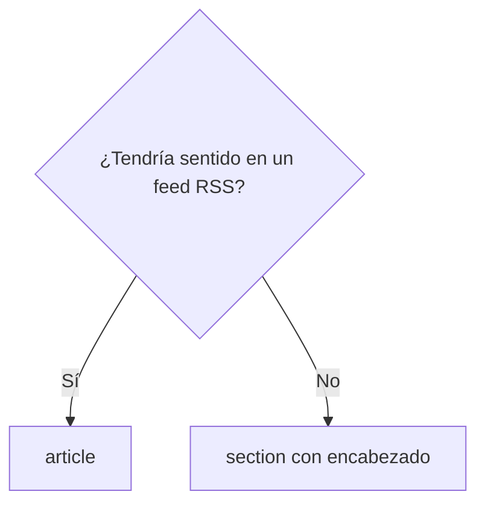
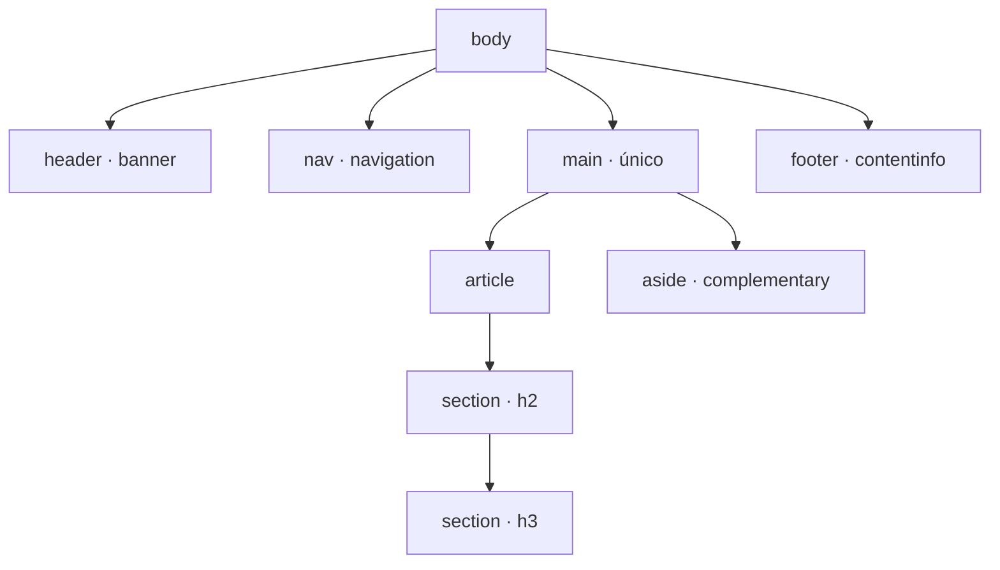

# Diseño de Interfaces Web

## Unidad 7 · HTML Semántico

**Módulo 0615 · Diseño de Interfaces Web**  
CFGS Desarrollo de Aplicaciones Web (DAW)

---

## Objetivos de aprendizaje I

- <span class="fragment">Comprender y aplicar el **HTML semántico**: páginas accesibles, mantenibles y optimizadas para buscadores</span>
- <span class="fragment">Distinguir elementos genéricos (`<div>`, `<span>`) de los semánticos (`<header>`, `<nav>`, `<main>`, `<article>`, `<section>`, `<aside>`, `<footer>`)</span>
- <span class="fragment">Dominar la jerarquía de encabezados: **único `<h1>`**, sin saltos de nivel</span>
- <span class="fragment">Construir formularios accesibles: `<label>` asociada, `<fieldset>`/`<legend>`, tipos HTML5 y validación nativa</span>

Note: Estos cuatro objetivos son la base estructural de toda la unidad. Pregunta para el aula: ¿cuántos div usasteis en vuestro último proyecto? La respuesta suele generar autoconciencia. Insistid en que la semántica no es decoración: es requisito funcional de accesibilidad y SEO.

---

## Objetivos de aprendizaje II

- <span class="fragment">Navegación semántica: `<nav>` + listas, skip links y `aria-current`</span>
- <span class="fragment">Tablas accesibles: `<caption>`, `scope` y sistema `id`/`headers`</span>
- <span class="fragment">SEO técnico: meta description, Open Graph, Twitter Cards y JSON-LD con Schema.org</span>
- <span class="fragment">WAI-ARIA como **complemento** del HTML nativo, nunca como sustituto</span>
- <span class="fragment">HTML5 avanzado: `<template>`, `<slot>`, `<picture>`, `srcset`/`sizes`, `loading="lazy"` y metadatos PWA</span>

Note: Los dos últimos objetivos conectan con unidades posteriores: WAI-ARIA se profundiza en la Unidad 14 (Accesibilidad Web) y los metadatos PWA reaparecen en Multimedia. Si sobra tiempo, preguntad qué temas de esta lista ya habéis usado en proyectos propios.

---

## Motivación inicial

**¿Qué oye una persona ciega al abrir tu web?**

- <span class="fragment">Sin semántica: una **masa indiferenciada de `<div>`** sin pistas sobre la función de cada bloque</span>
- <span class="fragment">Con semántica: «Navegación… Contenido principal… Artículo…» — el lector salta entre regiones con atajos de teclado</span>
- <span class="fragment">Google también lee la estructura: `<article>`, jerarquía de encabezados y JSON-LD determinan cómo se indexa tu contenido</span>
- <span class="fragment"><strong>Pregunta inicial:</strong> ¿podrías navegar tu última web usando solo la tecla Tab?</span>

Note: Es el gancho de la unidad. Demostración práctica: navegad una página con solo Tab, o activad NVDA (gratis) durante un minuto. El contraste entre «masa de divs» y «landmarks navegables» hace que todo lo demás tenga sentido.

---

## ¿Qué es el HTML semántico?

<div style="text-align: left; font-size: 0.9rem;">

- <span class="fragment">Usar elementos que transmiten el **significado y la función** del contenido</span>
- <span class="fragment">Para navegadores, desarrolladores y tecnologías de asistencia</span>
- <span class="fragment">En lugar de envolverlo todo en `<div>` y `<span>` genéricos</span>
- <span class="fragment">Evolución: HTML4/XHTML (`<div id="header">`) → HTML5 (`<header>`)</span>
- <span class="fragment">Visión de la web semántica de **Tim Berners-Lee**: datos estructurados que las máquinas interpretan</span>
- <span class="fragment">Separación de **estructura / presentación / comportamiento** (mejora progresiva)</span>

</div>

Note: El salto de HTML4 a HTML5 fue cualitativo: mismo resultado visual, pero ahora el significado viaja con el marcado. Recordad el principio de mejora progresiva: un HTML semántico funciona aunque falten CSS y JavaScript.

---

## Tres pilares: los beneficios

<div style="display: grid; grid-template-columns: 1fr 1fr 1fr; gap: 0.6rem; font-size: 0.8rem; text-align: left;">

<div class="fragment"><strong>♿ Accesibilidad</strong><br>Roles ARIA implícitos reconocidos por lectores de pantalla: `<nav>` → «navegación», `<main>` → «contenido principal», `<aside>` → «contenido complementario».</div>

<div class="fragment"><strong>🔍 SEO</strong><br>Google y Bing analizan la estructura para comprender jerarquía y relevancia. `<article>` bien jerarquizado + JSON-LD = mejor indexación y rich snippets.</div>

<div class="fragment"><strong>🛠️ Mantenibilidad</strong><br>`<footer>` comunica al instante; `<div class="site-footer">` exige descifrar convenciones. Menos comentarios, refactorizaciones ágiles.</div>

</div>

Note: Ejemplo práctico para el aula: poned ambos códigos en pantalla y preguntad cuál entiende mejor un compañero nuevo del equipo. En proyectos reales, esa legibilidad ahorra horas por refactorización.

---

## Elementos de estructura I

<div style="text-align: left; font-size: 0.9rem;">

- <span class="fragment"><strong>`<header>`</strong> — grupo introductorio (logo, título, nav, búsqueda). Hijo de `<body>` o de `<article>`/`<section>`. No anidar. **No confundir con `<head>`**.</span>
- <span class="fragment"><strong>`<nav>`</strong> — bloques de navegación relevantes, no cualquier grupo de enlaces. Varios por página: distinguir con `aria-label`.</span>
- <span class="fragment"><strong>`<main>`</strong> — contenido dominante. **Único** y visible; nunca dentro de `<article>`, `<aside>`, `<header>`, `<footer>` ni `<nav>`. Destino típico del skip link.</span>

</div>

Note: La confusión header/head aparece en casi todos los exámenes: uno es contenido visible, el otro metadatos. Y recordad la restricción de main: si está dentro de un article, ya no es el main del documento.

---

## Elementos de estructura II

<div style="text-align: left; font-size: 0.9rem;">

- <span class="fragment"><strong>`<section>`</strong> — agrupación temática **con encabezado propio**; forma parte de un todo mayor.</span>
- <span class="fragment"><strong>`<article>`</strong> — composición autocontenida (post, comentario, widget). Puede anidarse y tener su propio `<header>`/`<footer>`.</span>
- <span class="fragment"><strong>`<aside>`</strong> — contenido complementario indirectamente relacionado (barras laterales, glosarios).</span>
- <span class="fragment"><strong>`<footer>`</strong> — pie del ancestro de seccionamiento más cercano: copyright, enlaces, contacto.</span>

</div>



Note: La prueba del feed RSS es el criterio más rápido para decidir entre section y article: un post de blog es article; un capítulo temático dentro de ese post es section. Ambos pueden anidarse sin límite.

---

## Otros elementos útiles

<div style="display: grid; grid-template-columns: 1fr 1fr; gap: 0.6rem; font-size: 0.8rem; text-align: left;">

<div class="fragment"><strong>`<address>`</strong><br>Contacto del autor del documento o artículo más próximo. No para direcciones postales arbitrarias.</div>

<div class="fragment"><strong>`<figure>` / `<figcaption>`</strong><br>Contenido autónomo (imagen, diagrama, código) con leyenda; los lectores de pantalla los asocian automáticamente.</div>

<div class="fragment"><strong>`<time datetime="2025-01-15">`</strong><br>Fecha, hora o duración con versión legible por máquina.</div>

<div class="fragment"><strong>`<mark>`</strong><br>Texto resaltado por relevancia contextual (términos de búsqueda).</div>

<div class="fragment"><strong>`<details>` / `<summary>`</strong><br>Desplegable nativo sin JavaScript; atributo `open`. Ideal para FAQs y acordeones.</div>

<div class="fragment"><strong>`<dialog>`</strong><br>Modal nativo: `.showModal()`, gestión automática del foco, cierre con Escape y backdrop.</div>

</div>

Note: details/summary es el elemento estrella para FAQs y acordeones: cero JavaScript y accesible por defecto. dialog está soportado en todos los navegadores modernos desde 2022: conviene probarlo en clase con showModal().

---

## Roles ARIA implícitos

<div style="font-size: 0.9rem;">

| Elemento | Rol implícito |
|---|---|
| `<header>` (hijo de `<body>`) | `banner` |
| `<nav>` | `navigation` |
| `<main>` | `main` |
| `<aside>` | `complementary` |
| `<footer>` (hijo de `<body>`) | `contentinfo` |
| `<form>` con `aria-label` | `form` |

</div>

<span class="fragment" style="font-size: 0.9rem;"><strong>No hay que duplicar roles:</strong> `<nav role="navigation">` es redundante.</span>

Note: Este es el beneficio concreto de la semántica: el navegador traduce el elemento en un rol que el lector de pantalla anuncia automáticamente. Añadir el role equivalente a mano es redundante y, en algunos casos, contraproducente.

---

## Estructura típica de una página



<span class="fragment" style="font-size: 0.85rem; text-align: left; display: block;">Un único `<main>` · varios `<nav>` etiquetados · `<article>` solo si el contenido es autocontenido</span>

Note: Pedid a los alumnos que dibujen esta estructura en papel antes de codificar: si saben colocar cada elemento, el HTML casi se escribe solo. Repetid los tres mandamientos: un main, navs etiquetados y article solo cuando procede.

---

## Jerarquía de encabezados

<div style="text-align: left; font-size: 0.9rem;">

- <span class="fragment"><strong>Un único `<h1>`</strong> por página: tema principal (WCAG 2.4.6 y recomendación de buscadores)</span>
- <span class="fragment">El `<h1>` puede diferir del `<title>` (pestaña del navegador y SERP)</span>
- <span class="fragment"><strong>Prohibido saltar niveles:</strong> tras `<h2>` no aparece `<h4>` sin `<h3>`</span>
- <span class="fragment">El nivel marca la **posición lógica**, no el tamaño visual (eso es CSS)</span>
- <span class="fragment">Los lectores de pantalla navegan por la **lista jerárquica** de encabezados</span>
- <span class="fragment">Encabezados descriptivos, nunca genéricos</span>

</div>

Note: Pregunta clásica: ¿por qué no uso h4 porque me gusta más pequeño? Respuesta: el tamaño es asunto de CSS. Un salto de nivel rompe el esquema tanto para el lector de pantalla como para el algoritmo. Ejercicio exprés: proyectad una jerarquía rota y localizad el error.

---

## Accesibilidad básica

<div style="text-align: left; font-size: 0.9rem;">

- <span class="fragment">`lang="es"` en `<html>`: motor de voz correcto; también en elementos concretos ante cambios de idioma</span>
- <span class="fragment">`alt`: equivalente textual. Decorativa → `alt=""` · Compleja → `alt` breve + `aria-describedby`</span>
- <span class="fragment">`title`: solo tooltip; nunca como único canal de información importante (no accesible por teclado ni táctil)</span>
- <span class="fragment">`tabindex`: `"0"` orden natural · `"-1"` foco programático · **evitar valores positivos**</span>
- <span class="fragment">ARIA básico: `aria-label` (sin texto visible) · `aria-labelledby` (reutiliza otro elemento) · `aria-describedby` (descripción extra)</span>

</div>

Note: Subrayad la diferencia entre alt vacío y alt ausente: alt="" dice al lector «esto es decorativo, sáltalo». Los valores positivos de tabindex son uno de los errores más frecuentes en código de alumnos: detectadlo pronto.

---

## Formularios: etiquetas y agrupación

```html
<fieldset>
  <legend>Datos personales</legend>
  <label for="email">Correo electrónico *</label>
  <input type="email" id="email" name="email" required
         autocomplete="email" inputmode="email"
         aria-describedby="email-error">
  <p id="email-error" role="alert">Introduce un correo válido.</p>
</fieldset>
```

<div style="text-align: left; font-size: 0.85rem;">

- <span class="fragment">`<label for>` + `<input id>`: amplía el área de interacción y garantiza el anuncio correcto</span>
- <span class="fragment">`<fieldset>` + `<legend>`: la leyenda se anuncia antes de cada control del grupo</span>
- <span class="fragment">Nunca `placeholder` como sustituto de etiqueta</span>

</div>

Note: Asociar la etiqueta es la práctica de mayor impacto en la accesibilidad de formularios. Demostración: haced clic sobre el texto de la etiqueta con el ratón y ver cómo el campo recibe el foco; sin for/id eso no ocurre.

---

## Tipos HTML5 y validación nativa

<div style="font-size: 0.9rem;">

| Tipo | Comportamiento | Tipo | Comportamiento |
|---|---|---|---|
| `email` | Teclado con @, validación | `search` | Contexto de búsqueda |
| `tel` | Teclado numérico | `range` | Control deslizante |
| `number` | Incremento/decremento | `color` | Selector nativo |
| `date` | Selector nativo | `file` | Subida de archivos |

</div>

<div style="text-align: left; font-size: 0.8rem;">

- <span class="fragment"><strong>Validación:</strong> `required` · `pattern` (regex) · `min`/`max` · `minlength`/`maxlength`</span>
- <span class="fragment"><strong>Avanzados:</strong> `<datalist>` (autocompletado) · `<output>` (resultado) · `<progress>` (tarea en curso) · `<meter>` (medida escalar)</span>
- <span class="fragment"><strong>UX:</strong> `autocomplete` (tokens: `name`, `email`, `tel`, `postal-code`…) · `inputmode` (`numeric`, `tel`, `email`, `url`, `decimal`)</span>

</div>

Note: En móvil, el tipo correcto cambia el teclado virtual: UX gratis. La validación nativa debe completarse con mensajes personalizados vía aria-describedby; jamás confiéis solo en el borde rojo.

---

## Navegación semántica

<div style="text-align: left; font-size: 0.9rem;">

- <span class="fragment">Patrón: `<nav>` + `<ul>`/`<li>` + `<a>` — el lector anuncia: «Lista de 5 elementos: Enlace, Inicio…»</span>
- <span class="fragment">Varios `<nav>`: distinguir con `aria-label` («Navegación principal», «Pie de página», «Breadcrumb»)</span>
- <span class="fragment">`aria-current="page"` en el enlace activo: informa al lector de la ubicación actual</span>
- <span class="fragment">Breadcrumbs: `<nav aria-label="Breadcrumb">` + lista ordenada</span>

</div>

Note: La navegación es conceptualmente una lista: por eso va ul dentro de nav. Si el sitio tiene más de un menú, etiquetarlos siempre: sin aria-label, el lector oye «navegación» dos veces sin poder distinguirlas.

---

## Skip links

<span style="font-size: 0.9rem;">Enlace oculto visualmente (nunca `display:none` ni `hidden`) que aparece al recibir foco y salta a `<main>`.</span>

```html
<a href="#contenido-principal" class="skip-link"
   aria-label="Saltar al contenido principal">
  Saltar al contenido principal
</a>
```

```css
.skip-link { position: absolute; top: -100px; left: 0; }
.skip-link:focus { top: 0; outline: 3px solid #93c5fd; }
```

<span class="fragment" style="font-size: 0.8rem;">Técnica moderna: `transform: translateY(-100%)` → `translateY(0)`</span>

Note: Es el primer elemento interactivo de la página. Probadlo con Tab: el enlace debe aparecer y saltar directamente al contenido. La variante con transform evita saltos de layout.

---

## Tablas accesibles

```html
<table aria-describedby="desc-tabla">
  <caption>Ventas por trimestre y categoría (€)</caption>
  <thead>
    <tr><th scope="col">Categoría</th><th scope="col">T1</th></tr>
  </thead>
  <tfoot><!-- antes de tbody: se procesa primero --></tfoot>
  <tbody>
    <tr><th scope="row">Software</th><td>45.200 €</td></tr>
  </tbody>
</table>
```

<div style="text-align: left; font-size: 0.85rem;">

- <span class="fragment">Solo para **datos tabulares**, nunca para maquetar</span>
- <span class="fragment">`<caption>` se anuncia primero; `<tfoot>` antes de `<tbody>` en el código</span>
- <span class="fragment">`scope="col"` / `scope="row"`: el lector anuncia «Trimestre 1, Software, 45.200 €»</span>
- <span class="fragment">Tablas complejas: sistema `id`/`headers` · Descripción larga: `aria-describedby` en `<table>`</span>

</div>

Note: Sin scope, cada celda llega huérfana al lector de pantalla. Colocar tfoot antes de tbody parece extraño visualmente, pero el resumen se procesa antes que los datos detallados.

---

## SEO técnico: metaetiquetas

```html
<meta name="description" content="Fundamentos del HTML semántico para accesibilidad y SEO.">
<meta property="og:title" content="HTML Semántico: Guía Completa">
<meta property="og:image" content="https://ejemplo.com/img/html-semantico.png">
<meta name="twitter:card" content="summary_large_image">
```

<div style="text-align: left; font-size: 0.85rem;">

- <span class="fragment"><strong>Meta description:</strong> 120–160 caracteres; no influye en ranking, sí en CTR</span>
- <span class="fragment"><strong>Open Graph:</strong> `og:title`, `og:description`, `og:image` (mín. 1200×630 px), `og:url`, `og:type` → Facebook, LinkedIn, WhatsApp</span>
- <span class="fragment"><strong>Twitter Cards:</strong> `twitter:card` (`summary`/`summary_large_image`), title, description, image; usa OG como fallback</span>

</div>

Note: La description es el anuncio de vuestra página en la SERP: escribidla con palabras clave y gancho. Antes de publicar, probad con el Open Graph Debugger de Facebook y el Rich Results Test de Google.

---

## Datos estructurados: JSON-LD

```html
<script type="application/ld+json">
{
  "@context": "https://schema.org",
  "@type": "Article",
  "headline": "HTML Semántico: Guía Completa",
  "author": { "@type": "Person", "name": "María López García" },
  "datePublished": "2025-01-15",
  "publisher": { "@type": "Organization", "name": "Mi Blog" }
}
</script>
```

<div style="text-align: left; font-size: 0.85rem;">

- <span class="fragment">`<script type="application/ld+json">` en `<head>`; vocabulario **Schema.org**</span>
- <span class="fragment">Tipos habituales: Organization, Person, Article, Product, Recipe, Event, FAQ, BreadcrumbList</span>
- <span class="fragment">Habilita **rich snippets**: estrellas, precios, FAQs desplegables, paneles de conocimiento</span>
- <span class="fragment">Google recomienda JSON-LD sobre microdatos</span>

</div>

Note: Validad el JSON-LD generado con el Rich Results Test de Google: si es válido, el aula verá la previsualización del snippet. Consejo: empezad por Article o Product, los tipos más usados en proyectos DAW.

---

## WAI-ARIA básico

<div style="text-align: left; font-size: 0.9rem;">

- <span class="fragment"><strong>Primera regla de ARIA:</strong> no usar ARIA si existe equivalente HTML nativo — `<button>` > `<div role="button" tabindex="0">`</span>
- <span class="fragment"><strong>Landmarks:</strong> banner, navigation, main, complementary, contentinfo, search, form (muchos ya implícitos en HTML5)</span>
- <span class="fragment"><strong>Estados:</strong> `aria-expanded` · `aria-hidden` · `aria-selected` · `aria-disabled`</span>
- <span class="fragment"><strong>Regiones vivas:</strong> `aria-live="polite"` (espera, no intrusivo) / `"assertive"` (urgente, interrumpe) · `aria-atomic="true"`</span>

</div>

Note: Recrear elementos nativos con ARIA causa la mayoría de problemas de accesibilidad: hay que reimplementar a mano teclado, foco y estados. ARIA complementa HTML, no lo sustituye.

---

## HTML5 avanzado: template y slots

```html
<template id="tpl">
  <article><h3 class="t"></h3><p class="c"></p></article>
</template>
```

```javascript
const clon = tpl.content.cloneNode(true);
clon.querySelector('.t').textContent = 'Tarjeta #' + n;
contenedor.appendChild(clon);
```

```html
<mi-tarjeta>
  <h3 slot="titulo">HTML Semántico</h3>
  <p slot="contenido">Estructura con significado real.</p>
</mi-tarjeta>
```

<div style="text-align: left; font-size: 0.8rem;">

- <span class="fragment">`<template>`: HTML inerte, no renderizado hasta clonarlo con JS</span>
- <span class="fragment">Web Components: **Shadow DOM** encapsula estilos; `<slot>` proyecta el light DOM (nombrados y por defecto)</span>

</div>

Note: El nombre del componente debe incluir guión: customElements.define('mi-tarjeta', MiTarjeta). El Shadow DOM aísla estilos en ambos sentidos; las propiedades CSS personalizadas son el puente para personalizar cada instancia.

---

## Imágenes responsivas

```html
<picture>
  <source srcset="producto.avif" type="image/avif">
  <source srcset="producto.webp" type="image/webp">
  
</picture>
```

<div style="text-align: left; font-size: 0.85rem;">

- <span class="fragment">`<picture>` + `<source media>`: art direction y formatos AVIF → WebP → JPEG (fallback)</span>
- <span class="fragment">`srcset` con descriptores `w` + `sizes`: selección automática según espacio disponible</span>
- <span class="fragment">`loading="lazy"`: carga diferida · `decoding="async"`: decodificación no bloqueante</span>

</div>

Note: sizes le dice al navegador el espacio que ocupará la imagen antes de cargar el CSS: por eso supera a los descriptores de densidad. Medid el impacto del lazy loading con Lighthouse en páginas largas.

---

## Metadatos globales

```html
<!DOCTYPE html>
<html lang="es">
<head>
  <meta charset="UTF-8">
  <meta name="viewport" content="width=device-width, initial-scale=1.0">
  <meta name="theme-color" content="#2563eb">
  <link rel="manifest" href="/manifest.json">
</head>
```

<div style="text-align: left; font-size: 0.85rem;">

- <span class="fragment">`DOCTYPE`: activa el modo estándar · `charset="UTF-8"` pronto en `<head>`</span>
- <span class="fragment">`lang="es"`: obligatorio para accesibilidad</span>
- <span class="fragment">`viewport`: habilita el diseño responsivo; **nunca** `user-scalable=no`</span>
- <span class="fragment">`theme-color`: barra del navegador · `manifest`: habilita PWA</span>

</div>

Note: user-scalable=no es una barrera de accesibilidad: impide el zoom que WCAG exige hasta el 200 %. El manifiesto convierte la página en aplicación instalable; lo retomaremos en la unidad de multimedia.

---

## Casos reales

<div style="display: grid; grid-template-columns: 1fr 1fr; gap: 0.6rem; font-size: 0.8rem; text-align: left;">

<div class="fragment"><strong>GitHub</strong><br>`<header>` global, `<nav aria-label="Global">`, `<main>` con `<section>` temáticos, `aria-expanded` en menús, `<details>` en la navegación móvil, JSON-LD Organization, `loading="lazy"`.</div>

<div class="fragment"><strong>MDN Web Docs</strong><br>`<article>` por página, código en `<figure>`/`<figcaption>`, `<aside>` con `<nav>` interno, skip link, JSON-LD TechArticle, theme-color y manifiesto PWA.</div>

<div class="fragment"><strong>Shopify (e-commerce)</strong><br>Productos como `<article>`, «Añadir al carrito» como `<button>`, variantes con `<fieldset>`/`<legend>`, checkout con `autocomplete` completo.</div>

<div class="fragment"><strong>Reto para el aula</strong><br>Abre uno de estos sitios y encuentra con DevTools 5 elementos semánticos y 3 atributos ARIA.</div>

</div>

Note: MDN es la referencia a imitar; GitHub muestra la semántica a escala masiva. El reto con DevTools convierte la teoría en inspección real: dales cinco minutos y comparad hallazgos.

---

## Actividad en clase

<div style="text-align: left; font-size: 0.9rem;">

- <span class="fragment"><strong>Objetivo:</strong> construir la estructura semántica completa de una página de blog (RA1)</span>
- <span class="fragment"><strong>Tiempo:</strong> 45–60 min · <strong>Formato:</strong> individual, desde un HTML en blanco</span>
- <span class="fragment"><strong>Entregable:</strong> un único archivo `.html`</span>

</div>

<div style="text-align: left; font-size: 0.8rem;">

- <span class="fragment">`<header>`/`<nav>`/`<main>`/`<article>` (3 `<section>` con h2–h3 sin saltos)/`<aside>`/`<footer>`</span>
- <span class="fragment">Skip link funcional · único `<h1>` · alts descriptivos</span>
- <span class="fragment">Open Graph + Twitter Cards + JSON-LD `Article` completos</span>
- <span class="fragment">Navegación con `aria-current="page"` y `aria-label`</span>

</div>

<span class="fragment mini">Rúbrica 0–10: elementos semánticos (3) · jerarquía de encabezados (2) · skip link (1) · metadatos SEO (2) · alts (1) · aria-current/label (1)</span>

Note: Circulad comprobando anidamientos en directo; los fallos más comunes son main dentro de article y h1 duplicados. Al final, proyectad dos soluciones distintas y comparadlas frente al aula.

---

## Más actividades

<div style="text-align: left; font-size: 0.85rem;">

- <span class="fragment"><strong>Auditoría de accesibilidad</strong> de un sitio real: 5 elementos correctos + 3 problemas + propuestas de mejora (RA5)</span>
- <span class="fragment"><strong>Divs → semántica:</strong> reescribir una página maquetada con `<div>` manteniendo la apariencia idéntica (RA2)</span>
- <span class="fragment"><strong>Encuesta accesible:</strong> `range` + `output`, `<textarea>` con `maxlength`, checkbox de consentimiento (RA2/RA5)</span>
- <span class="fragment"><strong>FAQ con `<details>`/`<summary>`:</strong> 8 preguntas, CSS personalizado, sin JavaScript (RA2/RA4)</span>
- <span class="fragment"><strong>Producto con JSON-LD:</strong> `Product` + `BreadcrumbList`, validado con Google (RA1)</span>

</div>

<span class="fragment mini"><strong>Ampliación:</strong> Web Component `<perfil-usuario>` con Shadow DOM y slots · pestañas accesibles con ARIA (`tablist`/`tab`/`tabpanel`) · auditoría profesional con WAVE + axe DevTools + Lighthouse (RA4/RA5)</span>

Note: La auditoría es la actividad más cercana al trabajo profesional: herramientas automáticas más revisión manual con teclado y lector de pantalla (NVDA/VoiceOver). El informe clasifica los problemas por niveles WCAG 2.1 (A, AA, AAA).

---

## Buenas prácticas I

<div style="text-align: left; font-size: 0.85rem;">

- <span class="fragment">✅ Único `<h1>` por página describiendo el tema principal</span>
- <span class="fragment">✅ Jerarquía estricta `<h1>` → `<h2>` → `<h3>`, sin saltos</span>
- <span class="fragment">✅ Elemento nativo antes que ARIA: `<button>` > `<div role="button">`</span>
- <span class="fragment">✅ Siempre `<label for>`/`id`; nunca `placeholder` como etiqueta</span>
- <span class="fragment">✅ `<fieldset>`/`<legend>` en formularios largos</span>
- <span class="fragment">✅ `alt` siempre: `alt=""` decorativa, informativa describe la información</span>

</div>

Note: Son las seis reglas que menos discusiones generan en revisiones de código. Podéis imprimirlas y pegarlas junto al monitor: sirven como checklist rápida al entregar cualquier ejercicio.

---

## Buenas prácticas II

<div style="text-align: left; font-size: 0.85rem;">

- <span class="fragment">✅ Skip link al inicio de cada página, visible al recibir foco</span>
- <span class="fragment">✅ Tipos de input HTML5 especializados (`email`, `tel`, `date`…)</span>
- <span class="fragment">✅ SEO completo: description 120–160 caracteres, Open Graph, Twitter Cards, JSON-LD</span>
- <span class="fragment">✅ `DOCTYPE`, `lang="es"`, `charset` pronto, `viewport` sin restringir zoom</span>
- <span class="fragment">✅ Navegación `<nav>` + `<ul>`/`<li>`; `aria-label` y `aria-current`</span>
- <span class="fragment">✅ Tablas solo para datos: `<caption>`, `scope`, `<tfoot>` antes de `<tbody>`</span>

</div>

Note: La regla del viewport merece insistencia: cualquier valor que limite el zoom (user-scalable=no, maximum-scale=1) es incumplimiento de WCAG. Repasad estas doce prácticas como checklist antes de cada entrega.

---

## Errores frecuentes I

<div style="text-align: left; font-size: 0.85rem;">

- <span class="fragment">❌ `<div>` para todo: estructura invisible para lectores y buscadores</span>
- <span class="fragment">❌ Varios `<h1>`: muchos generadores los crean por defecto; la norma es uno</span>
- <span class="fragment">❌ Saltar niveles porque «el h3 no me gusta»: el tamaño se ajusta con CSS</span>
- <span class="fragment">❌ `placeholder` en vez de `<label>`: desaparece al escribir y no se anuncia bien</span>
- <span class="fragment">❌ Acciones como `<div onclick>` o `<a href="#">`: usar `<button>`</span>
- <span class="fragment">❌ `alt="imagen"` o `alt="foto"`: inútil; decorativas → `alt=""`</span>

</div>

Note: Los tres primeros son los más frecuentes en trabajos de primer curso. Proyectad un fragmento lleno de estos errores y haced que el aula los encuentre antes de dar la solución.

---

## Errores frecuentes II

<div style="text-align: left; font-size: 0.85rem;">

- <span class="fragment">❌ Errores solo en rojo: falta texto asociado con `aria-describedby`</span>
- <span class="fragment">❌ `tabindex` positivo (1, 2, 3…): orden artificial imposible de mantener</span>
- <span class="fragment">❌ `display:none`/`hidden` en elementos que deben ser accesibles (skip links)</span>
- <span class="fragment">❌ Anidar interactivos: `<button>` dentro de `<a>` viola la especificación</span>
- <span class="fragment">❌ Olvidar `lang` en `<html>`: afecta a voz, traducción y ortografía</span>
- <span class="fragment">❌ Varios `<nav>` sin `aria-label`: el lector no puede distinguirlos</span>

</div>

Note: El caso del skip link con display:none es traicionero: visualmente «funciona» y el lector de pantalla no ve nada. La técnica correcta es la ocultación con position:absolute que vimos en la diapositiva de skip links.

---

## Resumen · Conceptos clave

<div style="text-align: left; font-size: 0.85rem;">

- <span class="fragment">🎯 HTML semántico = accesible + indexable + mantenible</span>
- <span class="fragment">🎯 Elementos con roles implícitos: header, nav, main, section, article, aside, footer</span>
- <span class="fragment">🎯 Único `<h1>`, jerarquía sin saltos</span>
- <span class="fragment">🎯 Formularios: label, fieldset/legend, tipos HTML5, errores asociados</span>
- <span class="fragment">🎯 Navegación: `<nav>` + listas, `aria-current`, skip links</span>
- <span class="fragment">🎯 Tablas: `<caption>`, `scope`, `<tfoot>` antes de `<tbody>`</span>
- <span class="fragment">🎯 SEO: description, Open Graph, Twitter Cards, JSON-LD Schema.org</span>
- <span class="fragment">🎯 ARIA: complemento, nunca sustituto (primera regla)</span>
- <span class="fragment">🎯 Avanzado: `<template>`, `<slot>`, `<picture>`/`srcset`, lazy loading</span>

</div>

Note: Cerrad la unidad volviendo a la pregunta inicial: ¿qué oye ahora una persona ciega al abrir vuestra web? Con todo lo visto, la respuesta debería ser «landmarks navegables y contenido bien jerarquizado».

---

## Próximos pasos

<span class="fragment">A continuación: **Unidad 8 · CSS Profesional**</span>

- <span class="fragment">Estilizar la estructura semántica construida hoy: selectores, especificidad, arquitectura CSS</span>
- <span class="fragment">Próximamente: Flexbox (Unidad 9) y CSS Grid Layout (Unidad 10)</span>

<div style="font-size: 0.8rem; text-align: left;"><span class="mini">Antes de la próxima sesión: entregad la actividad elegida y tened abierto el HTML semántico que construisteis hoy: será la base del ejercicio de CSS.</span></div>

Note: El marcado semántico construido en esta unidad es exactamente el que estilizaréis la próxima: un HTML bien estructurado simplifica el CSS, con menos sobrescrituras y selectores más predecibles.

---

## ¿Preguntas?

Unidad 7 · HTML Semántico

0615 · DAW · Curso 2025/2026

Note: Cierre de la unidad. Recordad los recursos: HTML Living Standard (WHATWG), MDN, WAI-ARIA Authoring Practices, WCAG 2.1 y los validadores WAVE, axe DevTools, Lighthouse y Rich Results Test de Google.
