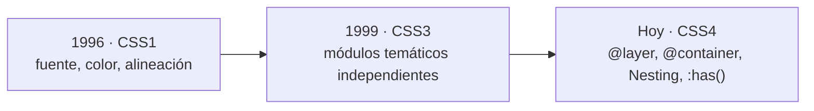
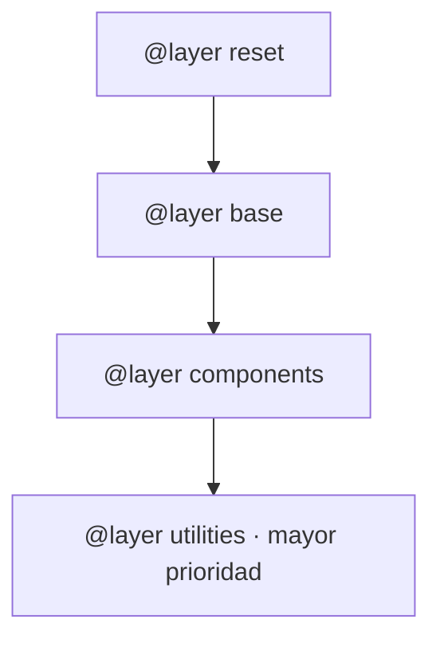

# Diseño de Interfaces Web

## Unidad 8 · CSS Profesional

**Módulo 0615 · Diseño de Interfaces Web**  
CFGS Desarrollo de Aplicaciones Web (DAW)

---

## Objetivos de aprendizaje I

<div style="font-size: 0.9rem; text-align: left;">
<ul>
<li><span class="fragment">Dominar CSS moderno para interfaces <strong>profesionales, responsivas y mantenibles</strong></span></li>
<li><span class="fragment">Selectores avanzados: combinadores, <code>:has()</code>, <code>:is()</code>, <code>:where()</code>, <code>:not()</code></span></li>
<li><span class="fragment">Pseudoelementos: <code>::before</code>, <code>::after</code>, <code>::marker</code></span></li>
<li><span class="fragment">Especificidad y cascada bajo control con <code>@layer</code></span></li>
<li><span class="fragment">Modelo de caja con <code>box-sizing</code></span></li>
<li><span class="fragment">Modos de <code>display</code> y posicionamiento</span></li>
</ul>
</div>

Note: Esta unidad marca el salto de «maquetar» a «ingenierizar CSS»: no basta con que funcione, debe ser mantenible por un equipo. Preguntad al aula qué selectores han usado ya de forma intuitiva y apuntadlo: será el punto de partida. Se alinea con el RA2 del módulo 0615.

---

## Objetivos de aprendizaje II

<div style="font-size: 0.9rem; text-align: left;">
<ul>
<li><span class="fragment">Variables CSS (Custom Properties) y <strong>temas claro/oscuro dinámicos</strong> con JavaScript</span></li>
<li><span class="fragment">Todas las unidades: <code>px</code>, <code>%</code>, <code>em</code>, <code>rem</code>, <code>vw</code>/<code>vh</code>, <code>dvh</code>, <code>fr</code></span></li>
<li><span class="fragment">Metodologías profesionales: <strong>BEM</strong> e <strong>ITCSS</strong></span></li>
<li><span class="fragment">Animaciones y transiciones respetando <code>prefers-reduced-motion</code></span></li>
<li><span class="fragment">Todas las técnicas de centrado de elementos</span></li>
<li><span class="fragment">Construir layouts completos combinando técnicas modernas</span></li>
</ul>
</div>

Note: El tema claro/oscuro es uno de los requisitos más pedidos en ofertas de empleo junior; preguntad quién lo ha implementado ya. Las variables CSS son la clave: se cambian en tiempo de ejecución sin recargar hojas de estilo.

---

## Motivación inicial

<p style="font-size: 0.95rem; text-align: left;"><span class="fragment">¿Cómo estiliza su web una empresa como <strong>Stripe</strong> sin que el CSS sea un caos?</span></p>

<div style="display: grid; grid-template-columns: 1fr 1fr 1fr; gap: 0.6rem; font-size: 0.8rem; text-align: left;">
<div class="fragment"><strong>Stripe</strong><br/>Cientos de custom properties en <code>:root</code> + <code>@layer</code></div>
<div class="fragment"><strong>Vercel</strong><br/>Tailwind utility-first + prefijo <code>dark:</code></div>
<div class="fragment"><strong>GitHub (Primer)</strong><br/>Temas light, dark, alto contraste y daltonismo</div>
</div>

<p style="font-size: 0.85rem; text-align: left;"><span class="fragment">Tres empresas, tres enfoques… <strong>un mismo objetivo: CSS predecible y escalable.</strong></span></p>

Note: Abrid stripe.com y vercel.com en vivo y pedid a un alumno que inspeccione las variables CSS con DevTools. La pregunta del gancho («¿quién organiza miles de reglas?») conecta directamente con @layer y con las metodologías que veremos después.

---

## Contenidos de la unidad

<div style="display: grid; grid-template-columns: 1fr 1fr; gap: 0.5rem; font-size: 0.8rem; text-align: left;">
<div class="fragment">1 · Evolución y estado actual de CSS</div>
<div class="fragment">2 · Selectores avanzados</div>
<div class="fragment">3 · Especificidad y cascada</div>
<div class="fragment">4 · Modelo de caja</div>
<div class="fragment">5 · Display y Position</div>
<div class="fragment">6 · Variables CSS (Custom Properties)</div>
<div class="fragment">7 · Unidades CSS</div>
<div class="fragment">8 · Organización del código</div>
<div class="fragment">9 · Funciones CSS</div>
<div class="fragment">10 · Pseudoelementos decorativos</div>
<div class="fragment">11 · Transiciones y animaciones</div>
<div class="fragment">12 · Técnicas de centrado</div>
</div>

Note: Doce bloques que encadenan entre sí: selectores → cascada → layout → movimiento. Todo lo que veáis hoy se volverá a usar en las unidades de Flexbox, Grid y Responsive Design.

---

## Evolución de CSS



<div style="font-size: 0.85rem; text-align: left;">
<ul>
<li><span class="fragment"><strong>CSS1 (1996):</strong> propiedades básicas de fuente, color y alineación</span></li>
<li><span class="fragment"><strong>CSS3 (1999):</strong> la especificación se fragmenta en módulos (Selectores, Color, Fondos, Transformaciones, Animaciones, Flexbox, Grid)</span></li>
<li><span class="fragment">Cada módulo evoluciona a su propio ritmo</span></li>
<li><span class="fragment"><strong>«CSS4»:</strong> término informal para los módulos más recientes con funcionalidad significativa</span></li>
</ul>
</div>

Note: Aclarad que «CSS4» no es una especificación oficial: el W3C publica módulos independientes. Dato práctico: consultad caniuse.com antes de usar cualquier novedad, porque cada navegador implementa los módulos a ritmos distintos.

---

## Novedades clave

<div style="display: grid; grid-template-columns: 1fr 1fr; gap: 0.6rem; font-size: 0.8rem; text-align: left;">
<div class="fragment"><strong>@layer</strong><br/>Capas de cascada explícitas: controla la especificidad sin <code>!important</code></div>
<div class="fragment"><strong>@container</strong><br/>Container Queries: estilos según el tamaño del <em>contenedor</em>, no del viewport</div>
<div class="fragment"><strong>CSS Nesting</strong><br/>Anidar selectores nativamente, como en Sass/LESS</div>
<div class="fragment"><strong>:has()</strong><br/>El «selector padre»: selecciona según sus descendientes</div>
</div>

Note: :has() resolvió una limitación histórica de 25 años: estilar un elemento por lo que contiene, sin JavaScript. Preguntad al aula: ¿qué cosas hacían antes con JS que ahora pueden hacer con :has()?

---

## Combinadores

<div style="font-size: 0.9rem;">
<table>
<thead><tr><th>Combinador</th><th>Sintaxis</th><th>Selecciona</th></tr></thead>
<tbody>
<tr><td>Descendiente</td><td><code>A B</code></td><td>B dentro de A, a cualquier nivel</td></tr>
<tr><td>Hijo</td><td><code>A &gt; B</code></td><td>B solo si es hijo directo de A</td></tr>
<tr><td>Hermano adyacente</td><td><code>A + B</code></td><td>B inmediatamente después de A</td></tr>
<tr><td>Hermano general</td><td><code>A ~ B</code></td><td>Todos los B hermanos de A</td></tr>
</tbody>
</table>
</div>

<div style="font-size: 0.85rem; text-align: left;">
<ul>
<li><span class="fragment"><code>.menu &gt; li</code> → solo los <code>&lt;li&gt;</code> hijos directos del menú</span></li>
<li><span class="fragment"><code>h2 + p</code> → el párrafo que sigue justo a un título</span></li>
</ul>
</div>

Note: Regla práctica: en proyectos reales preferid clases sobre combinadores; estos brillan cuando controláis el marcado. Pregunta típica de examen: diferencia entre + y ~.

---

## Pseudoclases funcionales

```css
/* Agrupa selectores: especificidad del argumento mayor */
:is(h2, h3, h4) { color: #2563eb; }

/* Igual que :is() pero con especificidad 0 */
:where(nav a) { color: #475569; }

/* Excluye coincidencias */
p:not(.destacado) { opacity: 0.85; }

/* «Selector padre»: reacciona a sus hijos */
.card:has(img) { border: 2px solid #2563eb; }
form:has(:invalid) { border-left: 4px solid #dc2626; }
```

<div style="font-size: 0.85rem; text-align: left;">
<ul>
<li><span class="fragment"><code>:is()</code> y <code>:where()</code> eliminan código repetitivo</span></li>
<li><span class="fragment"><code>:where()</code> → especificidad 0: estilos base fáciles de sobrescribir</span></li>
<li><span class="fragment"><code>:has()</code> → feedback visual sin JavaScript</span></li>
</ul>
</div>

Note: Haced predecir al aula qué regla gana en cada caso antes de abrir el navegador. La trampa clásica es creer que :is() suma especificidades: toma la del argumento más específico.

---

## Pseudoclases de formulario y foco

<div style="display: grid; grid-template-columns: 1fr 1fr; gap: 0.6rem; font-size: 0.8rem; text-align: left;">
<div class="fragment"><strong>:valid / :invalid</strong><br/>Estilos según la validación HTML5</div>
<div class="fragment"><strong>:disabled / :enabled</strong><br/>Campos deshabilitados o activos</div>
<div class="fragment"><strong>:checked</strong><br/>Checkboxes y radios marcados</div>
<div class="fragment"><strong>:focus-visible</strong><br/>Foco solo con teclado, no con ratón</div>
<div class="fragment" style="grid-column: span 2;"><strong>:focus-within</strong><br/>Se activa cuando cualquier descendiente tiene el foco (ideal para resaltar formularios completos)</div>
</div>

Note: :focus-visible es exigencia de accesibilidad: demostrad la diferencia navegando con Tab frente a clic con ratón. Con :focus clásico el anillo aparece también al hacer clic, lo que resulta molesto visualmente.

---

## Pseudoelementos

<div style="font-size: 0.9rem; text-align: left;">
<ul>
<li><span class="fragment"><code>::before</code> / <code>::after</code> → contenido generado (requieren <code>content</code>)</span></li>
<li><span class="fragment"><code>::marker</code> → marcadores de listas</span></li>
<li><span class="fragment"><code>::selection</code> → texto seleccionado</span></li>
<li><span class="fragment"><code>::placeholder</code> → texto placeholder de inputs</span></li>
<li><span class="fragment"><code>::first-letter</code> / <code>::first-line</code> → primera letra o línea de un bloque</span></li>
</ul>
</div>

Note: Insistid en que ::before y ::after exigen la propiedad content, aunque sea vacía (content: ""). Son la base de tooltips, iconos y decoraciones en CSS puro, sin tocar el HTML.

---

## Especificidad y cascada

<div style="font-size: 0.9rem; text-align: left;">
<ul>
<li><span class="fragment">Cálculo <strong>(a, b, c)</strong>:</span></li>
<li><span class="fragment"><span class="mini">a = IDs · b = clases, atributos y pseudoclases · c = elementos y pseudoelementos</span></span></li>
<li><span class="fragment">Estilos <strong>inline</strong>: máxima especificidad</span></li>
<li><span class="fragment">Empates → los resuelve la cascada por <strong>orden de aparición</strong></span></li>
<li><span class="fragment"><code>!important</code>: fuerza la declaración saltándose todo; uso <strong>excepcional</strong></span></li>
</ul>
</div>

Note: Calculad juntos en la pizarra la especificidad de dos selectores en conflicto (por ejemplo #nav ul li a frente a .menu li.active). Repetid que cada !important es deuda técnica: suele indicar arquitectura deficiente.

---

## @layer: control de la cascada



```css
@layer reset, base, components, utilities;

@layer components {
  .card__title { color: #1e293b; }
}
@layer utilities {
  .text-center { text-align: center; } /* siempre gana */
}
```

<div style="font-size: 0.85rem; text-align: left;">
<ul>
<li><span class="fragment">La capa declarada <strong>después</strong> tiene prioridad, <em>independientemente de la especificidad</em></span></li>
<li><span class="fragment">Las utilidades ganan por posición, no por <code>!important</code></span></li>
</ul>
</div>

Note: Declarad el orden una sola vez con @layer reset, base, components, utilities;. Comparadlo con las «guerras de !important» de hace una década: ahora la prioridad la decide la arquitectura, no el volumen del selector.

---

## Modelo de caja

<div style="font-size: 0.9rem;">
<table>
<thead><tr><th></th><th>content-box (por defecto)</th><th>border-box</th></tr></thead>
<tbody>
<tr><td><code>width</code> incluye</td><td>solo content</td><td>content + padding + border</td></tr>
<tr><td>Tamaño total</td><td>width + padding + border</td><td>width</td></tr>
<tr><td>Uso</td><td>raro</td><td>estándar universal</td></tr>
</tbody>
</table>
</div>

```css
*, *::before, *::after { box-sizing: border-box; }
```

<div style="font-size: 0.85rem; text-align: left;">
<strong>Colapso de márgenes:</strong>
<ul>
<li><span class="fragment">Márgenes verticales adyacentes se solapan: <strong>prevalece el mayor</strong></span></li>
<li><span class="fragment">Solo afecta a flujo normal; padding y border no colapsan</span></li>
<li><span class="fragment">Se evita con <code>display: flex/grid</code>, padding en el padre u <code>overflow: auto</code></span></li>
</ul>
</div>

Note: Preguntad por qué border-box es intuitivo: «si digo 300px, quiero 300px totales». El colapso de márgenes sorprende a todo el mundo la primera vez: demostradlo con dos div apilados de 20px de margen que dan 20px, no 40.

---

## Modos de display

<div style="display: grid; grid-template-columns: 1fr 1fr; gap: 0.5rem; font-size: 0.8rem; text-align: left;">
<div class="fragment"><strong>block</strong><br/>Ocupa todo el ancho, fuerza salto de línea</div>
<div class="fragment"><strong>inline</strong><br/>Fluye en línea, sin dimensiones propias</div>
<div class="fragment"><strong>inline-block</strong><br/>Flujo inline + capacidad de definir dimensiones</div>
<div class="fragment"><strong>none</strong><br/>Oculta el elemento: no ocupa espacio</div>
<div class="fragment"><strong>flex / grid</strong><br/>Activan contextos de formato flex y grid</div>
<div class="fragment"><strong>contents</strong><br/>El elemento desaparece; sus hijos pasan al ancestro</div>
</div>

Note: display: contents es útil para wrappers semánticos que no deben afectar al layout, pero avisad de que algunos navegadores lo quitan del árbol de accesibilidad: probadlo con lector de pantalla antes de usarlo en producción.

---

## Position y z-index

<div style="display: grid; grid-template-columns: 1fr 1fr; gap: 0.5rem; font-size: 0.8rem; text-align: left;">
<div class="fragment"><strong>static</strong><br/>Flujo normal (valor por defecto)</div>
<div class="fragment"><strong>relative</strong><br/>Se desplaza sin afectar al resto</div>
<div class="fragment"><strong>absolute</strong><br/>Respecto al ancestro posicionado; sale del flujo</div>
<div class="fragment"><strong>fixed</strong><br/>Respecto al viewport; sale del flujo</div>
<div class="fragment" style="grid-column: span 2;"><strong>sticky</strong><br/>Como relative hasta alcanzar un umbral de scroll, luego se fija</div>
</div>

<div style="font-size: 0.85rem; text-align: left;">
<ul>
<li><span class="fragment"><code>z-index</code> solo funciona en elementos posicionados o flex/grid items</span></li>
<li><span class="fragment">Crea contexto de apilamiento con <code>position</code> distinto de <code>static</code></span></li>
</ul>
</div>

Note: sticky falla silenciosamente si un ancestro tiene overflow: hidden — error muy común. Recordad que z-index solo compara valores dentro del mismo contexto de apilamiento.

---

## Variables CSS (Custom Properties)

```css
:root {
  --color-primario: #2563eb;
  --espaciado: 1rem;
}
.titulo {
  color: var(--color-primario);
  padding: var(--espaciado, 0.5rem); /* fallback opcional */
}
```

<div style="font-size: 0.85rem; text-align: left;">
<ul>
<li><span class="fragment">Definición: <code>--nombre: valor;</code> · Uso: <code>var(--nombre, fallback)</code></span></li>
<li><span class="fragment"><strong>Se heredan</strong> de padres a hijos; ámbito global en <code>:root</code></span></li>
<li><span class="fragment">A diferencia de Sass, son <strong>dinámicas</strong>: cambian en tiempo de ejecución</span></li>
<li><span class="fragment">Responden a media queries y se actualizan en cascada</span></li>
</ul>
</div>

Note: La diferencia con las variables de Sass es el punto clave del examen: ahí son constantes de compilación, aquí son valores vivos del DOM. El fallback es vuestra red de seguridad si una variable no está definida.

---

## Temas claro/oscuro dinámicos

```css
:root { --bg: #fff; --text: #1a1a2e; }
[data-theme="dark"] { --bg: #1a1a2e; --text: #f1f5f9; }
body { background: var(--bg); color: var(--text); }
```

```javascript
function toggleTheme() {
  const html = document.documentElement;
  const tema = html.dataset.theme === 'dark' ? 'light' : 'dark';
  html.setAttribute('data-theme', tema);
  localStorage.setItem('tema', tema);
}
```

<div style="font-size: 0.85rem; text-align: left;">
<ul>
<li><span class="fragment">Cambiar <code>data-theme</code> en <code>&lt;html&gt;</code> actualiza <strong>toda la interfaz al instante</strong></span></li>
<li><span class="fragment">Persistencia con <code>localStorage</code> + detección de <code>prefers-color-scheme</code></span></li>
</ul>
</div>

Note: El cambio es instantáneo porque solo se modifican valores, no se recargan hojas de estilo completas. Reto para el aula: añadir la transición suave de fondo y detectar la preferencia del sistema al cargar.

---

## Unidades CSS

<div style="font-size: 0.9rem;">
<table>
<thead><tr><th>Unidad</th><th>Referencia</th><th>Uso típico</th></tr></thead>
<tbody>
<tr><td><code>px</code></td><td>absoluta</td><td>bordes finos, sombras, detalles</td></tr>
<tr><td><code>%</code></td><td>padre</td><td>anchos y altos responsivos</td></tr>
<tr><td><code>em</code></td><td>font-size del elemento</td><td>márgenes que escalan con el texto</td></tr>
<tr><td><code>rem</code></td><td>font-size del <code>&lt;html&gt;</code></td><td>tipografía y espaciados globales</td></tr>
<tr><td><code>vw</code> / <code>vh</code></td><td>viewport</td><td>secciones a pantalla completa</td></tr>
<tr><td><code>dvh</code> / <code>svh</code> / <code>lvh</code></td><td>viewport dinámico</td><td>móvil con barras de navegador</td></tr>
<tr><td><code>ch</code></td><td>ancho del carácter «0»</td><td>líneas de 60-70ch (lectura óptima)</td></tr>
<tr><td><code>fr</code></td><td>fracción libre</td><td>distribución en CSS Grid</td></tr>
</tbody>
</table>
</div>

Note: Regla de oro: rem para tipografía y espaciado, px solo para bordes de 1px, %/vw para layout responsivo y ch para longitud de línea legible. Si el usuario sube el tamaño de fuente, todo lo hecho en rem escala proporcionalmente.

---

## Organización del código CSS

<div style="font-size: 0.9rem;">
<table>
<thead><tr><th>Metodología</th><th>Enfoque</th><th>Ejemplo</th></tr></thead>
<tbody>
<tr><td><strong>BEM</strong></td><td>nomenclatura Block-Element-Modifier</td><td><code>.card__title</code>, <code>.card--featured</code></td></tr>
<tr><td><strong>ITCSS</strong></td><td>capas de especificidad creciente</td><td>Settings → Tools → Generic → Elements → Objects → Components → Utilities</td></tr>
<tr><td><strong>Utility-first</strong></td><td>una propiedad por clase</td><td><code>flex items-center gap-4 p-6</code></td></tr>
</tbody>
</table>
</div>

<div style="font-size: 0.8rem; text-align: left;">
<ul>
<li><span class="fragment">También: SMACSS, OOCSS, Cube CSS, CSS Modules</span></li>
<li><span class="fragment">BEM: selectores planos, baja especificidad, auto-documentado</span></li>
<li><span class="fragment">Utility-first: sin naming, sin guerras de especificidad, CSS final más pequeño</span></li>
</ul>
</div>

Note: Lo importante es la consistencia, no la metodología elegida: ambas conviven en la industria. BEM domina en equipos grandes con CSS propio; utility-first (Tailwind) gana en velocidad de desarrollo.

---

## Funciones CSS

```css
width: calc(100% - 2rem);              /* mezcla de unidades */
width: min(100%, 900px);               /* el menor de los dos */
width: max(250px, 30%);                /* el mayor de los dos */
font-size: clamp(1rem, 2.5vw, 2rem);   /* tipografía fluida */
background: color-mix(in srgb, blue 70%, white);
```

<div style="font-size: 0.85rem; text-align: left;">
<ul>
<li><span class="fragment"><code>clamp(min, ideal, max)</code>: limita un valor entre mínimo y máximo</span></li>
<li><span class="fragment"><code>hsl()</code>/<code>rgb()</code>: colores por matiz, saturación y luminosidad</span></li>
<li><span class="fragment"><code>clamp()</code> sustituye a muchas media queries en tipografía</span></li>
</ul>
</div>

Note: Haced redimensionar la ventana mientras miran un h1 con clamp(): el texto escala suavemente sin un solo breakpoint. min() para anchos máximos de contenedor y max() para mínimos de tarjeta son patrones que veréis en todas partes.

---

## Contadores y tooltips CSS puro

```css
/* Contadores: numeración automática */
.lista { counter-reset: item; list-style: none; }
.lista li { counter-increment: item; }
.lista li::before {
  content: counter(item);
  background: #2563eb; color: #fff; border-radius: 50%;
}

/* Tooltip sin JavaScript */
.tooltip::after {
  content: attr(data-tooltip);
  position: absolute; bottom: calc(100% + 10px);
  opacity: 0; transition: opacity 0.2s;
}
.tooltip:hover::after { opacity: 1; }
```

<div style="font-size: 0.85rem; text-align: left;">
<ul>
<li><span class="fragment"><code>counter-reset</code> → inicializa · <code>counter-increment</code> → suma · <code>counter()</code> → muestra</span></li>
<li><span class="fragment">Ideal para figuras («Figura 3:»), secciones jerárquicas (1.2) y listas personalizadas</span></li>
<li><span class="fragment"><code>attr()</code> lee atributos <code>data-*</code>: cero JavaScript</span></li>
</ul>
</div>

Note: Los contadores se recalculan solos si añadís o quitáis elementos: la numeración nunca queda obsoleta. En el tooltip, la flecha triangular se construye con bordes transparentes en ::before.

---

## Transiciones y animaciones

```css
/* Transición: entre dos estados */
.btn { transition: background 0.3s ease, transform 0.2s ease; }
.btn:hover { background: #1d4ed8; transform: translateY(-2px); }

/* Animación: secuencia independiente */
@keyframes entrada {
  from { opacity: 0; transform: translateY(-30px); }
  to   { opacity: 1; transform: translateY(0); }
}
.tarjeta { animation: entrada 0.6s ease-out both; }
.tarjeta:nth-child(2) { animation-delay: 0.15s; }
```

<div style="font-size: 0.85rem; text-align: left;">
<ul>
<li><span class="fragment"><code>transition: propiedad duración timing retardo</code>; solo propiedades animables</span></li>
<li><span class="fragment"><code>@keyframes</code> define fotogramas; <code>animation</code> controla iteraciones, dirección y fill-mode</span></li>
<li><span class="fragment"><strong>Stagger:</strong> delays escalonados crean efecto cascada</span></li>
</ul>
</div>

Note: Distinción clave: transition necesita un cambio de estado (hover, clase), @keyframes corre por sí solo. El stagger con nth-child + animation-delay es el efecto de entrada que usan casi todos los dashboards modernos.

---

## prefers-reduced-motion

```css
@media (prefers-reduced-motion: reduce) {
  *, *::before, *::after {
    animation-duration: 0.01ms !important;
    animation-iteration-count: 1 !important;
    transition-duration: 0.01ms !important;
  }
}
```

<div style="font-size: 0.85rem; text-align: left;">
<ul>
<li><span class="fragment">Respeta la preferencia del sistema operativo del usuario</span></li>
<li><span class="fragment"><strong>Obligatorio</strong> para accesibilidad: WCAG 2.2, criterio 2.3.3</span></li>
<li><span class="fragment">Las animaciones pueden causar mareos en personas con trastornos vestibulares</span></li>
</ul>
</div>

Note: No es opcional: es requisito de accesibilidad. Para probarlo en Windows: Configuración → Accesibilidad → Efectos visuales → Mostrar animaciones. Aquí el !important está justificado: hay que garantizar la anulación total.

---

## Técnicas de centrado

```css
/* 1. Flexbox (la recomendada) */
.padre { display: flex; justify-content: center; align-items: center; }
/* 2. Grid */
.padre { display: grid; place-items: center; }
/* 3. Absolute + transform (clásica) */
.hijo { position: absolute; top: 50%; left: 50%;
        transform: translate(-50%, -50%); }
/* 4. Solo horizontal */
.hijo { width: fit-content; margin: 0 auto; }
/* 5. Texto inline */
.padre { text-align: center; line-height: 150px; }
```

<div style="font-size: 0.85rem; text-align: left;">
<ul>
<li><span class="fragment"><code>place-items</code> = shorthand de <code>align-items</code> + <code>justify-items</code></span></li>
<li><span class="fragment">Absolute requiere <code>position: relative</code> en el padre</span></li>
<li><span class="fragment">Históricamente el problema más frustrante de CSS; hoy se resuelve en dos líneas</span></li>
</ul>
</div>

Note: Dominad Flexbox y Grid para centrado general; absoluto + transform sigue siendo imprescindible para overlays y modales. Pregunta rápida: ¿cuál de estas cinco técnicas funciona si el elemento no conoce su propio tamaño?

---

## Ejemplo guiado: selectores en acción

```css
/* Combinadores */
.menu > li { display: inline-block; }  /* solo hijos directos */
h2 + p { font-style: italic; }         /* justo después */
h3 ~ button { margin-right: 8px; }     /* todos los hermanos */

/* Funcionales */
:is(h2, h3, h4) { color: #2563eb; }
p:not(.destacado) { opacity: 0.85; }
.card:has(img) { border: 2px solid #2563eb; }
form:has(:invalid) { border-left: 4px solid #dc2626; }

/* Pseudoelementos y foco */
h2::before { content: "◆ "; }
a[href^="http"]::after { content: " ↗"; }
li:nth-child(odd) { background: #f1f5f9; }
:focus-visible { outline: 3px solid #2563eb; }
```

<div style="font-size: 0.85rem; text-align: left;">
<ul>
<li><span class="fragment">Demo con 15 técnicas: abrid la página y probad cada una</span></li>
<li><span class="fragment">Casos estrella: borde en <code>.card:has(img)</code> y formulario rojo con <code>:has(:invalid)</code></span></li>
</ul>
</div>

Note: Pedid a los alumnos que predigan el resultado de cada selector antes de revelar el CSS. El caso form:has(:invalid) merece atención extra: feedback de validación en vivo sin una sola línea de JavaScript.

---

## Casos reales

<div style="display: grid; grid-template-columns: 1fr 1fr 1fr; gap: 0.6rem; font-size: 0.75rem; text-align: left;">
<div class="fragment"><strong>Stripe</strong><br/>Cientos de custom properties en <code>:root</code> · <code>@layer</code> · <code>:focus-visible</code> · transiciones sutiles en micro-interacciones</div>
<div class="fragment"><strong>Vercel</strong><br/>Tailwind utility-first · prefijo <code>dark:</code> para modo oscuro · purgado de clases → CSS de producción muy pequeño</div>
<div class="fragment"><strong>GitHub · Primer</strong><br/>CSS Modules por componente · temas light, dark, alto contraste y daltonismo vía variables intercambiables</div>
</div>

Note: Tres empresas, tres arquitecturas distintas, pero todas convergen en lo mismo: variables CSS como tokens de diseño y accesibilidad cuidada. Es el estándar que os van a exigir en una entrevista técnica.

---

## Actividad en clase

<div style="font-size: 0.9rem; text-align: left;">
<ul>
<li><span class="fragment"><strong>Objetivo:</strong> sistema de temas claro/oscuro completo con variables CSS + JavaScript</span></li>
<li><span class="fragment"><strong>Tiempo:</strong> 45 min · <strong>Formato:</strong> individual</span></li>
<li><span class="fragment"><strong>Entregable:</strong> página con header, cards y footer</span></li>
</ul>
</div>

<div style="display: grid; grid-template-columns: 1fr 1fr; gap: 0.6rem; font-size: 0.8rem; text-align: left;">
<div class="fragment">Variables completas para ambos temas (<code>:root</code> y <code>[data-theme="dark"]</code>)</div>
<div class="fragment">Botón toggle que cambia <code>data-theme</code> en <code>&lt;html&gt;</code></div>
<div class="fragment">Persistencia en <code>localStorage</code></div>
<div class="fragment">Detección de <code>prefers-color-scheme</code> al cargar</div>
</div>

<p style="font-size: 0.8rem; text-align: left;"><span class="fragment"><strong>Corrección:</strong> variables (3) · toggle (2) · persistencia (2) · preferencia sistema (2) · transiciones suaves (1)</span></p>

Note: Circulad por el aula verificando que ningún color esté hardcodeado: todo debe pasar por var(). Si alguien termina antes, el reto es añadir la transición de 0.3s en fondo y texto.

---

## Actividades propuestas

<div style="font-size: 0.85rem; text-align: left;">
<ul>
<li><span class="fragment"><strong>Refactorización legacy:</strong> hoja de 200 líneas con <code>!important</code> → variables, <code>@layer</code>, rem, BEM y <code>clamp()</code></span></li>
<li><span class="fragment"><strong>Acordeón CSS puro:</strong> FAQ animado con <code>details/summary</code> o checkbox hack, apertura exclusiva</span></li>
<li><span class="fragment"><strong>Landing parallax CSS puro:</strong> 4 secciones 100vh, <code>background-attachment: fixed</code>, menú sticky</span></li>
<li><span class="fragment"><strong>Formulario CSS-only:</strong> <code>:valid</code>/<code>:invalid</code>, barra de fortaleza, <code>:focus-within</code></span></li>
<li><span class="fragment"><strong>Micro-interacciones:</strong> ripple, skeleton loaders, toast, toggle switch, tilt 3D</span></li>
</ul>
</div>

Note: Son tareas para casa o portfolio. La refactorización es la más realista: es exactamente lo que se pide en entrevistas cuando entras a mantener código antiguo. Publicadlas en GitHub Pages y enlazadlas en el CV.

---

## Actividades de ampliación

<div style="font-size: 0.85rem; text-align: left;">
<ul>
<li><span class="fragment"><strong>Design system completo:</strong> tokens como variables, 5+ componentes, temas claro/oscuro, documentación, todo con <code>@layer</code></span></li>
<li><span class="fragment"><strong>Juego de memoria CSS-only:</strong> tablero 4x4 con <code>:checked</code>, giro 3D con <code>transform</code> y <code>perspective</code>, sin JavaScript</span></li>
<li><span class="fragment"><strong>Clon responsive de Spotify:</strong> Grid para el layout, Flexbox en componentes, 3 breakpoints (desktop / tablet / móvil)</span></li>
</ul>
</div>

Note: Reservadas a quien quiera subir el listón. El juego de memoria CSS-only impresiona mucho en entrevistas y el clon de Spotify os prepara directamente para la Unidad 10 de CSS Grid.

---

## Buenas prácticas

<div style="display: grid; grid-template-columns: 1fr 1fr; gap: 0.4rem; font-size: 0.75rem; text-align: left;">
<div class="fragment">✅ <code>box-sizing: border-box</code> universalmente</div>
<div class="fragment">✅ <code>rem</code> sobre <code>px</code> para tipografía y espaciado</div>
<div class="fragment">✅ Variables CSS para todo valor repetido</div>
<div class="fragment">✅ Capas lógicas con <code>@layer</code></div>
<div class="fragment">✅ Metodología consistente (BEM, utility-first)</div>
<div class="fragment">✅ Máximo 3 niveles de anidamiento</div>
<div class="fragment">✅ Siempre <code>prefers-reduced-motion</code></div>
<div class="fragment">✅ <code>:focus-visible</code> en lugar de <code>:focus</code></div>
<div class="fragment">✅ Mobile-first con <code>min-width</code></div>
<div class="fragment">✅ Selectores de baja especificidad (clases, no IDs)</div>
<div class="fragment">✅ <code>clamp()</code> para tipografía fluida</div>
<div class="fragment">✅ Media queries junto a su componente</div>
</div>

Note: Imprimid estas doce reglas: aparecerán en vuestros code reviews y en entrevistas. Si solo memorizáis tres: border-box universal, rem para todo lo tipográfico y @layer en vez de !important.

---

## Errores frecuentes

<div style="display: grid; grid-template-columns: 1fr 1fr; gap: 0.4rem; font-size: 0.75rem; text-align: left;">
<div class="fragment">❌ Abusar de <code>!important</code>: síntoma de CSS mal organizado</div>
<div class="fragment">❌ Olvidar <code>border-box</code>: desbordamientos y cálculos rotos</div>
<div class="fragment">❌ <code>px</code> para todo: la interfaz no escala con el texto</div>
<div class="fragment">❌ Anidar selectores profundamente: frágil y difícil de sobrescribir</div>
<div class="fragment">❌ Olvidar <code>prefers-reduced-motion</code>: mareos y náuseas</div>
<div class="fragment">❌ <code>display: none</code> en contenido accesible: desaparece del árbol de accesibilidad</div>
<div class="fragment">❌ Sin fallback en <code>var()</code>: usad <code>var(--color, #fallback)</code></div>
<div class="fragment">❌ Confundir <code>em</code> (efecto compuesto) y <code>rem</code> (consistente)</div>
<div class="fragment">❌ <code>z-index</code> sin <code>position</code>: no funciona</div>
<div class="fragment">❌ No probar en dispositivos reales</div>
</div>

Note: Preguntad quiénes han cometido alguno: el 90 % levantará la mano con el !important. Insistid en el display: none: para ocultar visualmente sin romper accesibilidad usad la técnica visually-hidden (clip + position absolute fuera de pantalla).

---

## Resumen · Conceptos clave

<div style="font-size: 0.85rem; text-align: left;">
<ul>
<li><span class="fragment">🎯 <code>:has()</code>, <code>:is()</code>, <code>:where()</code>, <code>:not()</code> → CSS expresivo con menos código</span></li>
<li><span class="fragment">🎯 Custom Properties → temas dinámicos sin recargar hojas de estilo</span></li>
<li><span class="fragment">🎯 <code>@layer</code> → control nativo de la cascada, adiós <code>!important</code></span></li>
<li><span class="fragment">🎯 BEM / ITCSS / utility-first → CSS mantenible y predecible</span></li>
<li><span class="fragment">🎯 <code>clamp()</code>, <code>min()</code>, <code>max()</code> → diseños fluidos sin media queries</span></li>
<li><span class="fragment">🎯 Flexbox y Grid → centrado elegante en dos líneas</span></li>
<li><span class="fragment">🎯 <code>prefers-reduced-motion</code> → animaciones inclusivas</span></li>
</ul>
</div>

Note: CSS moderno es un lenguaje de diseño completo: cálculo, tematización, animación y maquetación. Hacéd un quiz rápido oral: un uso práctico por concepto. Quien domine esto, domina la base de cualquier framework CSS.

---

## Próximos pasos

<div style="font-size: 0.95rem; text-align: left;">
<ul>
<li><span class="fragment"><strong>Unidad 9 · Flexbox</strong></span></li>
<li><span class="fragment">Eje principal y eje cruzado: alineación y distribución</span></li>
<li><span class="fragment">Tamaños flexibles: <code>flex-grow</code>, <code>flex-shrink</code>, <code>flex-basis</code></span></li>
<li><span class="fragment">El <code>display: flex</code> de hoy será el protagonista de la próxima semana</span></li>
</ul>
</div>

Note: Traed vuestros ejemplos de centrado de hoy: los vamos a reconstruir entendiendo por qué funcionan. Avisad de que después viene CSS Grid (Unidad 10) y juntos forman el núcleo del layout moderno.

---

## ¿Preguntas?

<p style="font-size: 1rem;"><span class="fragment">Unidad 8 · CSS Profesional</span></p>
<p style="font-size: 0.85rem;"><span class="fragment">0615 · DAW · Curso 2025/2026</span></p>

Note: Cerrad la sesión recordando los recursos: MDN Web Docs, web.dev/learn/css y Can I Use para compatibilidad. Dejad abierta la puerta a dudas por correo antes de la próxima clase.
