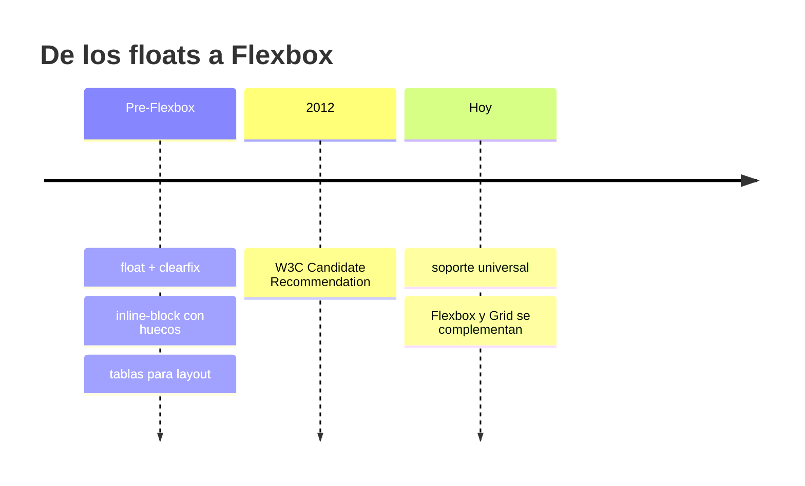
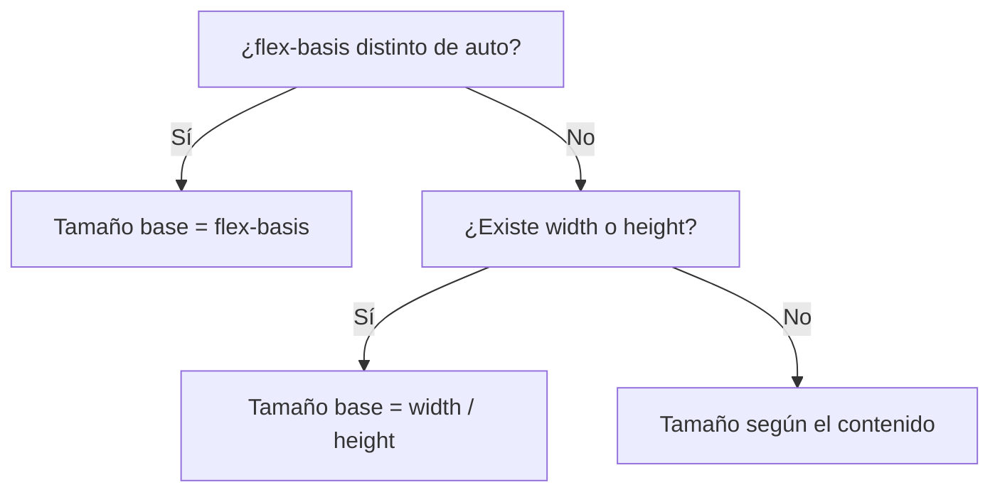

# Diseño de Interfaces Web

## Unidad 9 · Flexbox

**Módulo 0615 · Diseño de Interfaces Web**  
CFGS Desarrollo de Aplicaciones Web (DAW)

---

## Objetivos de aprendizaje · I

<div style="font-size: 0.95rem; text-align: left;">
- <span class="fragment">Dominar el modelo de maquetación <strong>Flexbox</strong>: cualquier layout unidimensional</span>
- <span class="fragment">Identificar y manipular el <strong>eje principal</strong> y el <strong>eje transversal</strong> según la dirección</span>
- <span class="fragment">Controlar el comportamiento de los ítems: <code>flex-grow</code>, <code>flex-shrink</code>, <code>flex-basis</code></span>
- <span class="fragment">Aplicar patrones profesionales: navbars, cards, formularios, dashboards, sticky footer, centrado perfecto</span>
- <span class="fragment">Diferenciar cuándo usar <strong>Flexbox</strong> frente a <strong>CSS Grid</strong></span>
</div>

Note: Empezad preguntando qué saben ya sobre maquetación con CSS. El objetivo central es que al terminar la unidad nadie vuelva a usar floats ni tablas para posicionar bloques. Insistid en que Flexbox resuelve lo unidimensional: una fila o una columna a la vez.

---

## Objetivos de aprendizaje · II

<div style="font-size: 0.95rem; text-align: left;">
- <span class="fragment">Construir una <strong>navbar completa</strong>: logo, menú, búsqueda e iconos</span>
- <span class="fragment">Versión responsive con <strong>menú hamburguesa en CSS puro</strong> (sin JavaScript)</span>
- <span class="fragment">Patrones de alineación: centrado, <code>space-between</code>, <code>align-self</code>, <code>margin: auto</code></span>
- <span class="fragment">Comprender <code>flex-basis</code> frente a <code>width</code> y el shorthand <code>flex</code></span>
- <span class="fragment">Relación con <strong>RA2</strong> (módulo 0615), <strong>RA4</strong> (elementos interactivos) y <strong>RA5</strong> (accesibilidad)</span>
</div>

Note: La hamburguesa con checkbox + label + :checked es un requisito evaluado: sin JavaScript. Recordad que un layout bien hecho respeta el orden del DOM, algo clave para lectores de pantalla (RA5). Podéis adelantar que la actividad práctica de hoy es construir esa navbar.

---

## Motivación: ¿cómo lo hace la web real?

<div style="font-size: 0.9rem; text-align: left;">
- <span class="fragment"><strong>GitHub</strong>: navbar, sidebar y listas de issues con Flexbox</span>
- <span class="fragment"><strong>Twitter/X</strong>: cada tweet es un patrón media object</span>
- <span class="fragment"><strong>Stripe</strong>: landing, componentes de pago y documentación</span>
</div>

<span class="fragment" style="font-size: 1.1rem;"><strong>Pregunta:</strong> ¿cuántas líneas de CSS necesitáis para centrar un elemento en horizontal Y vertical?</span>

<span class="fragment" style="font-size: 1rem;">Respuesta: tres.</span>

Note: Gancho inicial: dejadles intentar recordar el viejo truco del position: absolute con top y left al 50% y márgenes negativos. Cuando alguien lo diga, mostrad las tres líneas de Flexbox. Los casos reales (GitHub, X, Stripe) se analizarán al final de la unidad como comprobación.

---

## Qué es Flexbox

<div style="font-size: 0.9rem; text-align: left;">
- <span class="fragment"><strong>Flexible Box Layout</strong>: modelo de maquetación <strong>unidimensional</strong></span>
- <span class="fragment">Distribuye espacio entre ítems y los alinea, aunque su tamaño sea desconocido o dinámico</span>
- <span class="fragment"><strong>Flex</strong> = expandirse (<em>grow</em>) o contraerse (<em>shrink</em>)</span>
- <span class="fragment">Candidate Recommendation del <strong>W3C en 2012</strong>; hoy, soporte universal</span>
- <span class="fragment">Una sola dirección a la vez: fila <em>o</em> columna. Para ambas, <strong>CSS Grid</strong></span>
</div>



Note: Antes de Flexbox convivían tres técnicas con problemas graves: floats (requerían clearfix y no alineaban en vertical), inline-block (dejaba espacios fantasma entre elementos) y tablas HTML (mezclaban contenido y presentación). Pregunta para el aula: ¿quién ha usado alguna vez display: table para maquetar?

---

## Los dos ejes del modelo

<div style="font-size: 0.9rem; text-align: left;">
- <span class="fragment"><strong>Eje principal (main axis)</strong>: dirección en la que se colocan los ítems</span>
- <span class="fragment"><strong>Eje transversal (cross axis)</strong>: perpendicular al principal</span>
- <span class="fragment"><code>justify-content</code> opera sobre el <strong>eje principal</strong></span>
- <span class="fragment"><code>align-items</code> y <code>align-content</code> operan sobre el <strong>eje transversal</strong></span>
- <span class="fragment"><code>flex-direction</code> rota ambos ejes</span>
</div>

<div style="font-size: 0.9rem;">
| flex-direction | Eje principal | Eje transversal |
|---|---|---|
| row (defecto) | horizontal, izq → der | vertical, arriba → abajo |
| row-reverse | horizontal, der → izq | vertical |
| column | vertical, arriba → abajo | horizontal, izq → der |
| column-reverse | vertical, abajo → arriba | horizontal |
</div>

Note: Esta tabla es la base de toda la unidad: quien la sabe leer entiende la mitad de Flexbox. Insistid en que row-reverse y column-reverse invierten solo el orden visual, nunca el del DOM: el orden de tabulación y de lectura en voz alta sigue siendo el original. Por eso hay que usarlos con precaución cuando el orden semántico importa.

---

## Contenedor: display, dirección y wrap

<div style="font-size: 0.9rem; text-align: left;">
- <span class="fragment"><code>display: flex</code>: contenedor tipo bloque (ocupa todo el ancho)</span>
- <span class="fragment"><code>display: inline-flex</code>: contenedor tipo línea (solo el ancho de su contenido)</span>
- <span class="fragment"><code>flex-direction</code>: row, row-reverse, column, column-reverse</span>
- <span class="fragment"><code>flex-wrap</code>: nowrap (defecto) · wrap · wrap-reverse</span>
- <span class="fragment"><code>flex-flow</code>: shorthand de direction + wrap → <code>flex-flow: row wrap;</code></span>
</div>

```css
.contenedor {
  display: flex;
  flex-direction: row;   /* por defecto */
  flex-wrap: wrap;
}
```

Note: Señalad que con nowrap los ítems se comprimen pero nunca saltan de línea: pueden desbordarse. wrap es el valor que hará responsive casi todos los layouts de esta unidad. Pregunta rápida: ¿qué efecto tiene align-content si no hay wrap? Ninguno, porque solo existe una línea.

---

## justify-content (eje principal)

<div style="display: grid; grid-template-columns: 1fr 1fr; gap: 0.6rem; font-size: 0.8rem; text-align: left;">
  <div class="fragment"><strong>flex-start</strong>: al inicio del eje principal</div>
  <div class="fragment"><strong>flex-end</strong>: al final del eje principal</div>
  <div class="fragment"><strong>center</strong>: centrados en el eje principal</div>
  <div class="fragment"><strong>space-between</strong>: extremos pegados, espacio igual entre ítems</div>
  <div class="fragment"><strong>space-around</strong>: espacio igual alrededor (mitad en los extremos)</div>
  <div class="fragment"><strong>space-evenly</strong>: espacio exactamente igual en todas partes</div>
</div>

<span class="fragment" style="font-size: 0.85rem;"><code>space-between</code> es el rey de las navbars: logo a la izquierda, acciones a la derecha.</span>

Note: Haced una demo en vivo redimensionando el navegador: con space-between los extremos tocan siempre los bordes, con space-evenly el hueco exterior es igual al interior. Son los dos valores más usados en producción junto con center. Probad a combinarlos con flex-wrap y observad cómo se aplican línea a línea.

---

## align-items (eje transversal)

<div style="display: grid; grid-template-columns: 1fr 1fr; gap: 0.6rem; font-size: 0.8rem; text-align: left;">
  <div class="fragment"><strong>stretch</strong> (defecto): estira los ítems hasta llenar el cross axis</div>
  <div class="fragment"><strong>flex-start</strong>: al inicio del cross axis</div>
  <div class="fragment"><strong>flex-end</strong>: al final del cross axis</div>
  <div class="fragment"><strong>center</strong>: centrados en el cross axis</div>
  <div class="fragment"><strong>baseline</strong>: alineados por la línea base del texto</div>
</div>

<span class="fragment" style="font-size: 0.85rem;">stretch es el responsable de las <strong>columnas de igual altura</strong> automáticas.</span>

Note: Demo imprescindible: tres cajas con contenidos de altura distinta y align-items: stretch. Que vean cómo la caja corta crece sola, sin JavaScript ni hacks. Añadid que baseline resulta útil cuando mezcláis tamaños de fuente muy distintos en la misma fila.

---

## align-content y gap

<div style="font-size: 0.9rem; text-align: left;">
- <span class="fragment"><code>align-content</code>: distribuye las <strong>líneas</strong> en el cross axis (mismos valores que justify-content)</span>
- <span class="fragment">Solo funciona con <code>flex-wrap: wrap</code> y varias líneas</span>
- <span class="fragment"><code>gap</code>: espacio entre ítems, en filas y columnas</span>
- <span class="fragment"><code>row-gap</code> / <code>column-gap</code>: control independiente</span>
- <span class="fragment">A diferencia de <code>margin</code>, el gap <strong>no se aplica en los extremos</strong></span>
</div>

```css
.grid-cards {
  display: flex;
  flex-wrap: wrap;
  gap: 24px;        /* shorthand */
  /* row-gap: 16px; column-gap: 32px; */
}
```

Note: gap es la forma moderna y limpia de separar ítems: comparadlo con el clásico margen derecho en cada elemento menos el último. Con gap desaparecen los casos borde y el código es predecible. Recordad que gap también funciona en CSS Grid y en columnas múltiples.

---

## Ítems: order, grow, shrink, basis

<div style="display: grid; grid-template-columns: 1fr 1fr; gap: 0.6rem; font-size: 0.8rem; text-align: left;">
  <div class="fragment"><strong>order</strong>: orden visual (defecto 0). Negativo → al inicio. No toca el DOM ni la tabulación</div>
  <div class="fragment"><strong>flex-grow</strong>: factor de crecimiento del espacio libre (defecto 0)</div>
  <div class="fragment"><strong>flex-shrink</strong>: factor de reducción si falta espacio (defecto 1). 0 = nunca se encoge</div>
  <div class="fragment"><strong>flex-basis</strong>: tamaño base antes de grow/shrink (defecto auto)</div>
</div>

<span class="fragment" style="font-size: 0.85rem;">Ejemplo: <code>grow: 1</code> + <code>grow: 2</code> + <code>grow: 1</code> → el segundo recibe el doble de espacio extra.</span>

Note: flex-basis es la propiedad más incomprendida de Flexbox: dedicadle tiempo. Pregunta para el aula: si todos tienen flex-grow: 1, ¿qué pasa si uno contiene mucho texto? Con basis auto parte de su tamaño natural; con flex: 1 parte de cero. Así anticipáis la siguiente diapositiva.

---

## El shorthand flex

<div style="font-size: 0.9rem;">
| Sintaxis | Expansión | Comportamiento |
|---|---|---|
| flex: 1 | 1 1 0% | Crece y se encoge; base 0, reparto proporcional |
| flex: auto | 1 1 auto | Crece y se encoge; base según contenido |
| flex: none | 0 0 auto | Ni crece ni se encoge; tamaño fijo |
| flex: 0 1 300px | — | No crece, puede encogerse, base 300px |
</div>

<span class="fragment" style="font-size: 0.85rem; text-align: left;">Sintaxis completa: <code>flex: &lt;grow&gt; &lt;shrink&gt; &lt;basis&gt;</code> · <code>align-self</code> sobrescribe align-items en un ítem concreto</span>

Note: Regla mnemotécnica: flex: 1 reparte el espacio desde cero y todas salen iguales; flex: auto respeta primero el contenido y pueden quedar desiguales. Confundirlos es uno de los errores más frecuentes en código ajeno. Recomendad siempre el shorthand: más corto y menos propenso a errores.

---

## Auto margins: margin: auto

<div style="font-size: 0.9rem; text-align: left;">
- <span class="fragment"><code>margin-left: auto</code> → consume todo el espacio a la izquierda: <strong>empuja a la derecha</strong></span>
- <span class="fragment"><code>margin-top: auto</code> → <strong>empuja al fondo</strong> (footer de cards)</span>
- <span class="fragment"><code>margin: auto</code> → centra un único ítem en ambas direcciones</span>
</div>

```css
.navbar .iconos { margin-left: auto; }  /* grupo a la derecha */
.card__footer   { margin-top: auto; }   /* footer al fondo */
.hero .titulo   { margin: auto; }       /* centrado perfecto */
```

Note: Es el truco menos conocido y de los más útiles en producción: sustituye a los divs espaciadores vacíos. En una navbar, si queréis agrupar varios elementos a la derecha, basta un margin-left: auto en el primero del grupo. Pregunta: ¿por qué margin: auto en un único ítem equivale a centrarlo en ambas direcciones?

---

## flex-basis vs width

<div style="font-size: 0.9rem; text-align: left;">
- <span class="fragment">Si <code>flex-basis</code> no es <code>auto</code>, <strong>tiene prioridad</strong> sobre width/height</span>
- <span class="fragment">Si es <code>auto</code>, se usa <code>width</code>/<code>height</code> si existen</span>
- <span class="fragment">Si no hay ninguno, el tamaño sale del contenido</span>
</div>



<span class="fragment" style="font-size: 0.85rem;">Por eso <code>flex: 1</code> (base 0%) ≠ <code>flex: auto</code> (base auto).</span>

Note: Demo recomendada: tres ítems con textos de longitud muy distinta, primero con flex: 1 y luego con flex: auto. Con flex: 1 quedan idénticos; con flex: auto el de texto largo termina más ancho. En dirección column, la propiedad que compite con flex-basis es height, no width.

---

## Patrones I: lista, centrado, sticky footer

<div style="font-size: 0.9rem; text-align: left;">
- <span class="fragment"><strong>Lista horizontal</strong>: <code>display: flex; gap: 16px;</code> en la <code>&lt;ul&gt;</code> + <code>flex-wrap: wrap</code></span>
- <span class="fragment"><strong>Centrado perfecto</strong>: justify-content: center + align-items: center</span>
- <span class="fragment"><strong>Sticky footer</strong>: main con <code>flex: 1</code> empuja el footer al fondo</span>
</div>

```css
/* Centrado perfecto */
.centro {
  display: flex;
  justify-content: center;
  align-items: center;
}
/* Sticky footer */
body { display: flex; flex-direction: column; min-height: 100vh; }
main { flex: 1; }
```

Note: El sticky footer fue durante años un problema clásico que requería hacks con position: fixed o alturas calculadas; ahora son dos reglas. Probadlo con poco contenido (footer al fondo) y con mucho (footer tras el contenido): funciona solo en ambos casos. El centrado perfecto, por su parte, es la respuesta definitiva a la pregunta de la motivación.

---

## Patrones II: media object, alturas, cards

<div style="font-size: 0.9rem; text-align: left;">
- <span class="fragment"><strong>Media object</strong>: imagen con <code>flex-shrink: 0</code> + contenido con <code>flex: 1</code></span>
- <span class="fragment"><strong>Igual altura de columnas</strong>: automático gracias a <code>align-items: stretch</code></span>
- <span class="fragment"><strong>Cards alineadas</strong>: card como flex column + footer con <code>margin-top: auto</code></span>
- <span class="fragment"><strong>Formulario responsive</strong>: fila en escritorio (<code>row</code>), etiqueta encima en móvil (<code>column</code>)</span>
</div>

```css
.media { display: flex; gap: 16px; align-items: flex-start; }
.media__img { flex-shrink: 0; }
.media__body { flex: 1; }
```

Note: El media object está detrás de tweets, comentarios, resultados de búsqueda y notificaciones: avatar más contenido. Es probablemente el componente que más repetirán en sus proyectos. En móvil, cambiar flex-direction a column convierte cualquier formulario horizontal en vertical sin tocar el HTML.

---

## Navbar profesional: estructura

```html
<header class="header">
  <div class="navbar">
    <a class="logo">TechCorp</a>
    <nav>
      <ul class="menu">
        <li><a class="activo">Inicio</a></li>
        <!-- 4 enlaces más -->
      </ul>
    </nav>
    <div class="acciones">
      <input type="search" placeholder="Buscar…" aria-label="Buscar en el sitio">
      <button class="avatar" aria-label="Perfil de usuario">ML</button>
    </div>
  </div>
</header>
```

```css
.navbar {
  display: flex;
  align-items: center;
  justify-content: space-between;
  flex-wrap: wrap;
}
.logo { flex-shrink: 0; }
.menu { display: flex; gap: 4px; list-style: none; }
.acciones { display: flex; align-items: center; gap: 12px; }
```

Note: Desmontad la navbar pieza a pieza: el logo lleva flex-shrink: 0 para que nunca se comprima, space-between separa las tres zonas y flex-wrap: wrap deja sitio al menú desplegable en móvil. Pedid que expliquen qué harían para centrar el menú de verdad (margin: auto a ambos lados del nav).

---

## Hamburguesa con CSS puro

```html
<input type="checkbox" id="menu-toggle" class="toggle">
<label for="menu-toggle" class="toggle-label">☰</label>
<nav><ul class="menu">…</ul></nav>
```

```css
.toggle { display: none; }
@media (max-width: 768px) {
  .toggle-label { display: flex; cursor: pointer; }
  .menu {
    display: none;
    flex-direction: column;
    width: 100%;
    order: 3;              /* bajo el logo y el toggle */
  }
  .toggle:checked ~ .menu { display: flex; }
}
```

Note: Explicad el mecanismo: el checkbox guarda el estado, el label actúa como botón visual y :checked con el selector ~ muestra el menú hermano, sin una línea de JavaScript. Advertid de sus límites: no cierra al pulsar fuera y en producción habría que gestionar aria-expanded. Aun así, es perfecto para prototipos y para este ejercicio.

---

## Cards con Flexbox

```css
.cards-grid {
  display: flex;
  flex-wrap: wrap;
  gap: 24px;
}
.card {
  flex: 1 1 300px;          /* mínimo 300px, crece y se encoge */
  display: flex;
  flex-direction: column;
}
.card__body { flex: 1; }    /* el cuerpo absorbe el espacio */
.card__footer {
  margin-top: auto;         /* precio y botón siempre al fondo */
  display: flex;
  justify-content: space-between;
}
.card:hover {
  transform: translateY(-4px);
  box-shadow: 0 8px 24px rgba(0, 0, 0, 0.1);
}
```

Note: Este bloque es, prácticamente, la plantilla de cualquier catálogo de productos. La clave doble: flex: 1 1 300px hace responsive el grid y el flex-direction: column interno alinea los footers aunque el texto varíe. Reto para el aula: ¿cuántas cards caben a 1200px de ancho teniendo en cuenta el gap?

---

## Formularios con Flexbox

```css
.form-row {
  display: flex;
  align-items: center;
  gap: 16px;
}
.form-row label { flex: 0 0 130px; }  /* ancho fijo */
.form-row input { flex: 1; }           /* ocupa el resto */
.form-actions {
  display: flex;
  gap: 12px;
  justify-content: flex-end;
}
@media (max-width: 600px) {
  .form-row { flex-direction: column; align-items: stretch; }
  .form-actions button { width: 100%; }
}
```

Note: Patrón estándar de formularios profesionales: etiquetas con ancho fijo, inputs que absorben el resto y botones a la derecha. En móvil, un solo cambio de flex-direction apila todo. Mencionad la variante en columna para campos largos como textarea, donde la etiqueta queda encima.

---

## Dashboard con sidebar

```css
.dashboard { display: flex; min-height: 100vh; }
.sidebar {
  flex: 0 0 250px;           /* ancho fijo */
  display: flex;
  flex-direction: column;
  transition: flex-basis 0.3s ease;
}
.main {
  flex: 1;                   /* ocupa el resto */
  display: flex;
  flex-direction: column;
  min-width: 0;              /* permite truncar texto largo */
}
.stats { display: flex; flex-wrap: wrap; gap: 24px; }
.stat-card { flex: 1 1 200px; }
/* Sidebar colapsable, CSS puro */
#sidebar-toggle:checked ~ .sidebar { flex: 0 0 60px; }
```

Note: El min-width: 0 en el área principal no es decorativo: sin él, un texto largo impediría que la columna se encogiera y rompería el layout. El colapso anima flex-basis porque es una propiedad animable, y los textos se ocultan con display: none al activar el checkbox. Es el ejemplo donde convergen casi todas las propiedades vistas.

---

## Casos reales

<div style="display: grid; grid-template-columns: 1fr 1fr 1fr; gap: 0.6rem; font-size: 0.75rem; text-align: left;">
  <div class="fragment"><strong>GitHub</strong><br>Navbar con space-between (logo y búsqueda / iconos). Sidebar en flex column. Cada issue es una fila flex: checkbox, título, etiquetas. Grid solo para el layout global.</div>
  <div class="fragment"><strong>Twitter/X</strong><br>Tweet = media object: avatar flex-shrink: 0, cuerpo flex: 1. Acciones con space-between. Barra inferior móvil con space-around.</div>
  <div class="fragment"><strong>Stripe</strong><br>Landing con secciones que alternan row/column. Campos de pago en fila responsive. Documentación de dos columnas que pasa a columna en móvil.</div>
</div>

Note: Si tenéis proyector, abrid estas tres webs y localizad juntos los patrones: media objects en X, space-between en GitHub, filas de formulario en Stripe. Mensaje clave: Flexbox domina los componentes de interfaz; cuando aparece un layout completo con filas y columnas simultáneas, suele ser Grid.

---

## Flexbox vs Grid

<div style="font-size: 0.9rem;">
| | Flexbox | CSS Grid |
|---|---|---|
| Dimensiones | Unidimensional: fila O columna | Bidimensional: filas Y columnas |
| Lógica | Content-first: el contenido dicta el layout | Layout-first: el layout dicta dónde va el contenido |
| Ideal para | Navbars, listas, centrado, componentes | Página completa, galerías estructuradas, dashboards |
| Rol típico | Componentes dentro de cada área | Macro-layout de la página |
</div>

<span class="fragment" style="font-size: 0.85rem; text-align: left;">No compiten: <strong>Grid para el esqueleto, Flexbox para los órganos</strong>.</span>

Note: Pregunta de examen probable: ¿cuándo usarías cada uno? La respuesta esperada menciona dimensiones, lógica content-first frente a layout-first y el uso combinado. Prohibid el pensamiento de que uno sustituye al otro: en un mismo proyecto conviven, y la próxima unidad se apoya en esta.

---

## Actividad en clase: navbar completa

<div style="font-size: 0.9rem; text-align: left;">
- <span class="fragment"><strong>Objetivo</strong>: navbar profesional con Flexbox (RA2)</span>
- <span class="fragment"><strong>Tiempo</strong>: 50 minutos · <strong>Formato</strong>: individual, live coding</span>
- <span class="fragment"><strong>Entregable</strong>: HTML semántico + CSS con logo, menú de 5 enlaces, búsqueda, 2 iconos, hamburguesa CSS puro (&lt;768px), header sticky e indicador de página activa</span>
</div>

<div style="font-size: 0.8rem; text-align: left;">
<span class="fragment"><strong>Criterios:</strong> Flexbox correcto (3) · Hamburguesa checkbox+label+:checked (3) · 2+ breakpoints (2) · Sticky (1) · Transiciones (1)</span>
</div>

Note: Circulad por el aula revisando dos cosas: que el checkbox esté antes del menú en el DOM (necesario para el selector ~) y que usen gap en vez de márgenes. Si terminan pronto, pedid la mejora de una transición suave en el despliegue. Recoged el mejor trabajo para proyectarlo al final de la sesión.

---

## Buenas prácticas · I

<div style="font-size: 0.9rem; text-align: left;">
- <span class="fragment">✅ <code>display: flex</code> en el <strong>contenedor padre</strong>, nunca en los hijos</span>
- <span class="fragment">✅ Shorthand <code>flex</code> en vez de grow/shrink/basis por separado</span>
- <span class="fragment">✅ <code>gap</code> en lugar de <code>margin</code> para separar ítems</span>
- <span class="fragment">✅ <code>flex-basis</code> preferible a <code>width</code>/<code>height</code> en ítems</span>
- <span class="fragment">✅ <code>margin: auto</code> para distribución avanzada, sin divs espaciadores</span>
</div>

Note: Estas cinco prácticas cubren el 90% del código Flexbox que escribiréis en un proyecto real. Destacad la primera: display: flex se pone en el padre; ponerlo en un hijo no activa nada. Es el error de principiante más común de la sesión.

---

## Buenas prácticas · II

<div style="font-size: 0.9rem; text-align: left;">
- <span class="fragment">✅ <code>min-width: 0</code> en ítems con texto largo (permite ellipsis)</span>
- <span class="fragment">✅ <code>order</code> solo para presentación; si cambia el orden semántico, cambiad el HTML</span>
- <span class="fragment">✅ Combinad <strong>Grid + Flexbox</strong>, no los enfrentéis</span>
- <span class="fragment">✅ Mobile-first con <code>flex-wrap: wrap</code> y media queries <code>min-width</code></span>
- <span class="fragment">✅ No uséis <code>wrap</code> para crear grids estrictos: para eso, Grid</span>
</div>

Note: min-width: 0 merece especial atención: por defecto un ítem flex no se encoge por debajo de su contenido mínimo, y una palabra larga sin espacios puede estirar toda la fila. Con min-width: 0, overflow: hidden y text-overflow: ellipsis obtenéis el truncado profesional. Y recordad: el orden visual no es el orden de lectura para lectores de pantalla.

---

## Errores frecuentes · I

<div style="font-size: 0.9rem; text-align: left;">
- <span class="fragment">❌ Olvidar que Flexbox es <strong>unidimensional</strong> (filas Y columnas → Grid)</span>
- <span class="fragment">❌ Usar <code>flex: 1</code> cuando hace falta <code>flex: auto</code> (y viceversa)</span>
- <span class="fragment">❌ Propiedades en el elemento equivocado: justify/align/wrap van en el <strong>contenedor</strong>; grow/shrink/basis/align-self en los <strong>ítems</strong></span>
- <span class="fragment">❌ No poner <code>flex-shrink: 0</code> en logos, iconos y avatares</span>
</div>

Note: El error de contenedor frente a ítem es el que más puntos cuesta en los exámenes: haced un mini-test oral proyectando una regla y preguntando dónde va. Sobre flex-shrink: 0, mostrad un logo deformándose al reducir la ventana y corregidlo delante de ellos.

---

## Errores frecuentes · II

<div style="font-size: 0.9rem; text-align: left;">
- <span class="fragment">❌ Mezclar <code>float</code>, <code>clear</code> o <code>vertical-align</code> con Flexbox: no tienen efecto en ítems</span>
- <span class="fragment">❌ Esperar efectos de <code>align-content</code> sin <code>flex-wrap: wrap</code></span>
- <span class="fragment">❌ Probar solo con contenido corto: romped vuestro layout con textos reales largos</span>
- <span class="fragment">❌ Creer que <code>order</code> cambia el orden del DOM o de tabulación</span>
</div>

Note: Instad a probar siempre con contenido extremo: una palabra larguísima sin espacios, un párrafo de diez líneas, un logo enorme. Lo que aguanta contenido extremo, aguanta producción. Cerrad con la accesibilidad: order y los valores reverse cambian lo que se ve, no lo que se lee ni se tabula.

---

## Resumen · Conceptos clave

<div style="font-size: 0.9rem; text-align: left;">
- <span class="fragment">🎯 Modelo <strong>unidimensional</strong>: eje principal + transversal según <code>flex-direction</code></span>
- <span class="fragment">🎯 Contenedor: <code>justify-content</code>, <code>align-items</code>, <code>align-content</code>, <code>flex-wrap</code>, <code>gap</code></span>
- <span class="fragment">🎯 Ítems: <code>flex-grow</code>, <code>flex-shrink</code>, <code>flex-basis</code>, <code>align-self</code>, <code>order</code></span>
- <span class="fragment">🎯 Shorthand <code>flex</code>: <code>flex: 1</code> ≠ <code>flex: auto</code></span>
- <span class="fragment">🎯 <code>margin: auto</code> para centrar y empujar</span>
- <span class="fragment">🎯 Patrones: navbar, cards, dashboard, formulario, sticky footer, media object</span>
- <span class="fragment">🎯 Flexbox = componentes · Grid = macro-layout</span>
</div>

Note: Repasad los siete puntos a ritmo de pregunta rápida: lanzad uno y que respondan en coro. Si titubean en flex-basis o en el papel de align-content, señalad esos temas para repasar antes del examen. Todo lo visto hoy se volverá a usar mañana con Grid.

---

## Próximos pasos

<div style="font-size: 1rem; text-align: left;">
- <span class="fragment"><strong>Unidad 10 · CSS Grid Layout</strong></span>
- <span class="fragment">Maquetación <strong>bidimensional</strong>: filas y columnas a la vez</span>
- <span class="fragment">Cómo se combinan Grid y Flexbox en un proyecto real</span>
</div>

<span class="fragment" style="font-size: 0.85rem;">Para repasar: MDN (CSS Flexible Box Layout) · Flexbox Froggy · Flexbox Patterns</span>

Note: Mañana damos el salto a lo bidimensional: gap, wrap y el concepto de ejes tienen su equivalente en Grid, así que la curva de aprendizaje será corta. Animad a jugar diez minutos con Flexbox Froggy como tarea ligera antes de la próxima sesión.

---

## ¿Preguntas?

**Unidad 9 · Flexbox**

0615 · DAW · Curso 2025/2026

Note: Cerrad dejando claro que Flexbox no es una técnica aislada sino la base de la maquetación moderna junto con Grid. Anima a revisar los ejemplos guiados de la unidad, especialmente la navbar y las cards, antes del próximo examen parcial.
