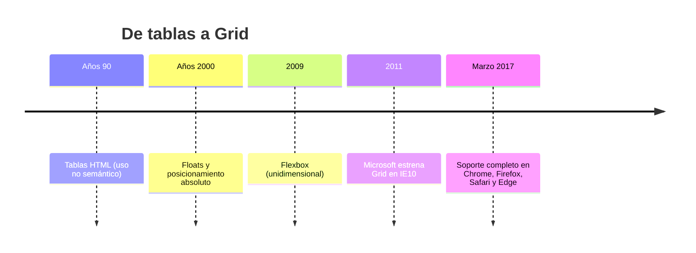
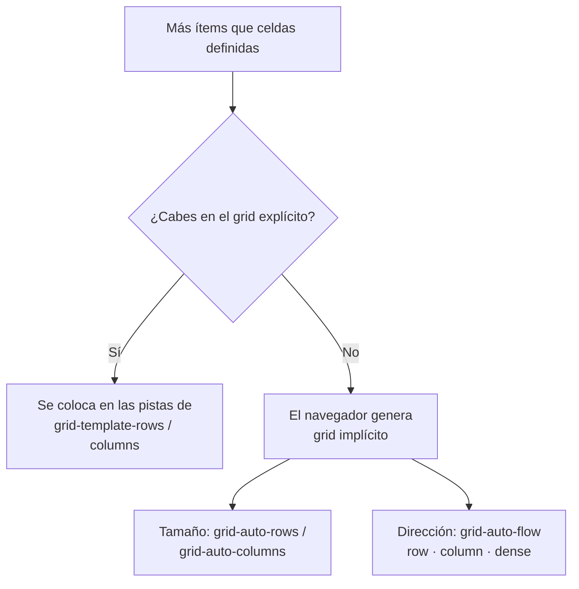

# Diseño de Interfaces Web

## Unidad 10 · CSS Grid Layout

**Módulo 0615 · Diseño de Interfaces Web**  
CFGS Desarrollo de Aplicaciones Web (DAW)
---
## Objetivos de aprendizaje I

- <span class="fragment">Comprender el **modelo bidimensional** de Grid y sus diferencias fundamentales con Flexbox</span>
- <span class="fragment">Configurar el contenedor: `display: grid`, `grid-template-columns`, `grid-template-rows` y `grid-template-areas`</span>
- <span class="fragment">Dominar las unidades propias de Grid: `fr`, `minmax()`, `auto` y `repeat()`</span>
- <span class="fragment">Posicionar ítems con `grid-column`, `grid-row` y `grid-area`</span>
- <span class="fragment">Aplicar la alineación completa: `justify-items`, `align-items`, `justify-content` y `align-content`</span>

Note: Estos cinco objetivos cubren el núcleo sintáctico de la unidad. Pregunta al aula: ¿cuál de estas propiedades ya habéis usado sin saberlo en proyectos anteriores? Insistid en que Grid no sustituye a Flexbox: ambos modelos conviven en cualquier proyecto real y hay saber elegir entre ellos.
---
## Objetivos de aprendizaje II

- <span class="fragment">Distinguir **grid explícito** e **implícito**; controlarlo con `grid-auto-rows` y `grid-auto-columns`</span>
- <span class="fragment">Diseñar layouts profesionales completos: landing pages, blogs, dashboards y galerías solo con Grid</span>
- <span class="fragment">Integrar Grid con **media queries** para conseguir diseños totalmente responsive</span>
- <span class="fragment">Evaluar implementaciones reales en sitios profesionales: Airbnb, Spotify y The New York Times</span>

Note: El objetivo final es transferir lo aprendido a casos del mundo profesional. Recordad la vinculación con el RA2 del módulo 0615 (crea interfaces homogéneas definiendo y aplicando estilos): CE 2.f (propiedades de maquetación), CE 2.g (clases de estilos) y CE 2.i (diseño responsive), verificando la visualización en distintos navegadores y dispositivos.
---
## ¿Por qué CSS Grid?

<div style="display: grid; grid-template-columns: 1fr 1fr; gap: 0.6rem; font-size: 0.8rem; text-align: left;">
  <div class="fragment"><strong>Antes de Grid</strong><br>Tablas HTML con uso no semántico · Floats diseñados para texto alrededor de imágenes · Posicionamiento absoluto difícil de mantener</div>
  <div class="fragment"><strong>Con Grid</strong><br>Sistema nativo bidimensional · Filosofía: definir la cuadrícula primero y colocar los elementos después</div>
</div>

<span class="fragment" style="font-size: 0.9rem;">💡 <strong>Pregunta:</strong> ¿cuántas líneas de CSS necesitáis hoy para un layout de cabecera + sidebar + contenido + pie?</span>

Note: Usad esta pregunta como gancho: la respuesta típica son decenas de líneas con floats, clearfix o absolute. Con Grid son unas pocas declaraciones. La filosofía de Grid invierte el proceso mental: antes pensábamos "dónde pongo cada elemento", ahora "cómo es la rejilla".
---
## Evolución de la maquetación web



<span class="fragment" style="font-size: 0.85rem;">Flexbox nació para distribuir elementos en **un eje**; Grid llegó para controlar **filas y columnas a la vez**.</span>

Note: El hito clave es marzo de 2017: los cuatro navegadores principales publicaron soporte completo casi simultáneamente, un momento histórico del desarrollo web. Antes de esa fecha, Grid solo existía en IE10 con sintaxis prefijada. Buen ejemplo de cómo una especificación del W3C puede tardar más de una década en generalizarse.
---
## Grid vs Flexbox

<div style="font-size: 0.9rem;">

| Aspecto | Flexbox | Grid |
|---|---|---|
| Dimensionalidad | 1D: fila **o** columna | 2D: filas **y** columnas |
| Lógica | El contenido determina el layout | El contenedor determina el layout |
| Ideal para | Barras de navegación, listas, centrado | Páginas completas, dashboards, galerías |
| Reordenación | Con `order` | Redefiniendo áreas o líneas |

</div>

<span class="fragment" style="font-size: 0.95rem;">📌 Regla práctica: <strong>un eje → Flexbox · dos ejes → Grid</strong></span>

Note: Enfatizad que no son rivales: en el mismo proyecto usaremos ambos. Una barra de navegación dentro de un layout Grid es Flexbox puro. Si un alumno duda, que pregunte si necesita alinear en dos direcciones a la vez: si la respuesta es sí, Grid.
---
## Compatibilidad y adopción progresiva

- <span class="fragment">Cobertura global **&gt; 97%** según Can I Use</span>
- <span class="fragment">IE11: soporte parcial mediante el prefijo `-ms-grid`, con limitaciones significativas</span>
- <span class="fragment">Estrategia recomendada: detectar con `@supports` y ofrecer fallback</span>

```css
/* Fallback por defecto */
.contenedor { display: flex; flex-wrap: wrap; }

/* Solo si el navegador soporta Grid */
@supports (display: grid) {
  .contenedor {
    display: grid;
    grid-template-columns: repeat(3, 1fr);
  }
}
```

Note: Hoy el soporte es universal, pero en proyectos corporativos con requisitos de compatibilidad sigue siendo buena práctica dominar @supports. Mostrad Can I Use en directo si tenéis proyector: es la referencia estándar de la industria para tomar decisiones de adopción.
---
## El contenedor Grid

- <span class="fragment"><code>display: grid</code> activa el contexto de cuadrícula (<code>inline-grid</code> si debe comportarse como inline)</span>
- <span class="fragment">Todos los **hijos directos** se convierten automáticamente en ítems</span>
- <span class="fragment">A diferencia de Flexbox, hay que **definir explícitamente** la estructura: columnas, filas y tamaños</span>

```css
.grid {
  display: grid;
  grid-template-columns: 200px 1fr 200px;
  grid-template-rows: 80px 200px 80px;
  gap: 16px;
}
```

<span class="fragment" style="font-size: 0.8rem;"><span class="mini">Cada valor de `grid-template-columns` crea una columna nueva: dos laterales fijas de 200px y una central que absorbe todo el espacio restante.</span></span>

Note: Recordad la diferencia con Flexbox: aquí el desarrollador dibuja la rejilla antes de colocar nada. Probad en clase borrar `grid-template-columns` y observad cómo todos los ítems caen en una única columna generada automáticamente.
---
## Columnas, filas y `repeat()`

<div style="display: grid; grid-template-columns: 1fr 1fr; gap: 0.6rem; font-size: 0.8rem; text-align: left;">
  <div class="fragment"><code>grid-template-columns</code><br>Crea una columna por cada valor declarado</div>
  <div class="fragment"><code>grid-template-rows</code><br>Análogo, pero para las filas</div>
  <div class="fragment"><code>repeat(n, valor)</code><br><code>repeat(3, 1fr)</code> equivale a <code>1fr 1fr 1fr</code></div>
  <div class="fragment"><code>grid-template</code><br>Shorthand de todo; sintaxis compleja, usar con precaución</div>
</div>

```css
/* Unidades disponibles: px, %, fr, auto, min-content, max-content */
.grid-a { grid-template-columns: 200px 1fr 200px; }
.grid-b { grid-template-columns: repeat(4, 1fr); }
```

Note: Insistid en que el número de valores declarados es exactamente el número de pistas. Un error clásico de principiante es declarar tres valores creyendo que crea cuatro columnas. Y advertid sobre el shorthand `grid-template`: potente, pero propenso a errores difíciles de depurar.
---
## La unidad `fr`

- <span class="fragment"><code>fr</code> = **fracción del espacio disponible** tras restar tamaños fijos y gaps</span>
- <span class="fragment">No existe en ningún otro contexto de CSS</span>
- <span class="fragment">Elimina cálculos manuales de porcentajes; ideal en layouts responsivos</span>

```css
.grid {
  display: grid;
  grid-template-columns: 1fr 2fr 1fr;
}
/* Espacio disponible dividido en 4 partes:
   col 1 → 1 parte · col 2 → 2 partes · col 3 → 1 parte */
```

<div style="display: grid; grid-template-columns: 1fr 2fr 1fr; gap: 0.4rem; font-size: 0.75rem; text-align: center;" class="fragment">
  <div>1fr</div>
  <div>2fr</div>
  <div>1fr</div>
</div>

Note: Haced la demo visual: este propio div de la diapositiva usa `1fr 2fr 1fr`, así que los alumnos ven la proporción en directo. Pregunta para el aula: ¿qué pasa si cambio a `2fr 1fr 2fr`? La columna central se encoge y las laterales crecen.
---
## `minmax()`: límites flexibles

- <span class="fragment">Define un **rango**: tamaño mínimo y máximo</span>
- <span class="fragment">Evita colapsos más allá de un límite y crecimientos descontrolados</span>
- <span class="fragment">Los extremos pueden ser cualquier unidad: `auto`, `min-content`, `max-content`…</span>

```css
/* Cada columna: al menos 250px, como máximo su fracción */
.grid {
  grid-template-columns: repeat(auto-fill, minmax(250px, 1fr));
}

/* Filas implícitas: mínimo 100px, crecen con el contenido */
.grid-alturas {
  grid-auto-rows: minmax(100px, auto);
}
```

Note: `minmax()` es la pieza que hace posibles los layouts fluidos. Combinada con `auto-fill` o `auto-fit`, permite crear rejillas que se adaptan solas al ancho de pantalla sin una sola media query. Pedid a los alumnos que experimenten cambiando 250px por 400px y cuenten cuántas columnas resultan.
---
## `auto-fill` vs `auto-fit`

<div style="font-size: 0.9rem;">

| Comportamiento | `auto-fill` | `auto-fit` |
|---|---|---|
| Pistas vacías | Se **mantienen** (espacio visible) | Se **colapsan** |
| Ítems existentes | Miden su fracción normal | Se **expanden** al espacio sobrante |
| Resultado | Rejilla constante | Layout pegado al contenido |
| Uso típico | Catálogos con nº variable de ítems | Tarjetas que deben llenar la fila |

</div>

<span class="fragment" style="font-size: 0.85rem;">Ambas solo funcionan dentro de `repeat()` y suelen combinarse con `minmax()`.</span>

Note: Es la distinción más sutil y la más preguntada en exámenes. Demostradlo con 3 ítems en espacio para 5 columnas: `auto-fill` deja 2 huecos visibles, `auto-fit` estira los 3 ítems hasta llenar. Si un layout muestra espacios vacíos inexplicables, casi siempre es `auto-fill` donde haría falta `auto-fit`.
---
## Espaciado con `gap`

- <span class="fragment"><code>column-gap</code>, <code>row-gap</code> y el shorthand <code>gap</code></span>
- <span class="fragment">Espaciado uniforme entre celdas **sin márgenes** ni collapses</span>
- <span class="fragment">Sustituye a los viejos trucos de margen negativo entre columnas</span>
- <span class="fragment">Admite funciones CSS para lograr espaciado responsivo</span>

```css
.grid {
  display: grid;
  grid-template-columns: repeat(3, 1fr);
  gap: 16px;            /* ambas direcciones */
  /* gap: 12px 24px;    /* filas y columnas */
}
```

Note: Recordad que `gap` no añade espacio alrededor del borde exterior del contenedor, solo entre pistas: para el relleno externo sigue usando padding en el contenedor. Es un punto que falla con frecuencia en las entregas prácticas.
---
## Grid explícito vs implícito



- <span class="fragment">Explícito: lo defines tú con `grid-template-*`</span>
- <span class="fragment">Implícito: aparece solo; por defecto crea filas de altura `auto`</span>
- <span class="fragment">Ideal para contenido dinámico: ecommerce, galerías generadas, feeds asíncronos</span>

Note: Pensadlo como un contrato: el grid explícito es la estructura garantizada y el implícito es el plan B automático. Si no definís `grid-auto-rows`, las filas nuevas se ajustarán al contenido y podréis ver alturas inconsistentes en listados largos.
---
## Posicionando ítems

- <span class="fragment">Las líneas se numeran desde **1**; los negativos cuentan desde el final (`-1` = última línea)</span>
- <span class="fragment"><code>grid-column-start / end</code> y <code>grid-row-start / end</code></span>
- <span class="fragment">Shorthand: <code>grid-column: 1 / 3</code> · palabra clave <code>span</code>: <code>grid-column: 1 / span 2</code></span>
- <span class="fragment"><code>grid-area: fila-ini / col-ini / fin-fila / fin-col</code> (shorthand definitivo)</span>

```css
.cabecera { grid-column: 1 / -1; }       /* Todo el ancho */
.contenido { grid-row: span 2; }         /* Dos filas de alto */
.destacado { grid-area: 1 / 1 / 3 / 3; } /* Caja de 2x2 */
```

Note: La doble numeración (positiva y negativa) es lo que hace elegante `1 / -1` para elementos a ancho completo. Advertencia: si posicionáis un ítem fuera de los límites definidos, el navegador creará pistas implícitas; asegurad de tener `grid-auto-columns` bajo control.
---
## `grid-template-areas`: maquetación visual

- <span class="fragment">La estructura de la página como **mapa ASCII** directamente en el CSS</span>
- <span class="fragment">Cada cadena = una fila · nombre repetido = área fusionada · `.` = celda vacía</span>
- <span class="fragment">Reorganiza el layout en breakpoints **sin tocar el HTML** ni las reglas individuales</span>
- <span class="fragment">Orden lógico del DOM preservado → accesibilidad y SEO</span>

```css
.layout {
  display: grid;
  grid-template-columns: repeat(3, 1fr);
  grid-template-areas:
    "header header header"
    "sidebar content content"
    "footer footer footer";
}
.header  { grid-area: header; }
.sidebar { grid-area: sidebar; }
.content { grid-area: content; }
.footer  { grid-area: footer; }
```

Note: Esta es la propiedad estrella de la unidad: el código se lee igual que el render. Haced el ejercicio mental de pedir un cambio ("que el sidebar pase a la derecha") y mostrad que solo se edita el mapa, no el HTML ni las propiedades de cada ítem.
---
## Ejemplo guiado 1 · Primera cuadrícula

5 ítems: cabecera, sidebar izquierdo, contenido principal, sidebar derecho y pie.

```css
.grid-contenedor {
  display: grid;
  grid-template-columns: 200px 1fr 200px;
  grid-template-rows: 80px 200px 80px;
  gap: 16px;
}
/* Cabecera y pie ocupan todas las columnas */
.item:nth-child(1),
.item:nth-child(5) { grid-column: 1 / -1; }
/* El contenido principal ocupa 2 filas */
.item:nth-child(3) { grid-row: span 2; }
```

- <span class="fragment">Los ítems se colocan solos, fila a fila, en orden DOM</span>
- <span class="fragment">Unidades mixtas: píxeles fijos para los sidebars + `fr` para la zona central</span>

Note: Proyectad el resultado y pedid a un alumno que prediga dónde caerá cada número antes de recargar. Después, retadles: ¿cómo haríais que el sidebar derecho ocupara también 2 filas? La respuesta es `grid-row: span 2` en el cuarto hijo.
---
## Ejemplo guiado 2 · Áreas nombradas

Layout completo de plataforma educativa: logo, navegación, usuario, héroe, lateral, contenido y pie.

```css
.pagina {
  display: grid;
  grid-template-columns: repeat(4, 1fr);
  grid-template-rows: 80px auto 1fr 60px;
  grid-template-areas:
    "logo     nav      nav      usuario"
    "hero     hero     hero     hero"
    "lateral  contenido contenido contenido"
    "footer   footer   footer   footer";
  gap: 12px;
}
.navegacion { grid-area: nav; }
.hero       { grid-area: hero; }
```

- <span class="fragment">El HTML queda lineal y semántico; toda la disposición visual vive en el CSS</span>

Note: Observad cómo `nav` se repite en dos celdas contiguas y forma una sola área. En móvil bastaría redefinir el mapa a una única columna. Este patrón es el que usan los grandes medios editoriales para reorganizar portadas sin modificar el marcado.
---
## Ejemplo guiado 3 · Unidades fluidas

```css
/* Alturas mínimas que crecen con el contenido */
.grid-minmax {
  display: grid;
  grid-template-columns: repeat(3, 1fr);
  grid-auto-rows: minmax(100px, auto);
  gap: 20px;
}
/* Mantiene las columnas vacías visibles */
.grid-auto-fill {
  grid-template-columns: repeat(auto-fill, minmax(200px, 1fr));
}
/* Colapsa las vacías: los ítems se expanden */
.grid-auto-fit {
  grid-template-columns: repeat(auto-fit, minmax(200px, 1fr));
}
```

- <span class="fragment">Con 3 ítems y espacio para 5: `auto-fill` deja 2 huecos, `auto-fit` estira los 3</span>
- <span class="fragment">En la misma fila, todas las tarjetas igualan la altura gracias a Grid</span>

Note: Poned los tres grids lado a lado en el navegador y comparad en vivo: es la mejor demostración visual de la unidad, mismo código con distinto comportamiento por una sola palabra. También sirve para explicar por qué `minmax(100px, auto)` evita desbordes en tarjetas con textos de longitud variable.
---
## Ejemplo guiado 4 · Grid implícito en acción

8 ítems en un grid explícito de 2×2: los 4 extra generan filas implícitas.

```css
.grid-impl {
  display: grid;
  grid-template-columns: repeat(2, 1fr);
  grid-template-rows: repeat(2, 120px);
  grid-auto-rows: 120px;      /* filas implícitas de 120px */
  gap: 12px;
}
/* Los extras van en nuevas COLUMNAS, no en filas */
.grid-col {
  grid-auto-flow: column;
  grid-auto-columns: 150px;
}
/* Rellena huecos compactando (puede alterar el orden visual) */
.grid-dense { grid-auto-flow: dense; }
```

Note: Con `dense`, los ítems pequeños rellenan los agujeros dejados por los grandes: perfecto para galerías, peligroso cuando el orden importa por accesibilidad. Probad a quitar `grid-auto-rows` y comparad las alturas de las filas generadas automáticamente.
---
## Ejemplo guiado 5 · Sistema de alineación

Grid comparte con Flexbox el **Box Alignment Module**, por lo que la sintaxis es idéntica en ambos modelos.

```css
/* Alinea TODOS los ítems dentro de sus celdas */
.grid { place-items: center; }   /* start · center · end · stretch */

/* Alinea la CUADRÍCULA entera dentro del contenedor */
.grid { place-content: space-between; }

/* Sobrescribe la alineación de UN ítem concreto */
.item:nth-child(5) { place-self: end; }
```

- <span class="fragment"><code>stretch</code> es el valor por defecto: los ítems llenan por completo su celda</span>
- <span class="fragment">Útil para centrar una imagen concreta en un grid de tarjetas estiradas</span>

Note: Repasad la tríada items / content / self: la primera afecta a los ítems dentro de sus celdas, la segunda a la rejilla entera y la tercera a un ítem concreto. Es el grupo de propiedades que más confusión genera junto con el de `auto-fill`/`auto-fit`.
---
## Patrón · Landing page profesional

- <span class="fragment">Estructura con `grid-template-areas`: header → hero → features → testimonials → cta → footer</span>
- <span class="fragment">Héroe a 2 columnas (texto + imagen) que pasa a 1 columna en móvil</span>
- <span class="fragment">Tarjetas fluidas: 3 columnas en desktop, 2 en tablet, 1 en móvil — sin media queries</span>
- <span class="fragment">Cabecera `sticky` con Grid interno: `auto 1fr auto`</span>

```css
.landing {
  display: grid;
  grid-template-areas:
    "header" "hero" "features"
    "testimonials" "cta" "footer";
}
.features__grid {
  grid-template-columns: repeat(auto-fit, minmax(280px, 1fr));
}
```

Note: Este patrón es el más reutilizable de la unidad: prácticamente cualquier landing profesional se monta con estas seis áreas. Señalad que el único media query necesario es el del héroe y la cabecera; el resto de secciones son fluidas por diseño.
---
## Patrones · Blog y ecommerce

<div style="display: grid; grid-template-columns: 1fr 1fr; gap: 0.6rem; font-size: 0.8rem; text-align: left;">
  <div class="fragment"><strong>Blog editorial</strong><br>· Contenedor centrado: <code>1fr minmax(0, 1100px) 1fr</code><br>· Post destacado: <code>grid-column: 1 / -1</code> + grid interno a 2 col.<br>· Posts: <code>repeat(auto-fill, minmax(280px, 1fr))</code><br>· Paginación: <code>grid-auto-flow: column</code></div>
  <div class="fragment"><strong>Ecommerce</strong><br>· Filtros + productos: <code>250px 1fr</code><br>· Sidebar de filtros <code>position: sticky</code><br>· Productos: <code>repeat(auto-fill, minmax(260px, 1fr))</code><br>· Producto destacado: <code>grid-column: span 2</code></div>
</div>

<span class="fragment" style="font-size: 0.85rem;">En ambos casos, en tablet/móvil el grid pasa a 1 columna y el destacado vuelve a <code>span 1</code>.</span>

Note: Estos dos ejemplos muestran Grid trabajando a varios niveles anidados: página → sección → tarjeta → pie de tarjeta. En el ecommerce, el producto destacado a doble columna es un recurso visual muy usado por tiendas reales para jerarquizar el catálogo.
---
## Patrones · Dashboard y galería masonry

<div style="display: grid; grid-template-columns: 1fr 1fr; gap: 0.6rem; font-size: 0.8rem; text-align: left;">
  <div class="fragment"><strong>Dashboard</strong><br>· Áreas: <code>"sidebar header"</code> / <code>"sidebar main"</code><br>· Widgets: <code>repeat(4, 1fr)</code><br>· <code>grid-auto-rows: minmax(150px, auto)</code><br>· Widget ancho: <code>grid-column: span 2</code></div>
  <div class="fragment"><strong>Galería masonry</strong><br>· Base: <code>repeat(4, 1fr)</code> + <code>grid-auto-rows: 200px</code><br>· Tamaños irregulares con spans: <code>grid-row: span 2</code><br>· Alternativa automática: <code>grid-auto-flow: dense</code><br>· Overlay hover con <code>inset: 0</code></div>
</div>

<span class="fragment" style="font-size: 0.8rem;"><span class="mini">No es masonry puro (eso requiere CSS Grid Level 3 experimental), pero el resultado visual es equivalente y totalmente compatible.</span></span>

Note: En el dashboard, probad a ocultar el sidebar en tablet redefiniendo las áreas a `"header"` y `"main"`. En la galería, comparad la versión con spans manuales frente a `dense`: la primera da control total, la segunda ahorra esfuerzo cuando el contenido es dinámico.
---
## Grid responsive

- <span class="fragment">Redefinir `grid-template-areas` en cada breakpoint: **cero cambios en el HTML**</span>
- <span class="fragment"><code>auto-fit</code>/<code>auto-fill</code> + <code>minmax()</code>: fluidez sin breakpoints</span>
- <span class="fragment">Breakpoints usados en los ejemplos: 768px · 900px · 1024px</span>
- <span class="fragment">Reservar media queries solo para **cambios estructurales mayores**</span>

```css
@media (max-width: 768px) {
  .hero { grid-template-columns: 1fr; text-align: center; }
  .header { grid-template-columns: 1fr; }
  .header__nav { order: 3; flex-wrap: wrap; }
}
```

Note: La estrategia ganadora es combinar ambas técnicas: lo fluido lo resuelve `minmax()` y lo estructural lo resuelve la media query. Pedid a los alumnos que identifiquen en la landing cuántos media queries hacen realmente falta (respuesta: uno) y cuáles resultarían innecesarios.
---
## Casos reales

<div style="display: grid; grid-template-columns: 1fr 1fr 1fr; gap: 0.6rem; font-size: 0.75rem; text-align: left;">
  <div class="fragment"><strong>Airbnb</strong><br>Resultados con <code>repeat(auto-fill, minmax(280px, 1fr))</code>. Filtros laterales que pasan a modal en móvil. Grid + Flexbox dentro de cada tarjeta. Row scrollable de experiencias.</div>
  <div class="fragment"><strong>Spotify</strong><br>App de escritorio: sidebar fijo + <code>1fr</code>. Categorías con <code>minmax(180px, 1fr)</code>. Reproductor inferior con <code>grid-template-rows: 1fr auto</code> + <code>calc()</code>. Canciones como filas de grid perfectamente alineadas.</div>
  <div class="fragment"><strong>The New York Times</strong><br>Sistema de 12 columnas: noticia principal a 8, secundarias a 4. Portada reorganizada en cada breakpoint redefiniendo <code>grid-template-areas</code> sin tocar el HTML.</div>
</div>

Note: Asignad un caso a cada grupo como mini-análisis: que abran la web, inspeccionen con DevTools y documenten qué propiedades Grid detectan. Es la forma más directa de conectar la teoría con el mercado laboral real.
---
## Actividad en clase

<div style="font-size: 0.9rem;">

| | |
|---|---|
| **Objetivo** | Construir un portfolio personal completo con CSS Grid |
| **Tiempo** | 45 minutos |
| **Formato** | Individual, paso a paso, con el apunte abierto |
| **Entregable** | HTML + CSS comentados, verificados en DevTools |

</div>

- <span class="fragment">HTML semántico: cabecera, presentación, proyectos, habilidades y contacto</span>
- <span class="fragment">Estructura principal definida con `grid-template-areas`</span>
- <span class="fragment">Proyectos: `repeat(auto-fill, minmax(300px, 1fr))`</span>
- <span class="fragment">Alineación con `place-items` y `place-self`</span>
- <span class="fragment">Verificación con el inspector de Grid (líneas y áreas coloreadas)</span>

Note: Variantes si sobra tiempo: rediseño de tabla de precios (3 columnas con el plan central destacado), panel de widgets con sidebar de 220px, galería masonry con overlays o artículo editorial con ancho de lectura óptimo de 65ch. Recoged las entregas para evaluar el uso correcto de áreas y spans.
---
## Buenas prácticas

- <span class="fragment">✅ Grid para el layout principal · Flexbox para componentes internos</span>
- <span class="fragment">✅ Nombres semánticos en líneas `[inicio-sidebar]` y en las áreas</span>
- <span class="fragment">✅ Preferir `grid-template-areas` para layouts estáticos</span>
- <span class="fragment">✅ `minmax()` + `auto-fit` antes que media queries cuando sea posible</span>
- <span class="fragment">✅ Grid explícito para la base · implícito para contenido dinámico</span>
- <span class="fragment">✅ Depurar con el inspector visual (el de Firefox es el más completo)</span>
- <span class="fragment">✅ Fallbacks con `@supports (display: grid)`</span>
- <span class="fragment">✅ `box-sizing: border-box` global · evitar el shorthand `grid-template` · documentar con comentarios</span>

Note: Cerrad repasando las tres que más fallos evitan: nombres semánticos (legibilidad), `minmax` con `auto-fit` (menos media queries) y `border-box` global (predicibilidad de las fracciones). Son hábitos que marcan la diferencia entre un layout mantenible y uno frágil.
---
## Errores frecuentes

- <span class="fragment">❌ Confundir `auto-fill` con `auto-fit` (huecos vacíos inexplicables)</span>
- <span class="fragment">❌ Olvidar que solo los **hijos directos** son ítems del grid</span>
- <span class="fragment">❌ No definir `grid-auto-rows` → alturas inconsistentes en el grid implícito</span>
- <span class="fragment">❌ Usar `%` en lugar de `fr`: los porcentajes no descuentan el espacio de los gaps</span>
- <span class="fragment">❌ Posicionar fuera de límites sin `grid-auto-columns` definido</span>
- <span class="fragment">❌ Confundir `justify-items` (ítems en celdas) con `justify-content` (rejilla en contenedor)</span>
- <span class="fragment">❌ Usar `dense` cuando el orden del DOM importa (accesibilidad)</span>
- <span class="fragment">❌ Ignorar Subgrid antes de recurrir a JavaScript o `display: contents`</span>
- <span class="fragment">❌ Sobrecargar media queries cuando las herramientas fluidas bastan</span>

Note: Los errores 1, 2 y 6 aparecen en la mayoría de entregas de primer curso. Tenéis un truco diagnóstico: si algo no entra en el grid, comprobad primero si es hijo directo; si veis huecos raros, sospechad de `auto-fill`; si la alineación no responde, revisad items contra content.
---
## Resumen · Conceptos clave

- <span class="fragment">🎯 Modelo **bidimensional**: filas y columnas controladas a la vez</span>
- <span class="fragment">🎯 `fr`: fracciones proporcionales del espacio disponible</span>
- <span class="fragment">🎯 `minmax()` + `auto-fill`/`auto-fit`: layouts fluidos sin media queries</span>
- <span class="fragment">🎯 Grid **explícito** (estructura) vs **implícito** (contenido dinámico)</span>
- <span class="fragment">🎯 Líneas numeradas, `span` y valores negativos para posicionar ítems</span>
- <span class="fragment">🎯 `grid-template-areas`: mapa visual, reordenación sin tocar el HTML</span>
- <span class="fragment">🎯 Grid + Flexbox: aliados, no competidores</span>
- <span class="fragment">🎯 Soporte &gt; 97% · `@supports` para mejora progresiva</span>

Note: Como cierre conceptual, pedid a cada alumno que explique en una frase la diferencia entre explícito e implícito y otra entre `auto-fill` y `auto-fit`. Si ambas salen claras, la unidad está asimilada; el resto de propiedades se consultan en la documentación.
---
## Recursos complementarios

<div style="display: grid; grid-template-columns: 1fr 1fr 1fr; gap: 0.6rem; font-size: 0.75rem; text-align: left;">
  <div class="fragment"><strong>CSS Grid Garden</strong><br>Juego interactivo con desafíos de posicionamiento. Primer contacto práctico recomendado.</div>
  <div class="fragment"><strong>CSS-Tricks</strong><br>Complete Guide to Grid: la referencia visual más completa, chuleta de consulta rápida.</div>
  <div class="fragment"><strong>MDN Web Docs</strong><br>Documentación oficial en español con tutoriales y ejemplos interactivos.</div>
  <div class="fragment"><strong>Grid by Example</strong><br>Rachel Andrew: patrones prácticos, vídeos y código descargable.</div>
  <div class="fragment"><strong>Layout Land</strong><br>Canal de YouTube de Jen Simmons: posibilidades creativas de Grid.</div>
  <div class="fragment"><strong>Can I Use</strong><br>Datos actualizados de soporte, incluyendo Subgrid.</div>
  <div class="fragment"><strong>W3C CSS Grid Level 1</strong><br>La especificación oficial de referencia técnica.</div>
  <div class="fragment"><strong>Firefox DevTools</strong><br>El inspector de Grid más potente: líneas, áreas y gaps superpuestos.</div>
  <div class="fragment"><strong>Autoprefixer</strong><br>Herramienta PostCSS para prefijos legacy (IE11).</div>
</div>

Note: Para profundizar, el libro "CSS: The Definitive Guide" (5ª ed., Eric Meyer y Estelle Weyl, O'Reilly, 2023) cubre Grid en profundidad junto con el resto de tecnologías CSS. Animad a practicar con CSS Grid Garden como tarea lúdica antes del examen.
---
## Próximos pasos

<span style="font-size: 1.1rem;">→ <strong>Unidad 11 · Responsive Design</strong></span>

- <span class="fragment">Metodología **Mobile First** aplicada a sistemas de grid</span>
- <span class="fragment">Breakpoints estratégicos y testing multi-dispositivo</span>
- <span class="fragment">Grid como base de layouts totalmente adaptables</span>

Note: Lo visto hoy es la base estructural de la próxima unidad: en Responsive Design profundizaremos en cómo diseñar desde el móvil y elegir breakpoints con criterio, no por costumbre. Anima a practicar con CSS Grid Garden antes de la siguiente sesión.
---
## ¿Preguntas?

Unidad 10 · CSS Grid Layout

0615 · DAW · Curso 2025/2026

Note: Cierre de la sesión. Si hay tiempo, recordad los recursos prioritarios: CSS Grid Garden para practicar de forma lúdica, la Complete Guide to Grid de CSS-Tricks como chuleta visual y Grid by Example de Rachel Andrew para patrones avanzados.
