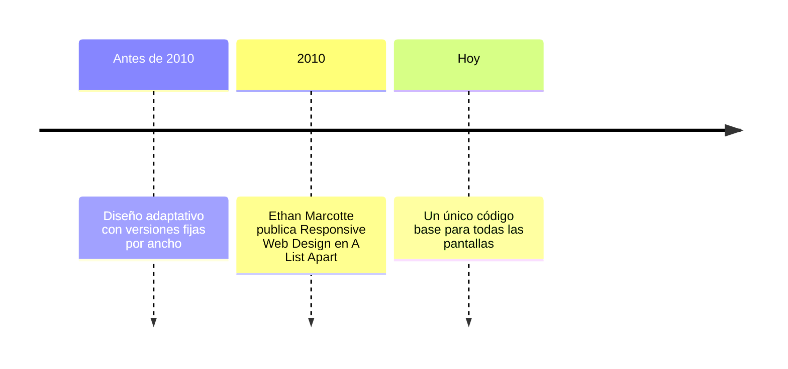

# Diseño de Interfaces Web

## Unidad 11 · Responsive Design

**Módulo 0615 · Diseño de Interfaces Web**  
CFGS Desarrollo de Aplicaciones Web (DAW)

---

## Objetivos de aprendizaje I

- <span class="fragment">Comprender la **filosofía responsive** y su diferencia con el diseño adaptativo</span>
- <span class="fragment">Aplicar la metodología **Mobile First**: mejora progresiva frente a degradación elegante</span>
- <span class="fragment">Configurar la **metaetiqueta viewport** y el impacto de cada uno de sus atributos</span>
- <span class="fragment">Seleccionar **breakpoints basados en el contenido**, no en dispositivos específicos</span>
- <span class="fragment">Dominar las **media queries** en todas sus variantes, incluidas las modernas</span>

Note: Estos objetivos cubren tanto la teoría (filosofía, viewport) como la práctica (código real). Insistid en que el alumnado sepa justificar cada breakpoint que elija, no solo copiar valores de internet. Pregunta de arranque para el aula: ¿cuántos breakpoints creéis que necesita una landing page sencilla?

---

## Objetivos de aprendizaje II

- <span class="fragment">Implementar **Container Queries** para componentes reutilizables que se adaptan a su contenedor</span>
- <span class="fragment">Servir **imágenes responsive** con srcset, sizes y el elemento picture</span>
- <span class="fragment">Aplicar **tipografía responsive** con clamp() y unidades relativas</span>
- <span class="fragment">Construir **patrones de layout**: Column Drop, Mostly Fluid, Layout Shifter y Off Canvas</span>
- <span class="fragment">Diseñar **menús y tablas responsive** con las técnicas adecuadas a cada caso</span>
- <span class="fragment">Desarrollar un **proyecto web completo** aplicando todas las técnicas aprendidas</span>

Note: Los cinco primeros objetivos son puramente prácticos y se evaluarán en el proyecto final de la unidad. Destacar que las container queries son la técnica más reciente y la que más valor añadido aporta en entrevistas de trabajo. El proyecto completo integra todas estas piezas, por lo que conviene empezar a planificarlo desde hoy.

---

## ¿Por qué responsive?

<span class="fragment" style="font-size: 1rem;">¿Qué porcentaje del tráfico web proviene de dispositivos móviles?</span>

- <span class="fragment">≈ **58 %** del tráfico global es móvil (StatCounter, 2025)</span>
- <span class="fragment">Picos de **más del 70 %** en regiones como Asia y África</span>
- <span class="fragment">Más del **60 %** de las ofertas de empleo web lo exigen como requisito</span>
- <span class="fragment">Competencia transversal del ciclo: todos los proyectos DAW deben funcionar en móvil, tablet y escritorio</span>
- <span class="fragment">Currículo: RA2 · CE 2.i «diseño web adaptativo o responsive» (y RA6, usabilidad en cualquier dispositivo)</span>

Note: Dejad que respondan antes de revelar las cifras. El dato del 58 % de StatCounter 2025 es orientativo: varía según la fuente y la región, pero la tendencia es inequívoca. Conectar con el currículo oficial: esta unidad desarrolla el RA2 (CE 2.i, diseño responsive) y está vinculada a la verificación de la visualización en distintos navegadores y dispositivos, así como al RA6 (usabilidad en cualquier dispositivo).

---

## Orígenes: Ethan Marcotte (2010)



- <span class="fragment"><strong>Grillas fluidas</strong>: porcentajes en lugar de píxeles fijos</span>
- <span class="fragment"><strong>Imágenes flexibles</strong>: que no desborden su contenedor</span>
- <span class="fragment"><strong>Media queries</strong>: reglas CSS condicionales según el dispositivo</span>

Note: Ethan Marcotte acuñó el término en su artículo seminal de 2010 en A List Apart; su libro «Responsive Web Design» (A Book Apart) sigue siendo la obra de referencia. Los tres pilares siguen vigentes, aunque las herramientas han evolucionado mucho: hoy contamos con clamp(), grid y container queries.

---

## Responsive vs. Adaptativo

<div style="font-size: 0.9rem;">

| Criterio | Responsive | Adaptativo |
|----------|-----------|------------|
| Enfoque | Un único código fluido | Múltiples versiones fijas |
| Anchos | Se adapta continuamente | Predefinidos: 320 / 768 / 1024 px |
| Mantenimiento | Bajo | Alto: cada cambio se replica |
| Cobertura | Cualquier tamaño de pantalla | Solo tamaños previstos |
| SEO | Un solo contenido | Duplicación perjudicial |

</div>

<span class="fragment" style="font-size: 0.85rem;">En el enfoque adaptativo, el servidor detecta el dispositivo y sirve la versión correspondiente.</span>

Note: El diseño adaptativo aún aparece en algunos proyectos corporativos con audiencias muy concretas, pero su coste de mantenimiento lo hace poco viable hoy. Preguntar al aula: ¿qué pasa con el SEO si duplicamos el mismo contenido en varias versiones fijas?

---

## El ecosistema de dispositivos

<div style="display: grid; grid-template-columns: 1fr 1fr; gap: 0.6rem; font-size: 0.8rem; text-align: left;">
  <div class="fragment"><strong>Smartphones</strong><br>320 px → plegables de 400 px+</div>
  <div class="fragment"><strong>Tablets</strong><br>600 – 1200 px</div>
  <div class="fragment"><strong>Portátiles</strong><br>1024 – 1920 px</div>
  <div class="fragment"><strong>Monitores de escritorio</strong><br>1920 – 5120 px</div>
  <div class="fragment"><strong>Smart TV y relojes</strong><br>Nuevos contextos de uso</div>
  <div class="fragment"><strong>Realidad extendida</strong><br>Próxima generación de dispositivos</div>
</div>

<span class="fragment" style="font-size: 0.85rem;">No existe «el» dispositivo: el diseño debe cubrir todo el rango presente y futuro.</span>

Note: Insistir en que diseñar «para iPhone y iPad» es insuficiente: existen plegables, monitores 4K y contextos emergentes. Esta diversidad es precisamente la razón de ser del diseño fluido frente a las versiones fijas.

---

## Viewport: dos conceptos clave

- <span class="fragment"><strong>Viewport</strong>: área visible de la página dentro del navegador</span>
- <span class="fragment"><strong>Layout viewport</strong>: zona sobre la que se renderiza la página (en móvil, **980 px por defecto**)</span>
- <span class="fragment"><strong>Visual viewport</strong>: área realmente visible en la pantalla</span>
- <span class="fragment">Sin meta viewport: el móvil renderiza a 980 px y encoge todo → texto minúsculo y zoom obligatorio</span>

Note: Demostrarlo en vivo: abrir una página sin meta viewport en el emulador de móvil de Chrome DevTools y observar cómo se renderiza a 980 px. Es el error más fácil de detectar y corregir, y a la vez el más común en los trabajos de alumnado.

---

## La metaetiqueta viewport

```html
<head>
  <!-- Imprescindible en cualquier sitio responsive -->
  <meta name="viewport"
        content="width=device-width, initial-scale=1.0">
</head>
```

<div style="font-size: 0.9rem;">

| Atributo | Efecto |
|----------|--------|
| `width=device-width` | Layout viewport = ancho del dispositivo (px CSS) |
| `initial-scale=1.0` | Zoom inicial al 100 % |
| `user-scalable=no` | Deshabilita el zoom (❌ accesibilidad) |
| `minimum-scale` / `maximum-scale` | Límites del zoom del usuario |
| `viewport-fit=cover` | Pantallas con notch o isla dinámica |

</div>

<span class="fragment" style="font-size: 0.8rem;">Ejemplo: iPhone 14 → 1170 px físicos, pero reporta `device-width` de 390 px (devicePixelRatio 3×).</span>

Note: Nunca usar user-scalable=no: impide el zoom y constituye una barrera grave de accesibilidad. El caso del iPhone 14 ayuda a entender la diferencia entre píxeles físicos y píxeles CSS, un concepto previo que muchos alumnos confunden.

---

## Mobile First

- <span class="fragment">Empezar por la versión **móvil** (la más restrictiva) y añadir complejidad progresivamente</span>
- <span class="fragment">Popularizada por **Luke Wroblewski**; invierte la práctica tradicional desktop-first</span>
- <span class="fragment">Ventaja 1: **prioriza el contenido** — el espacio limitado elimina lo superfluo</span>
- <span class="fragment">Ventaja 2: **rendimiento** — el móvil solo descarga y procesa el CSS que necesita</span>
- <span class="fragment">Ventaja 3: se alinea con la realidad estadística del tráfico web actual</span>
- <span class="fragment">En CSS: estilos base = móvil; **solo `min-width`** en las media queries</span>

Note: Mobile First no significa «sitios feos para móvil»: significa priorizar. Hacer hincapié en la ventaja de rendimiento: menos CSS descargado y procesado justo en el dispositivo más limitado. Pregunta para el aula: ¿qué ocurre con el tiempo de carga si servimos primero todo el CSS de escritorio?

---

## Mejora progresiva vs. Degradación elegante

<div style="display: grid; grid-template-columns: 1fr 1fr; gap: 0.6rem; font-size: 0.8rem; text-align: left;">
  <div class="fragment">
    <strong>✅ Mejora progresiva</strong><br>
    La versión base funciona en cualquier dispositivo; los navegadores más capaces reciben mejoras adicionales.<br><br>
    <em>Recomendada (es la base de Mobile First)</em>
  </div>
  <div class="fragment">
    <strong>❌ Degradación elegante</strong><br>
    Diseñar para el escenario máximo e ir quitando funcionalidades a dispositivos menos capaces.<br><br>
    <em>Desaconsejada en la actualidad</em>
  </div>
</div>

Note: La mejora progresiva garantiza que lo básico siempre funciona y lo avanzado se añade si el navegador puede. La degradación elegante parte del escenario ideal y quita funciones: con la diversidad actual de dispositivos, es una apuesta arriesgada.

---

## Breakpoints: donde el contenido «se rompe»

- <span class="fragment">Un breakpoint es el punto donde el diseño cambia de estructura</span>
- <span class="fragment">Regla de oro (recomendación W3C): **basados en el contenido, no en dispositivos**</span>
- <span class="fragment">Estrategia: empezar con **0 breakpoints** y técnicas fluidas (`auto-fit/minmax`, `wrap`, `clamp()`)</span>
- <span class="fragment">Añadir uno solo cuando el diseño deje de verse bien</span>
- <span class="fragment">Rangos habituales de referencia:</span>

<div style="font-size: 0.85rem;">
  <span class="fragment"><code>480px</code> móvil pequeño → grande</span> ·
  <span class="fragment"><code>768px</code> móvil/tablet pequeña → tablet</span> ·
  <span class="fragment"><code>1024px</code> tablet → escritorio</span> ·
  <span class="fragment"><code>1280px</code> escritorio estándar</span>
</div>

<span class="fragment" style="font-size: 0.85rem;">Enfoque Mobile First ⇒ todos los breakpoints usan <code>min-width</code>.</span>

Note: Ejercicio mental: redimensionad esta diapositiva y observad dónde se rompe el contenido. Los rangos 480/768/1024/1280 son puntos de partida didácticos, no dogma: en vuestros proyectos, dejad que el contenido os diga exactamente dónde romper.

---

## Media queries: sintaxis

```css
@media [tipo] [operador] (característica) {
  /* reglas condicionales */
}
```

- <span class="fragment"><strong>Tipos de medio</strong>: `screen`, `print`, `all` (por defecto)</span>
- <span class="fragment"><strong>Operadores lógicos</strong>: `and` (intersección), `not` (negación), `only` (navegadores antiguos), coma = OR</span>
- <span class="fragment">Ejemplo: <code>@media (min-width: 768px) { … }</code> → «cuando la pantalla tenga al menos 768 px de ancho»</span>

Note: La coma como OR es la forma más usada en la práctica: @media (min-width: 768px), (min-width: 1024px). El operador only casi ha desaparecido junto con los navegadores antiguos, pero conviene conocerlo para leer código legado.

---

## Características clásicas

<div style="font-size: 0.9rem;">

| Característica | Valores | Uso |
|----------------|---------|-----|
| `width` / `min-width` / `max-width` | px | Ancho del viewport |
| `height` / `min-height` / `max-height` | px | Alto del viewport |
| `orientation` | `portrait` \| `landscape` | Orientación del dispositivo |
| `aspect-ratio` | ej. `16/9` | Relación de aspecto |
| `resolution` | dpi / dppx | Densidad de píxeles |

</div>

<span class="fragment" style="font-size: 0.85rem;">Combinables: <code>@media screen and (orientation: landscape) and (min-width: 768px)</code></span>

Note: orientation y aspect-ratio son útiles para ajustes específicos como vídeos o impresión. resolution permite servir estilos distintos a pantallas de alta densidad, aunque hoy se prefiere resolverlo con srcset en las imágenes.

---

## Media queries modernas

<div style="display: grid; grid-template-columns: 1fr 1fr; gap: 0.6rem; font-size: 0.8rem; text-align: left;">
  <div class="fragment">
    <strong>Preferencias de usuario</strong><br>
    <code>prefers-reduced-motion: reduce</code><br>
    <code>prefers-color-scheme: dark | light</code><br>
    <code>prefers-contrast: more | less</code><br>
    <code>prefers-reduced-data: reduce</code>
  </div>
  <div class="fragment">
    <strong>Interacción</strong><br>
    <code>hover: hover | none</code><br>
    <code>pointer: coarse | fine</code><br>
    <code>any-hover</code> / <code>any-pointer</code><br>
    <span class="mini">(consideran todos los periféricos conectados)</span>
  </div>
</div>

```css
@media screen and (min-width: 768px)
       and (hover: hover)
       and (prefers-color-scheme: dark) { … }
```

Note: Estas consultas son de accesibilidad pura: respetarlas es obligatorio en proyectos profesionales. Demostrar prefers-color-scheme cambiando el tema del sistema operativo en tiempo real. hover y pointer permiten activar efectos solo en dispositivos con ratón, no en táctiles.

---

## Container Queries

- <span class="fragment">Las media queries consultan el **viewport**; las container queries, el **contenedor**</span>
- <span class="fragment">Resuelven el problema de los **componentes reutilizables**: la misma tarjeta en un sidebar de 300 px y en una zona principal de 800 px</span>

```css
.card-wrapper {
  container-type: inline-size; /* o size | normal */
  container-name: card;
}

@container card (min-width: 400px) {
  .card { grid-template-columns: 1fr 2fr; }
}
```

<span class="fragment" style="font-size: 0.85rem;">El componente se adapta a su contexto, sin conocer el tamaño del viewport.</span>

Note: Esta es la evolución más significativa del diseño responsive desde las media queries originales: el componente deja de depender de la página. Pensad en un design system: la misma tarjeta debe funcionar en un sidebar estrecho y en una zona central ancha sin tocar su CSS.

---

## Unidades de contenedor

<div style="font-size: 0.9rem;">

| Unidad | Significado |
|--------|-------------|
| `cqw` | 1 % del ancho del contenedor |
| `cqh` | 1 % del alto del contenedor |
| `cqi` / `cqb` | Eje inline / bloque del contenedor |
| `cqmin` / `cqmax` | Menor / mayor de las anteriores |

</div>

<span class="fragment" style="font-size: 0.85rem;">Ejemplo: <code>font-size: clamp(0.7rem, 3cqi, 0.9rem)</code> — escala con el contenedor, no con la ventana.</span>

Note: Son equivalentes a vw/vh pero relativos al contenedor en lugar del viewport. Combinarlas con clamp() permite un escalado fluido dentro del propio componente. Verificar el soporte actual en caniuse.com antes de usarlas en producción.

---

## Imágenes responsive: srcset + sizes

- <span class="fragment">Problema doble: imágenes enormes servidas a móviles + pantallas Retina (2×, 3×) que piden más resolución</span>

```html

```

- <span class="fragment"><code>w</code>: ancho intrínseco de cada versión · <code>x</code>: densidad (1×/2×/3×)</span>
- <span class="fragment"><code>sizes</code>: informa al navegador del tamaño de renderizado en cada condición</span>

Note: Recordad que src y srcset conviven: src actúa como fallback. El navegador combina srcset + sizes + devicePixelRatio para elegir la fuente óptima. Las distintas resoluciones pueden generarse con Squoosh u otra herramienta de conversión de Google.

---

## picture: dirección artística y formatos

```html
<picture>
  <source srcset="hero-mobile.webp"
          media="(max-width: 768px)"
          type="image/webp">
  <source srcset="hero-desktop.webp"
          type="image/webp">
  
</picture>
```

- <span class="fragment"><strong>Art direction</strong>: recortes o composiciones distintas según la pantalla</span>
- <span class="fragment"><strong>Formatos modernos</strong>: WebP / AVIF con fallback a JPEG/PNG</span>
- <span class="fragment"><code>loading="lazy"</code>: carga diferida fuera del viewport</span>
- <span class="fragment"><code>fetchpriority="high"</code>: para la imagen héroe crítica</span>
- <span class="fragment"><code>width</code>/<code>height</code>: reservan espacio y evitan el CLS</span>

Note: El orden de los source importa: el navegador usa el primero compatible. WebP reduce el peso un 25–35 % respecto a JPEG y AVIF va aún más allá. loading=lazy no debe usarse en la imagen héroe visible al cargar la página.

---

## Tipografía responsive: clamp()

```css
:root {
  --fs-h1:   clamp(2rem, 1.5rem + 3vw, 4rem);
  --fs-h2:   clamp(1.5rem, 1.2rem + 2vw, 3rem);
  --fs-body: clamp(1rem, 0.8rem + 0.5vw, 1.25rem);
}

.article {
  max-width: 65ch; /* longitud de línea óptima */
  line-height: 1.6; /* sin unidades */
}
```

- <span class="fragment"><code>clamp(mín, preferido, máx)</code>: tamaño fluido acotado entre dos límites</span>
- <span class="fragment">Elimina docenas de media queries tipográficas</span>
- <span class="fragment"><code>ch</code>: ancho del carácter «0»; óptimo de lectura: **45–75 caracteres** por línea</span>

Note: clamp() es la joya de la tipografía fluida: un solo valor en lugar de tres media queries. La regla de 45–75 caracteres por línea viene de estudios clásicos de legibilidad tipográfica. Probar redimensionando la ventana: el texto escala sin saltos bruscos.

---

## Espaciado responsive

- <span class="fragment"><code>padding: clamp(1rem, 5vw, 4rem)</code> — crece con la pantalla, siempre acotado</span>
- <span class="fragment"><code>gap: 2vw</code> — separación proporcional al viewport</span>
- <span class="fragment"><code>min()</code>: <code>width: min(100%, 600px)</code> — nunca más ancho que el contenedor ni 600 px</span>
- <span class="fragment"><code>max()</code>: <code>padding: max(1rem, 2vw)</code> — garantiza un mínimo y permite crecer</span>
- <span class="fragment">Unidades de viewport: <code>vw</code>, <code>vh</code>, <code>vmin</code>, <code>vmax</code> para espaciados proporcionales</span>

Note: min() y max() complementan a clamp(): son más simples cuando solo necesitas un límite. Evitar vw suelto en tipografía: sin límites produce extremos absurdos, microtexto en móvil y letras gigantes en pantallas 4K.

---

## Patrones de layout responsive

<div style="display: grid; grid-template-columns: 1fr 1fr; gap: 0.6rem; font-size: 0.8rem; text-align: left;">
  <div class="fragment"><strong>Column Drop</strong><br>Columnas en fila que se apilan al reducir el ancho. Flexbox con <code>wrap</code> o Grid.</div>
  <div class="fragment"><strong>Mostly Fluid</strong><br>Márgenes fluidos + <code>max-width</code>. El patrón más común en la web moderna.</div>
  <div class="fragment"><strong>Layout Shifter</strong><br>Reorganización completa en cada breakpoint. Ideal con <code>grid-template-areas</code>.</div>
  <div class="fragment"><strong>Off Canvas</strong><br>Menú oculto fuera de pantalla; <code>translateX()</code> + overlay semitransparente.</div>
</div>

Note: Estos cuatro patrones cubren la gran mayoría de los casos reales. Column Drop y Mostly Fluid se resuelven casi siempre con técnicas fluidas y sin media queries; Layout Shifter y Off Canvas sí requieren cambios estructurales.

---

## Layout Shifter con grid-template-areas

```css
/* Móvil: 1 columna (estilos base) */
.page {
  grid-template-areas:
    "header" "nav" "content"
    "sidebar-left" "sidebar-right" "footer";
}

/* Tablet ≥ 768px: 2 columnas */
@media (min-width: 768px) {
  .page {
    grid-template-columns: 250px 1fr;
    grid-template-areas:
      "header header" "nav nav"
      "sidebar-left content"
      "sidebar-right sidebar-right"
      "footer footer";
  }
}
```

<span class="fragment" style="font-size: 0.85rem;">En desktop (≥ 1024px) se redefine de nuevo con 3 columnas. El HTML no cambia jamás.</span>

Note: grid-template-areas convierte el layout en un mapa de texto: fácil de leer, comparar y mantener. Pedir al alumnado que dibuje el mapa de áreas de cada breakpoint antes de escribir una sola línea de CSS.

---

## Menú hamburguesa: CSS puro (checkbox hack)

```css
.navbar__toggle { display: none; }

.navbar__menu {
  max-height: 0;
  overflow: hidden;
  transition: max-height 0.4s ease;
}

/* La magia: checkbox marcado */
.navbar__toggle:checked ~ .navbar__menu {
  max-height: 500px;
}
```

```html
<label for="menu-toggle">&#9776;</label>
<input type="checkbox" id="menu-toggle" class="navbar__toggle">
<div class="navbar__menu">…</div>
```

<span class="fragment" style="font-size: 0.85rem;">Sin JavaScript: el label actúa como botón y <code>:checked ~</code> controla la visibilidad del menú.</span>

Note: El checkbox hack funciona en todos los navegadores y no requiere JavaScript, pero tiene limitaciones: no gestiona el foco ni se cierra con Escape. Para menús críticos en productos reales, prefirid la versión con JavaScript mínimo.

---

## Menú off-canvas con transiciones

```css
.offcanvas {
  position: fixed;
  left: 0;
  width: 280px;
  transform: translateX(-100%);
  transition: transform 0.3s ease;
}
.offcanvas--open { transform: translateX(0); }

.overlay {
  inset: 0;
  background: rgba(0, 0, 0, 0.5);
  opacity: 0;
  pointer-events: none;
}
```

- <span class="fragment">JS mínimo: añadir/quitar clases + cerrar con **Escape** (accesibilidad)</span>
- <span class="fragment"><code>body { overflow: hidden }</code> mientras el menú está abierto</span>
- <span class="fragment">Alternativa móvil: **bottom navigation** (zona del pulgar, 4–5 enlaces)</span>

Note: El off-canvas con JS es superior en accesibilidad: se cierra con Escape, devuelve el foco al botón y bloquea el scroll del fondo. La bottom navigation es el patrón dominante en la web móvil: los pulgares alcanzan mejor la parte inferior de la pantalla.

---

## Tablas responsive: 3 estrategias

<div style="display: grid; grid-template-columns: 1fr 1fr 1fr; gap: 0.6rem; font-size: 0.75rem; text-align: left;">
  <div class="fragment"><strong>1. Scroll horizontal</strong><br><code>overflow-x: auto</code> + <code>min-width</code>.<br>Ideal con muchas columnas.</div>
  <div class="fragment"><strong>2. Colapso en cards</strong><br><code>data-label</code> + <code>::before</code>.<br>Ideal en móvil, pocas columnas.</div>
  <div class="fragment"><strong>3. Ocultar columnas</strong><br>Clases <code>.col-opcional</code> y <code>.col-secundaria</code> por breakpoint.</div>
</div>

<span class="fragment" style="font-size: 0.85rem;">Toda tabla con más de 3 columnas necesita al menos una estrategia.</span>

Note: No existe una estrategia universal: depende de cuántas columnas tenga la tabla y de si cada fila tiene sentido como unidad independiente. En móvil, el colapso en cards suele dar la mejor experiencia de lectura.

---

## Estrategia: filas → tarjetas

```css
@media (max-width: 600px) {
  .table-cards thead { display: none; }
  .table-cards tr {
    display: block;
    margin-bottom: 1rem;
  }
  .table-cards td {
    display: block;
    text-align: right;
  }
  .table-cards td::before {
    content: attr(data-label);
    float: left;
    font-weight: 600;
  }
}
```

```html
<td data-label="Precio">999,00 €</td>
```

<span class="fragment" style="font-size: 0.85rem;">Cada fila se convierte en una tarjeta legible; el nombre de la columna sale de <code>attr(data-label)</code>.</span>

Note: data-label duplica información en el HTML, pero es el precio a pagar por tablas legibles en móvil. Verificar que el contraste de la etiqueta sea suficiente y que el orden visual no confunda al lector.

---

## Preferencias del usuario en CSS

```css
@media (prefers-color-scheme: dark) {
  :root {
    --bg: #0d1117;
    --text: #e6edf3;
  }
}

@media (prefers-reduced-motion: reduce) {
  *, *::before, *::after {
    animation-duration: 0.01ms !important;
    transition-duration: 0.01ms !important;
    scroll-behavior: auto !important;
  }
}
```

- <span class="fragment">Modo oscuro con **variables CSS**: sin JavaScript ni clases adicionales</span>
- <span class="fragment">Respeta la configuración de accesibilidad del sistema operativo</span>
- <span class="fragment"><code>@media print</code>: <code>.no-print</code>, <code>break-inside: avoid</code></span>

Note: Este bloque de CSS debería estar prácticamente en todos los proyectos. El modo oscuro con variables es trivial de mantener y el reduced-motion evita mareos en usuarios sensibles. Añadir también estilos de impresión para un buen resultado en papel.

---

## Casos reales

<div style="display: grid; grid-template-columns: 1fr 1fr 1fr; gap: 0.6rem; font-size: 0.75rem; text-align: left;">
  <div class="fragment"><strong>El País</strong><br>Grid de 3 columnas en desktop → 1 columna en móvil. <code>srcset</code>/<code>picture</code> con art direction en portada. Off-canvas en móvil.</div>
  <div class="fragment"><strong>Starbucks</strong><br>Mobile First en ecommerce: botones táctiles de más de 48 dp, bottom navigation. <code>picture</code> con WebP: −30–40 % de peso.</div>
  <div class="fragment"><strong>GitHub</strong><br>Container queries en tarjetas de repositorio. Modo oscuro refinado. Columnas selectivas en issues y PRs.</div>
</div>

Note: Tres sectores, tres enfoques: periodismo denso (El País), ecommerce (Starbucks) y dashboard técnico (GitHub). Analizar juntos qué estrategia de tablas usa GitHub en issues y por qué tiene sentido en ese contexto.

---

## Actividad en clase

<div style="font-size: 0.9rem;">

| | |
|---|---|
| **Objetivo** | Refactorizar un layout desktop-first a Mobile First |
| **Tiempo** | 45 minutos |
| **Formato** | Individual · Chrome DevTools + Lighthouse |
| **Entregable** | CSS solo con `min-width`, resultado idéntico, informe Lighthouse |

</div>

- <span class="fragment">Paso 1: identificar los estilos base que corresponden a la versión móvil</span>
- <span class="fragment">Paso 2: moverlos fuera de las media queries</span>
- <span class="fragment">Paso 3: convertir todas las consultas de <code>max-width</code> a <code>min-width</code></span>
- <span class="fragment">Verificar en modo dispositivo y comparar métricas antes/después</span>

Note: La clave es que el resultado sea funcionalmente idéntico: si algo cambia visualmente, el refactor está mal hecho. Comparar las puntuaciones de Lighthouse antes y después para cuantificar la mejora real de rendimiento en móvil.

---

## Buenas prácticas

<div style="display: grid; grid-template-columns: 1fr 1fr; gap: 0.5rem; font-size: 0.75rem; text-align: left;">
  <div class="fragment">✅ Mobile First: base 320 px + solo `min-width`</div>
  <div class="fragment">✅ Breakpoints por contenido, no por dispositivo</div>
  <div class="fragment">✅ Unidades relativas y fluidas: rem, %, fr, vw</div>
  <div class="fragment">✅ `clamp()` para tipografía y espaciado</div>
  <div class="fragment">✅ Layouts fluidos: `repeat(auto-fit, minmax(280px, 1fr))`</div>
  <div class="fragment">✅ `srcset` + `sizes` en toda imagen de contenido</div>
  <div class="fragment">✅ `loading="lazy"`; `fetchpriority="high"` en el héroe</div>
  <div class="fragment">✅ Respetar `prefers-reduced-motion` y `prefers-color-scheme`</div>
  <div class="fragment">✅ Probar en dispositivos reales (iPhone + Android)</div>
  <div class="fragment">✅ Lighthouse: Performance &gt; 90 · CLS &lt; 0.1 · LCP &lt; 2.5 s</div>
</div>

Note: Estas diez prácticas resumen la unidad. Destacar la última: Lighthouse con objetivos medibles convierte el «responsive» en algo verificable y defendible ante un cliente.

---

## Errores frecuentes

<div style="display: grid; grid-template-columns: 1fr 1fr; gap: 0.5rem; font-size: 0.75rem; text-align: left;">
  <div class="fragment">❌ Olvidar la meta viewport (texto minúsculo en móvil)</div>
  <div class="fragment">❌ Usar `max-width` (desktop first) en vez de `min-width`</div>
  <div class="fragment">❌ Breakpoints «porque es el tamaño del iPhone»</div>
  <div class="fragment">❌ Servir imágenes de 3000 px a un móvil de 375 px</div>
  <div class="fragment">❌ `vw` sin límites: microtexto en móvil, gigante en 4K</div>
  <div class="fragment">❌ No probar en anchos intermedios (600, 800, 1100 px)</div>
  <div class="fragment">❌ Ignorar el modo landscape en móvil</div>
  <div class="fragment">❌ Tablas que desbordan sin scroll ni adaptación</div>
  <div class="fragment">❌ `display: none` a contenido importante en móvil</div>
  <div class="fragment">❌ Objetivos táctiles pequeños (mín. 44×44 pt / 48×48 dp)</div>
</div>

Note: Casi todos estos errores aparecen en los trabajos de alumnado cada año. El más frecuente es olvidar la meta viewport; el más caro en producción es servir imágenes gigantes a móviles. Pasar lista rápida preguntando si les ha pasado alguno.

---

## Resumen · Conceptos clave

- <span class="fragment">🎯 **Mobile First** como metodología: rendimiento y prioridad de contenido</span>
- <span class="fragment">🎯 **Breakpoints por contenido**, no por dispositivos</span>
- <span class="fragment">🎯 Técnicas **fluidas** (`clamp`, `minmax`, `auto-fit`) para minimizar media queries</span>
- <span class="fragment">🎯 **Imágenes responsive** (`srcset`, `sizes`, `picture`) como parte del diseño, no una opción</span>
- <span class="fragment">🎯 **Respeto al usuario**: `prefers-reduced-motion`, `prefers-color-scheme`</span>
- <span class="fragment" style="font-size: 0.85rem;">Tendencia: componentes autónomos con **Container Queries** reducen la necesidad de media queries tradicionales</span>

Note: Cerrar volviendo a la pregunta inicial: ¿por qué responsive? Porque el usuario está en el centro y su dispositivo es tan variado como su contexto de uso. Repasar dudas antes de pasar a la actividad práctica.

---

## Próximos pasos

- <span class="fragment">La próxima semana: **Unidad 12 · Multimedia Web**</span>
- <span class="fragment">Vídeo, audio y otros medios integrados en layouts responsive</span>
- <span class="fragment">Lectura recomendada: artículo original de Ethan Marcotte (A List Apart, 2010)</span>
- <span class="fragment">Herramientas útiles: Responsively App, Can I Use, Squoosh, Polypane</span>

Note: En la unidad 12 trabajaremos vídeo, audio y otros medios dentro de layouts responsive. Como preparación, recomiendo releer el artículo de Marcotte y jugar con Responsively App. Las actividades propuestas (clima, portafolio, dashboard, landing de evento) quedan abiertas como opciones.

---

## ¿Preguntas?

Unidad 11 · Responsive Design

0615 · DAW · Curso 2025/2026

Note: Espacio para preguntas finales. Si nadie pregunta, lanzar una de cierre: ¿qué técnica de la unidad vais a aplicar primero en vuestro proyecto personal?
