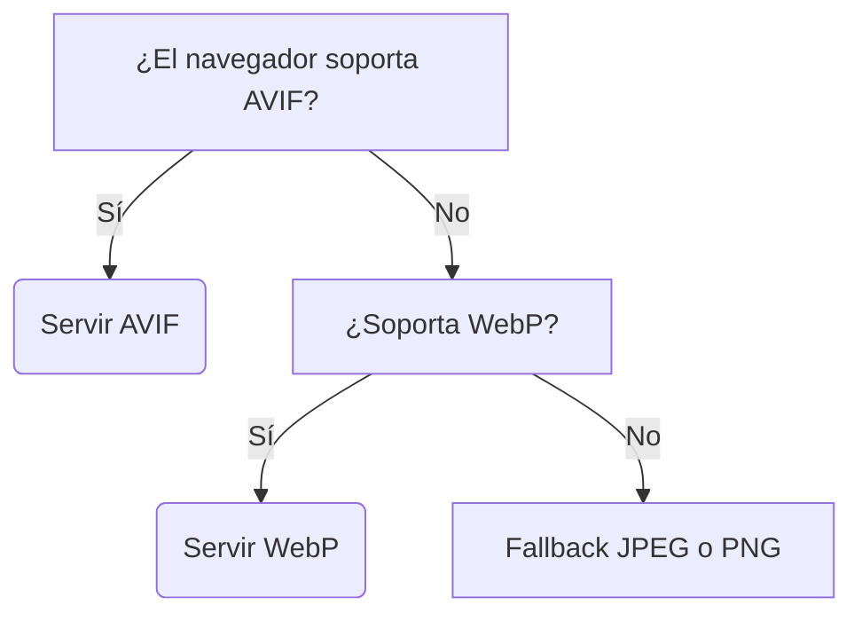
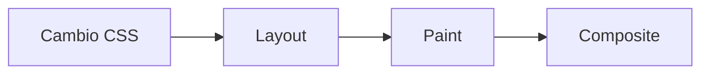
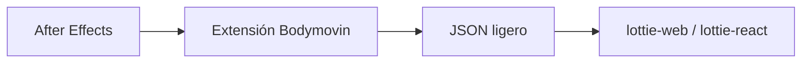

# Diseño de Interfaces Web

## Unidad 12 · Multimedia Web

**Módulo 0615 · Diseño de Interfaces Web**  
CFGS Desarrollo de Aplicaciones Web (DAW)

---

## Objetivos de aprendizaje · I

<div style="font-size: 0.85rem; text-align: left;">
<ul>
  <li><span class="fragment">Seleccionar el <strong>formato de imagen</strong> adecuado (JPEG, PNG, SVG, WebP, AVIF) justificando compresión, transparencia, escalabilidad y rendimiento</span></li>
  <li><span class="fragment">Optimizar imágenes: compresión, redimensionamiento y carga diferida (<code>Squoosh</code>, <code>Sharp</code>, <code>loading="lazy"</code>, <code>decoding="async"</code>)</span></li>
  <li><span class="fragment">Implementar imágenes responsive con <code>srcset</code>, <code>sizes</code> y <code>&lt;picture&gt;</code></span></li>
  <li><span class="fragment">Integrar <strong>audio</strong> con <code>&lt;audio&gt;</code> y elegir formato según compatibilidad (MP3, AAC, OGG)</span></li>
</ul>
</div>

Note: Insistid en que estos objetivos se corresponden uno a uno con los criterios de evaluación 4.a a 4.e del currículo. Pregunta para romper el hielo: ¿cuántos habéis comprimido alguna vez una imagen a mano? Hoy veréis que casi todo se puede automatizar.

---

## Objetivos de aprendizaje · II

<div style="font-size: 0.85rem; text-align: left;">
<ul>
  <li><span class="fragment">Integrar <strong>vídeo</strong> con <code>&lt;video&gt;</code>, subtítulos <code>&lt;track&gt;</code> (WebVTT) y embedding responsive (YouTube, Vimeo)</span></li>
  <li><span class="fragment">Crear animaciones CSS con <code>@keyframes</code> y transiciones: curvas de easing y propiedades aceleradas por GPU</span></li>
  <li><span class="fragment">Desarrollar animaciones SVG (CSS, <code>stroke-dasharray</code>) y con <strong>Lottie</strong>/Bodymovin</span></li>
  <li><span class="fragment">Aplicar buenas prácticas de rendimiento: <code>will-change</code>, <code>prefers-reduced-motion</code>, <code>requestAnimationFrame</code></span></li>
  <li><span class="fragment">Diseñar <strong>microinteracciones</strong> útiles y analizar estrategias multimedia de sitios profesionales</span></li>
</ul>
</div>

Note: Señalad que esta unidad conecta con el módulo de Desarrollo Web en Entorno Cliente (interacciones complejas con JavaScript) y con el de Servidor (subida y almacenamiento de archivos). Aquí el multimedia no es "pegar un vídeo", sino gestionar todo el ciclo de vida del recurso.

---

## Contexto: Resultado de Aprendizaje 4

<div style="font-size: 0.85rem; text-align: left;">
<p><span class="fragment">RA 4 (currículo andaluz · módulo 0615): <em>"integrar contenido multimedia en las interfaces web, aplicando criterios de usabilidad y accesibilidad"</em></span></p>
<ul>
  <li><span class="fragment"><strong>CE 4.a</strong> identificar los formatos de archivo multimedia adecuados para la web</span></li>
  <li><span class="fragment"><strong>CE 4.b</strong> aplicar técnicas de optimización para reducir su peso</span></li>
  <li><span class="fragment"><strong>CE 4.c</strong> integrar elementos multimedia con las etiquetas HTML apropiadas</span></li>
  <li><span class="fragment"><strong>CE 4.d</strong> aplicar accesibilidad: alternativas textuales y subtítulos</span></li>
  <li><span class="fragment"><strong>CE 4.e</strong> verificar la visualización en diferentes navegadores y dispositivos</span></li>
</ul>
<p><span class="mini">Conecta con DWEC (interacciones multimedia complejas con JS) y DWES (subida, almacenamiento y servicio de archivos).</span></p>
</div>

Note: Leed el RA 4 en voz alta y subrayad "usabilidad y accesibilidad": esas dos palabras atraviesan toda la unidad. El criterio 4.e es el que más se olvida en los proyectos: probar en dispositivos reales, no solo en el Chrome del portátil.

---

## Motivación: ¿pesa tu web?

<div style="font-size: 1rem;">
<p><span class="fragment">Las imágenes representan entre el <strong>50% y el 70%</strong> del peso total de una página web.</span></p>
</div>

<div style="display: grid; grid-template-columns: 1fr 1fr; gap: 0.6rem; font-size: 0.8rem; text-align: left;">
  <div class="fragment"><strong>GIF de 5 segundos:</strong> 3–8 MB<br><strong>Mismo contenido en MP4:</strong> 300–800 KB</div>
  <div class="fragment"><strong>Medium</strong> convierte GIFs a MP4 automáticamente:<br>5 MB → 500 KB sin pérdida visible</div>
</div>

<p style="font-size: 0.9rem;"><span class="fragment">¿Cómo consiguen <strong>Apple</strong>, <strong>Netflix</strong> y <strong>Medium</strong> webs llenas de multimedia y rápidas a la vez?</span></p>

Note: Abrid DevTools en una página lenta real y comparad la pestaña Network con una página optimizada: el impacto se ve solo. La pregunta sobre Apple dejadla abierta hasta los casos reales del final de la sesión.

---

## Formatos raster: JPEG y PNG

<div style="display: grid; grid-template-columns: 1fr 1fr; gap: 0.6rem; font-size: 0.8rem; text-align: left;">
  <div class="fragment">
    <strong>JPEG</strong> · con pérdida (lossy)<br>
    • Ratios de compresión 10:1 – 20:1<br>
    • Ideal: fotos, paisajes, retratos, gradientes<br>
    • Progresivo: borroso → nítido (percepción de velocidad)<br>
    • ✗ Sin transparencia ni animación
  </div>
  <div class="fragment">
    <strong>PNG</strong> · sin pérdida (lossless)<br>
    • Fidelidad absoluta al original<br>
    • Alpha: 256 niveles (PNG-24) o binaria (PNG-8)<br>
    • Ideal: capturas, logotipos, iconos, texto nítido<br>
    • ✗ Excesivo para fotografías
  </div>
</div>

Note: Pedid alos alumnos que adivinen el formato de varias imágenes antes de revelar la respuesta. El JPEG progresivo merece una demo en vivo: se muestra borroso y se va refinando, lo que mejora mucho la percepción de velocidad.

---

## Formatos modernos: SVG, WebP y AVIF

<div style="display: grid; grid-template-columns: 1fr 1fr 1fr; gap: 0.6rem; font-size: 0.75rem; text-align: left;">
  <div class="fragment">
    <strong>SVG</strong> · vectorial (XML)<br>
    • Escala infinitamente sin pérdida<br>
    • Es texto: editable, gzip, indexable<br>
    • Animable con CSS y JavaScript<br>
    • Iconos, logos, ilustraciones, gráficos
  </div>
  <div class="fragment">
    <strong>WebP</strong> · Google<br>
    • −25% a −35% vs JPEG<br>
    • Lossy + lossless + alpha + animación<br>
    • Soporte: 97% de navegadores<br>
    • ✗ Photoshop no lo soporta nativo
  </div>
  <div class="fragment">
    <strong>AVIF</strong> · basado en códec AV1<br>
    • −20% a −30% adicional vs WebP<br>
    • HDR, color de 12 bits<br>
    • Soporte &gt; 93%<br>
    • Rendimiento sobre compatibilidad
  </div>
</div>

Note: WebP ya es apuesta segura en proyectos nuevos; AVIF es el futuro pero exige fallback. Recordad que Can I Use permite comprobar el soporte de cualquier formato en tiempo real, dato a dato.

---

## Estrategia: servir el formato óptimo



```html
<picture>
  <source srcset="foto.avif" type="image/avif">
  <source srcset="foto.webp" type="image/webp">
  
</picture>
```

<p style="font-size: 0.85rem;"><span class="fragment">Resultado: <strong>−50% a −70% de peso</strong> sin pérdida visual apreciable.</span></p>

Note: Esta cascada es el patrón estándar de la industria. Sin <picture>, servir solo AVIF rompería las imágenes en navegadores que no lo soportan. Haced probar la cascada en DevTools bloqueando formatos para que vean qué fuente elige cada navegador.

---

## Optimización de imágenes

<div style="font-size: 0.85rem; text-align: left;">
<ul>
  <li><span class="fragment"><strong>Dimensiones correctas:</strong> si se muestra a 400 px, no cargar 2000 px</span></li>
  <li><span class="fragment"><strong>Compresión lossy:</strong> descarta información visual que el ojo apenas percibe</span></li>
  <li><span class="fragment"><strong>Compresión lossless:</strong> reorganiza datos, elimina metadatos EXIF, reduce paleta (PNG-8)</span></li>
</ul>
</div>

<div style="display: grid; grid-template-columns: 1fr 1fr; gap: 0.6rem; font-size: 0.8rem; text-align: left;">
  <div class="fragment"><strong>Squoosh</strong> — online, visual, comparación lado a lado</div>
  <div class="fragment"><strong>TinyPNG</strong> — compresión automática PNG/JPEG</div>
  <div class="fragment"><strong>ImageOptim</strong> — escritorio</div>
  <div class="fragment"><strong>Sharp</strong> — Node.js: lotes y automatización (Vite, Webpack)</div>
</div>

Note: El error más común en proyectos de alumnos es servir fotos a tamaño de cámara. Squoosh es perfecto para una demo rápida: ajustad la calidad y observad cómo cambia el peso en tiempo real frente al original.

---

## Carga diferida y priorización

<div style="font-size: 0.85rem; text-align: left;">
<ul>
  <li><span class="fragment"><code>loading="lazy"</code> — pospone la carga hasta acercarse al viewport (<code>&lt;img&gt;</code> e <code>&lt;iframe&gt;</code>)</span></li>
  <li><span class="fragment"><code>decoding="async"</code> — decodifica en segundo plano sin bloquear el renderizado</span></li>
  <li><span class="fragment"><code>fetchpriority="high"</code> — imagen héroe: mejora la métrica <strong>LCP</strong></span></li>
  <li><span class="fragment"><code>fetchpriority="low"</code> — recursos no críticos no compiten por ancho de banda</span></li>
  <li><span class="fragment"><strong>Intersection Observer</strong> — control avanzado de carga bajo demanda</span></li>
</ul>
</div>

<p style="font-size: 0.8rem;"><span class="fragment">Impacto directo en <strong>Core Web Vitals</strong>: LCP (Largest Contentful Paint) y CLS (Cumulative Layout Shift).</span></p>

Note: fetchpriority="high" en la imagen héroe es una de las mejoras de LCP más baratas que existen. Explicad también que lazy loading no sirve de nada en imágenes dentro del viewport inicial: solo aplícalo a lo que está debajo del pliegue.

---

## SVG en profundidad

<div style="font-size: 0.85rem; text-align: left;">
<ul>
  <li><span class="fragment">Primitivas geométricas: <code>rect</code>, <code>circle</code>, <code>ellipse</code>, <code>line</code>, <code>polygon</code>, <code>path</code>, <code>text</code></span></li>
  <li><span class="fragment">Creación: <strong>Inkscape</strong> (gratis), <strong>Illustrator</strong> (profesional), <strong>Figma</strong> (colaborativo) o XML a mano</span></li>
  <li><span class="fragment"><strong>SVGO</strong>: elimina metadatos, comentarios y precisión innecesaria → <strong>−20% a −50%</strong> de peso</span></li>
  <li><span class="fragment">Al ser texto: se edita con cualquier editor, se comprime con gzip y lo indexan los buscadores</span></li>
</ul>
</div>

Note: SVG es el único formato que se puede estilizar y animar como si fuera HTML. Recomendad SVGOMG como forma rápida de optimizar sin instalar nada: subes el archivo y ves el ahorro al instante.

---

## Métodos de inserción de SVG

<div style="font-size: 0.9rem;">
<table>
  <thead>
    <tr><th>Método</th><th>Ventaja</th><th>Límite</th></tr>
  </thead>
  <tbody>
    <tr><td><strong>Inline</strong> (pegar el XML)</td><td>Acceso a cada elemento interno con CSS/JS · el más potente</td><td>Repite código en el HTML</td></tr>
    <tr><td><code>&lt;img src="icono.svg"&gt;</code></td><td>Simple y cacheable</td><td>No manipula elementos internos</td></tr>
    <tr><td><code>background-image</code></td><td>Igual que <code>&lt;img&gt;</code></td><td>Sin semántica ni <code>alt</code></td></tr>
    <tr><td><code>&lt;object&gt;</code></td><td>Externo con cierto nivel de interacción</td><td>Comportamiento inconsistente entre navegadores</td></tr>
  </tbody>
</table>
</div>

Note: La elección del método determina lo que podréis hacer después: si queréis animar el icono con CSS, tiene que ser inline. Si es un logo simple,  basta y además se beneficia de la caché del navegador.

---

## Sprites SVG

<div style="font-size: 0.85rem; text-align: left;">
<ul>
  <li><span class="fragment"><code>&lt;symbol&gt;</code> + <code>&lt;use&gt;</code>: definir un icono una vez y referenciarlo muchas veces</span></li>
  <li><span class="fragment">Menos peticiones HTTP y mantenimiento centralizado</span></li>
  <li><span class="fragment"><code>fill: currentColor</code> → el icono hereda el color del texto del padre</span></li>
</ul>
</div>

```html
<svg style="display: none;" aria-hidden="true">
  <symbol id="icon-home" viewBox="0 0 24 24">
    <path d="M12 3L4 9v12h5v-7h6v7h5V9z"/>
  </symbol>
</svg>
<svg class="icon"><use href="#icon-home"/></svg>
```

Note: Demostrad en clase cómo cambiar el color del icono cambiando solo el color del contenedor: esa es la magia de currentColor. Elimina la necesidad de duplicar archivos por cada color.

---

## Imágenes responsive avanzadas

<div style="font-size: 0.85rem; text-align: left;">
<ul>
  <li><span class="fragment"><code>srcset</code>: descriptores <code>w</code> (ancho intrínseco) y <code>x</code> (densidad de píxeles)</span></li>
  <li><span class="fragment"><code>sizes</code>: ancho de renderizado según condiciones de media</span></li>
  <li><span class="fragment"><code>&lt;picture&gt;</code> + varios <code>&lt;source&gt;</code>: distintos formatos y recortes (<strong>art direction</strong>)</span></li>
  <li><span class="fragment"><code>image-set()</code>: imágenes de fondo responsive por resolución y formato</span></li>
</ul>
</div>

```html

```

Note: La art direction es la gran ventaja de <picture>: no solo cambia el tamaño, sino la composición. En móvil a veces interesa mostrar otra parte de la imagen, no solo una versión más pequeña.

---

## Audio en la web

<div style="font-size: 0.9rem;">
<table>
  <thead>
    <tr><th>Formato</th><th>Características</th><th>Compatibilidad</th></tr>
  </thead>
  <tbody>
    <tr><td><strong>MP3</strong></td><td>El más universal, buena compresión</td><td>Todos los navegadores</td></tr>
    <tr><td><strong>AAC</strong></td><td>Mejor calidad a igual bitrate (preferido por Apple)</td><td>Todos los navegadores</td></tr>
    <tr><td><strong>OGG Vorbis</strong></td><td>Abierto, sin patentes</td><td>Firefox, Chrome · ✗ Safari</td></tr>
    <tr><td><strong>WAV</strong></td><td>Sin compresión, archivos enormes</td><td>Todos (solo si es imprescindible)</td></tr>
  </tbody>
</table>
</div>

<div style="font-size: 0.8rem; text-align: left;">
<ul>
  <li><span class="fragment">Atributos: <code>controls</code>, <code>autoplay</code> (bloqueado sin <code>muted</code>), <code>loop</code>, <code>muted</code>, <code>preload</code> (none / metadata / auto)</span></li>
  <li><span class="fragment">Múltiples <code>&lt;source&gt;</code>: primero OGG (más ligero), luego MP3 (compatibilidad universal)</span></li>
  <li><span class="fragment">Accesibilidad: transcripción cerca del reproductor, identificando quién habla en podcasts</span></li>
</ul>
</div>

Note: Pregunta para el aula: ¿por qué poner OGG antes si MP3 funciona en todas partes? Porque el navegador descarga la primera fuente que soporta: poner la más ligera primero ahorra ancho de banda donde es compatible.

---

## Vídeo en la web

<div style="font-size: 0.85rem; text-align: left;">
<ul>
  <li><span class="fragment"><strong>Contenedor</strong> (el archivo): MP4, WebM, OGG · agrupa pistas de vídeo, audio y subtítulos</span></li>
  <li><span class="fragment"><strong>Códec</strong> (el algoritmo): H.264, VP8/VP9, AV1, Theora · comprime cada pista</span></li>
  <li><span class="fragment">MP4 = H.264 + AAC → todos los navegadores · WebM = VP8/VP9 + Opus → mejor compresión (Safari desde 2021)</span></li>
  <li><span class="fragment">Atributos: <code>controls</code>, <code>poster</code>, <code>preload</code>, <code>autoplay</code> + <code>muted</code> + <code>playsinline</code></span></li>
</ul>
</div>

```html
<video controls poster="poster.jpg" preload="metadata">
  <source src="video.webm" type="video/webm">
  <source src="video.mp4" type="video/mp4">
  <track kind="subtitles" src="subtitulos-es.vtt" srclang="es" default>
  <p>Tu navegador no soporta vídeo HTML5.</p>
</video>
```

Note: Confundir contenedor y códec es la pregunta clásica de examen: MP4 es la caja, H.264 es el compresor que hay dentro. La recomendación práctica es ofrecer siempre WebM primero y MP4 como fallback.

---

## Optimización de vídeo

<div style="font-size: 0.85rem; text-align: left;">
<ul>
  <li><span class="fragment"><strong>FFmpeg</strong>: escala resolución (1080p / 720p / 480p), ajusta bitrate, extrae el <code>poster</code></span></li>
  <li><span class="fragment">CRF H.264 (0–51): <strong>18</strong> casi sin pérdida · <strong>23</strong> recomendado para web · <strong>28</strong> móvil · VP9 usa 30 (escala 0–63)</span></li>
  <li><span class="fragment"><code>-movflags +faststart</code> → el vídeo reproduce antes de descargarse por completo</span></li>
  <li><span class="fragment"><strong>Streaming adaptativo:</strong> HLS (Apple) y DASH (estándar) — segmentos con varias calidades según la conexión</span></li>
  <li><span class="fragment"><strong>CDN</strong> → menos latencia y mejor experiencia global</span></li>
</ul>
</div>

<p style="font-size: 0.7rem;"><span class="mini"><code>ffmpeg -i original.mp4 -vf "scale=1280:-2" -c:v libx264 -crf 23 -preset medium -c:a aac -b:a 128k -movflags +faststart web-720p.mp4</code></span></p>

Note: FFmpeg intimida, pero tres comandos cubren el 90% de las necesidades: comprimir, escalar y extraer poster. faststart es esencial porque mueve el índice del archivo al principio, permitiendo reproducir antes.

---

## Embedding responsive (YouTube / Vimeo)

<div style="font-size: 0.85rem; text-align: left;">
<ul>
  <li><span class="fragment"><strong>Truco del padding-bottom: 56.25%</strong> (9/16) → relación de aspecto 16:9 fija a cualquier ancho</span></li>
  <li><span class="fragment">Parámetros de URL: <code>rel=0</code>, <code>modestbranding=1</code>, <code>start=30</code></span></li>
  <li><span class="fragment">Privacidad: <code>youtube-nocookie.com</code> → sin cookies de seguimiento hasta reproducir</span></li>
  <li><span class="fragment"><code>loading="lazy"</code> en el <code>&lt;iframe&gt;</code></span></li>
</ul>
</div>

```css
.video-container {
  position: relative;
  padding-bottom: 56.25%; /* 16:9 */
  height: 0;
  overflow: hidden;
}
.video-container iframe {
  position: absolute;
  top: 0;
  left: 0;
  width: 100%;
  height: 100%;
  border: none;
}
```

Note: El truco funciona para cualquier proporción: dividid altura entre ancho y multiplicad por 100 (para 4:3 sería 75%). Usar youtube-nocookie es hoy un requisito básico de cumplimiento RGPD.

---

## Accesibilidad multimedia

<div style="font-size: 0.85rem; text-align: left;">
<ul>
  <li><span class="fragment">Marco legal: <strong>RD 1112/2018</strong> (España) ← Directiva Europea <strong>2016/2102</strong></span></li>
  <li><span class="fragment"><code>&lt;track kind="subtitles"&gt;</code> + archivos <strong>WebVTT</strong> (cabecera <code>WEBVTT</code>, tiempos <code>HH:MM:SS.mmm</code>, bloques separados por línea en blanco)</span></li>
  <li><span class="fragment"><code>kind="descriptions"</code> → narra lo visual para personas ciegas · <code>kind="chapters"</code> → navegación por secciones</span></li>
  <li><span class="fragment">Transcripción completa junto al reproductor → accesibilidad + <strong>SEO</strong></span></li>
  <li><span class="fragment">Los subtítulos también ayudan en entornos ruidosos o sin auriculares</span></li>
  <li><span class="fragment">Imágenes decorativas: <code>alt=""</code> (vacío, no ausente) para que los lectores las ignoren</span></li>
</ul>
</div>

Note: Los subtítulos no son solo para personas sordas: gran parte del consumo de vídeo en redes sociales se hace sin sonido. El validador del W3C comprueba los archivos WebVTT en segundos; hacedlo con un ejemplo mal formado para ver los errores típicos.

---

## CSS Transitions

<div style="font-size: 0.85rem; text-align: left;">
<ul>
  <li><span class="fragment">Suavizan el cambio entre <strong>dos estados</strong> de un elemento</span></li>
  <li><span class="fragment">Sintaxis: <code>transition: propiedad duración timing-function retraso</code></span></li>
  <li><span class="fragment">Disparadores: <code>:hover</code>, <code>:focus</code>, añadir/quitar clase con JavaScript</span></li>
  <li><span class="fragment"><code>transform</code> y <code>opacity</code>: las más eficientes (solo composición por GPU)</span></li>
</ul>
</div>

```css
.dropdown__menu {
  opacity: 0;
  transform: translateY(-10px);
  pointer-events: none;
  transition: opacity 0.25s, transform 0.25s;
}
.dropdown:hover .dropdown__menu {
  opacity: 1;
  transform: translateY(0);
  pointer-events: auto;
}
```

Note: La diferencia clave con las animaciones: las transiciones reaccionan a cambios de estado, los keyframes corren por sí solos. El pointer-events: none es imprescindible para que el menú oculto no intercepte clics.

---

## CSS Animations y easing

<div style="font-size: 0.85rem; text-align: left;">
<ul>
  <li><span class="fragment"><code>@keyframes</code>: estados intermedios por porcentaje (0% → 100%), independientes de eventos</span></li>
  <li><span class="fragment">Propiedades: <code>name</code>, <code>duration</code>, <code>delay</code>, <code>timing-function</code>, <code>iteration-count</code>, <code>direction</code>, <code>fill-mode</code>, <code>play-state</code></span></li>
  <li><span class="fragment">Easing: <code>linear</code>, <code>ease</code> (defecto), <code>ease-in</code>, <code>ease-out</code>, <code>ease-in-out</code></span></li>
  <li><span class="fragment"><code>cubic-bezier()</code> para curvas personalizadas · <code>steps()</code> para saltos discretos (sprites fotograma a fotograma)</span></li>
</ul>
</div>

```css
.spinner {
  border: 4px solid #e0e0e0;
  border-top: 4px solid #6c5ce7;
  border-radius: 50%;
  animation: spin 0.8s linear infinite;
}
@keyframes spin {
  to { transform: rotate(360deg); }
}
```

Note: Haced experimentar con cubic-bezier usando un editor de curvas visual en el navegador: ver la curva mientras cambias el movimiento fija el concepto. steps() es perfecto para explicar animaciones sprite, como un personaje caminando.

---

## Rendimiento en animaciones



<div style="font-size: 0.8rem; text-align: left;">
<ul>
  <li><span class="fragment"><code>width</code>, <code>height</code>, <code>margin</code>, <code>padding</code> → fuerzan las 3 etapas (las más costosas)</span></li>
  <li><span class="fragment"><code>transform</code> y <code>opacity</code> → solo Composite, en capa separada de la <strong>GPU</strong> ✓</span></li>
  <li><span class="fragment"><code>will-change: transform, opacity</code> → crea la capa anticipadamente (uso moderado: consume memoria)</span></li>
  <li><span class="fragment"><code>requestAnimationFrame</code> → animaciones JS sincronizadas con el refresco de pantalla</span></li>
</ul>
</div>

```css
@media (prefers-reduced-motion: reduce) {
  * {
    animation-duration: 0.01ms !important;
    animation-iteration-count: 1 !important;
    transition-duration: 0.01ms !important;
  }
}
```

Note: La regla de oro: si podéis animarlo con transform u opacity, hacedlo así. will-change no es varita mágica: cada capa GPU consume memoria, así que aplicadlo solo cuando la animación sea inminente. prefers-reduced-motion afecta a unos 5% de usuarios y es requisito WCAG 2.2.

---

## Lottie: animaciones vectoriales



<div style="font-size: 0.85rem; text-align: left;">
<ul>
  <li><span class="fragment">Librería de código abierto de <strong>Airbnb</strong>: renderiza animaciones de After Effects en tiempo real</span></li>
  <li><span class="fragment">Pocos KB frente a cientos de KB o MB de un GIF o vídeo equivalente</span></li>
  <li><span class="fragment">Vectorial (escala infinita) e <strong>interactiva</strong>: reproducción, velocidad y dirección programables</span></li>
  <li><span class="fragment">La usan <strong>Uber</strong>, <strong>Google Pay</strong>, <strong>Duolingo</strong>: iconos animados, pantallas de carga, onboarding</span></li>
</ul>
</div>

Note: Lottie ha democratizado la animación profesional: el diseñador exporta desde After Effects y el desarrollador solo incrusta un JSON. Comparad en clase el peso de una animación de LottieFiles con el GIF equivalente: la diferencia suele ser de 10 a 100 veces.

---

## Microinteracciones

<p style="font-size: 0.9rem;"><span class="fragment">Feedback breve y puntual que <strong>mejora la usabilidad</strong> sin sobrecargar la interfaz.</span></p>

<div style="display: grid; grid-template-columns: 1fr 1fr; gap: 0.6rem; font-size: 0.8rem; text-align: left;">
  <div class="fragment"><strong>Botón like animado</strong> — confirmación de acción (pop con scale)</div>
  <div class="fragment"><strong>Toasts / notificaciones</strong> — entrada por translateX, salida automática</div>
  <div class="fragment"><strong>Pull-to-refresh</strong> — giro del icono durante la recarga</div>
  <div class="fragment"><strong>Skeleton loaders</strong> — placeholders con gradiente animado (shimmer)</div>
  <div class="fragment"><strong>Confirmación visual</strong> — botón que cambia a «✓ Guardado»</div>
  <div class="fragment"><strong>Toggle switch</strong> — deslizamiento con cubic-bezier elástico</div>
</div>

Note: El criterio para decidir si una microinteracción es buena es simple: ¿comunica algo? Debe comunicar un cambio de estado, guiar la atención o dar feedback. Si distrae o molesta en usos repetidos, se quita.

---

## Ejemplo: galería optimizada

```html
<div class="gallery__item"> <!-- aspect-ratio: 4/3 evita CLS -->
  <picture>
    <source srcset="foto-400.webp 400w, foto-800.webp 800w, foto-1200.webp 1200w"
            sizes="(max-width: 600px) 100vw, (max-width: 900px) 50vw, 33vw"
            type="image/webp">
    
  </picture>
</div>
```

<div style="font-size: 0.8rem; text-align: left;">
<ul>
  <li><span class="fragment">Placeholder con <code>aspect-ratio</code> → reserva espacio, cero layout shift</span></li>
  <li><span class="fragment">Fade-in al terminar de cargar: <code>opacity: 0 → 1</code> con transición de 0.4 s</span></li>
</ul>
</div>

Note: Resaltad la triple protección: placeholder con aspect-ratio (sin CLS), lazy loading (ahorro de ancho de banda) y fade-in (pulido). Todo se puede verificar en las pestañas Network y Rendimiento de DevTools.

---

## Ejemplo: audio y vídeo accesibles

```html
<audio controls preload="metadata">
  <source src="audio.ogg" type="audio/ogg">
  <source src="audio.mp3" type="audio/mpeg">
  <p>Tu navegador no soporta audio HTML5.</p>
</audio>

<video controls poster="video-poster.jpg" preload="metadata" crossorigin="anonymous">
  <source src="video.webm" type="video/webm">
  <source src="video.mp4" type="video/mp4">
  <track kind="subtitles" src="subtitulos-es.vtt" srclang="es" label="Español" default>
  <track kind="descriptions" src="descripciones-es.vtt" srclang="es">
</video>
```

<div style="font-size: 0.8rem; text-align: left;">
<ul>
  <li><span class="fragment">WebVTT: cabecera <code>WEBVTT</code> + <code>00:00:01.000 --&gt; 00:00:04.000</code> + texto</span></li>
  <li><span class="fragment">Transcripción textual completa bajo el reproductor → accesibilidad + SEO</span></li>
  <li><span class="fragment">Embedding YouTube: mismo contenedor 56.25% + <code>youtube-nocookie.com</code></span></li>
</ul>
</div>

Note: crossorigin="anonymous" es necesario para que los subtítulos funcionen en algunos servidores. La transcripción bajo el reproductor es lo que marca la diferencia entre "cumplir" y ser realmente accesible: también ayuda al SEO.

---

## Ejemplo: animaciones CSS reutilizables

```css
/* Spinner: solo CSS, sin imágenes ni JS */
.spinner {
  width: 50px; height: 50px;
  border: 4px solid #e0e0e0;
  border-top: 4px solid #6c5ce7;
  border-radius: 50%;
  animation: spin 0.8s linear infinite;
}
@keyframes spin { to { transform: rotate(360deg); } }
/* Puntos: delays escalonados */
.dot:nth-child(2) { animation-delay: 0.16s; }
.dot:nth-child(3) { animation-delay: 0.32s; }
/* Skeleton: gradiente desplazado */
.skeleton {
  background: linear-gradient(90deg, #e0e0e0 25%, #f0f0f0 50%, #e0e0e0 75%);
  background-size: 200% 100%;
  animation: shimmer 1.5s ease-in-out infinite;
}
@keyframes shimmer { from { background-position: 200% 0; } to { background-position: -200% 0; } }
```

<p style="font-size: 0.8rem;"><span class="fragment">También: <code>fade-in</code>, <code>slide-in-left/up</code>, <code>pulse</code> (CTA), <code>shake</code> (errores) y botón like con animación <code>likePop</code>.</span></p>

Note: Estos fragmentos forman un "kit de inicio" reutilizable para cualquier proyecto. Discutid cuándo usar cada loader: spinner para acciones del sistema, skeleton para carga de páginas y puntos para procesos breves.

---

## Ejemplo: SVG que se dibuja solo

```css
.draw-path {
  stroke: #58a6ff;
  stroke-width: 3;
  fill: none;
  stroke-linecap: round;
  stroke-dasharray: var(--path-length);
  stroke-dashoffset: var(--path-length); /* invisible */
  animation: drawLine 3s ease-in-out forwards;
}
@keyframes drawLine {
  to { stroke-dashoffset: 0; } /* totalmente visible */
}
```

```javascript
// Medimos la longitud real de cada trazado
document.querySelectorAll('.draw-path').forEach(path => {
  const length = path.getTotalLength();
  path.style.setProperty('--path-length', length);
});
```

<p style="font-size: 0.8rem;"><span class="fragment">Usos: logotipos animados, ilustraciones reveladas y gráficos de progreso (75% de un círculo de circunferencia 283 → offset 71).</span></p>

Note: getTotalLength() os ahorra calcular perímetros a mano. El gráfico de progreso circular es un buen ejercicio para casa: la circunferencia es 2πr y el offset visible es proporcional al porcentaje.

---

## Casos reales

<div style="display: grid; grid-template-columns: 1fr 1fr 1fr; gap: 0.6rem; font-size: 0.75rem; text-align: left;">
  <div class="fragment">
    <strong>Apple</strong><br>
    • <code>&lt;picture&gt;</code> AVIF + JPEG, carga progresiva con Intersection Observer<br>
    • Héroe: vídeo <code>autoplay muted loop playsinline</code><br>
    • Sprite sheet animada con scroll → producto "girando" en 3D<br>
    • <code>alt</code> descriptivos escritos por especialistas
  </div>
  <div class="fragment">
    <strong>Netflix</strong><br>
    • &gt;20 versiones por título (240p → 4K HDR, AV1/H.264/HEVC)<br>
    • Streaming adaptativo DASH según la conexión<br>
    • Carátulas AVIF/WebP con <code>lazy</code> + <code>async</code><br>
    • Hover: <code>scale(1.1)</code> sin afectar al layout
  </div>
  <div class="fragment">
    <strong>Medium</strong><br>
    • LQIP: JPEG ~200 bytes en base64 → efecto blur-up<br>
    • GIFs convertidos a MP4: 5 MB → 500 KB<br>
    • Aplausos con confeti, lightbox con zoom<br>
    • Modo oscuro ajusta brillo de las imágenes
  </div>
</div>

Note: Estas tres empresas aplican prácticamente todo lo visto en la unidad: formatos modernos, carga diferida, animaciones GPU y respeto a reduced-motion. Proponed usarlas como checklist para auditar vuestros propios proyectos.

---

## Actividad en clase: optimizar una galería

<div style="font-size: 0.85rem; text-align: left;">
<ul>
  <li><span class="fragment"><strong>Objetivo:</strong> transformar una galería sin optimizar (JPEG a 4000 px, sin lazy loading) en una profesional</span></li>
  <li><span class="fragment"><strong>Tiempo:</strong> 45 min · parejas · práctica guiada paso a paso</span></li>
  <li><span class="fragment"><strong>Entregable:</strong> galería optimizada + informe antes/después (peso total y puntuación Lighthouse móvil)</span></li>
</ul>
</div>

<div style="font-size: 0.75rem; text-align: left;">
<p><span class="fragment">Pasos: Squoosh → WebP a 400/800/1200 px (calidad 75%) · <code>&lt;picture&gt;</code> con fallback JPEG · <code>srcset</code> + <code>sizes</code> · <code>loading="lazy"</code> + <code>decoding="async"</code> · <code>width</code>/<code>height</code> anti-CLS.</span></p>
<p><span class="mini">Proyectos propuestos: portafolio fotográfico · plataforma de podcast · logo animado de startup · microinteracciones de to-do · vídeo corporativo. Ampliación: pipeline Sharp+SVGO+FFmpeg, estudio SSIM de formatos, componente Lottie interactivo.</span></p>
</div>

Note: Circulad por las parejas y comprobad que miden el peso real antes y después: ese número es el aprendizaje verdadero. La puntuación Lighthouse en móvil debería mejorar de forma notable tras la optimización.

---

## Buenas prácticas

<div style="display: grid; grid-template-columns: 1fr 1fr; gap: 0.5rem; font-size: 0.75rem; text-align: left;">
  <div class="fragment">✅ <code>&lt;picture&gt;</code>: AVIF → WebP → JPEG/PNG (−50–70% de peso)</div>
  <div class="fragment">✅ Siempre <code>alt</code>; decorativas con <code>alt=""</code></div>
  <div class="fragment">✅ Nunca <code>autoplay</code> sin <code>muted</code>; <code>playsinline</code> en iOS</div>
  <div class="fragment">✅ Anima solo <code>transform</code> y <code>opacity</code></div>
  <div class="fragment">✅ <code>prefers-reduced-motion</code> siempre (WCAG 2.2, ~5% de usuarios)</div>
  <div class="fragment">✅ <code>loading="lazy"</code> fuera del viewport + <code>fetchpriority="high"</code> en el LCP</div>
  <div class="fragment">✅ Subtítulos y transcripciones en todo audio y vídeo</div>
  <div class="fragment">✅ Comprime siempre: Squoosh, Sharp, plugins de build</div>
  <div class="fragment">✅ SVG en vez de fuentes de iconos (<code>currentColor</code>, <code>&lt;use&gt;</code>)</div>
  <div class="fragment">✅ Mide con Lighthouse: presupuestos (página ≤ 1,5 MB, imágenes ≤ 500 KB)</div>
</div>

Note: Estas diez reglas son la checklist de la unidad. Proponed imprimirlas y tenerlas a mano durante el proyecto de portafolio. El punto de reduced-motion no es opcional: WCAG 2.2 lo convierte en requisito de accesibilidad.

---

## Errores frecuentes

<div style="display: grid; grid-template-columns: 1fr 1fr; gap: 0.5rem; font-size: 0.75rem; text-align: left;">
  <div class="fragment">❌ Imagen de 4000 px mostrada en un contenedor de 400 px</div>
  <div class="fragment">❌ JPEG para todo: texto, transparencias y bordes nítidos sufren</div>
  <div class="fragment">❌ Autoplay con sonido sin consentimiento del usuario</div>
  <div class="fragment">❌ Olvidar <code>width</code>/<code>height</code> → layout shift y peor CLS</div>
  <div class="fragment">❌ Animar <code>width</code>, <code>top/left</code>, <code>box-shadow</code> → jank en móvil</div>
  <div class="fragment">❌ Vídeos en iOS sin <code>playsinline</code> → pantalla completa forzada</div>
  <div class="fragment">❌ GIFs en vez de vídeo: 3–8 MB vs 300–800 KB, 256 colores</div>
  <div class="fragment">❌ WebVTT mal formado: sin cabecera o tiempos incorrectos</div>
  <div class="fragment">❌ Solo WebP/AVIF sin fallback → imágenes rotas en algunos navegadores</div>
  <div class="fragment">❌ Animaciones sin propósito que distraen del contenido</div>
</div>

Note: Leed cada error y preguntad a la clase si lo han cometido alguna vez: casi todos, sí. El caso GIF vs vídeo es el más dramático para memorizar: el mismo contenido pesa hasta 10 veces menos en MP4.

---

## Resumen · Conceptos clave

<div style="font-size: 0.85rem; text-align: left;">
<ul>
  <li><span class="fragment">🎯 El formato correcto es una <strong>decisión de diseño</strong> con impacto directo en el rendimiento</span></li>
  <li><span class="fragment">🎯 <code>&lt;picture&gt;</code> + <code>srcset</code> + <code>sizes</code>: imprescindibles, no opcionales</span></li>
  <li><span class="fragment">🎯 La accesibilidad multimedia (<code>alt</code>, subtítulos, transcripciones) es un <strong>requisito</strong>, no una mejora</span></li>
  <li><span class="fragment">🎯 Animaciones: GPU (<code>transform</code>/<code>opacity</code>) + respeto a <code>prefers-reduced-motion</code></span></li>
  <li><span class="fragment">🎯 La optimización vive en el flujo de trabajo (build), no de última hora</span></li>
</ul>
</div>

<p style="font-size: 0.8rem;"><span class="fragment">Tendencia: AVIF desbanca progresivamente a JPEG y WebP · Lottie para animaciones complejas · automatización en el build.</span></p>

Note: Cerrad pidiendo a cada alumno que elija los dos conceptos clave que aplicará primero en su proyecto. Las tendencias (AVIF, Lottie, automatización) son justo lo que la industria busca en perfiles junior.

---

## Próximos pasos

<div style="font-size: 0.9rem; text-align: left;">
<ul>
  <li><span class="fragment">Terminar la actividad de la galería y subir el informe de Lighthouse antes/después</span></li>
  <li><span class="fragment">Para la próxima sesión: explorar <strong>LottieFiles</strong> y <strong>Squoosh</strong> con una imagen propia</span></li>
</ul>
</div>

<p style="font-size: 1rem;"><span class="fragment">Siguiente unidad: <strong>Unidad 13 · Interactividad Web</strong> — JavaScript para interacciones multimedia complejas.</span></p>

Note: Recordad que la unidad 13 retoma exactamente donde dejamos hoy: JavaScript toma el relevo de las APIs HTML5 y CSS que hemos preparado en esta unidad para construir interacciones complejas.

---

## ¿Preguntas?

<p style="font-size: 1rem;"><span class="fragment">Unidad 12 · Multimedia Web</span></p>
<p style="font-size: 0.85rem;"><span class="fragment">0615 · DAW · Curso 2025/2026</span></p>

Note: Dejad un rato para preguntas y recoged las dudas recurrentes para publicarlas en el foro del curso. Recordad la fecha de entrega de la galería optimizada antes de despediros.
