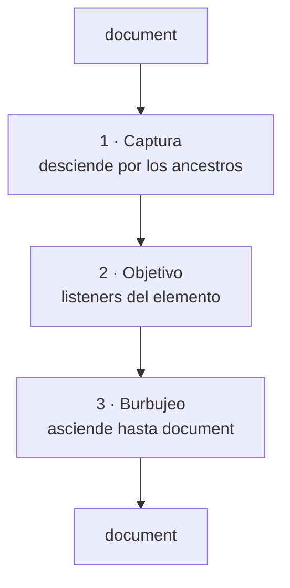
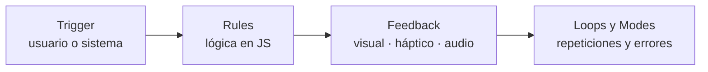

# Diseño de Interfaces Web

## Unidad 13 · Interactividad Web

**Módulo 0615 · Diseño de Interfaces Web**  
CFGS Desarrollo de Aplicaciones Web (DAW)

---

## Objetivos de aprendizaje I

- <span class="fragment">Comprender la **interactividad web** y distinguirla de la animación pasiva; valorar su impacto en la UX</span>
- <span class="fragment">Identificar y delegar **eventos JavaScript** (ratón, teclado, táctiles, formularios, scroll) con `{ once, passive, capture }`</span>
- <span class="fragment">Diseñar **microinteracciones** completas con el modelo de Dan Saffer: trigger, reglas, feedback, bucles/modos</span>
- <span class="fragment">Crear animaciones con **transiciones CSS**, `@keyframes` y la **Web Animations API**, eligiendo la técnica adecuada</span>

Note: Estos cuatro objetivos cubren los cimientos conceptuales y técnicos de la unidad. Pregunta a la clase cuáles dominan ya y cuáles les cuestan más para ajustar el ritmo. Insistid en que distinguir interactividad de mera animación es el hilo conductor de todo lo que veremos.

---

## Objetivos de aprendizaje II

- <span class="fragment">Construir **componentes interactivos completos**: carruseles, acordeones, tabs, modales, lightbox, formularios, toasts, dark mode, scroll reveal, drag & drop</span>
- <span class="fragment">Optimizar el rendimiento: **debounce, throttle, requestAnimationFrame, will-change, Intersection Observer**; fluidez a **60 fps**</span>
- <span class="fragment">Integrar **accesibilidad** en cada componente: foco, aria-live, trampas de foco, ARIA (`aria-expanded`, `aria-selected`, `aria-pressed`) → **WCAG 2.1 AA**</span>
- <span class="fragment">Evaluar críticamente la interactividad de sitios reales: **Twitter/X, Notion y Linear**</span>

Note: Aquí entran los objetivos aplicados: componentes completos, rendimiento y accesibilidad integrada desde el diseño. Recordad que la evaluación incluye código funcional, no solo teoría. Dato práctico: 60 fps significa menos de 16,67 ms por fotograma. Cierra preguntando cuántos han construido un modal o un carrusel desde cero.

---

## ¿Qué es la interactividad web?

<div style="display: grid; grid-template-columns: 1fr 1fr; gap: 0.6rem; font-size: 0.8rem; text-align: left;">
  <div class="fragment">
    <strong>Animación pasiva</strong><br>
    El usuario es <em>espectador</em>: banner en bucle, carrusel automático…
  </div>
  <div class="fragment">
    <strong>Interactividad</strong><br>
    El usuario es <em>agente activo</em>: causa → efecto → confirmación
  </div>
</div>

<span class="fragment">Ejemplo: botón «Me gusta» — clic → corazón rojo con latido + contador animado</span>

<span class="fragment"><span class="mini">Diálogo bidireccional usuario ↔ sistema en tiempo real</span></span>

Note: Empieza con una mano alzada: ¿quién me da un ejemplo de animación pasiva? El banner en bucle es el clásico. Luego pide ejemplos donde el usuario cause algo. La clave es la relación causa-efecto: en interactividad el sistema siempre confirma que la acción se procesó. Si la interfaz no responde, el usuario siente incertidumbre y duda de si su acción funcionó.

---

## Cinco funciones de la interactividad en UX

- <span class="fragment"><strong>Retroalimentación inmediata</strong> — elimina la incertidumbre</span>
- <span class="fragment"><strong>Guía la atención</strong> hacia lo importante</span>
- <span class="fragment"><strong>Reduce la carga cognitiva</strong> — comportamiento predecible y consistente</span>
- <span class="fragment"><strong>Aumenta la percepción de velocidad</strong> — un skeleton hace que 3 s parezcan 1 s</span>
- <span class="fragment"><strong>Satisfacción emocional</strong> — «diseño emocional» (Don Norman)</span>

Note: Estas cinco funciones se complementan entre sí. La más infravalorada es la percepción de velocidad: una pantalla congelada hace que incluso 500 ms parezcan una eternidad. Pregunta para el aula: ¿qué función cumple el indicador de «escribiendo…» de un chat? (Retroalimentación + percepción de velocidad.)

---

## Niveles de interactividad y modelo mental

- <span class="fragment"><strong>Reactiva:</strong> responde a una acción explícita (clic, arrastre, escritura)</span>
- <span class="fragment"><strong>Proactiva:</strong> anticipa necesidades (autocompletado, notificaciones contextuales)</span>
- <span class="fragment"><strong>Predictiva:</strong> predice con datos y patrones (recomendaciones, atajos, precarga)</span>

<span class="fragment"><strong>Ley de Jakob</strong> (Jakob Nielsen): los usuarios pasan más tiempo en otros sitios → prefieren que el nuestro funcione como los demás</span>

<span class="fragment"><span class="mini">Lupa = buscar · Tres rayas = menú · Botón 3D = clicable: alinea el diseño con el modelo mental del usuario</span></span>

Note: Lo reactivo es el mínimo indispensable; lo proactivo y lo predictivo se construyen sobre él. Cita el autocompletado de Google como proactividad y las recomendaciones de YouTube como predicción. La Ley de Jakob explica por qué inventar patrones propios es arriesgado: el usuario llega con expectativas formadas por cientos de sitios. Si hay que desviarse, compensa con affordances claros.

---

## Modelo de eventos del DOM



<span class="fragment"><span class="mini">Por defecto, <code>addEventListener</code> escucha en fase de burbujeo; <code>{ capture: true }</code> cambia la fase</span></span>

Note: Dibuja este flujo en la pizarra antes de mostrar el diagrama. Comprender las tres fases es imprescindible para entender la delegación de eventos y la opción capture. Pregunta: si hay listeners en padre e hijo, ¿cuál dispara primero en burbujeo? (El hijo.) Y en captura, ¿cuál va primero? (El padre.)

---

## Eventos de ratón y teclado

<div style="font-size: 0.9rem;">
<table>
  <tr><th>Evento</th><th>Dato clave</th></tr>
  <tr class="fragment"><td><code>click</code></td><td>Presionar + soltar sobre el mismo elemento; compone <code>mousedown</code> + <code>mouseup</code></td></tr>
  <tr class="fragment"><td><code>dblclick</code></td><td>Siempre precedido de dos <code>click</code>; cuidado con conflictos</td></tr>
  <tr class="fragment"><td><code>mouseenter/leave</code></td><td>No disparan desde hijos → preferibles a <code>mouseover/out</code></td></tr>
  <tr class="fragment"><td><code>keydown/keyup</code></td><td>Usa <code>keydown</code>: respuesta inmediata al presionar</td></tr>
  <tr class="fragment"><td><code>event.key</code></td><td>Valor lógico: «Enter», «ArrowUp» → interfaz</td></tr>
  <tr class="fragment"><td><code>event.code</code></td><td>Posición física: «KeyA» → videojuegos</td></tr>
</table>
</div>

Note: Enfatiza la diferencia entre mouseenter/mouseleave y mouseover/mouseout: los primeros no se disparan al cruzar elementos hijos, así que casi siempre son preferibles. Sobre click: si presionas sobre un elemento, arrastras fuera y sueltas, no ocurre ningún click. Para teclado, usa keydown y no keyup, porque el usuario espera respuesta inmediata. event.key refleja la intención, event.code la posición física: esta última es para juegos, no para interfaces.

---

## Eventos táctiles y de formulario

<div style="display: grid; grid-template-columns: 1fr 1fr; gap: 0.6rem; font-size: 0.8rem; text-align: left;">
  <div class="fragment">
    <strong>Táctiles</strong><br>
    <code>touchstart</code> · <code>touchmove</code> · <code>touchend</code><br>
    <span class="mini">touches / targetTouches / changedTouches</span><br>
    ⚠ Retardo de <strong>300 ms</strong> en click (doble toque)<br>
    Solución: <code>touch-action: manipulation</code>
  </div>
  <div class="fragment">
    <strong>Formulario</strong><br>
    <code>input</code> → inmediato: validación en vivo, contadores<br>
    <code>change</code> → al perder foco: acciones costosas<br>
    <code>submit</code> → último control; <code>preventDefault()</code>
  </div>
</div>

Note: El retardo de 300 ms en el click móvil existe para distinguir un toque de un doble toque (zoom). La solución moderna es touch-action: manipulation. En formularios, elegir entre input y change define la calidad de la experiencia: input para validación en tiempo real, change para acciones costosas como comprobar disponibilidad de usuario en el servidor. Consejo práctico: combina input con debounce de 300 ms y blur para validar al instante.

---

## Delegación de eventos

<span class="fragment">Un solo listener en un ancestro común + <code>event.target</code> para identificar el origen</span>

```javascript
lista.addEventListener('click', (e) => {
  const boton = e.target.closest('.btn-borrar');
  if (!boton) return;
  borrarTarea(boton.dataset.id);
});
```

- <span class="fragment">Menos memoria: 1 listener en vez de cientos</span>
- <span class="fragment">Funciona con elementos añadidos dinámicamente</span>
- <span class="fragment">Lógica centralizada, fácil de mantener</span>

<span class="fragment"><span class="mini">Limitación: no sirve para eventos que no burbujan (focus/blur, scroll, mouseenter/leave) → usa focusin/focusout</span></span>

Note: La delegación es uno de los patrones más elegantes del front-end: explota el burbujeo. Tres ventajas: memoria, elementos dinámicos y lógica centralizada. Advertencia importante: no funciona con eventos que no burbujan como focus, blur, scroll o mouseenter; para foco existen focusin y focusout. Pregunta: en una tabla con 10.000 filas, ¿cuántos listeners necesitarías sin delegación?

---

## Opciones avanzadas de addEventListener

<div style="font-size: 0.9rem;">
<table>
  <tr><th>Opción</th><th>Efecto</th><th>Caso de uso</th></tr>
  <tr class="fragment"><td><code>{ once: true }</code></td><td>Se autoelimina tras ejecutarse</td><td>Inicialización única, avisos leídos</td></tr>
  <tr class="fragment"><td><code>{ passive: true }</code></td><td>Nunca llamará a preventDefault(); el scroll no espera al JS</td><td>scroll y touch → scroll fluido en móvil</td></tr>
  <tr class="fragment"><td><code>{ capture: true }</code></td><td>Escucha en fase de captura</td><td>«Cerrar al hacer clic fuera» en document</td></tr>
</table>
</div>

Note: Estas tres opciones convierten a addEventListener en una herramienta mucho más precisa. passive es crítica en móviles: le dice al navegador que el listener no llamará a preventDefault(), así el scroll no espera a JavaScript. once es perfecto para inicializaciones únicas. capture permite interceptar eventos antes de que lleguen a su destino, ideal para cerrar menús al hacer clic fuera. Prueba práctica: compara un listener de scroll con y sin passive en DevTools.

---

## Microinteracciones: Dan Saffer

<span class="fragment"><em>Microinteractions: Designing with Details</em> (O'Reilly, 2013)</span>

<span class="fragment">«Momentos contenidos y autocontenidos que realizan una única tarea»</span>

<span class="fragment">«La diferencia entre un producto que amas y uno que toleras son, a menudo, las microinteracciones»</span>

- <span class="fragment">Like de redes sociales · indicador de progreso · toast de guardado</span>
- <span class="fragment">Vibración del modo silencio · deslizar para desbloquear · «escribiendo…»</span>

Note: El libro de Dan Saffer (O'Reilly, 2013) es la referencia fundacional del tema. Cada microinteracción parece trivial, pero acumuladas definen la calidad percibida del producto. Pide a los alumnos que nombren tres microinteracciones que hayan usado hoy en su móvil: desbloquear la pantalla, el sonido de la captura, la vibración del modo silencio…

---

## Los cuatro elementos de Saffer



<span class="fragment"><span class="mini">Like de Twitter: clic → toggle + petición asíncrona optimista → corazón rojo (~400 ms) + vibración (~15 ms) → revierte si falla + toast</span></span>

Note: Aplica el modelo al like de Twitter: el trigger es el clic, las rules son el toggle más la petición asíncrona con actualización optimista, el feedback es multicanal (visual, numérico y háptico de ~15 ms), y los loops cubren el fallo (revertir + toast) y la sincronización en tiempo real. Al diseñar microinteracciones propias, obliga a responder explícitamente las cuatro preguntas: ¿qué la dispara, qué pasa, cómo se comunica y qué ocurre al repetir o fallar?

---

## Otras microinteracciones canónicas

<div style="display: grid; grid-template-columns: 1fr 1fr; gap: 0.6rem; font-size: 0.8rem; text-align: left;">
  <div class="fragment">
    <strong>Toggle switch</strong><br>
    Checkbox oculto + spans visuales; <code>role="switch"</code>
  </div>
  <div class="fragment">
    <strong>Toast</strong><br>
    Cola, auto-dismiss 3–8 s, máx. 3–5 visibles
  </div>
  <div class="fragment">
    <strong>Ripple</strong> (Material Design)<br>
    scale + opacity desde el punto del clic: sin reflow
  </div>
  <div class="fragment">
    <strong>Skeleton</strong><br>
    Shimmer en degradado; reserva espacio → sin CLS
  </div>
</div>

<span class="fragment"><strong>Swipe gesture:</strong> decide por distancia (umbral 40–50 %) o velocidad del gesto; retorno elástico con cubic-bezier</span>

Note: Estas cinco son paradigmáticas y conviene implementarlas todas. El toggle switch oculta un checkbox real, conservando la accesibilidad nativa. Un toast profesional necesita cola, auto-dismiss configurable (3–8 s) y máximo 3–5 visibles. El ripple usa solo scale y opacity, así que no dispara reflow. Los skeletons eliminan los saltos de layout (CLS) porque reservan el espacio desde el principio.

---

## Transiciones CSS

```css
.btn {
  transition: background-color 0.3s ease,
              transform 0.15s ease;
}
.btn:hover {
  background-color: #ff6b81;
  transform: translateY(-2px);
}
```

- <span class="fragment">Interpola suavemente entre <strong>dos estados</strong> (inicial → final)</span>
- <span class="fragment">Sintaxis: <code>propiedad duración timing-function delay</code></span>
- <span class="fragment">Ideal para hover, focus y alternancia de clases</span>
- <span class="fragment">Limitación: sin secuencias multi-etapa ni bucles</span>

Note: Las transiciones son el mecanismo más simple y declarativo: el navegador interpola entre dos estados cuando cambia una propiedad por clase, pseudoclase o style. Recuerda la sintaxis completa: propiedad, duración, timing-function y delay. Su limitación es estructural: solo dos estados, no pueden iterar en bucle ni encadenar etapas. Pregunta: ¿puede una transición ejecutarse sola, sin interacción? (No, salvo que JS cambie la clase.)

---

## Animaciones con @keyframes

```css
@keyframes heartbeat {
  0%   { transform: scale(1); }
  25%  { transform: scale(1.3); }
  55%  { transform: scale(1.15); }
  100% { transform: scale(1); }
}
.like { animation: heartbeat 0.4s ease-in-out; }
```

- <span class="fragment">Secuencias multi-etapa definidas por porcentajes (<code>from</code>/<code>to</code>)</span>
- <span class="fragment"><code>iteration-count: infinite</code> · <code>direction: alternate</code></span>
- <span class="fragment"><code>fill-mode: forwards/both</code> → evita saltos al terminar</span>
- <span class="fragment">Rebotes: <code>cubic-bezier()</code> con valores &gt; 1 (overshoot)</span>

Note: Con @keyframes describes la línea temporal con porcentajes y el navegador interpola entre fotogramas. Tres propiedades destacadas: iteration-count para bucles, direction: alternate para vaivén natural y fill-mode para evitar que el elemento salte visualmente al terminar. Combinar cubic-bezier con valores mayores que 1 produce el efecto rebote/overshoot que ven en productos profesionales.

---

## Web Animations API

```javascript
const anim = el.animate(
  [{ transform: 'scale(1)' }, { transform: 'scale(1.3)' }],
  { duration: 400, easing: 'ease-in-out' }
);
anim.pause();                     // .play() .reverse() .cancel() .finish()
anim.finished.then(() => fin());  // promesa de finalización
```

- <span class="fragment">Control programático: valores conocidos solo en tiempo de ejecución</span>
- <span class="fragment">Orquesta múltiples animaciones (secuenciales o paralelas)</span>
- <span class="fragment"><code>.playState</code>, <code>.currentTime</code>, <code>.playbackRate</code></span>

Note: La Web Animations API converge el mundo declarativo de CSS con el control de JavaScript. El objeto Animation devuelto expone play, pause, reverse, cancel, finish y la promesa finished. Úsala cuando la animación dependa de valores que solo conoces en runtime (tamaño del viewport, posición del ratón, datos del servidor) o necesites orquestar varias animaciones. Dato: Infinity en iterations equivale a infinite en CSS.

---

## Regla práctica de decisión

<div style="font-size: 0.9rem;">
<table>
  <tr><th>Técnica</th><th>Úsala cuando…</th></tr>
  <tr class="fragment"><td><strong>Transiciones CSS</strong></td><td>Cambios simples de estado por interacción (hover, focus, alternar clase)</td></tr>
  <tr class="fragment"><td><strong>@keyframes</strong></td><td>Secuencias complejas estáticas, bucles, rebotes</td></tr>
  <tr class="fragment"><td><strong>Web Animations API</strong></td><td>Valores calculados en JS, control programático, orquestación</td></tr>
</table>
</div>

<span class="fragment"><span class="mini">Si una transición lo resuelve, no escribas JavaScript</span></span>

Note: Esta regla de decisión es lo que separa a un junior de un senior: saber qué herramienta usar. Cambio de estado por interacción → transiciones. Secuencia compleja estática → keyframes. Valores dinámicos o control programático → WAAPI. No compliques: si una transición lo resuelve, no escribas JavaScript. Ejercicio rápido: clasifica juntos menú desplegable, spinner de carga y confeti al confirmar una compra.

---

## Rendimiento: el presupuesto de 16,67 ms

<span class="fragment">Fluidez = <strong>60 fps</strong> → 1000 ms / 60 = <strong>16,67 ms por fotograma</strong></span>

- <span class="fragment">&gt; 33 ms → 30 fps · &gt; 66 ms → 15 fps</span>
- <span class="fragment">El usuario percibe <strong>jank</strong>: califica de baja calidad y abandona</span>
- <span class="fragment">Optimizar interacciones no es opcional: es responsabilidad del front-end</span>

Note: La cifra de 16,67 ms sale de dividir 1000 ms entre 60 fotogramas. Si te pasas, la tasa de refresco efectiva cae: 33 ms dan 30 fps, 66 ms dan 15 fps. El jank no es un detalle: los usuarios asocian el tartamudeo con falta de profesionalidad y abandonan la tarea. Optimizar el rendimiento de las interacciones es una responsabilidad central, no una microoptimización opcional. Mide en dispositivos reales de gama media-baja, no solo en tu máquina potente.

---

## Debounce vs Throttle

<div style="font-size: 0.9rem;">
<table>
  <tr><th></th><th>Debounce</th><th>Throttle</th></tr>
  <tr class="fragment"><td><strong>Comportamiento</strong></td><td>Espera X ms de inactividad y ejecuta una vez</td><td>Máximo una ejecución por intervalo fijo</td></tr>
  <tr class="fragment"><td><strong>Ideal para</strong></td><td><code>input</code> (búsqueda), <code>resize</code></td><td><code>scroll</code>, <code>mousemove</code></td></tr>
  <tr class="fragment"><td><strong>Retorno</strong></td><td>Solo el estado final</td><td>Frecuencia garantizada durante la ráfaga</td></tr>
</table>
</div>

<span class="fragment"><span class="mini">Intervalo típico de throttle en scroll: 100–200 ms (5–10 actualizaciones/s)</span></span>

Note: Ambos patterns doman eventos de alta frecuencia, pero de forma distinta. Debounce espera a que termine la ráfaga: ideal cuando solo importa el estado final (búsqueda con sugerencias, recalcular layout al redimensionar). Throttle garantiza una frecuencia durante la ráfaga: ideal para retroalimentación continua (barra de progreso de lectura, tooltip que sigue al cursor). Intervalo típico en scroll: 100–200 ms. Ejercicio clásico: implementad ambos con setTimeout y comparad con una búsqueda tecleada rápido.

---

## requestAnimationFrame y layout thrashing

- <span class="fragment"><strong>rAF:</strong> callback justo antes del siguiente repintado; sustituye a <code>setInterval</code> en animaciones</span>
- <span class="fragment">Pausa solo en pestañas ocultas → ahorra batería y CPU</span>
- <span class="fragment"><strong>Layout thrashing:</strong> intercalar lecturas (<code>offsetWidth</code>, <code>getBoundingClientRect()</code>…) y escrituras fuerza reflows síncronos</span>
- <span class="fragment">Solución: <strong>batching lectura → cálculo → escritura</strong> (FastDOM lo automatiza)</span>

Note: requestAnimationFrame debe sustituir a setInterval para animaciones: se sincroniza con la tasa de refresco del monitor y pausa automáticamente cuando la pestaña no es visible, ahorrando batería. El layout thrashing es un anti-patrón sutil: alternar lecturas y escrituras geométricas dentro de un bucle fuerza un reflow costoso por iteración. La solución canónica es el batching: lee todo, calcula, escribe todo. FastDOM, del equipo de Google, automatiza este patrón.

---

## will-change e Intersection Observer

<div style="display: grid; grid-template-columns: 1fr 1fr; gap: 0.6rem; font-size: 0.8rem; text-align: left;">
  <div class="fragment">
    <strong>will-change</strong><br>
    Promueve el elemento a capa GPU (transform/opacity)<br>
    <span class="mini">Cada capa consume VRAM</span><br>
    Aplícala <em>durante</em> la animación; quítala en <code>transitionend</code>
  </div>
  <div class="fragment">
    <strong>IntersectionObserver</strong><br>
    Detecta visibilidad de forma asíncrona<br>
    <span class="mini">root · rootMargin · threshold (0–1)</span><br>
    Lazy loading, scroll reveal, carga infinita, analíticas
  </div>
</div>

Note: will-change avisa al navegador de cambios próximos y promueve el elemento a su propia capa de composición, acelerando transform y opacity. Pero cada capa consume memoria de vídeo: aplícala dinámicamente justo antes de animar y quítala al terminar, nunca de forma estática a docenas de elementos. IntersectionObserver sustituye al combo scroll + getBoundingClientRect: es asíncrono, eficiente y sus opciones rootMargin y threshold son muy versátiles. Sus usos son infinitos: lazy loading, scroll reveal, carga infinita y seguimiento de impresiones.

---

## Gestión del foco y trampa de foco

- <span class="fragment">Cada cambio de contexto exige mover el foco al lugar lógico</span>
  - <span class="fragment" style="margin-left: 1rem;">Abrir modal → primer elemento interactivo</span>
  - <span class="fragment" style="margin-left: 1rem;">Cerrar modal → elemento que lo abrió</span>
  - <span class="fragment" style="margin-left: 1rem;">Navegar SPA → encabezado principal</span>
- <span class="fragment"><code>tabindex="-1"</code>: foco programático sin entrar en el orden de Tab</span>
- <span class="fragment"><strong>Focus trapping:</strong> Tab cicla dentro del componente; Shift+Tab al revés</span>

Note: La gestión del foco es el pilar más descuidado de la accesibilidad interactiva. En una SPA es facilísimo perder el foco: queda en body o en un elemento eliminado. Cada cambio de contexto requiere devolver la referencia al usuario de teclado. tabindex=-1 permite enfocar programáticamente sin contaminar el orden de tabulación. La trampa de foco confina el Tab dentro del modal: sin ella, el usuario «escapa» a la página de detrás sin darse cuenta.

---

## Regiones aria-live y roles implícitos

- <span class="fragment"><code>aria-live="polite"</code>: espera a terminar la tarea actual → toasts, contadores</span>
- <span class="fragment"><code>aria-live="assertive"</code>: interrumpe de inmediato → solo errores críticos</span>
- <span class="fragment"><code>aria-atomic="true"</code>: anuncia la región completa («Resultados: 12 encontrados»)</span>

<div style="font-size: 0.9rem;">
<table>
  <tr class="fragment"><td><code>role="alert"</code></td><td>= assertive + atomic → errores urgentes</td></tr>
  <tr class="fragment"><td><code>role="status"</code></td><td>= polite + atomic → «Mensaje enviado»</td></tr>
  <tr class="fragment"><td><code>role="log"</code></td><td>Contenido añadido secuencialmente (chat, consola)</td></tr>
</table>
</div>

Note: Las regiones aria-live comunican cambios dinámicos a lectores de pantalla sin mover el foco, lo cual sería disruptivo. Polite espera a que el lector termine lo que está leyendo; assertive interrumpe de inmediato y debe reservarse para mensajes verdaderamente críticos: abusar de assertive es contraproducente. El atributo aria-atomic=true garantiza que se anuncie la frase completa y no solo el fragmento cambiado. Los roles alert y status traen el comportamiento live implícito y evitan escribir los atributos a mano.

---

## Atributos ARIA de estado

<div style="font-size: 0.9rem;">
<table>
  <tr><th>Atributo</th><th>Para qué</th></tr>
  <tr class="fragment"><td><code>aria-expanded</code></td><td>Botones que controlan paneles (acordeón, menú)</td></tr>
  <tr class="fragment"><td><code>aria-selected</code></td><td>Tabs, listbox: solo uno «true» a la vez</td></tr>
  <tr class="fragment"><td><code>aria-pressed</code></td><td>Botones toggle con estado persistente</td></tr>
  <tr class="fragment"><td><code>aria-current</code></td><td>Página activa, paso de wizard, breadcrumb</td></tr>
  <tr class="fragment"><td><code>aria-checked</code></td><td>Checkbox/radio/switch personalizados</td></tr>
  <tr class="fragment"><td><code>aria-disabled</code></td><td>Deshabilitar sin el atributo <code>disabled</code></td></tr>
</table>
</div>

Note: Sin estos atributos, un lector de pantalla no puede distinguir si un botón está expandido o colapsado, si la tab activa es la enfocada o si un interruptor está activado. Los más usados en esta unidad: aria-expanded para acordeones y menús, aria-selected para tabs (solo uno true a la vez), aria-pressed para botones toggle y aria-current para paginación y breadcrumbs. Son parte de los patrones ARIA Authoring Practices del W3C, que debéis consultar para cada componente que construyáis.

---

## Ejemplo guiado: botón de like

```javascript
btn.addEventListener('click', () => {
  liked = !liked;
  count += liked ? 1 : -1;
  btn.classList.toggle('liked', liked);
  btn.setAttribute('aria-pressed', String(liked));
  btn.setAttribute('aria-label',
    `Me gusta. ${count} me gustas${liked ? '. Te gusta' : ''}`);
  void countEl.offsetWidth;      // reinicia la animación
  countEl.classList.add('updating');
});
```

<span class="fragment"><span class="mini">@keyframes heartbeat: scale 1 → 1.3 → 0.95 → 1.15 → 1 (0,4 s) · Enter/Espacio también activan</span></span>

Note: Esta es la microinteracción completa de Saffer en unas veinte líneas: estado optimista, contador animado y anuncio completo con aria-pressed más aria-label dinámico. Fijaos en el detalle técnico: void countEl.offsetWidth fuerza un reflow para reiniciar la animación CSS del contador. Pregunta a la clase: ¿qué pasaría si quitamos el aria-label y dejamos solo el icono? (El lector de pantalla no anunciaría nada útil.)

---

## Ejemplo guiado: modal accesible

```javascript
function abrir() {
  ultimoFoco = document.activeElement;
  dialog.classList.add('visible');
  document.body.style.overflow = 'hidden';
  btnCerrar.focus();
}
function trampaFoco(e) {
  if (e.key !== 'Tab') return;
  const f = dialog.querySelectorAll('button, [tabindex]');
  const primero = f[0], ultimo = f[f.length - 1];
  if (e.shiftKey && document.activeElement === primero) {
    e.preventDefault(); ultimo.focus();
  } else if (!e.shiftKey && document.activeElement === ultimo) {
    e.preventDefault(); primero.focus();
  }
}
```

<span class="fragment"><span class="mini"><code>role="dialog" aria-modal="true"</code> · Escape cierra · al cerrar, devuelve el foco al origen</span></span>

Note: Un modal accesible combina cuatro mecanismos: role=dialog con aria-modal, trampa de foco, cierre con Escape y restauración del foco al elemento que lo abrió. También bloquea el scroll del body mientras está abierto. El selector de elementos enfocables debe ser exhaustivo: enlaces, botones, campos, tabindex mayor o igual que 0 y contenteditable; recordad que un grupo de radios cuenta como un único punto de tabulación. Probadlo: abrid el modal y navegad solo con Tab.

---

## Caso real: Twitter/X

- <span class="fragment">Corazón: animación en 3 fases (~400 ms, overshoot) + partículas + vibración háptica (~15 ms)</span>
- <span class="fragment">Actualización <strong>optimista</strong>: UI instantánea; si falla el servidor, revierte + toast</span>
- <span class="fragment">Indicador de tweets nuevos: <strong>Intersection Observer + throttle + rAF</strong></span>
- <span class="fragment">Infinite scroll: IO detecta el final del timeline + <strong>skeleton screens</strong></span>

Note: Twitter/X es un estudio de caso magistral de microinteracciones. La coreografía del corazón dura unos 400 ms con curva de overshoot y chispas radiales, más vibración háptica de ~15 ms en la app móvil. Observad la actualización optimista: la interfaz responde al instante y revierte si la petición falla. El indicador de tweets nuevos combina tres técnicas de esta unidad: Intersection Observer, throttle y requestAnimationFrame. Pregunta: ¿qué elemento de Saffer faltaría si el like no vibrara? (Feedback.)

---

## Casos reales: Notion y Linear

<div style="display: grid; grid-template-columns: 1fr 1fr; gap: 0.6rem; font-size: 0.8rem; text-align: left;">
  <div class="fragment">
    <strong>Notion</strong><br>
    Drag & drop con línea azul de inserción<br>
    Menú «/»: debounce 300 ms + virtualización + <code>aria-activedescendant</code><br>
    Sidebar: <code>translateX</code> (no width) → 60 fps
  </div>
  <div class="fragment">
    <strong>Linear</strong><br>
    Atajos universales + paleta Cmd+K<br>
    Navegación 150–200 ms; tooltips: 200 ms entrada / 0 ms salida<br>
    Paleta: 150 ms, debounce 150 ms, focus trap, aria-live
  </div>
</div>

Note: Notion muestra la interactividad al servicio de la productividad: la línea azul durante el arrastre reduce drásticamente los errores de colocación, y el menú slash usa debounce de 300 ms y virtualización para manejar cientos de comandos. Su sidebar anima translateX en vez de width, garantizando 60 fps. Linear es la referencia en rendimiento: navegación de 150–200 ms, tooltips que aparecen con 200 ms de retardo pero desaparecen al instante, y una paleta de comandos con debounce agresivo de 150 ms porque sus usuarios son developers que escriben rápido.

---

## Actividad en clase: validación en tiempo real

- <span class="fragment"><strong>Objetivo:</strong> formulario de registro con feedback inmediato por campo (iconos, colores, mensajes accesibles)</span>
- <span class="fragment"><strong>Tiempo:</strong> 90 min · <strong>Formato:</strong> individual, VS Code + DevTools</span>
- <span class="fragment"><strong>Pasos clave:</strong></span>
  - <span class="fragment" style="margin-left: 1rem;"><code>&lt;form novalidate&gt;</code> + labels + contenedores <code>aria-live="polite"</code></span>
  - <span class="fragment" style="margin-left: 1rem;">Objeto de reglas por campo (requerido, longitud, email regex, contraseña fuerte)</span>
  - <span class="fragment" style="margin-left: 1rem;"><code>input</code> con debounce 300 ms + <code>blur</code> inmediato</span>
  - <span class="fragment" style="margin-left: 1rem;">Submit: enfoca primer error + resumen en región <code>assertive</code></span>
- <span class="fragment"><strong>Entregable:</strong> archivo HTML único, funcional y comentado</span>

Note: Esta es la actividad principal de la unidad: 90 minutos en individual. Las decisiones clave son pedagógicas: novalidate para tomar el control de la validación nativa, input con debounce de 300 ms más blur para validación inmediata, y una región assertive para el resumen final de errores. Recorre la sala comprobando que todos tienen labels asociados y mensajes de error accesibles. El entregable es un único archivo HTML con comentarios explicativos.

---

## Buenas prácticas

- <span class="fragment">✅ Planifica antes: «inventario de interacción» (componente, trigger, reglas, feedback, teclado, estados)</span>
- <span class="fragment">✅ Separa HTML / CSS / JS; alterna clases, no estilos inline desde JS</span>
- <span class="fragment">✅ Anima solo <code>transform</code> y <code>opacity</code> (capa de composición, sin reflow)</span>
- <span class="fragment">✅ Accesibilidad desde el diseño: checklist de teclado en cada componente</span>
- <span class="fragment">✅ Gestiona el foco tras cada cambio de contexto</span>
- <span class="fragment">✅ Monitoriza 60 fps en dispositivos reales (DevTools → Performance)</span>

Note: Estos siete hábitos separan el código profesional del de estudiante. El inventario de interacción es especialmente útil: una tabla con componente, trigger, reglas, feedback, teclado y estados evita olvidar casos límite. Y recordad: la accesibilidad no es una capa final, es parte del diseño. Antes de entregar cualquier componente, pasa la checklist de teclado: ¿funciona sin ratón?, ¿el foco es visible?, ¿los cambios se anuncian?

---

## Errores frecuentes

- <span class="fragment">❌ Animar <code>width/height/top/left</code> → reflow; usa <code>transform</code></span>
- <span class="fragment">❌ No gestionar el foco en modales y SPAs</span>
- <span class="fragment">❌ Validar con <code>click/change</code> en vez de <code>input</code> + debounce</span>
- <span class="fragment">❌ Ignorar la navegación por teclado</span>
- <span class="fragment">❌ No limpiar listeners/temporizadores → memory leaks</span>
- <span class="fragment">❌ Delegación sin <code>e.target.closest()</code></span>
- <span class="fragment">❌ Abusar de <code>will-change</code> (consume VRAM)</span>
- <span class="fragment">❌ Validación solo en cliente (seguridad) · <code>innerHTML</code> con texto de usuario (XSS)</span>

Note: Estos errores aparecen en prácticamente todos los proyectos de estudiantes. Los tres más dañinos: animar propiedades que disparan reflow (rendimiento), ignorar el teclado (accesibilidad) y validar solo en cliente (seguridad). Destaca el caso XSS: innerHTML con texto del usuario es una vulnerabilidad directa; usad textContent o sanitizad con DOMPurify. Propuesta: usad esta lista como rúbrica de autoevaluación antes de entregar.

---

## Resumen · Conceptos clave

- <span class="fragment">🎯 Interactividad = diálogo usuario ↔ sistema, no animación pasiva</span>
- <span class="fragment">🎯 Eventos: captura → objetivo → burbujeo; delegación; <code>{ once, passive, capture }</code></span>
- <span class="fragment">🎯 Saffer: trigger, rules, feedback, loops/modes</span>
- <span class="fragment">🎯 Transiciones / @keyframes / WAAPI: elige según el caso</span>
- <span class="fragment">🎯 60 fps: debounce, throttle, rAF, batching, IO, will-change</span>
- <span class="fragment">🎯 Accesibilidad integrada: foco, ARIA, aria-live, WCAG 2.1 AA</span>
- <span class="fragment">🎯 Referentes: Twitter/X, Notion, Linear</span>

Note: Cierra repasando el hilo conductor: la interactividad es un diálogo, los eventos son la base técnica, el modelo de Saffer organiza el detalle, las tres técnicas de animación cubren todos los casos, y 60 fps más accesibilidad son requisitos innegociables. Los diez componentes de referencia (like, toggle, toast, modal, acordeón, tabs, carrusel, lightbox, dark mode, drag & drop) están listos para reutilizar en vuestros proyectos. Pide a cada alumno que anote las tres ideas que considere más importantes.

---

## Próximos pasos

<span class="fragment"><strong>Unidad 14 · Accesibilidad Web</strong></span>

- <span class="fragment">Criterios <strong>WCAG 2.1 nivel AA</strong> en profundidad</span>
- <span class="fragment">Lectores de pantalla y navegación por teclado</span>
- <span class="fragment">Auditorías con <strong>axe DevTools, WAVE y Lighthouse</strong></span>

Note: La próxima unidad profundiza en accesibilidad web: los criterios WCAG 2.1 AA en detalle, contraste, lectores de pantalla y herramientas de auditoría como axe DevTools, WAVE y Lighthouse. Todo lo construido esta semana con ARIA será la base para auditar sistemáticamente. Avance: aprenderéis a leer una página exactamente como la hace un lector de pantalla.

---

## ¿Preguntas?

Unidad 13 · Interactividad Web

0615 · DAW · Curso 2025/2026

Note: Gracias por vuestra atención. Dejad espacio para dudas sobre los componentes y las actividades. Quien quiera ir más allá, las actividades de ampliación (librería de microinteracciones, dashboard en tiempo real y clon de Trello) son un excelente entrenamiento para el proyecto final.
