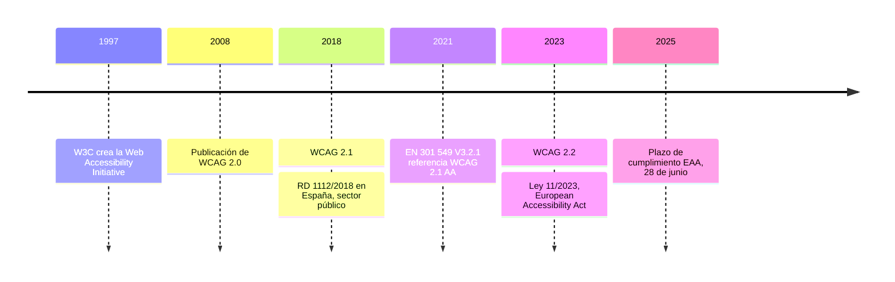
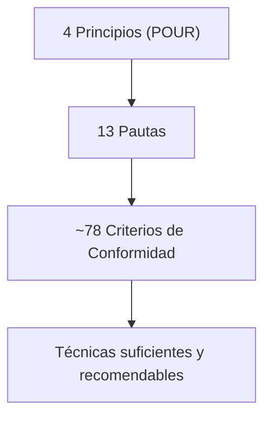

# Diseño de Interfaces Web

## Unidad 14 · Accesibilidad Web

**Módulo 0615 · Diseño de Interfaces Web**  
CFGS Desarrollo de Aplicaciones Web (DAW)

---

## Objetivos de aprendizaje I

- <span class="fragment">Comprender la accesibilidad web en toda su amplitud: perspectivas **legal, ética y de negocio**</span>
- <span class="fragment">Identificar los **tipos de discapacidad** (visual, auditiva, motriz, cognitiva, neurológica) y su impacto en la web</span>
- <span class="fragment">Aplicar la legislación vigente: **EN 301 549**, **RD 1112/2018**, **Ley 11/2023** (EAA), **ADA**, **Section 508**</span>
- <span class="fragment">Dominar **WCAG 2.0 / 2.1 / 2.2**: Principios, Pautas, Criterios de Conformidad y niveles **A, AA, AAA**</span>

Note: Insistid en que la accesibilidad no es "para una minoría": beneficia a todos en algún momento de la vida. Pregunta para el aula: ¿quién ha usado alguna vez el móvil con la pantalla rota o bajo el sol directo?

---

## Objetivos de aprendizaje II

- <span class="fragment">Aplicar los principios **POUR** e implementar las soluciones técnicas de cada criterio</span>
- <span class="fragment">Desarrollar interfaces plenamente **navegables por teclado**: `tabindex`, `:focus-visible`, skip links</span>
- <span class="fragment">Trabajar con **lectores de pantalla**: NVDA, VoiceOver, JAWS, TalkBack</span>
- <span class="fragment">Usar el **HTML semántico** como primera estrategia y **WAI-ARIA** de forma profesional</span>
- <span class="fragment">Realizar **auditorías** (Lighthouse, WAVE, axe) y construir componentes accesibles: formularios, modales, acordeones, tabs</span>

Note: Esta unidad es el núcleo del resultado de aprendizaje RA5 (evalúa la accesibilidad de la interfaz). Señalad que estas competencias aparecen de forma explícita en ofertas de trabajo de desarrollo frontend.

---

## ¿Por qué la accesibilidad?

> "El poder de la Web está en su universalidad. El acceso para todos, independientemente de la discapacidad, es un aspecto esencial."
> — **Tim Berners-Lee**, inventor de la World Wide Web

- <span class="fragment">No solo personas con **discapacidades permanentes**</span>
- <span class="fragment">Situaciones temporales: fractura de brazo, ojos cansados, manos ocupadas</span>
- <span class="fragment">Contextos limitantes: entorno ruidoso, mucho sol, conexión lenta</span>
- <span class="fragment">La accesibilidad beneficia a **todos** en algún momento de nuestras vidas</span>

<span class="fragment"><strong>Pregunta:</strong> ¿puede usarse vuestra interfaz solo con el teclado?</span>

Note: Leed la cita en voz alta y preguntad quién sabe quién es Tim Berners-Lee. El objetivo es romper el mito de que la accesibilidad "solo es para ciegos" antes de entrar en contenido técnico.

---

## Las cifras: discapacidad (OMS)

<div style="font-size: 0.9rem;">
<table>
<tr><th>Colectivo</th><th>Dato</th></tr>
<tr><td>Población mundial con alguna discapacidad</td><td><strong>&gt; 15%</strong> (más de 1.000 millones)</td></tr>
<tr><td>Discapacidad visual</td><td>285 millones (39 M ceguera · 246 M baja visión)</td></tr>
<tr><td>Pérdida auditiva discapacitante</td><td>466 millones</td></tr>
<tr><td>Dificultades significativas de movilidad</td><td>~200 millones</td></tr>
<tr><td>Daltonismo</td><td>8% de los hombres · 0,5% de las mujeres</td></tr>
</table>
</div>

<span class="fragment"><strong>"Purple pound":</strong> el poder adquisitivo global de personas con discapacidad y sus familias supera los <strong>8 billones de dólares/año</strong></span>

Note: Son estimaciones de la OMS. Añadid que la población mayor de 65 años ya supera el 20% en muchos países, y que el envejecimiento deteriora vista, oído y movilidad: la accesibilidad también es diseño para el envejecimiento.

---

## Tipos de discapacidad y su impacto

<div style="display: grid; grid-template-columns: 1fr 1fr; gap: 0.6rem; font-size: 0.8rem; text-align: left;">
<div class="fragment"><strong>Visual</strong><br>Ceguera, baja visión, daltonismo<br>→ Lectores de pantalla, magnificadores, contraste, alt descriptivos</div>
<div class="fragment"><strong>Auditiva</strong><br>Sordera, hipoacusia<br>→ Subtítulos, transcripciones, alertas visuales</div>
<div class="fragment"><strong>Motriz</strong><br>Temblores, parálisis, movilidad reducida<br>→ Teclado, objetivos ≥ 44×44 px, tiempo ajustable</div>
<div class="fragment"><strong>Cognitiva / Neurológica</strong><br>Dislexia, TDAH, autismo, epilepsia fotosensible<br>→ Lenguaje claro, nada que parpadee &gt; 3 veces/s</div>
</div>

Note: Fomentad la empatía: cada barrera tiene una solución técnica concreta. Proponed el ejercicio inverso: pensad cómo usaríais la web sin ratón y durante 10 minutos.

---

## Tecnologías de apoyo

- <span class="fragment"><strong>Lectores de pantalla:</strong> convierten el contenido en voz sintetizada o braille (NVDA, JAWS, VoiceOver, TalkBack)</span>
- <span class="fragment"><strong>Magnificadores</strong> de pantalla y modos de alto contraste</span>
- <span class="fragment"><strong>Software de reconocimiento de voz</strong> (emula eventos de teclado)</span>
- <span class="fragment"><strong>Teclados adaptativos,</strong> punteros de cabeza, sopladores, seguimiento ocular</span>
- <span class="fragment"><strong>Conmutadores</strong> para usuarios que no pueden usar las manos</span>

<span class="fragment"><span class="mini">Existen muchas formas de interactuar con un ordenador más allá del binomio ratón + teclado.</span></span>

Note: Si es posible, demostrad NVDA en vivo: es gratuito y se instala en minutos. Escuchar cómo lee una página mal estructurada ("Enlace... Enlace... Enlace...") resulta muy revelador.

---

## Marco legislativo



- <span class="fragment"><strong>RD 1112/2018:</strong> sector público (BOE 19/09/2018); sitios nuevos accesibles desde el 23/09/2019</span>
- <span class="fragment"><strong>Ley 11/2023:</strong> sector privado (ecommerce, banca, transporte, audiovisual); productos existentes hasta 2030</span>
- <span class="fragment"><strong>EEUU:</strong> ADA + Section 508 → miles de demandas anuales por inaccesibilidad</span>

Note: Enfatizad que en España la accesibilidad ya no es voluntaria: sector público desde 2018 y privado desde junio de 2025. Pregunta para el aula: ¿qué sectores afecta directamente la EAA a vuestras futuras empresas?

---

## WCAG: evolución y estructura

- <span class="fragment"><strong>WCAG 1.0</strong> (1999) → rápidamente obsoleta</span>
- <span class="fragment"><strong>WCAG 2.0</strong> (2008) → establece los 4 principios</span>
- <span class="fragment"><strong>WCAG 2.1</strong> (2018) → móviles, baja visión, cognitivas</span>
- <span class="fragment"><strong>WCAG 2.2</strong> (2023) → 9 criterios nuevos (cognitivas + táctiles)</span>



<span class="fragment"><strong>Niveles:</strong> A (30 criterios, mínimo) · AA (50, estándar legal) · AAA (78, óptimo; no realista para sitios completos)</span>

Note: La jerarquía es clave: los principios son ideas, las pautas son objetivos, los criterios son enunciados verificables y las técnicas son ejemplos. Solo los criterios de conformidad se pueden pasar o fallar objetivamente.

---

## POUR: los 4 principios

<div style="display: grid; grid-template-columns: 1fr 1fr; gap: 0.6rem; font-size: 0.8rem; text-align: left;">
<div class="fragment"><strong>P · Perceptible</strong><br>Contenido perceptible por al menos un sentido<br>1.1 Alternativas textuales · 1.2 Medios basados en el tiempo · 1.3 Adaptable · 1.4 Distinguible</div>
<div class="fragment"><strong>O · Operable</strong><br>Componentes y navegación operables<br>2.1 Teclado · 2.2 Tiempo suficiente · 2.3 Convulsiones · 2.4 Navegable · 2.5 Modalidades de entrada</div>
<div class="fragment"><strong>C · Comprensible</strong><br>Información y manejo comprensibles<br>3.1 Legible · 3.2 Predecible · 3.3 Asistencia a la entrada</div>
<div class="fragment"><strong>R · Robusto</strong><br>Compatible con agentes de usuario y tecnologías asistivas<br>4.1 Compatible (Name, Role, Value)</div>
</div>

Note: POUR es el mnemotécnico que hay que recordar siempre. Mini-test en el aula: "¿a qué principio pertenece el contraste de color?" (Perceptible → pauta 1.4 Distinguible).

---

## Criterios de conformidad clave

<div style="font-size: 0.9rem;">
<table>
<tr><th>Criterio</th><th>Nivel</th><th>Requisito</th></tr>
<tr><td>1.1.1 Non-text Content</td><td>A</td><td>Alternativa textual para imágenes, gráficos, CAPTCHA</td></tr>
<tr><td>1.4.1 Use of Color</td><td>A</td><td>El color no es el único medio de información</td></tr>
<tr><td>1.4.3 Contrast Minimum</td><td>AA</td><td>4.5:1 texto normal · 3:1 texto grande</td></tr>
<tr><td>1.4.11 Non-text Contrast</td><td>AA</td><td>3:1 componentes UI y objetos gráficos</td></tr>
<tr><td>1.4.12 Text Spacing</td><td>AA</td><td>Sin pérdida al modificar el espaciado</td></tr>
<tr><td>2.1.1 Keyboard</td><td>A</td><td>Toda funcionalidad operable por teclado</td></tr>
<tr><td>2.4.1 Bypass Blocks</td><td>A</td><td>Mecanismo para saltar bloques (skip links)</td></tr>
<tr><td>2.4.3 Focus Order</td><td>A</td><td>Orden de foco lógico y significativo</td></tr>
<tr><td>2.4.4 Link Purpose</td><td>A</td><td>Propósito de cada enlace determinable</td></tr>
<tr><td>2.4.7 Focus Visible</td><td>AA</td><td>Indicador de foco visible</td></tr>
<tr><td>3.2.3 Consistent Navigation</td><td>AA</td><td>Navegación consistente entre páginas</td></tr>
<tr><td>4.1.2 Name, Role, Value</td><td>A</td><td>Nombre, rol y valor expuestos a las APIs</td></tr>
</table>
</div>

Note: Estos doce criterios aparecen en prácticamente todas las auditorías; debéis conocerlos de memoria. Pregunta rápida: "¿qué nivel exige el contraste 4.5:1?" (AA, criterio 1.4.3).

---

## Navegación por teclado: tabindex

<div style="font-size: 0.9rem;">
<table>
<tr><th>Valor</th><th>Comportamiento</th><th>Cuándo usarlo</th></tr>
<tr><td><code>tabindex="0"</code></td><td>Incluye en el orden natural de tabulación (DOM)</td><td>Hacer enfocable un control personalizado</td></tr>
<tr><td><code>tabindex="-1"</code></td><td>Foco programático (<code>el.focus()</code>), fuera del orden Tab</td><td>SPAs, modales, destino de skip links</td></tr>
<tr><td><code>tabindex="1+"</code></td><td>Orden artificial que se desincroniza del DOM</td><td><strong>NUNCA usarlo</strong></td></tr>
</table>
</div>

- <span class="fragment">¿Necesitas un orden concreto? <strong>Reordena el DOM</strong>, no manipules tabindex</span>
- <span class="fragment">Ojo con CSS Grid/Flexbox: la propiedad `order` puede desincronizar el orden visual del DOM</span>

Note: El tabindex positivo es uno de los errores más persistentes del código heredado. Ejemplo práctico: un div que actúa como botón necesita tabindex="0" y además manejar keydown de Enter y Espacio.

---

## Foco visible

```css
/* Nunca elimines el outline sin reemplazarlo */
*:focus-visible {
  outline: 3px solid #4a90d9;
  outline-offset: 2px;
}
/* Resalta el contenedor que alberga el elemento enfocado */
.card:focus-within {
  border-color: #4a90d9;
}
```

- <span class="fragment"><code>:focus</code> → cualquier método de enfoque (ratón o teclado)</span>
- <span class="fragment"><code>:focus-visible</code> → solo con teclado: resuelve el dilema estético</span>
- <span class="fragment"><code>:focus-within</code> → se aplica al ancestro del elemento enfocado</span>
- <span class="fragment">WCAG <strong>2.4.7 (AA)</strong>: indicador visible; contraste ≥ <strong>3:1</strong> frente a colores adyacentes (1.4.11)</span>

Note: `outline: none` sin alternativa es una de las líneas de CSS más dañinas que existen. Reto para el aula: rediseñad el contorno azul por defecto para que sea estético y, a la vez, claramente visible.

---

## Skip links

```html
<!-- Primer elemento enfocable de la página -->
<a href="#main-content" class="skip-link">
  Saltar al contenido principal
</a>
<main id="main-content" tabindex="-1">
  <!-- Contenido principal -->
</main>
```

```css
.skip-link { position: absolute; top: -100px; left: 0; }
.skip-link:focus { top: 0; }
```

- <span class="fragment">WCAG <strong>2.4.1 Bypass Blocks (A)</strong>: evita tabular por docenas de enlaces de navegación</span>
- <span class="fragment">El destino necesita <code>tabindex="-1"</code> para recibir el foco programático</span>
- <span class="fragment">Nunca <code>display: none</code>: debe <strong>aparecer al recibir el foco</strong></span>

Note: Demostradlo en el navegador: al cargar la página, pulsad Tab y veréis cómo aparece el enlace. Preguntad por qué no puede estar permanentemente oculto (no sería enfocable ni anunciarlo el lector de pantalla).

---

## Lectores de pantalla

<div style="display: grid; grid-template-columns: 1fr 1fr; gap: 0.6rem; font-size: 0.8rem; text-align: left;">
<div class="fragment"><strong>NVDA</strong> — Windows, gratuito y open source<br>El más utilizado en pruebas de accesibilidad</div>
<div class="fragment"><strong>JAWS</strong> — Windows, comercial<br>Entornos corporativos y gubernamentales anglosajones</div>
<div class="fragment"><strong>VoiceOver</strong> — macOS/iOS, integrado<br>El más usado del mundo si contamos móviles</div>
<div class="fragment"><strong>TalkBack</strong> — Android, integrado<br>Equivalente de VoiceOver en el ecosistema Google</div>
</div>

<span class="fragment"><strong>Navegación (teclas NVDA):</strong> H encabezados · D landmarks · K enlaces · F controles de formulario · L listas</span>

<span class="fragment"><span class="mini">"Documento web. [Título]. 3 landmarks: banner, navegación, contenido principal. 15 enlaces. 8 encabezados."</span></span>

Note: Los usuarios no leen de arriba a abajo: navegan por estructura. Por eso la jerarquía de encabezados y los landmarks importan tanto. Un div genérico sin alt solo produce "Enlace... Enlace... Enlace...".

---

## HTML semántico: primera estrategia

<span class="fragment"><strong>Resuelve ~70% de los problemas de accesibilidad sin necesidad de ARIA</strong></span>

- <span class="fragment"><strong>Jerarquía de encabezados</strong> h1→h6 sin saltos de nivel</span>
- <span class="fragment"><strong>Landmarks:</strong> <code>header</code>, <code>nav</code>, <code>main</code>, <code>footer</code>, <code>aside</code>, <code>section</code>, <code>search</code></span>
- <span class="fragment"><strong>Enlace vs botón:</strong> enlace = navegar a otro sitio; botón = ejecutar una acción</span>
- <span class="fragment"><strong>Texto de enlace descriptivo y único:</strong> "Ver detalles del producto X", no "Leer más"</span>
- <span class="fragment"><strong><code>lang="es"</code></strong> en <code>&lt;html&gt;</code>: el lector elige el sintetizador correcto</span>

Note: Mostrad el árbol de accesibilidad en DevTools (pestaña Accessibility de Chrome) comparando una página semántica con otra hecha con divs genéricos. La diferencia es dramática y visual.

---

## Formularios y texto alternativo

- <span class="fragment"><code>&lt;label for="id"&gt;</code> <strong>siempre</strong>. Nunca placeholder como sustituto (desaparece al escribir, bajo contraste)</span>
- <span class="fragment"><code>fieldset</code> + <code>legend</code> para agrupar campos relacionados</span>
- <span class="fragment"><strong>Errores:</strong> texto claro + icono + anunciados con <code>aria-live</code>/<code>role="alert"</code></span>
- <span class="fragment"><strong><code>alt</code>:</strong> descriptivo si la imagen informa; <code>alt=""</code> si es puramente decorativa</span>
- <span class="fragment">Icono que actúa como botón: el nombre accesible va en el <strong>botón</strong>, no en el alt</span>

```html
<label for="email">Correo electrónico</label>
<input type="email" id="email" required
       aria-describedby="emailHelp emailError">
```

Note: Pregunta para el aula: "¿sirve alt='foto'?" (No). Regla práctica: describe la imagen como si lo hicieras por teléfono con alguien que no puede verla.

---

## WAI-ARIA: reglas de oro

1. <span class="fragment">Usa <strong>HTML nativo</strong> siempre que sea posible</span>
2. <span class="fragment">No cambies la semántica nativa salvo que sea <strong>absolutamente necesario</strong></span>
3. <span class="fragment">Todos los controles interactivos deben ser <strong>operables por teclado</strong></span>
4. <span class="fragment">No uses <code>role="presentation"</code> / <code>aria-hidden="true"</code> en elementos <strong>enfocables</strong></span>
5. <span class="fragment">Todos los elementos interactivos necesitan un <strong>nombre accesible</strong></span>

<span class="fragment"><strong>"No ARIA is better than bad ARIA."</strong> Ningún ARIA es mejor que un ARIA incorrecto.</span>

Note: ARIA complementa al HTML semántico, no lo sustituye. Advertencia importante: un uso incorrecto de ARIA empeora la experiencia en lugar de mejorarla.

---

## ARIA: roles, propiedades y estados

<div style="font-size: 0.8rem;">
<table>
<tr><th>Categoría</th><th>Ejemplos</th></tr>
<tr><td><strong>Roles widget</strong></td><td>button, checkbox, radio, switch, tab, tabpanel, combobox, listbox, slider, progressbar, menu, menuitem, dialog</td></tr>
<tr><td><strong>Roles landmark</strong></td><td>banner, navigation, main, complementary, contentinfo, form, search, region</td></tr>
<tr><td><strong>Propiedades</strong></td><td>aria-label, aria-labelledby, aria-describedby, aria-required, aria-invalid, aria-current, aria-hidden</td></tr>
<tr><td><strong>Estados</strong></td><td>aria-expanded, aria-selected, aria-checked, aria-pressed, aria-disabled, aria-busy</td></tr>
</table>
</div>

- <span class="fragment">Los roles definen <strong>qué es</strong> un elemento; no añaden comportamiento (no hacen clickable lo que no lo era)</span>
- <span class="fragment">Propiedades ≈ estáticas · Estados ≈ dinámicos (se actualizan con JavaScript)</span>

Note: Distinción útil: aria-label da un nombre directo; aria-labelledby reutiliza texto visible de otro elemento, lo que facilita el mantenimiento y evita duplicados.

---

## Live regions

<span class="fragment">Anuncian <strong>cambios en el DOM sin mover el foco</strong>: clave en aplicaciones dinámicas</span>

- <span class="fragment"><code>aria-live="polite"</code>: espera a terminar la lectura actual → mayoría de notificaciones</span>
- <span class="fragment"><code>aria-live="assertive"</code>: interrumpe de inmediato → mensajes críticos</span>
- <span class="fragment"><code>aria-atomic</code>: anuncia toda la región o solo el cambio</span>
- <span class="fragment"><code>aria-relevant</code>: qué tipos de cambios anunciar</span>

```html
<div role="status" aria-live="polite"></div>
<div role="alert" aria-live="assertive"></div>
```

<span class="fragment"><span class="mini">Roles live implícitos: alert (assertive+atomic) · status (polite+atomic) · log · marquee · timer</span></span>

Note: Sin live regions, el usuario de lector de pantalla nunca se entera de que el contenido ha cambiado. Prueba práctica: añadid un producto al carrito y escuchad si NVDA lo anuncia.

---

## Auditoría: herramientas automáticas

<div style="font-size: 0.9rem;">
<table>
<tr><th>Herramienta</th><th>Qué hace</th><th>Límite clave</th></tr>
<tr><td><strong>Lighthouse</strong> (DevTools)</td><td>Puntuación 0–100, ~50 comprobaciones</td><td>Detecta solo el 25–35% de los criterios; 100 ≠ accesible</td></tr>
<tr><td><strong>WAVE</strong> (WebAIM)</td><td>Iconos visuales: rojo error, amarillo alerta, verde característica, azul estructura</td><td>Las alertas requieren revisión humana; vista "sin estilos"</td></tr>
<tr><td><strong>axe DevTools</strong> (Deque)</td><td>Listado de violaciones: ubicación exacta, criterio, severidad</td><td>Complementa la prueba manual; integración CI/CD (axe-core)</td></tr>
</table>
</div>

<span class="fragment"><strong>Las herramientas automáticas detectan ≈ 25–35% de los problemas. El resto es manual.</strong></span>

Note: Ejecutad Lighthouse en vivo sobre un proyecto del alumnado. Insistid: la puntuación perfecta es un punto de partida, no un certificado de accesibilidad.

---

## Verificación manual

<div style="font-size: 0.8rem;">
<ol>
<li class="fragment">Navegar todo con <strong>teclado</strong>: Tab, Shift+Tab, Enter, Espacio, flechas, Esc — sin trampas de foco</li>
<li class="fragment">Comprobar que los <strong>skip links</strong> funcionan</li>
<li class="fragment">Revisar <strong>alt</strong>: correctos, no solo presentes</li>
<li class="fragment"><strong>Jerarquía de encabezados</strong> sin saltos de nivel</li>
<li class="fragment"><strong>Formularios:</strong> labels asociadas + errores accesibles</li>
<li class="fragment"><strong>Zoom 200%</strong> sin perder contenido ni funcionalidad</li>
<li class="fragment"><strong>Multimedia:</strong> subtítulos y/o transcripciones</li>
<li class="fragment">Ninguna información transmitida solo por <strong>color</strong></li>
<li class="fragment"><strong>Contraste</strong> manual (Colour Contrast Analyser)</li>
<li class="fragment">Prueba con <strong>NVDA / VoiceOver</strong></li>
</ol>
</div>

Note: Este checklist es la espina dorsal de cualquier auditoría manual. Recomended imprimirlo y marcar cada punto durante la actividad en clase; documentad los hallazgos con capturas.

---

## Informe de auditoría

- <span class="fragment">Cada hallazgo: <strong>ID único</strong>, criterio WCAG infringido, nivel, ubicación exacta (URL + elemento)</span>
- <span class="fragment"><strong>Descripción</strong> + impacto en usuarios (qué discapacidad afecta y con qué severidad)</span>
- <span class="fragment"><strong>Recomendación de solución</strong> con código de ejemplo cuando aplique</span>
- <span class="fragment"><strong>Prioridad</strong> = frecuencia × impacto × dificultad de corrección</span>

<div style="font-size: 0.9rem;">
<table>
<tr><th>Severidad</th><th>Significado</th></tr>
<tr><td><strong>Crítico</strong></td><td>Impide el acceso completo (p. ej., pago no operable por teclado)</td></tr>
<tr><td><strong>Alto</strong></td><td>Dificulta significativamente el acceso</td></tr>
<tr><td><strong>Medio</strong></td><td>Mejora recomendada</td></tr>
<tr><td><strong>Bajo</strong></td><td>Incidencia cosmética</td></tr>
</table>
</div>

Note: Un buen informe es accionable: cada hallazgo debe llegar con solución concreta. Priorizad por impacto en el usuario, no por facilidad de corrección.

---

## Ejemplo: página completa accesible

```html
<html lang="es">
<body>
  <a href="#main" class="skip-link">Saltar al contenido</a>
  <header><h1>EcoTienda</h1></header>
  <nav aria-label="Navegación principal">
    <ul>
      <li><a href="/" aria-current="page">Inicio</a></li>
      <li><a href="/productos">Productos</a></li>
    </ul>
  </nav>
  <main id="main" tabindex="-1">
    <section aria-labelledby="destacados">
      <h2 id="destacados">Productos Destacados</h2>
      <a href="/p/cesta" class="btn">Ver detalles
        <span class="sr-only">de Cesta de Frutas</span></a>
    </section>
  </main>
  <footer>© 2025 EcoTienda</footer>
</body>
```

- <span class="fragment">Landmarks + jerarquía de encabezados + skip link</span>
- <span class="fragment"><code>aria-label</code> distingue varios <code>nav</code>; <code>aria-current="page"</code> marca la página activa</span>
- <span class="fragment"><code>.sr-only</code> completa el texto del enlace para lectores de pantalla</span>

Note: Es el patrón de referencia para cualquier página. Pedid al alumnado que identifique en su propio proyecto qué elementos de esta lista le faltan.

---

## Ejemplo: formulario accesible

```html
<form aria-labelledby="form-heading" novalidate>
  <div role="alert" aria-live="assertive" hidden></div>
  <fieldset>
    <legend>Datos personales</legend>
    <label for="nombre">Nombre <span aria-hidden="true">*</span></label>
    <input id="nombre" required aria-required="true"
           aria-describedby="nombreHelp nombreError">
    <span id="nombreHelp">Tal como aparece en tu DNI.</span>
    <span id="nombreError" role="alert"></span>
  </fieldset>
  <div role="status" aria-live="polite" hidden></div>
  <button type="submit">Crear cuenta</button>
</form>
```

- <span class="fragment"><code>fieldset</code>/<code>legend</code> agrupan; asterisco con <code>aria-hidden</code> + "asterisco" en sr-only</span>
- <span class="fragment"><code>aria-describedby</code> enlaza ayuda y error con el campo</span>
- <span class="fragment">JS: <code>setAttribute('aria-invalid','true')</code> + foco en el primer campo erróneo</span>

Note: Al enviar con errores, mostrad un resumen global con enlaces internos a cada campo inválido y moved el foco a ese resumen: es el patrón profesional de validación accesible.

---

## Ejemplo: modal accesible

```html
<button aria-haspopup="dialog">Abrir diálogo</button>
<div role="dialog" aria-modal="true"
     aria-labelledby="modalTitle"
     aria-describedby="modalDesc" aria-hidden="true">
  <h3 id="modalTitle">Confirmar eliminación</h3>
  <p id="modalDesc">Esta acción es irreversible.</p>
  <button id="closeBtn">Cerrar</button>
</div>
```

```js
function open() {
  lastFocus = document.activeElement;
  wrapper.hidden = false;
  closeBtn.focus();   // mover el foco dentro
}
function close() {
  wrapper.hidden = true;
  lastFocus.focus();  // restaurar el foco
}
// Tab / Shift+Tab ciclan entre elementos enfocables (focus trap)
// Escape cierra el diálogo
```

Note: Tres pilares del modal accesible: foco inicial dentro, focus trapping y devolución del foco al cerrar. Además, aria-modal="true" oculta el fondo del árbol de accesibilidad.

---

## Ejemplo: patrones ARIA (acordeón · toast)

```html
<button id="faqBtn1" aria-expanded="false"
        aria-controls="faqPanel1">
  ¿Cuál es el plazo de envío?
</button>
<div id="faqPanel1" role="region"
     aria-labelledby="faqBtn1" hidden>
  <p>Envío estándar: 3-5 días laborables.</p>
</div>
```

- <span class="fragment"><strong>Disclosure/Acordeón:</strong> <code>aria-expanded</code> + <code>aria-controls</code>; teclas ↑ ↓ Home End</span>
- <span class="fragment"><strong>Tabs:</strong> <code>role="tablist/tab/tabpanel"</code>, <code>aria-selected</code> y roving tabindex (un tab con 0, el resto -1)</span>
- <span class="fragment"><strong>Toast:</strong> <code>role="status"</code> → anunciado de forma educada sin robar el foco</span>

Note: Estos patrones siguen la ARIA Authoring Practices Guide (APG) del W3C. Recomendad consultar el APG antes de construir cualquier widget personalizado.

---

## Caso real: Sede Electrónica

<span class="fragment"><span class="mini">sede.administracion.gob.es — obligada legalmente: RD 1112/2018 + EN 301 549 (WCAG 2.1 AA)</span></span>

<div style="display: grid; grid-template-columns: 1fr 1fr; gap: 0.6rem; font-size: 0.8rem; text-align: left;">
<div class="fragment"><strong>Contraste</strong><br>Textos secundarios a 3.8:1 (&lt; 4.5:1)<br>→ Oscurecer a #595959 (ratio 7:1)</div>
<div class="fragment"><strong>Menú</strong><br>Submenús solo con hover<br>→ aria-expanded + keydown (Enter/Espacio)</div>
<div class="fragment"><strong>Formularios</strong><br>Sin resumen de errores al enviar<br>→ contenedor aria-live="assertive" con enlaces a campos</div>
<div class="fragment"><strong>Encabezados</strong><br>Saltos de nivel h1 → h3<br>→ Jerarquía estrictamente secuencial</div>
</div>

Note: Ni siquiera un organismo público obligado legalmente está libre de barreras. Conclusión: el cumplimiento exige auditoría continua, no un esfuerzo puntual.

---

## Casos reales: banca y ecommerce

<div style="display: grid; grid-template-columns: 1fr 1fr; gap: 0.6rem; font-size: 0.8rem; text-align: left;">
<div class="fragment"><strong>Portal bancario</strong><br>· Timeout de sesión 5–10 min sin aviso → WCAG 2.2.1 (A): modal 2 min antes del cierre<br>· CAPTCHA visual sin audio → reCAPTCHA v3 / hCaptcha<br>· Gráficos en canvas/SVG sin ARIA → tabla de datos sr-only equivalente</div>
<div class="fragment"><strong>Ecommerce</strong><br>· Slider de precio solo con ratón → campos numéricos mín/máx sincronizados<br>· alt="producto" → "Vestido midi azul marino con estampado floral"<br>· Checkout con componentes no enfocables → controles nativos o patrones ARIA<br>· Toast del carrito sin role="status"</div>
</div>

<span class="fragment"><strong>Un carrito inaccesible = ventas perdidas.</strong></span>

Note: En el comercio electrónico la accesibilidad impacta directamente en la facturación. Proponed que auditen el checkout de una tienda online que usen habitualmente.

---

## Actividad en clase: auditoría de una página real

- <span class="fragment"><strong>Objetivo:</strong> auditoría completa (automática + manual) con informe estructurado</span>
- <span class="fragment"><strong>Tiempo:</strong> 120 min · <strong>Formato:</strong> individual</span>
- <span class="fragment"><strong>Herramientas:</strong> Chrome + Lighthouse + axe DevTools + WAVE + NVDA/VoiceOver</span>
- <span class="fragment"><strong>Desarrollo:</strong> elegir un servicio público o ecommerce → ejecutar herramientas → verificación manual de teclado → prueba con lector de pantalla</span>
- <span class="fragment"><strong>Entregable:</strong> informe PDF con hallazgos (criterio WCAG, nivel, severidad, ubicación, solución)</span>

<span class="fragment"><span class="mini">Otras actividades: transformar una página "enferma" hasta AA (90 min) · acordeón ARIA desde cero (60 min) · combobox con autocompletado (75 min)</span></span>

Note: Circulad por el aula comprobando que realmente navegan con teclado, no solo ejecutan Lighthouse. Sevaluará la calidad de los hallazgos (impacto + solución), no su cantidad.

---

## Buenas prácticas

<div style="font-size: 0.85rem;">
<ul>
<li class="fragment">✅ Empezar con <strong>HTML semántico</strong>, no con ARIA</li>
<li class="fragment">✅ Nunca eliminar el <code>outline</code> sin reemplazo (<code>:focus-visible</code>)</li>
<li class="fragment">✅ Probar con <strong>teclado real</strong> cada sprint (15 min)</li>
<li class="fragment">✅ Usar un <strong>lector de pantalla</strong> al menos una vez al mes (NVDA)</li>
<li class="fragment">✅ Verificar el <strong>contraste</strong> con Colour Contrast Analyser</li>
<li class="fragment">✅ <strong>Alt descriptivos</strong>; <code>alt=""</code> solo para decorativas</li>
<li class="fragment">✅ <strong>Labels visibles y asociadas</strong>; placeholder nunca como label</li>
<li class="fragment">✅ Errores con <strong>texto + icono + aria-live</strong></li>
<li class="fragment">✅ Integrar <strong>axe-core / Lighthouse CI</strong> en el pipeline (umbral 90)</li>
<li class="fragment">✅ No engañar el contraste con texto grande (18px / 14px negrita)</li>
</ul>
</div>

Note: Proponed convertir estas diez prácticas en checklist de equipo antes de cada release. La constancia gana a la perfección: 15 minutos con teclado cada sprint detectan la mayoría de regresiones.

---

## Errores frecuentes

<div style="font-size: 0.75rem;">
<ul>
<li class="fragment">❌ <code>tabindex</code> positivo (1, 2, 3…)</li>
<li class="fragment">❌ <code>* { outline: none; }</code> global</li>
<li class="fragment">❌ <code>alt=""</code> en imágenes informativas</li>
<li class="fragment">❌ Placeholder en lugar de <code>&lt;label&gt;</code></li>
<li class="fragment">❌ Contenido dinámico sin <code>aria-live</code></li>
<li class="fragment">❌ Enlaces genéricos: "Leer más", "Haz clic aquí"</li>
<li class="fragment">❌ <code>role="button"</code> en un <code>&lt;button&gt;</code> nativo</li>
<li class="fragment">❌ Confiar en un Lighthouse 100 (detecta 25–35%)</li>
<li class="fragment">❌ Modales sin gestión ni trampa de foco</li>
<li class="fragment">❌ Faltar <code>&lt;html lang="es"&gt;</code></li>
<li class="fragment">❌ <code>aria-hidden="true"</code> en elementos enfocables</li>
</ul>
</div>

Note: Repasad cada error preguntando "¿dónde lo hemos visto?". Los errores 1, 2 y 8 son los más frecuentes tanto en proyectos de alumnos como en código de producción.

---

## Resumen · Conceptos clave

- <span class="fragment">🎯 Accesibilidad = <strong>derecho + obligación legal + negocio</strong></span>
- <span class="fragment">🎯 El <strong>HTML semántico</strong> resuelve ~70%; ARIA para widgets complejos</span>
- <span class="fragment">🎯 <strong>Teclado:</strong> tabindex 0/-1, foco visible, skip links</span>
- <span class="fragment">🎯 <strong>WCAG 2.1 AA</strong> es el estándar legal (EN 301 549 · RD 1112/2018 · Ley 11/2023)</span>
- <span class="fragment">🎯 <strong>POUR:</strong> Perceptible, Operable, Comprensible, Robusto</span>
- <span class="fragment">🎯 Auditoría = <strong>automáticas (25–35%) + manual + lector de pantalla</strong></span>
- <span class="fragment">🎯 <strong>Live regions</strong> para el contenido dinámico</span>

Note: Cerrad con el mensaje central: la accesibilidad no es una característica añadida al final, es una cualidad transversal que se decide desde el diseño.

---

## Próximos pasos

<span class="fragment"><strong>Unidad 15 · Usabilidad Web</strong></span>

- <span class="fragment">Técnicas de evaluación de usabilidad</span>
- <span class="fragment">Heurísticas y pruebas con usuarios</span>
- <span class="fragment">Accesibilidad y usabilidad: una interfaz accesible es inherentemente más usable</span>

Note: Puente hacia la próxima unidad: las técnicas de evaluación que aprenderéis en la Unidad 15 se aplicarán aquí con enfoque específico en usuarios con discapacidad.

---

## ¿Preguntas?

Unidad 14 · Accesibilidad Web

0615 · DAW · Curso 2025/2026

Note: Espacio para dudas sobre la unidad y sobre cómo aplicar lo aprendido en el proyecto del módulo. Recordad que los recursos oficiales (WCAG en español, APG de ARIA, NVDA) quedan disponibles en el aula virtual.
