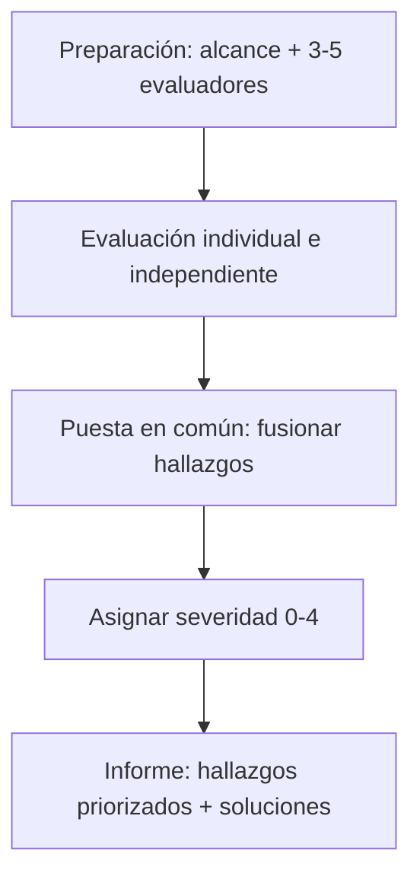
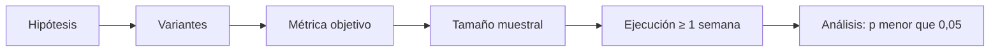
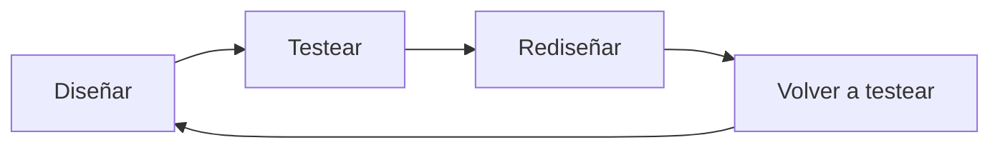

# Diseño de Interfaces Web

## Unidad 15 · Usabilidad Web

**Módulo 0615 · Diseño de Interfaces Web**  
CFGS Desarrollo de Aplicaciones Web (DAW)

---

## Objetivos de aprendizaje I

- <span class="fragment">Comprender la usabilidad según **ISO 9241-11**: eficacia, eficiencia y satisfacción</span>
- <span class="fragment">Distinguir usabilidad de conceptos afines: **UX** y **accesibilidad**</span>
- <span class="fragment">Dominar las **10 heurísticas de Nielsen** para evaluar cualquier interfaz</span>
- <span class="fragment">Planificar y ejecutar una **evaluación heurística** completa con escala de severidad 0-4</span>
- <span class="fragment">Realizar un **recorrido cognitivo** (cognitive walkthrough) paso a paso</span>
- <span class="fragment">Diseñar y ejecutar **tests de usuario**: presencial/remoto, moderado/no moderado</span>

Note: Los objetivos se agrupan en dos bloques: primero los conceptos y las técnicas de inspección, después las métricas y las herramientas cuantitativas. Preguntad al aula quién ha usado alguna vez Hotjar o ha visto un mapa de calor: casi todos, sin saberlo, como usuarios. El hilo conductor de la unidad es pasar de la intuición del diseñador a la evidencia medible.

---

## Objetivos de aprendizaje II

- <span class="fragment">Calcular e interpretar **métricas de usabilidad**: tasa de éxito, tiempo de tarea, errores, SUS, NPS, SEQ</span>
- <span class="fragment">Comprender el **eye tracking**: mapas de calor de mirada y gaze plots</span>
- <span class="fragment">Analizar **heat maps** de comportamiento (Hotjar, Microsoft Clarity)</span>
- <span class="fragment">Diseñar **tests A/B** con significancia estadística y tamaño de muestra</span>
- <span class="fragment">Usar **Google Analytics** para detectar problemas de usabilidad</span>
- <span class="fragment">Aplicar **tests de guerrilla** y analizar críticamente sitios reales: Amazon, Renfe, portales de empleo público</span>

Note: Insistid en que las métricas no son un fin en sí mismas: sirven para comparar versiones y tomar decisiones. El SUS es el cuestionario más usado en la industria por su simplicidad: diez preguntas y una puntuación única comparable entre sistemas. Recordad que la unidad cierra con casos españoles reconocibles: Renfe y los portales de oposiciones.

---

## Resultados de aprendizaje y previos

<div style="display: grid; grid-template-columns: 1fr 1fr; gap: 0.6rem; font-size: 0.8rem; text-align: left;">
  <div class="fragment"><strong>Relación con los RA</strong><br>RA1: planifica la interfaz (flujos eficientes, baja carga cognitiva)<br>RA2: interfaces homogéneas (heurística 4: consistencia)<br>RA5: evalúa la accesibilidad (metodologías complementarias)<br><strong>RA6: verifica la usabilidad → núcleo de la unidad</strong></div>
  <div class="fragment"><strong>Conocimientos previos</strong><br>Diseño de interfaces básico y responsive<br>HTML y CSS (prototipos funcionales)<br>Metodologías ágiles: Scrum, sprints<br>Estadística básica: media, mediana, desviación estándar<br>Observación y empatía: escuchar sin sugerir</div>
</div>

Note: El RA6 es el núcleo de esta unidad: verificar la usabilidad es una competencia explícita del perfil profesional. Los conocimientos previos de estadística son clave: sin media, mediana y desviación estándar, las métricas de usabilidad no se pueden interpretar correctamente. Y recordad la conexión con el RA5: muchas barreras de accesibilidad son también problemas de usabilidad para todos los usuarios.

---

## ¿Qué es la usabilidad?

> «Grado en que un producto puede ser utilizado por usuarios específicos para alcanzar objetivos específicos con **eficacia, eficiencia y satisfacción** en un contexto de uso específico.»
> — **ISO 9241-11**

- <span class="fragment">No es una propiedad **absoluta** del sistema</span>
- <span class="fragment">Depende de tres factores: **usuarios**, **objetivos** y **contexto** (físico, social, organizativo)</span>
- <span class="fragment"><span class="mini">Ej.: el mismo sitio puede ser usable para un adolescente experto e inusable para una persona mayor con poca experiencia digital</span></span>
- <span class="fragment">Se diseña y evalúa para el **usuario real**, no para un usuario idealizado</span>

Note: La definición de la ISO 9241-11 lleva tres variables implícitas: usuarios concretos, objetivos concretos y contexto concreto. Pregunta para el aula: ¿es «la web» usable, o son «los usuarios» quienes usan la web? La usabilidad no es una propiedad absoluta del sistema, sino de la relación sistema-usuario-contexto. Por eso nunca se puede afirmar que un diseño sea «usable» en abstracto: siempre es usable para alguien, con algún objetivo, en algún contexto.

---

## Eficacia, eficiencia y satisfacción

<div style="display: grid; grid-template-columns: 1fr 1fr; gap: 0.6rem; font-size: 0.8rem; text-align: left;">
  <div class="fragment"><strong>Eficacia</strong><br>¿Se alcanza el objetivo?<br>Completitud + precisión<br><span class="mini">Puede ser eficiente pero ineficaz: rápido… y mal hecho</span></div>
  <div class="fragment"><strong>Eficiencia</strong><br>Recursos gastados vs resultados<br>Tiempo, esfuerzo mental, pasos<br><span class="mini">Puede ser eficaz pero ineficiente: se consigue, pero cuesta</span></div>
  <div class="fragment"><strong>Satisfacción</strong><br>Respuesta subjetiva del usuario<br>Ausencia de incomodidad<br><span class="mini">Puede ser eficaz y eficiente… y frustrante</span></div>
</div>

Note: Son tres pilares independientes: un sistema puede ser eficiente pero ineficaz (se termina rápido pero mal), eficaz pero ineficiente (se consigue pero cuesta mucho), o eficaz y eficiente pero frustrante (por ejemplo, si interrumpe constantemente con notificaciones). En clase conviene pedir ejemplos de cada combinación. La satisfacción es la única dimensión subjetiva: se mide con cuestionarios, no con cronómetros.

---

## Usabilidad ≠ UX ≠ Accesibilidad ≠ Utilidad

<div style="font-size: 0.9rem;">
<table>
<tr><th>Concepto</th><th>Alcance</th></tr>
<tr class="fragment"><td><strong>Usabilidad</strong></td><td>Facilidad de uso (ISO 9241-11)</td></tr>
<tr class="fragment"><td><strong>UX</strong></td><td>Más amplia: deseabilidad, emoción, confianza, credibilidad (Don Norman)</td></tr>
<tr class="fragment"><td><strong>Accesibilidad</strong></td><td>Subconjunto centrado en personas con discapacidad</td></tr>
<tr class="fragment"><td><strong>Utilidad</strong></td><td>¿Resuelve un problema real del usuario?</td></tr>
</table>
</div>

- <span class="fragment">Usable pero **inaccesible**: fácil con ratón, imposible con teclado</span>
- <span class="fragment">Accesible pero **no usable**: operable con lector de pantalla, confuso y mal organizado</span>

Note: Don Norman acuñó el término UX y lo definió como «todos los aspectos de la interacción del usuario final con la empresa, sus servicios y sus productos». Las dos combinaciones imposibles de confundir: usable pero inaccesible, y accesible pero no usable. Y cuidado con la utilidad: un producto muy usable que no resuelve ningún problema real del usuario es inútil, por bien diseñado que esté.

---

## Beneficios y ROI

- <span class="fragment"><strong>ROI 10:1 a 100:1</strong> (estimación de Nielsen): cada euro invertido retorna entre 10 y 100 euros</span>
- <span class="fragment"><strong>Menos costes de soporte</strong>: menos llamadas, emails de consulta y devoluciones</span>
- <span class="fragment"><strong>Más conversión</strong>: simplificar un checkout puede subir las ventas un <strong>10% a 35%</strong></span>
- <span class="fragment"><strong>Retención</strong>: el cliente satisfecho no solo repite, sino que recomienda</span>
- <span class="fragment"><strong>Corregir antes es más barato</strong> que rediseñar tras el lanzamiento</span>

Note: Las cifras de Nielsen sobre el ROI son orientativas, pero ilustran el orden de magnitud. El argumento más convincente ante un cliente escéptico suele ser el coste de soporte: una web usable genera menos llamadas al servicio de atención al cliente. Y el dato económico más fácil de vender: simplificar un checkout puede aumentar la conversión entre un 10% y un 35%, sin tocar el producto.

---

## Las 10 heurísticas de Nielsen

- <span class="fragment"><strong>1990</strong>: primeras heurísticas, Jakob Nielsen + Rolf Molich</span>
- <span class="fragment"><strong>1994</strong>: forma canónica de 10 principios</span>
- <span class="fragment">Principios amplios e **independientes de la tecnología**: web, móvil, cajeros, electrodomésticos, dashboards…</span>

<div style="display: grid; grid-template-columns: 1fr 1fr; gap: 0.6rem; font-size: 0.8rem; text-align: left;">
  <div class="fragment">1. Visibilidad del estado del sistema<br>2. Coincidencia sistema-mundo real<br>3. Control y libertad del usuario<br>4. Consistencia y estándares<br>5. Prevención de errores</div>
  <div class="fragment">6. Reconocimiento antes que recuerdo<br>7. Flexibilidad y eficiencia de uso<br>8. Diseño estético y minimalista<br>9. Recuperarse de errores<br>10. Ayuda y documentación</div>
</div>

Note: Su longevidad viene de operar a un nivel de abstracción que las hace independientes de la tecnología concreta: aplican tanto a una interfaz de línea de comandos como a una app táctil. Ojo: no son directrices específicas de interfaz, no dicen «ponga el botón aquí», sino qué debe cumplirse. Son la herramienta de inspección más utilizada y accesible que existe, y la base de la evaluación heurística que veremos a continuación.

---

## Heurísticas 1-2

### H1 · Visibilidad del estado del sistema
<span class="fragment" style="font-size:0.85rem;">Retroalimentación apropiada en un tiempo razonable (visual, auditiva, táctil).</span>
<span class="fragment" style="font-size:0.8rem;">✓ Spinner, barra de progreso, cambio de color · respuesta instantánea (&lt;100 ms) en acciones simples · en operaciones largas: estado + progreso + tiempo restante</span><br>
<span class="fragment" style="font-size:0.8rem;">✗ Botón que no responde: el usuario no sabe si ha funcionado</span>

### H2 · Coincidencia entre el sistema y el mundo real
<span class="fragment" style="font-size:0.85rem;">Hablar el lenguaje de los usuarios, con un orden natural y lógico.</span>
<span class="fragment" style="font-size:0.8rem;">✓ Carrito de compra, papelera, iconos reconocibles, lenguaje conversacional</span><br>
<span class="fragment" style="font-size:0.8rem;">✗ «Error: FK_Constraint_UserID_3», jerga interna, orden alfabético donde lógicamente iría por relevancia</span>

Note: La visibilidad del estado es probablemente la heurística más universal: si el usuario no sabe qué está pasando, pierde la confianza. El tiempo «razonable» depende del contexto: menos de 100 ms para marcar un checkbox, barra de progreso para cargar una página, tiempo estimado para procesar un vídeo. Pregunta rápida para el aula: ¿qué veis cuando enviáis un formulario lento y no pasa nada?

---

## Heurísticas 3-5

### H3 · Control y libertad del usuario
<span class="fragment" style="font-size:0.85rem;">«Salida de emergencia» claramente marcada: deshacer y rehacer.</span>
<span class="fragment" style="font-size:0.8rem;">✓ Atrás, Cancelar, Cerrar, Deshacer/Rehacer</span><br>
<span class="fragment" style="font-size:0.8rem;">✗ Acción irreversible sin forma de volver: el usuario tiene que ser perfecto → ansiedad</span>

### H4 · Consistencia y estándares
<span class="fragment" style="font-size:0.85rem;">Internas (dentro del producto) y externas (convenciones de plataforma e industria).</span>
<span class="fragment" style="font-size:0.8rem;">✓ Mismo botón primario, misma etiqueta para la misma acción, guías iOS/Android/web</span><br>
<span class="fragment" style="font-size:0.8rem;">✗ La misma acción etiquetada distinto en distintas pantallas</span>

### H5 · Prevención de errores
<span class="fragment" style="font-size:0.85rem;">Mejor prevenir el error que avisar bien cuando ocurre.</span>
<span class="fragment" style="font-size:0.8rem;">✓ Opciones inválidas deshabilitadas, selector de fechas, confirmar acciones destructivas, valores por defecto sensatos, máscaras (DNI, teléfono, IBAN)</span><br>
<span class="fragment" style="font-size:0.8rem;">✗ Campo de texto libre para introducir una fecha</span>

Note: En H3, sin deshacer el usuario tiene que ser perfecto, y eso genera ansiedad y frena la exploración. En H5 la idea clave es la proactividad: eliminar las condiciones propensas a error. Las máscaras de entrada (DNI, teléfono, IBAN) son el ejemplo clásico que los alumnos reconocen de inmediato en cualquier formulario español.

---

## Heurísticas 6-8

### H6 · Reconocimiento antes que recuerdo
<span class="fragment" style="font-size:0.85rem;">Minimizar la carga de memoria: hacer visibles objetos, acciones y opciones.</span>
<span class="fragment" style="font-size:0.8rem;">✓ Menús visibles, autocompletado, filtros disponibles a la vista</span><br>
<span class="fragment" style="font-size:0.8rem;">✗ Comandos memorizados: el usuario tiene que recordar qué filtros existen</span>

### H7 · Flexibilidad y eficiencia de uso
<span class="fragment" style="font-size:0.85rem;">Aceleradores invisibles para el novato que empoderan al experto.</span>
<span class="fragment" style="font-size:0.8rem;">✓ Atajos de teclado, personalización, plantillas, «comprar de nuevo»</span><br>
<span class="fragment" style="font-size:0.8rem;">✗ Un único camino rígido para todos los perfiles de usuario</span>

### H8 · Diseño estético y minimalista
<span class="fragment" style="font-size:0.85rem;">Sin información irrelevante: cada unidad extra compite con las relevantes.</span>
<span class="fragment" style="font-size:0.8rem;">Base científica: **ley de Hick** (el tiempo de decisión crece logarítmicamente con el número de opciones)</span><br>
<span class="fragment" style="font-size:0.8rem;">✓ Jerarquía clara, solo las opciones necesarias · ✗ Sobrecarga: banners, popups, opciones infinitas</span>

Note: H6 se apoya en psicología cognitiva: reconocer es siempre más fácil y rápido que recordar. H7 explica por qué las herramientas profesionales tienen atajos de teclado: sirven al experto sin estorbar al principiante. Y H8 no es opinión estética: la ley de Hick da la base científica, más opciones significa más tiempo de decisión.

---

## Heurísticas 9-10

### H9 · Reconocer, diagnosticar y recuperarse de errores
<span class="fragment" style="font-size:0.85rem;">Mensajes en lenguaje claro (sin códigos), precisos y constructivos.</span>
<span class="fragment" style="font-size:0.8rem;">Tres componentes: <strong>qué</strong> ha pasado · <strong>por qué</strong> (si procede) · <strong>qué</strong> puede hacer el usuario</span>
<span class="fragment" style="font-size:0.8rem;">✗ «Error 403 Forbidden» · ✓ «No tienes permiso para acceder a esta página. Contacta con tu administrador o inicia sesión con otra cuenta»</span>

### H10 · Ayuda y documentation
<span class="fragment" style="font-size:0.85rem;">Fácil de buscar, enfocada en tareas, pasos concretos, no extensa.</span>
<span class="fragment" style="font-size:0.8rem;">✓ Ayuda contextual: tooltips, texto de ayuda junto al campo, FAQs enlazadas</span><br>
<span class="fragment" style="font-size:0.8rem;">✗ Documentación exhaustiva en PDF que nadie consulta</span>

Note: Un buen mensaje de error tiene tres componentes: qué ha pasado, por qué y qué puede hacer el usuario. «Error 403 Forbidden» falla en los tres. Para H10, la regla práctica: la ayuda contextual y accionable gana siempre a un PDF de 200 páginas. Es mejor que el sistema se pueda usar sin documentación, pero cuando haga falta, que se encuentre en segundos.

---

## Evaluación heurística: el proceso

<strong>Inspección por expertos</strong> basada en principios: rápida (días, no semanas), económica (sin laboratorio ni reclutamiento) y efectiva (encuentra los problemas más graves).



Note: La evaluación heurística triunfa por su excelente relación coste-beneficio. Insistid en que los evaluadores trabajan de forma independiente antes de la puesta en común: si se consultan antes, sesgan sus hallazgos. El informe final debe ser accionable: cada hallazgo con la heurística violada, la severidad justificada y una propuesta de solución concreta.

---

## Evaluadores y severidad

<div style="display: grid; grid-template-columns: 1fr 1fr; gap: 0.6rem; font-size: 0.8rem; text-align: left;">
  <div class="fragment"><strong>Curva de rendimiento decreciente</strong><br>1 evaluador ≈ 35% de los problemas<br>2 evaluadores ≈ 50%<br>5 evaluadores ≈ 75-80%<br><strong>Óptimo: 3-5 evaluadores</strong></div>
  <div class="fragment"><strong>Severidad = frecuencia × impacto × persistencia</strong><br>¿El usuario supera el problema una vez que lo conoce, o le afecta cada vez?</div>
</div>

<div style="font-size: 0.9rem;">
<table>
<tr><th>Nivel</th><th>Significado</th></tr>
<tr class="fragment"><td><strong>0</strong></td><td>No es un problema de usabilidad (falso positivo)</td></tr>
<tr class="fragment"><td><strong>1</strong></td><td>Cosmético: solo si sobra tiempo</td></tr>
<tr class="fragment"><td><strong>2</strong></td><td>Menor: arreglar, sin urgencia</td></tr>
<tr class="fragment"><td><strong>3</strong></td><td>Mayor: alta prioridad, dificultades significativas</td></tr>
<tr class="fragment"><td><strong>4</strong></td><td>Catastrófico: impide tareas esenciales; corregir antes de lanzar</td></tr>
</table>
</div>

Note: La curva de rendimiento decreciente es el argumento matemático de por qué 3-5 evaluadores: uno solo encuentra un 35% de los problemas, cinco ya llegan al 75-80%; añadir más evaluadores apenas aporta hallazgos nuevos y multiplica el coste. La severidad combina tres factores: frecuencia, impacto y persistencia. Un problema que el usuario aprende a sortear una vez cae en menor; uno que le bloquea cada vez, en mayor o catastrófico.

---

## Otras técnicas de inspección

- <span class="fragment"><strong>Inspección de estándares:</strong> checklists de usabilidad, guías de estilo corporativas, ISO 9241</span>
- <span class="fragment"><strong>Recorrido cognitivo</strong> (cognitive walkthrough): analizar paso a paso si el diseño guía al usuario novel hacia la acción correcta en cada momento</span>
  - <span class="mini">Ideal para interfaces nuevas, aún sin usuarios reales</span>
- <span class="fragment"><strong>Inspección de consistencia:</strong> buscar patrones que se comportan distinto donde deberían ser iguales</span>

Note: El recorrido cognitivo es la técnica estrella para interfaces nuevas sin usuarios: se simula el paso a paso de un usuario novel y se pregunta en cada punto si el diseño le sugiere la siguiente acción correcta. La inspección de estándares usa checklists y guías corporativas existentes, y la de consistencia caza los patrones traidores: el icono que en una pantalla abre un menú y en otra envía un formulario.

---

## Test de usuarios: tipos y planificación

<div style="display: grid; grid-template-columns: 1fr 1fr; gap: 0.6rem; font-size: 0.8rem; text-align: left;">
  <div class="fragment"><strong>Presencial</strong><br>En laboratorio u oficina; máxima riqueza de observación</div>
  <div class="fragment"><strong>Remoto</strong><br>Videoconferencia o grabación compartida; más accesible</div>
  <div class="fragment"><strong>Moderado</strong><br>Un moderador guía la sesión y aplica think aloud</div>
  <div class="fragment"><strong>No moderado</strong><br>Guion autónomo del participante; escala y bajo coste</div>
</div>

- <span class="fragment"><strong>Planificación:</strong> objetivos de investigación · criterios de reclutamiento · guion de tareas</span>
- <span class="fragment">El <strong>patrón oro</strong> de la evaluación: observar directamente a personas reales</span>

Note: Mientras la evaluación heurística dice qué principios se violan, el test de usuarios muestra qué sucede realmente: dónde se atascan, qué malinterpretan, qué atajos descubren y qué emociones experimentan. La planificación es tan importante como la ejecución: sin objetivos de investigación claros y tareas bien redactadas, el test no sirve para nada.

---

## Think aloud y participantes

- <span class="fragment"><strong>Think aloud:</strong> el participante verbaliza pensamientos, expectativas y decisiones en tiempo real</span>
- <span class="fragment"><span class="mini">Frases-tipo del moderador: «¿Qué estás mirando ahora?» · «¿Qué esperas que pase si haces clic ahí?»</span></span>
- <span class="fragment"><strong>5 usuarios</strong> en cualitativo ≈ <strong>85%</strong> de los problemas (Nielsen)</span>
- <span class="fragment"><strong>20-40 participantes</strong> en cuantitativo: medir tiempos y tasas con precisión</span>
- <span class="fragment">Mejor varias iteraciones de 5 usuarios que un único test masivo</span>
- <span class="fragment"><strong>Ejecución:</strong> bienvenida → consentimiento → tareas → cierre</span>
- <span class="fragment"><strong>Herramientas:</strong> UserTesting, Maze, Lookback, Loom, UserZoom, Optimal Workshop</span>

Note: El think aloud no es natural: la mayoría no verbaliza sus pensamientos al usar un ordenador, así que hay que recordarle al participante que siga hablando cuando se calla. Las frases-tipo del moderador reactivan el discurso sin sugerir respuestas. Con 5 usuarios se descubren aproximadamente el 85% de los problemas cualitativos; para estudios cuantitativos hacen falta muestras de 20 a 40 participantes.

---

## Métricas de usabilidad

<div style="display: grid; grid-template-columns: 1fr 1fr; gap: 0.6rem; font-size: 0.8rem; text-align: left;">
  <div class="fragment"><strong>De comportamiento</strong> (objetivas)<br>Tasa de éxito · tiempo de tarea · tasa de errores · eficiencia</div>
  <div class="fragment"><strong>De actitud</strong> (subjetivas)<br>SUS · SEQ · NPS · UMUX · SUS-Lite</div>
</div>

<div style="font-size: 0.9rem;">
<table>
<tr><th>Métrica</th><th>Formato</th><th>Claves</th></tr>
<tr class="fragment"><td><strong>SUS</strong></td><td>10 preguntas Likert 1-5</td><td>Puntuación 0-100 · media histórica 68 · &gt;80 excelente · &lt;50 inaceptable</td></tr>
<tr class="fragment"><td><strong>SEQ</strong></td><td>1 pregunta tras cada tarea (1-7)</td><td>Rápida, sensible a diferencias entre tareas</td></tr>
<tr class="fragment"><td><strong>NPS</strong></td><td>1 pregunta (0-10)</td><td>% promotores (9-10) − % detractores (0-6)</td></tr>
</table>
</div>

Note: Distinguid bien las métricas de comportamiento, objetivas y medibles con cronómetro, de las métricas de actitud, subjetivas y basadas en autoinforme. El SUS, desarrollado por John Brooke en 1986, da una puntuación única de 0 a 100 comparable entre sistemas: media histórica 68, excelente por encima de 80, inaceptable por debajo de 50. El NPS mide lealtad y disposición a recomendar, no usabilidad pura.

---

## Eye tracking y heat maps

- <span class="fragment"><strong>Eye tracking:</strong> cámaras infrarrojas (60-1200 Hz) registran fijaciones y sacadas</span>
- <span class="fragment"><span class="mini">Mapa de calor de mirada (rojo = más mirado) · gaze plot: círculos numerados unidos por líneas</span></span>
- <span class="fragment"><strong>Límites:</strong> alto coste, calibración individual, laboratorio… y «mirar» ≠ «comprender»</span>
- <span class="fragment"><strong>Click maps:</strong> qué cree el usuario que es clicable, y qué elementos importantes reciben pocos clics</span>
- <span class="fragment"><strong>Scroll maps:</strong> la mayoría abandona antes del <strong>50%</strong> de la página → lo esencial, «above the fold»</span>
- <span class="fragment"><strong>Move maps:</strong> trayectoria del cursor, correlaciona aproximadamente con la mirada</span>
- <span class="fragment"><strong>Herramientas:</strong> Hotjar, Microsoft Clarity, Crazy Egg, Mouseflow</span>
- <span class="fragment"><span class="mini">Interpretación: el dato no es autoevidente; necesita contexto cualitativo</span></span>

Note: El eye tracking es valioso para investigación fundamental, pero caro y de laboratorio: mirar fijamente un elemento no significa que el usuario lo haya procesado cognitivamente. Los heat maps de comportamiento (Hotjar, Clarity) registran datos pasivos de usuarios reales en su entorno natural. El scroll map es el más revelador para contenido largo: si la mayoría abandona antes del 50%, el contenido clave está demasiado abajo.

---

## A/B Testing

Experimento controlado: el tráfico se divide aleatoriamente entre variantes y se mide una métrica predefinida.



- <span class="fragment">Ganador solo con <strong>significancia estadística</strong> (p &lt; 0,05)</span>
- <span class="fragment">Ciclos completos de negocio: <strong>mínimo 1 semana, ideal 2</strong>, para evitar sesgos estacionales</span>
- <span class="fragment"><strong>Herramientas:</strong> Google Optimize, VWO, Optimizely</span>

Note: Reglas de oro del A/B testing: precalcular el tamaño muestral, no mirar los resultados provisionales y declarar ganador solo con significancia estadística. Ejecutar ciclos completos de negocio, mínimo una semana e idealmente dos, evita los sesgos de día de la semana. Detener el test antes de tiempo es la fuente clásica de falsos positivos: ver algo prometedor y parar es perder el experimento.

---

## Analítica web y tests de guerrilla

- <span class="fragment"><strong>Google Analytics 4:</strong> tasa de rebote · tiempo en página · páginas por sesión · flujo de usuarios · embudos de conversión · páginas de salida</span>
- <span class="fragment">Los datos cuantitativos señalan el <strong>«qué»</strong>; los tests cualitativos explican el <strong>«por qué»</strong></span>
- <span class="fragment"><strong>Tests de guerrilla:</strong> rápidos, informales, con pocos recursos</span>
  - <span class="mini">Ventajas: velocidad, bajo coste, iteración rápida · Límite: sesgo de muestra, menor rigor</span>

Note: Google Analytics responde al «qué»: rebote alto en una página, abandono en un paso del embudo, salida masiva desde una pantalla concreta. Los tests cualitativos responden al «por qué». Por eso se combinan: los datos a gran escala señalan dónde mirar y los tests explican qué está pasando. El test de guerrilla es la versión ágil de todo esto: minutos, pocos recursos y validación temprana de prototipos, aceptando su menor rigor.

---

## Ejemplo · Evaluación heurística de un checkout

Checkout de tienda online: 4 pasos (identificación, dirección, envío, pago).

<div style="font-size: 0.9rem;">
<table>
<tr><th>Heurística</th><th>Problema</th><th>Sev.</th></tr>
<tr class="fragment"><td>H1 Estado</td><td>No indica el paso actual: «¿estoy en el 2 de 4 o en el 3 de 7?»</td><td>3</td></tr>
<tr class="fragment"><td>H3 Control</td><td>Sin botón «Volver»: corregir exige el Atrás del navegador (puede perder datos)</td><td>4</td></tr>
<tr class="fragment"><td>H5 Prevención</td><td>Código postal sin validar: acepta letras</td><td>3</td></tr>
<tr class="fragment"><td>H6 Reconocimiento</td><td>Envíos con nombres técnicos, sin precio ni plazo</td><td>2</td></tr>
</table>
</div>

Solución H1:
```html
<nav aria-label="Progreso del pedido">
  <p>Paso 2 de 4: Dirección de envío</p>
  <progress max="4" value="2"></progress>
</nav>
```

Note: Cada hallazgo sigue el formato: heurística violada, descripción del problema, solución concreta y severidad. El caso del botón «Volver» ausente es catastrófico (severidad 4) porque obliga al usuario a usar el Atrás del navegador, arriesgando perder los datos ya introducidos. Pedid al aula que proponga soluciones para el resto de hallazgos antes de revelarlas: la máscara de entrada para el código postal es la más obvia.

---

## Ejemplo · Test de usuario en banca móvil

- <span class="fragment"><strong>Objetivo:</strong> ¿pueden los usuarios realizar transferencias sin errores y en tiempo razonable?</span>
- <span class="fragment"><strong>Participantes:</strong> 5 clientes (2 con baja experiencia, +55 años; 3 con experiencia media) · reclutados externamente · incentivo 50 €</span>
- <span class="fragment"><strong>Tareas del guion:</strong></span>
  1. <span class="fragment">Iniciar sesión <span class="mini">(tarea de calentamiento)</span></span>
  2. <span class="fragment">Revisar el saldo de la cuenta principal</span>
  3. <span class="fragment">Transferir 150 € a ES12 3456 7890 1234 5678 9012</span>
  4. <span class="fragment">Programar transferencia periódica de 50 € el día 1 de cada mes</span>
  5. <span class="fragment">Activar notificaciones push para movimientos superiores a 500 €</span>
- <span class="fragment"><strong>Métricas:</strong> tasa de éxito y tiempo por tarea · errores · SEQ tras cada tarea · SUS al final</span>

Note: Un buen guion empieza con una tarea de calentamiento y mezcla tareas fáciles con complejas. Fijad en la composición de la muestra: incluir perfiles con baja experiencia tecnológica revela problemas que los usuarios expertos nunca verían. El reclutamiento externo y el incentivo evitan el sesgo de conocidos, y grabar la pantalla convierte las observaciones en evidencia revisable.

---

## Ejemplo · Análisis de un scroll map

Página de producto: porcentaje de usuarios que llegan a cada sección.

<div style="font-size: 0.9rem;">
<table>
<tr><th>Sección</th><th>Visibilidad</th></tr>
<tr class="fragment"><td>Hero: imagen + nombre + precio + CTA</td><td>100%</td></tr>
<tr class="fragment"><td>Valoraciones en estrellas</td><td>98%</td></tr>
<tr class="fragment"><td>Descripción corta</td><td>85%</td></tr>
<tr class="fragment"><td>Características técnicas</td><td>62%</td></tr>
<tr class="fragment"><td>Opiniones de clientes</td><td>41%</td></tr>
<tr class="fragment"><td>Productos relacionados</td><td>28%</td></tr>
<tr class="fragment"><td>Preguntas frecuentes</td><td>12%</td></tr>
</table>
</div>

- <span class="fragment"><strong>Diagnóstico:</strong> las opiniones, factor decisivo de compra, solo las ve el <strong>41%</strong> de los usuarios</span>
- <span class="fragment"><strong>Recomendación:</strong> mover las opiniones tras la descripción · resumir características con «Ver especificaciones completas»</span>

Note: Leed el scroll map de arriba abajo: el porcentaje indica cuántos usuarios llegan a esa sección. Las opiniones de clientes, un factor decisivo de compra, solo las ven el 41%: están demasiado bajas. La recomendación típica es moverlas justo después de la descripción y resumir las características técnicas en bullets con un enlace a las especificaciones completas.

---

## Ejemplo · Cálculo del SUS

5 usuarios evalúan una intranet. Fórmula: impares → valor−1 · pares → 5−valor · suma × 2,5.

<div style="font-size: 0.9rem;">
<table>
<tr><th>Usuario</th><th>Suma</th><th>SUS</th></tr>
<tr class="fragment"><td>U1</td><td>29</td><td>72,5</td></tr>
<tr class="fragment"><td>U2</td><td>31</td><td>77,5</td></tr>
<tr class="fragment"><td>U3</td><td>19</td><td>47,5</td></tr>
<tr class="fragment"><td>U4</td><td>29</td><td>72,5</td></tr>
<tr class="fragment"><td>U5</td><td>31</td><td>77,5</td></tr>
<tr><td><strong>Media</strong></td><td></td><td><strong>69,5</strong></td></tr>
</table>
</div>

- <span class="fragment">69,5 ≈ media histórica (<strong>68</strong>): resultado aceptable, no excelente</span>
- <span class="fragment">U3 (47,5, por debajo de 50) merece investigación: ¿qué perfil tiene? ¿qué tareas le frustraron?</span>

Note: Recordad la fórmula: preguntas impares valor menos 1, pares 5 menos valor, y la suma multiplicada por 2,5. La media de 69,5 está ligeramente por encima del benchmark histórico de 68: aceptable, no excelente. El usuario 3, con 47,5, es un outlier bajo que merece investigación individual: suele contar la historia de un perfil concreto o de una tarea especialmente frustrante.

---

## Caso real · Amazon

- <span class="fragment"><strong>✓ One-Click Purchase:</strong> ejemplo magistral de H7 (flexibilidad); elimina el checkout para usuarios recurrentes; patentado durante años</span>
- <span class="fragment"><strong>✗ Ficha de producto saturada:</strong> galería, variantes, «Comprados juntos habitualmente», recomendaciones, patrocinados… viola H8 (minimalismo)</span>
  - <span class="mini">La venta cruzada genera ingresos: usabilidad al servicio del negocio</span>
- <span class="fragment"><strong>✗ Devoluciones y atención ocultas:</strong> múltiples niveles de menús y FAQs; violación deliberada de H6 y H3 para reducir devoluciones</span>

Note: Amazon es el ejemplo perfecto de tensión entre usabilidad pura y modelo de negocio: el one-click es magistral, pero la saturación de la ficha de producto viola el minimalismo porque el algoritmo de recomendación genera ingresos. Y hacer difícil la devolución es una violación deliberada de heurísticas por razones comerciales. Pregunta para el aula: ¿la usabilidad está al servicio del usuario o al servicio del negocio?

---

## Casos reales · Renfe y empleo público

<div style="display: grid; grid-template-columns: 1fr 1fr; gap: 0.6rem; font-size: 0.8rem; text-align: left;">
  <div class="fragment"><strong>Renfe.com</strong><br>✗ Buscador con listas enormes sin búsqueda por texto (H7, H6) — mejorado en versiones recientes<br>✗ Tarifas no autoexplicativas: «Promo», «Promo+», «Flexible», «Mesa»<br>✗ Compra 3-5 min más lenta que Trainline (benchmark)<br>✓ Mejora continua: autocompletado, pago simplificado, app móvil</div>
  <div class="fragment"><strong>Portal de empleo público</strong><br>✗ Lenguaje jurídico-administrativo: «subsanación», «baremación» (H2)<br>✗ Información dispersa: 3-4 webs para un solo proceso (H6, H8)<br>✗ PDFs escaneados: sin texto buscable, ilegibles en lector de pantalla<br>✓ Solución: portal único personalizado por opositor</div>
</div>

Note: Renfe es el caso español recurrente en usabilidad: listas de cientos de estaciones sin búsqueda por texto, tarifas con nombres no autoexplicativos y un benchmark de 3 a 5 minutos más que Trainline en comprar un billete. Es justo reconocer su mejora continua: autocompletado y pago simplificado en versiones recientes. Los portales de empleo público suman lenguaje administrativo, información dispersa en varios sitios y PDFs escaneados que rompen usabilidad y accesibilidad a la vez.

---

## Actividad en clase

<div style="display: grid; grid-template-columns: 1fr 1fr; gap: 0.6rem; font-size: 0.8rem; text-align: left;">
  <div class="fragment"><strong>Objetivo</strong><br>Evaluación heurística completa de un sitio web elegido por el equipo: 10 heurísticas, severidad justificada e informe profesional</div>
  <div class="fragment"><strong>Formato</strong><br>Equipos de 3-4 · <strong>90 minutos</strong> · plantilla de evaluación + capturador de pantalla</div>
</div>

- <span class="fragment"><strong>Entregable:</strong> informe con hallazgos, heurística afectada, severidad y propuesta de solución</span>
- <span class="fragment"><span class="mini">Capturad pantalla de cada hallazgo: un recuadro rojo sobre la captura vale más que un párrafo describiéndolo</span></span>

Note: Formato: equipos de 3-4, sitio web elegido por el grupo, 90 minutos. El entregable es un informe profesional con cada hallazgo documentado: heurística afectada, severidad justificada con frecuencia, impacto y persistencia, y propuesta de solución. Se recomienda capturar la pantalla de cada problema: un recuadro rojo sobre la captura convence más que cualquier párrafo.

---

## Buenas prácticas

<div style="display: grid; grid-template-columns: 1fr 1fr; gap: 0.6rem; font-size: 0.8rem; text-align: left;">
  <div class="fragment">✅ Testea pronto y a menudo: wireframes en papel incluidos</div>
  <div class="fragment">✅ Nunca testes con familiares, amigos o compañeros</div>
  <div class="fragment">✅ Mide antes y después: establece línea base</div>
  <div class="fragment">✅ Triangula métodos: heurística + tests + analítica</div>
  <div class="fragment">✅ No hagas preguntas que sugieran la respuesta</div>
  <div class="fragment">✅ Prioriza: frecuencia × impacto × persistencia</div>
  <div class="fragment">✅ Graba las sesiones (con consentimiento)</div>
  <div class="fragment">✅ Itera: diseñar, testear, rediseñar, volver a testear</div>
</div>

Note: Ocho reglas que repito cada curso. Testear wireframes en papel antes que el producto terminado: los problemas encontrados temprano son infinitamente más baratos de arreglar. Nunca testear con amigos: el deseo de no herir sentimientos sesga completamente los resultados. Y grabar con consentimiento: un vídeo de 30 segundos de un usuario frustrado vale más que 30 páginas de informe ante stakeholders escépticos.

---

## Errores frecuentes

<div style="display: grid; grid-template-columns: 1fr 1fr; gap: 0.6rem; font-size: 0.8rem; text-align: left;">
  <div class="fragment">❌ Número equivocado de participantes: 5 cualitativo, 20-40 cuantitativo</div>
  <div class="fragment">❌ Que el diseñador evalúe su propio diseño (sesgo del creador)</div>
  <div class="fragment">❌ Métricas sin contexto: compara con línea base o benchmark</div>
  <div class="fragment">❌ Detener el A/B antes de tiempo: falsos positivos</div>
  <div class="fragment">❌ Ayudar al participante: invalida el test</div>
  <div class="fragment">❌ Jerga técnica: «CTA del hero» → «botón para empezar»</div>
  <div class="fragment">❌ Heat maps sin contexto cualitativo: hipótesis, no conclusiones</div>
  <div class="fragment">❌ Media con outliers extremos: usa la mediana</div>
</div>

Note: Los errores 4 y 8 son favoritos de los exámenes: detener un A/B antes de alcanzar el tamaño muestral produce falsos positivos, y la media se distorsiona con valores atípicos (50 s y 500 s dan una media de 275 s que no representa a nadie: usad la mediana). Y el error 6 es el más común en prácticas: decirle al usuario «haz clic en el CTA del hero» en lugar de «busca un botón para empezar».

---

## Resumen · Conceptos clave

- <span class="fragment">🎯 Usabilidad (ISO 9241-11) = eficacia + eficiencia + satisfacción, relativa a usuarios, objetivos y contexto</span>
- <span class="fragment">🎯 10 heurísticas de Nielsen (1994): la inspección más usada y accesible</span>
- <span class="fragment">🎯 Evaluación heurística: 3-5 evaluadores, severidad 0-4, días y bajo coste</span>
- <span class="fragment">🎯 Test de usuarios: patrón oro; 5 usuarios ≈ 85% de los problemas</span>
- <span class="fragment">🎯 Métricas: SUS (media histórica 68), SEQ, NPS + éxito, tiempos y errores</span>
- <span class="fragment">🎯 Heat maps y analítica: el «qué» a gran escala; los tests explican el «por qué»</span>



Note: Mensaje final: la usabilidad no es sentido común ni intuición del diseñador, es una disciplina con fundamentos en psicología cognitiva, métodos empíricos y métricas rigurosas. El ciclo iterativo es el mantra: diseñar, testear, rediseñar, volver a testear. Cada ciclo acerca el producto a las necesidades y capacidades reales de sus usuarios.

---

## Próximos pasos

- <span class="fragment"><strong>Unidad 16 · Diseño Centrado en el Usuario</strong></span>
- <span class="fragment">El proceso completo de DCU: investigación, diseño iterativo y validación centrada en las personas</span>
- <span class="fragment">Todo lo visto aquí (heurísticas, tests, métricas) se integrará en ese marco</span>
- <span class="fragment"><span class="mini">Lectura recomendada: «Don't Make Me Think», Steve Krug</span></span>

Note: La siguiente unidad, Diseño Centrado en el Usuario, profundiza en el proceso completo de DCU: desde la investigación inicial hasta el diseño iterativo centrado en las necesidades de las personas. Todo lo aprendido aquí, heurísticas, tests de usuario y métricas, se integrará en ese marco como herramientas de evaluación. Y quien quiera seguir leyendo: «Don't Make Me Think», de Steve Krug, es la lectura obligatoria de referencia.

---

## ¿Preguntas?

Unidad 15 · Usabilidad Web

0615 · DAW · Curso 2025/2026

Note: Cierre de la unidad. Dejad caer los recursos para casa: Microsoft Clarity para heat maps gratuitos ilimitados, MeasuringU para calculadoras de tamaño muestral y benchmarks de SUS, y Nielsen Norman Group como referencia online. Cualquier duda, canal habitual del módulo.
