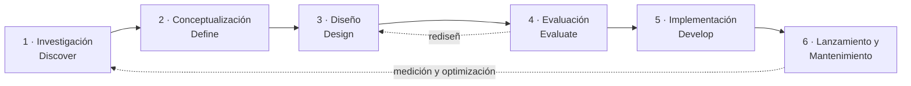
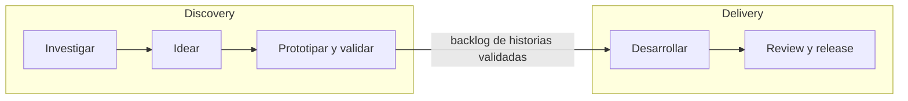

# Diseño de Interfaces Web

## Unidad 16 · Diseño Centrado en el Usuario

**Módulo 0615 · Diseño de Interfaces Web**  
CFGS Desarrollo de Aplicaciones Web (DAW)

---

## Objetivos de aprendizaje I

- <span class="fragment">Comprender el paradigma **DCU** según la norma **ISO 9241-210** y sus seis principios</span>
- <span class="fragment">Distinguir entre **DCU** (proceso), **UX** (resultado) y **usabilidad** (métrica)</span>
- <span class="fragment">Aplicar las fases del proceso iterativo de DCU a proyectos de distinta escala</span>
- <span class="fragment">Crear **User Personas** basadas en datos de investigación</span>
- <span class="fragment">Elaborar **Customer Journey Maps** completos: fases, emociones y pain points</span>

Note: Estos objetivos cubren la mitad conceptual de la unidad: qué es el DCU, cómo se diferencia de UX y usabilidad, y las tres herramientas de síntesis de investigación. Pregunta para el aula: ¿cuál de estas herramientas habéis visto ya aplicada en algún proyecto real? El hilo conductor será pasar de la intuición del diseñador a la evidencia.

---

## Objetivos de aprendizaje II

- <span class="fragment">Redactar **User Stories** con formato estándar, **INVEST** y criterios de aceptación</span>
- <span class="fragment">Planificar investigación UX con métodos **cuantitativos** y **cualitativos** según la pregunta</span>
- <span class="fragment">Diseñar y conducir **entrevistas de usuario** profesionales y sin sesgos</span>
- <span class="fragment">Crear **encuestas** con escalas validadas (SUS, NPS) y tamaño de muestra adecuado</span>
- <span class="fragment">Realizar **benchmarking competitivo** de UX para detectar diferenciación</span>
- <span class="fragment">Integrar el DCU en equipos ágiles: **Dual Track**, Design Sprints, Lean UX Canvas</span>

Note: La segunda mitad es más práctica: redactar user stories de calidad, planificar investigación e integrar todo en entornos ágiles. Las actividades de la unidad evalúan tanto el dominio conceptual como la aplicación a casos concretos. Recordad que el DCU conecta con todos los RA del módulo: es su marco metodológico.

---

## Motivación: el experimento de Airbnb

<span class="fragment">2009. Airbnb apenas consigue reservas y está a punto de cerrar.</span>

<span class="fragment">Los fundadores viajan a Nueva York y <strong>fotografían profesionalmente</strong> los pisos de los anfitriones.</span>

<span class="fragment"><strong>Resultado: los ingresos por reserva se duplican.</strong></span>

<span class="fragment">No faltaba demanda: faltaba <strong>entender al usuario</strong>. Eso es el Diseño Centrado en Usuario.</span>

Note: Este caso ('Snow White') engancha porque muestra que a veces no hay que cambiar el producto, sino observar mejor al usuario. Podéis preguntar a la clase: ¿qué productos creéis que fracasan por no mirar a sus usuarios reales? El experimento fue barato y rápido, y validó una hipótesis enorme sobre la calidad de las fotos.

---

## ¿Qué es el DCU?

<span class="fragment">Filosofía y proceso que sitúa a los <strong>usuarios finales</strong> —sus necesidades, capacidades, limitaciones, contextos y objetivos— en el centro de cada decisión de diseño.</span>

<div style="display: grid; grid-template-columns: 1fr 1fr; gap: 0.6rem; font-size: 0.8rem; text-align: left;">
  <div class="fragment"><strong>UCD</strong> — <em>User-Centered Design</em></div>
  <div class="fragment"><strong>HCD</strong> — <em>Human-Centered Design</em> (denominación actual, más inclusiva)</div>
</div>

<span class="fragment">No es un estilo visual, ni una metodología de testing, ni un conjunto de wireframes.</span>

<span class="fragment">Referencia normativa: <strong>ISO 9241-210:2019</strong> · «Ergonomics of human-system interaction — Part 210: Human-centred design for interactive systems».</span>

Note: Insistid en que el DCU no es 'hacer maquetas bonitas': es una forma de tomar decisiones con evidencia. La ISO 9241-210 es la norma internacional de referencia en ergonomía de la interacción humano-sistema, y la exigirán las empresas serias en cualquier proceso formal de diseño.

---

## Los 6 principios (ISO 9241-210)

<div style="display: grid; grid-template-columns: 1fr 1fr; gap: 0.6rem; font-size: 0.8rem; text-align: left;">
  <div class="fragment"><strong>1 · Comprensión explícita</strong> de usuarios, tareas y entornos. Datos, no intuiciones ni opiniones del CEO.</div>
  <div class="fragment"><strong>2 · Participación activa</strong> de los usuarios en todo el proceso: co-crean, evalúan y dan feedback continuo.</div>
  <div class="fragment"><strong>3 · Evaluación continua</strong>: cada decisión se valida empíricamente, en cada iteración.</div>
  <div class="fragment"><strong>4 · Proceso iterativo</strong>: investigar → diseñar → prototipar → evaluar → aprender → rediseñar.</div>
  <div class="fragment"><strong>5 · Experiencia completa</strong>: emociones, marca, confianza, post-venta, contexto cultural.</div>
  <div class="fragment"><strong>6 · Equipo multidisciplinar</strong>: diseño, desarrollo, negocio, contenido, accesibilidad, usuarios.</div>
</div>

Note: Los seis principios salen literalmente de la ISO 9241-210. Pedid ejemplos de cada uno con apps que la clase use a diario. El principio de 'experiencia completa' suele sorprender: incluye post-venta y contexto cultural, no solo la interfaz. Y el de participación: los usuarios no diseñan, informan y validan.

---

## DCU, UX y usabilidad: no se confundan

<div style="font-size: 0.9rem;">
<table>
  <thead>
    <tr><th>Concepto</th><th>Qué es</th><th>Ejemplo</th></tr>
  </thead>
  <tbody>
    <tr><td><strong>DCU</strong></td><td>El <em>proceso</em>: cómo se diseña</td><td>Iterar con tests de usuario</td></tr>
    <tr><td><strong>UX</strong></td><td>El <em>resultado</em>: lo que experimenta el usuario</td><td>La sensación al usar la app</td></tr>
    <tr><td><strong>Usabilidad</strong></td><td>Métrica de calidad dentro de la UX</td><td>Eficacia, eficiencia, satisfacción</td></tr>
    <tr><td><strong>Accesibilidad</strong></td><td>Dimensión de la usabilidad</td><td>Usable por personas con discapacidad</td></tr>
    <tr><td><strong>Design Thinking</strong></td><td>Metodología hermana, alcance más amplio</td><td>Innovación en problemas complejos</td></tr>
  </tbody>
</table>
</div>

Note: Esta distinción cae en exámenes y en entrevistas de trabajo. Truco mnemotécnico: el DCU es el camino, la UX es el destino y la usabilidad es el velocímetro. La accesibilidad no es algo aparte: es una dimensión de la usabilidad, y el DCU debe incorporar la diversidad funcional desde el primer día.

---

## Fases del proceso de DCU

<span class="fragment">No es cascada: es un <strong>ciclo iterativo</strong> cuyas fases se superponen y se repiten a distintas escalas (dentro de un sprint, de un proyecto, del ciclo de vida del producto).</span>



Note: Enfatizad que el proceso no termina con el lanzamiento: el mantenimiento realimenta una nueva iteración. La flecha de retorno es la diferencia entre un producto vivo y un producto congelado. Cada fase tiene actividades, entregables y criterios de salida propios, que veremos en las dos diapositivas siguientes.

---

## Fases I: Discover y Define

<div style="display: grid; grid-template-columns: 1fr 1fr; gap: 0.6rem; font-size: 0.75rem; text-align: left;">
  <div class="fragment">
    <strong>1 · Investigación (Discover)</strong><br>
    Observación contextual, entrevistas, benchmarking UX, analítica web, encuestas, literatura previa.<br>
    <em>Entregables:</em> informe de hallazgos, proto-personas, mapa de empatía, journey map as-is, problem statement.<br>
    <em>Salida:</em> sabemos quién es el usuario, qué necesita y dónde duele hoy.
  </div>
  <div class="fragment">
    <strong>2 · Conceptualización (Define)</strong><br>
    Ideación (brainstorming, crazy eights), principios de diseño, personas definitivas, escenarios, arquitectura de la información, priorización <strong>MoSCoW</strong>.<br>
    <em>Entregables:</em> personas finales, journey map to-be, mapa de AI, backlog inicial priorizado.
  </div>
</div>

Note: El criterio de salida de Discover es poder responder: ¿quién es nuestro usuario, qué necesita y dónde duele la experiencia actual? En Define aparece MoSCoW (Must have, Should have, Could have, Won't have) como técnica de priorización de funcionalidades. Ojo: el journey map to-be contrasta con el as-is descubierto en la fase anterior.

---

## Fases II: Design, Evaluate, Launch

<div style="display: grid; grid-template-columns: 1fr 1fr; gap: 0.6rem; font-size: 0.75rem; text-align: left;">
  <div class="fragment">
    <strong>3 · Diseño (Design)</strong><br>
    De baja a alta fidelidad: sketches → wireframes → prototipos interactivos → mockups. Sistema de diseño y UX writing.
  </div>
  <div class="fragment">
    <strong>4 · Evaluación (Evaluate)</strong><br>
    Tests de usabilidad moderados y no moderados, heurística, accesibilidad, métricas (SUS, tiempo de tarea, tasa de éxito), A/B testing.
  </div>
  <div class="fragment">
    <strong>5 · Implementación (Develop)</strong><br>
    Front-end y back-end, QA, rendimiento y seguridad. Las desviaciones técnicas que afecten a la UX se reevalúan.
  </div>
  <div class="fragment">
    <strong>6 · Lanzamiento y Mantenimiento</strong><br>
    Despliegue progresivo, monitorización de métricas reales, feedback continuo → nueva iteración del ciclo.
  </div>
</div>

Note: Recordad que el DCU no termina en la implementación: si un cambio técnico afecta a la experiencia, hay que volver a evaluarlo con usuarios. El despliegue progresivo permite medir el impacto real antes de liberar al 100%. La evaluación usa prototipos de baja, media y alta fidelidad según el momento del ciclo.

---

## User Personas

<span class="fragment">Arquetipo <strong>ficticio pero realista</strong> de un grupo de usuarios con comportamientos, necesidades y motivaciones similares.</span>

<span class="fragment">Introducidas por <strong>Alan Cooper</strong> en <em>The Inmates Are Running the Asylum</em> (<strong>1999</strong>) para acabar con el «usuario elástico» que se adapta a cualquier decisión de diseño.</span>

<span class="fragment">No son estereotipos demográficos: son <strong>perfiles conductuales y psicográficos</strong> ricos.</span>

<span class="fragment">Número óptimo por proyecto: <strong>3–5 personas</strong>. Menos de 3 no captura diversidad; más de 5 diluye el foco.</span>

Note: Alan Cooper acuñó las personas en 1999 precisamente contra el 'usuario elástico', ese avatar imaginario que justifica cualquier decisión de diseño. Insistid en el rango 3-5: con más de cinco personas el equipo deja de recordarlas y de usarlas. Cada persona debe diferir de las demás en al menos un eje relevante.

---

## Elementos de una buena persona

<div style="display: grid; grid-template-columns: 1fr 1fr; gap: 0.6rem; font-size: 0.8rem; text-align: left;">
  <div class="fragment"><strong>Nombre + foto</strong> — humaniza: «¿Qué haría Carmen en esta pantalla?»</div>
  <div class="fragment"><strong>Datos demográficos relevantes</strong> — solo los que afectan al uso del producto</div>
  <div class="fragment"><strong>Contexto de uso</strong> — dónde, cuándo, dispositivos, con prisa o con calma</div>
  <div class="fragment"><strong>Objetivos y necesidades</strong> — funcionales, de experiencia y aspiracionales</div>
  <div class="fragment"><strong>Frustraciones / pain points</strong> — qué le molesta hasta hacerle abandonar</div>
  <div class="fragment"><strong>Comportamientos</strong> — ¿investiga antes o decide por impulso?</div>
  <div class="fragment"><strong>Cita textual</strong> — frase real de entrevista que capture su esencia</div>
</div>

Note: El elemento más infravalorado es la cita textual auténtica: una frase real de entrevista pesa más que diez adjetivos inventados. Decid a la clase que busque en las transcripciones frases que 'suenen a usuario' y no a diseñador. Y recordad: las personas no son un póster en la pared, son una herramienta de decisión diaria.

---

## Proto-personas vs Personas basadas en investigación

<div style="font-size: 0.9rem;">
<table>
  <thead>
    <tr><th></th><th>Proto-personas</th><th>Personas basadas en investigación</th></tr>
  </thead>
  <tbody>
    <tr><td><strong>Origen</strong></td><td>Workshop rápido + suposiciones del equipo</td><td>Entrevistas, encuestas, observación, analítica</td></tr>
    <tr><td><strong>Coste</strong></td><td>Bajo, inmediato</td><td>Alto, proceso riguroso de síntesis</td></tr>
    <tr><td><strong>Uso</strong></td><td>Alinear al equipo al inicio, generar hipótesis</td><td>Dirigir decisiones y defenderlas ante stakeholders</td></tr>
    <tr><td><strong>Límite</strong></td><td colspan="2">Nunca sustituyen a la investigación: deben validarse o refutarse con usuarios lo antes posible</td></tr>
  </tbody>
</table>
</div>

Note: Las proto-personas no están mal: sirven para arrancar y alinear al equipo. Lo grave es dejarlas sin validar jamás. Pregunta para el aula: ¿cuándo aceptaríais trabajar solo con proto-personas? (Proyectos muy cortos o con presupuesto mínimo, y siempre etiquetadas como tales.)

---

## Ejemplo: personas para una app de fitness

<span class="fragment mini">Base: 15 entrevistas + encuesta a 200 usuarios → 3 personas</span>

<div style="display: grid; grid-template-columns: 1fr 1fr 1fr; gap: 0.6rem; font-size: 0.7rem; text-align: left;">
  <div class="fragment">
    <strong>Marina, 28</strong> · principiante motivada<br>
    Administrativa, vida sedentaria. 30-40 min a las 19:30, sin equipamiento. Necesita guía paso a paso y refuerzo positivo.<br>
    «No quiero sentirme torpe…»
  </div>
  <div class="fragment">
    <strong>Carlos, 35</strong> · deportista intermedio<br>
    Ingeniero. Corre 10K, 45 min a las 7:00, con mancuernas. Quiere datos, cronómetro y cero fricción.<br>
    «No necesito motivación, necesito eficiencia.»
  </div>
  <div class="fragment">
    <strong>Elena, 52</strong> · recuperadora post-lesión<br>
    Profesora. Lesión de rodilla, sesiones pausadas por la tarde. Necesita bajo impacto y ejercicios seguros.<br>
    «Yo necesito ir a mi ritmo.»
  </div>
</div>

Note: Tres personas que difieren en tres ejes: nivel de experiencia, momento de uso y restricción física. Fijaros en cómo cada una empuja el diseño en otra dirección: Marina pide tutoriales, Carlos pide métricas, Elena pide filtros por limitación. Ninguna app única sirve igual a las tres: ahí está el valor de tenerlas.

---

## Customer Journey Map

<span class="fragment">Visualización cronológica de todos los <strong>touchpoints</strong> del usuario con el producto a lo largo del tiempo: qué hace, qué piensa y qué siente en cada etapa.</span>

<div style="display: grid; grid-template-columns: 1fr 1fr; gap: 0.6rem; font-size: 0.8rem; text-align: left;">
  <div class="fragment"><strong>Fases</strong> — etapas grandes: descubrimiento → … → fidelización</div>
  <div class="fragment"><strong>Acciones</strong> — qué hace concretamente en cada fase</div>
  <div class="fragment"><strong>Touchpoints / canales</strong> — web, app, email, teléfono, tienda física</div>
  <div class="fragment"><strong>Pensamientos</strong> — quotes reales extraídos de la investigación</div>
  <div class="fragment"><strong>Curva emocional</strong> — muestra dónde se rompe la experiencia y dónde funciona</div>
  <div class="fragment"><strong>Pain points → oportunidades</strong> — cada dolor se traduce en una mejora accionable</div>
</div>

Note: El journey map obliga a salir de la pantalla: incluye cómo el usuario descubre que tiene una necesidad y qué ocurre después de la compra. La curva emocional es lo que convierte un diagrama bonito en herramienta de decisión real. Se construye de forma colaborativa con marketing, ventas, soporte y desarrollo: cada uno tiene su pieza del puzzle.

---

## Ejemplo: journey map de compra online (as-is)

<span class="fragment mini">Experiencia: comprar un portátil · fases seleccionadas</span>

<div style="font-size: 0.7rem;">
<table>
  <thead>
    <tr><th></th><th>Comparación</th><th>Compra</th><th>Post-compra</th></tr>
  </thead>
  <tbody>
    <tr><td><strong>Acciones</strong></td><td>8 pestañas, Excel comparativo, opiniones en Amazon</td><td>Carrito, formulario largo, pago con tarjeta</td><td>Email de confirmación, tracking, recibe el paquete</td></tr>
    <tr><td><strong>Pensamiento</strong></td><td>«¿De verdad necesito 16 GB de RAM?»</td><td>«¿Por qué me obligan a crear una cuenta?»</td><td>«El tracking no se actualiza. ¿Dónde está mi pedido?»</td></tr>
    <tr><td><strong>Emoción</strong></td><td>😟 Frustrada</td><td>😡 Enfadada</td><td>😊 Aliviada</td></tr>
    <tr><td><strong>Pain point</strong></td><td>Tablas manuales, pérdida de tiempo</td><td>Registro obligatorio, formulario largo</td><td>Falta de comunicación proactiva</td></tr>
    <tr><td><strong>Oportunidad</strong></td><td>Comparador integrado, filtros por uso</td><td>Guest checkout, guardar datos</td><td>Notificaciones proactivas SMS/email</td></tr>
  </tbody>
</table>
</div>

Note: El enfado aparece justo en el checkout, provocado por el registro obligatorio. Cada oportunidad (guest checkout, notificaciones proactivas) sale de un pain point concreto: esa trazabilidad es lo que hace accionable el mapa y lo alimenta directamente del backlog. Un journey map efectivo debe poder traducirse en tareas.

---

## User Stories: formato canónico

<span class="fragment">Descripciones breves, centradas en el usuario y en lenguaje no técnico. Nacen en <strong>Extreme Programming (XP)</strong> y las popularizó <strong>Scrum</strong>.</span>

<p style="text-align: left; font-size: 1rem;"><strong>Como</strong> [tipo de usuario], <strong>quiero</strong> [funcionalidad], <strong>para</strong> [beneficio].</p>

<span class="fragment">«Como comprador frecuente, quiero guardar múltiples direcciones de envío en mi cuenta, para no tener que introducir la de casa y la de la oficina cada vez que compro.»</span>

<span class="fragment mini">Cada parte cumple una función: la persona ancla el «para quién», la funcionalidad el «qué» y el beneficio el «por qué».</span>

Note: El 'para' es lo que más se omite y lo más importante: fuerza a pensar en el valor. Si no sabéis completar el 'para', la historia probablemente no está bien formulada. Las user stories son el mecanismo principal para traducir necesidades de usuario en trabajo de desarrollo dentro del Product Backlog.

---

## Técnica INVEST (Bill Wake, 2003)

<div style="display: grid; grid-template-columns: 1fr 1fr; gap: 0.6rem; font-size: 0.8rem; text-align: left;">
  <div class="fragment"><strong>I · Independent</strong> — autocontenida; las dependencias crean bloqueos en cascada</div>
  <div class="fragment"><strong>N · Negotiable</strong> — recordatorio de conversación, no contrato detallado</div>
  <div class="fragment"><strong>V · Valuable</strong> — valor claro para usuario o negocio; si no, es tarea técnica</div>
  <div class="fragment"><strong>E · Estimable</strong> — el equipo puede estimar el esfuerzo; si no, spike de investigación</div>
  <div class="fragment"><strong>S · Small</strong> — se completa en un sprint, idealmente en pocos días</div>
  <div class="fragment"><strong>T · Testable</strong> — verificable objetivamente mediante criterios de aceptación</div>
</div>

Note: En clase, tomad una user story mal escrita y evaluadla letra a letra con INVEST: casi siempre falla en Small o Testable. Negociable significa que la story es una invitación a conversar con el Product Owner durante el sprint, no un pliego de condiciones cerrado.

---

## Criterios de aceptación: Given / When / Then

<span class="fragment">Condiciones <strong>específicas, medibles y comprobables</strong> para dar la historia por completada. Formato del Behavior-Driven Development:</span>

<p style="text-align: left; font-size: 0.85rem; padding: 0.5rem 1rem; border-left: 4px solid #4a90d9;">
<strong>Given</strong> que soy un comprador frecuente con sesión iniciada,<br>
<strong>When</strong> accedo a «Mis direcciones» y añado una nueva dirección,<br>
<strong>Then</strong> la dirección se guarda y aparece en el selector de direcciones del checkout.
</p>

<span class="fragment">Jerarquía del backlog: <strong>Épica → Tema → User Story</strong> (granularidad decreciente).</span>

Note: Given/When/Then convierte los criterios de aceptación en algo casi automatizable como test. La jerarquía épica-tema-historia es la que usará el Product Owner para organizar y priorizar el Product Backlog. Las historias demasiado grandes son épicas disfrazadas: toca descomponerlas.

---

## Investigación UX: dos familias de métodos

<div style="font-size: 0.9rem;">
<table>
  <thead>
    <tr><th></th><th>Cualitativos</th><th>Cuantitativos</th></tr>
  </thead>
  <tbody>
    <tr><td><strong>Pregunta</strong></td><td>¿Por qué? ¿Cómo?</td><td>¿Cuánto? ¿Cuántos?</td></tr>
    <tr><td><strong>Datos</strong></td><td>Ricos, profundos, contextuales</td><td>Numéricos, generalizables</td></tr>
    <tr><td><strong>Muestra</strong></td><td>Pequeña, no generalizable</td><td>Grande, estadísticamente significativa</td></tr>
    <tr><td><strong>Métodos</strong></td><td>Entrevistas (45-90 min), observación contextual, diarios, focus groups (6-8 pers.)</td><td>Encuestas, analítica web, tests A/B</td></tr>
  </tbody>
</table>
</div>

Note: Regla rápida para elegir: si la pregunta es '¿por qué?', método cualitativo; si es '¿cuántos?', cuantitativo. Ojo con los focus groups: las opiniones dominantes pueden silenciar a las minoritarias, por eso rara vez son la primera opción. La observación contextual revela comportamientos que el propio usuario no verbaliza.

---

## Triangulación metodológica

<span class="fragment">Combinar cualitativo + cuantitativo: las fortalezas de unos compensan las debilidades de otros.</span>

<span class="fragment"><strong>1 · El cualitativo genera hipótesis:</strong> «Los usuarios abandonan el checkout porque no entienden los gastos de envío».</span>

<span class="fragment"><strong>2 · El cuantitativo las valida a escala:</strong> test A/B de dos versiones del resumen de gastos de envío → <strong>+12% de finalización del checkout (p &lt; 0.01)</strong>.</span>

<span class="fragment mini">Regla: nunca decidir con un solo estudio, una sola métrica o una sola entrevista.</span>

Note: Este ejemplo ilustra el flujo completo de la investigación: la entrevista sugiere la hipótesis y el A/B la confirma a escala. Enseñad a leer el p-valor como umbral de confianza estadística, no como magia. Sin triangulación, el 'diseño centrado en el usuario' queda reducido a diseño basado en opiniones.

---

## Entrevistas de usuario efectivas

<span class="fragment">Una conversación estructurada donde el entrevistador <strong>aprende</strong> del participante. Ni encuesta oral ni interrogatorio.</span>

<div style="display: grid; grid-template-columns: 1fr 1fr; gap: 0.6rem; font-size: 0.8rem; text-align: left;">
  <div class="fragment"><strong>Preparación</strong> — guion semi-estructurado: introducción y consentimiento, calentamiento, 5-7 temas centrales, cierre.</div>
  <div class="fragment"><strong>Preguntas abiertas</strong> — «Cuéntame sobre la última vez que…». Evitar inductivas, binarias y sobre el futuro.</div>
  <div class="fragment"><strong>Ejecución</strong> — rapport, escucha activa, parafrasear y <strong>silencio productivo</strong> (esperar 3-5 s).</div>
  <div class="fragment"><strong>Análisis</strong> — transcripción → codificación temática → patrones (affinity mapping).</div>
</div>

<span class="fragment"><strong>Sesgos a evitar:</strong> sesgo de confirmación · preguntas inductivas · deseabilidad social.</span>

Note: El silencio productivo es lo más difícil: esperar 3-5 segundos tras una respuesta parece incómodo, pero es cuando llegan las respuestas más profundas. La gente predice mal su comportamiento futuro, por eso evitad preguntar '¿usarías esta función?'. El affinity mapping con post-its facilita el análisis colaborativo en equipo.

---

## Encuestas bien diseñadas

<span class="fragment"><strong>Tipos de pregunta:</strong> Likert · opción múltiple · abierta · diferencial semántico</span>

<span class="fragment"><strong>Escala validadas:</strong> SUS · UMUX · NPS · AttrakDiff</span>

<span class="fragment"><strong>Tamaño de muestra</strong> y margen de error → resultados estadísticamente significativos · <strong>Herramientas:</strong> Google Forms, Typeform, SurveyMonkey, Alchemer</span>

```html
<!-- Encuesta post-compra: email 24 h tras recibir el pedido -->
<label>¿Recibiste tu pedido en plazo? (Sí / No / No estoy seguro/a)</label>
<label>¿Qué tan fácil fue el proceso de compra? (SEQ, 1-7) <input type="range" min="1" max="7"></label>
<label>¿Qué aspecto te resultó más frustrante? <textarea></textarea></label>
<label>NPS: ¿recomendarías la tienda a un amigo? (0-10) <input type="number" min="0" max="10"></label>
```

Note: SUS es la escala de usabilidad más citada de la industria y el NPS mide la disposición a recomendar en una escala de 0 a 10. Con muestras pequeñas el margen de error se dispara: tratad los resultados como orientativos hasta alcanzar un tamaño de muestra suficiente. Mezclad tipos de pregunta: las abiertas aportan el 'por qué' que las cerradas no capturan.

---

## Otras técnicas de investigación UX

<div style="display: grid; grid-template-columns: 1fr 1fr; gap: 0.6rem; font-size: 0.8rem; text-align: left;">
  <div class="fragment"><strong>Observación contextual</strong> — ver al usuario en su entorno real; revela comportamientos que no verbaliza.</div>
  <div class="fragment"><strong>Benchmarking UX</strong> — análisis competitivo para posicionar el producto y detectar diferenciación.</div>
  <div class="fragment"><strong>Card Sorting</strong> — validar la arquitectura de la información agrupando tarjetas con participantes.</div>
  <div class="fragment"><strong>Tree Testing</strong> — validar la encontrabilidad en estructuras de navegación ya definidas.</div>
</div>

Note: Card sorting y tree testing son hermanas: la primera ayuda a descubrir cómo agrupan los usuarios la información, la segunda comprueba si la estructura construida se entiende. Optimal Workshop es la herramienta estándar de la industria para ambas. El benchmarking UX define criterios de evaluación comunes para comparar competidores en igualdad de condiciones.

---

## Herramientas complementarias del DCU

<div style="display: grid; grid-template-columns: 1fr 1fr; gap: 0.6rem; font-size: 0.8rem; text-align: left;">
  <div class="fragment"><strong>Storyboarding</strong> — visualizar escenarios de uso mediante viñetas.</div>
  <div class="fragment"><strong>Lean UX Canvas</strong> (Jeff Gothelf) — una página para declarar suposiciones y planificar su validación.</div>
  <div class="fragment"><strong>Design Sprints</strong> (Google Ventures · Jake Knapp, <em>Sprint</em>, 2016) — 5 días: Understand → Sketch → Decide → Prototype → Test.</div>
  <div class="fragment"><strong>Design Thinking</strong> (IDEO / Stanford d.school) — Empathize, Define, Ideate, Prototype, Test.</div>
</div>

Note: Design Sprint y Design Thinking comparten fases pero no propósito: el sprint responde a una pregunta de negocio concreta en 5 días; el thinking es un marco más abierto de innovación. El Lean UX Canvas sirve para poner las hipótesis por escrito antes de construir nada. El Design Sprint es ideal para desatascar decisiones y validar ideas arriesgadas antes de invertir en desarrollo.

---

## DCU en ágil: Dual Track

<span class="fragment">Propuesto por <strong>Jeff Patton</strong> y <strong>Marty Cagan</strong>: el equipo trabaja en dos tracks paralelos.</span>



<span class="fragment">Discovery va <strong>1-2 sprints por delante</strong> de Delivery: el backlog siempre contiene historias validadas con usuarios, no suposiciones.</span>

Note: El truco de Dual Track resuelve el clásico choque 'el ágil no da tiempo a investigar': discovery anticipa el trabajo para que delivery nunca construya sobre suposiciones. Es el modelo que integra UX en Scrum sin romper el ritmo de entrega, y el rol del diseñador UX encaja principalmente en el track de descubrimiento.

---

## Caso real: Spotify

<div style="display: grid; grid-template-columns: 1fr 1fr; gap: 0.6rem; font-size: 0.8rem; text-align: left;">
  <div class="fragment"><strong>Investigación continua</strong> — estudios etnográficos globales: descubrir música en India ≠ en Europa (Bollywood, música regional).</div>
  <div class="fragment"><strong>Segmentación conductual</strong> — «The Curator», «The Explorer», «The Habitual», «The Background Listener».</div>
  <div class="fragment"><strong>Personalización</strong> — Discover Weekly, Daily Mix y Release Radar nacen de necesidades investigadas.</div>
  <div class="fragment"><strong>Miles de tests A/B simultáneos</strong> — si un cambio no mejora engagement o satisfacción, no se lanza.</div>
</div>

Note: Spotify segmenta por comportamiento musical y contexto de escucha, no por demografía: por eso sus 'personas' son The Curator, The Explorer, etc. Los miles de A/B simultáneos explican por qué la app cambia constantemente: todo se mide antes de desplegarse globalmente. No asumen que lo que funciona en Estocolmo funciona en Mumbai.

---

## Caso real: Airbnb

<span class="fragment"><strong>Joe Gebbia</strong>, co-fundador y Chief Product Officer, es diseñador de formación (RISD): el pensamiento de diseño está institucionalizado en la empresa.</span>

<div style="display: grid; grid-template-columns: 1fr 1fr; gap: 0.6rem; font-size: 0.8rem; text-align: left;">
  <div class="fragment"><strong>Proyecto «Snow White»</strong> — fotos profesionales en NY duplicaron los ingresos; hoy ofrecen fotografía gratuita a todos los anfitriones.</div>
  <div class="fragment"><strong>Journey maps de dos lados</strong> — guest y host a la vez; cada funcionalidad se prioriza por su impacto en ambos.</div>
  <div class="fragment"><strong>Investigación inmersiva</strong> — diseñadores e investigadores viajan, se alojan y entrevistan en los hogares.</div>
</div>

Note: El caso de las fotos demuestra el principio de evaluación: una hipótesis barata y rápida validó una mejora enorme. El reto dual guest/host es único en la industria: ninguna otra empresa diseña simultáneamente para dos usuarios opuestos. Las inmersiones periódicas evitan que el equipo pierda el contacto con la realidad del usuario.

---

## Caso real: BBVA

<div style="display: grid; grid-template-columns: 1fr 1fr; gap: 0.6rem; font-size: 0.8rem; text-align: left;">
  <div class="fragment"><strong>Equipo de diseño interno</strong> — cientos de personas integradas en negocio y tecnología, no externalizado a agencias.</div>
  <div class="fragment"><strong>Experience Design System</strong> — unifica app, banca de empresas, web y cajeros en todos sus países.</div>
  <div class="fragment"><strong>Big data + cualitativo</strong> — los datos mostraban abandono; las entrevistas revelaron: lenguaje financiero incomprensible.</div>
  <div class="fragment"><strong>Discovery antes de desarrollar</strong> — cada funcionalidad pasa por investigación + prototipado previo.</div>
</div>

Note: BBVA es el ejemplo español de referencia: equipo interno grande, design system global y combinación de big data con investigación cualitativa. El caso del lenguaje financiero es perfecto para explicar la triangulación: los datos dicen 'dónde' se abandona, las entrevistas dicen 'por qué'. El design system reduce drásticamente el tiempo de desarrollo de nuevas funcionalidades.

---

## Actividad en clase

<span class="fragment"><strong>Objetivo:</strong> crear 3 User Personas para una app de recetas a partir de datos de investigación reales.</span>

<div style="display: grid; grid-template-columns: 1fr 1fr; gap: 0.6rem; font-size: 0.8rem; text-align: left;">
  <div class="fragment"><strong>Materiales:</strong> transcripciones de 12 entrevistas + encuesta a 150 personas + plantilla de persona.</div>
  <div class="fragment"><strong>Formato:</strong> grupos de 3-4 · <strong>duración:</strong> 75 minutos.</div>
  <div class="fragment"><strong>Proceso:</strong> extraer notas en post-its → affinity mapping → identificar grupos → rellenar fichas → validar diferencias.</div>
  <div class="fragment"><strong>Entregable:</strong> documento con 3 personas en formato ficha visual.</div>
</div>

Note: Los 15 primeros minutos son lectura y extracción de post-its; luego affinity mapping en la pizarra o en Miro. Circulad por los grupos y preguntad: ¿este grupo de post-its describe a una persona realmente distinta de las otras? Cada grupo presenta su entregable en 2 minutos. Validad que las tres personas no se solapan entre sí.

---

## Buenas prácticas

- <span class="fragment">✅ <strong>Investiga antes de diseñar:</strong> tú también eres usuario, y eso es justo el problema.</span>
- <span class="fragment">✅ <strong>Involucra a todo el equipo:</strong> devs y PMs deben observar al menos 2 sesiones de usuario por trimestre.</span>
- <span class="fragment">✅ <strong>Las personas son herramientas de decisión, no pósters:</strong> cada story debe referenciar a una persona.</span>
- <span class="fragment">✅ <strong>Itera en ciclos cortos:</strong> prototipo mínimo → 3-5 usuarios → aprende → rediseña.</span>
- <span class="fragment">✅ <strong>Triangula métodos y fuentes:</strong> cualitativo + cuantitativo, observado + declarado.</span>
- <span class="fragment">✅ <strong>Haz los hallazgos accesibles:</strong> research repository compartido por todo el equipo.</span>
- <span class="fragment">✅ <strong>Diseña para la diversidad:</strong> edades, capacidades, contextos socioeconómicos y geográficos.</span>

Note: Destacad la práctica de que desarrolladores y product managers observen sesiones de usuario: dos horas viendo a un usuario real alinean más que diez reuniones. Y el research repository: si la investigación vive en la cabeza de una persona o en un informe que nadie lee, es como si no existiera.

---

## Errores frecuentes

- <span class="fragment">❌ <strong>Personas de estereotipo</strong> inventadas en un workshop y nunca validadas con investigación.</span>
- <span class="fragment">❌ <strong>Diseñar para uno mismo:</strong> el diseñador es, por definición, un usuario atípico.</span>
- <span class="fragment">❌ <strong>Preguntar qué quieren</strong> en vez de observar qué necesitan: «caballos más rápidos» (Henry Ford).</span>
- <span class="fragment">❌ <strong>Parálisis por análisis:</strong> «hay que recopilar más datos» sin pasar nunca a la acción.</span>
- <span class="fragment">❌ <strong>User stories mal formuladas:</strong> demasiado técnicas («migrar a PostgreSQL») o vagas («una app mejor»).</span>
- <span class="fragment">❌ <strong>Journey maps de ficción:</strong> curvas emocionales basadas en lo que el equipo cree que siente el usuario.</span>
- <span class="fragment">❌ <strong>Olvidar la inclusión:</strong> el 15% de la población tiene alguna discapacidad.</span>

Note: El error de 'diseñar para uno mismo' es el más común en estudiantes: sois expertos digitales y vuestros usuarios no lo son. La cita de Henry Ford resume el otro extremo: los usuarios son expertos en sus problemas, no en vuestras soluciones. Y recordad el dato: el 15% de la población tiene alguna discapacidad, así que las personas deben reflejar esa diversidad.

---

## Resumen · Conceptos clave

- <span class="fragment">🎯 <strong>DCU</strong> (ISO 9241-210:2019): filosofía y proceso iterativo de 6 fases guiado por evidencia, no por suposiciones.</span>
- <span class="fragment">🎯 <strong>Tríptico de herramientas:</strong> Personas (para quién) · Journey Maps (contexto y emociones) · User Stories (qué y por qué).</span>
- <span class="fragment">🎯 <strong>Investigación UX:</strong> cualitativo (¿por qué?) + cuantitativo (¿cuánto?) = triangulación metodológica.</span>
- <span class="fragment">🎯 <strong>Entrevistas:</strong> guion preparado, escucha activa, silencio productivo, codificación temática.</span>
- <span class="fragment">🎯 <strong>DCU + ágil:</strong> Dual Track Agile, Design Sprints de 5 días, Lean UX Canvas.</span>
- <span class="fragment">🎯 <strong>Casos de referencia:</strong> Spotify, Airbnb y BBVA — el DCU como ventaja competitiva real.</span>

Note: Cerrad volviendo al tríptico: personas para el 'para quién', journey maps para el 'dónde y cómo se siente', user stories para el 'qué construimos y por qué'. Todo fluye de la investigación y vuelve a ella en cada iteración. El DCU no es un lujo académico: es una ventaja competitiva que se traduce en productos que los usuarios aman y recomiendan.

---

## Próximos pasos

<span class="fragment">Pasamos de investigar y planificar a construir. Próxima unidad:</span>

<span class="fragment" style="font-size: 1.3rem;"><strong>Unidad 17 · Tailwind CSS 4</strong></span>

<span class="fragment mini">Para llegar preparados: redactad 2 user stories propias con formato canónico y criterios Given/When/Then.</span>

Note: La unidad 17 cambia de marcha: aplicaremos utilidades CSS modernas a lo aprendido. Las user stories que traigan hechas les servirán para escribir el backlog de la unidad, así que insistid en entregarlas. Es la primera unidad del bloque de frameworks CSS del curso.

---

## ¿Preguntas?

Unidad 16 · Diseño Centrado en el Usuario

0615 · DAW · Curso 2025/2026

Note: Dejad espacio para dudas sobre la unidad y sobre el proyecto de fin de módulo. Recordad que el DCU no acaba aquí: será el hilo conductor de todas las unidades restantes del curso. Quien quiera profundizar: 'Interviewing Users' de Steve Portigal y 'Mapping Experiences' de Jim Kalbach.
