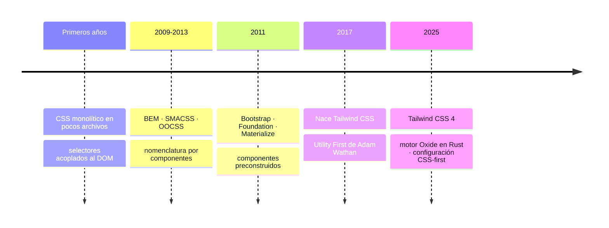

# Diseño de Interfaces Web

## Unidad 17 · Tailwind CSS 4

**Módulo 0615 · Diseño de Interfaces Web**  
CFGS Desarrollo de Aplicaciones Web (DAW)

---

## Objetivos de aprendizaje · I

- <span class="fragment">Identificar el paradigma **Utility First** como alternativa al CSS en cascada tradicional</span>
- <span class="fragment">Comprender el modelo de **clases atómicas** y contrastarlo con la maquetación convencional</span>
- <span class="fragment">Valorar productividad, consistencia visual y mantenibilidad de un framework basado en **restricciones**</span>
- <span class="fragment">Instalar y configurar **Tailwind CSS 4** en un proyecto real gestionado con **Vite**</span>
- <span class="fragment">Interpretar la **escala numérica** del sistema de diseño: espaciado, tipografía, colores, bordes (valores nominales ↔ rem/px)</span>
- <span class="fragment">Vinculación directa con el **RA2** del módulo 0615 (crea interfaces web homogéneas definiendo y aplicando estilos): maquetación con Tailwind CSS, layouts adaptables y componentes coherentes</span>

Note: Enfatiza que esta unidad no consiste en memorizar clases, sino en adoptar un nuevo modelo mental para escribir estilos. Pregunta al aula cuántos han perdido tiempo buscando qué regla CSS se les estaba aplicando: esa frustración es el punto de partida de toda la unidad. El RA2 es el resultado de aprendizaje principal con el que se evalúa.

---

## Objetivos de aprendizaje · II

- <span class="fragment">Manejar las utilidades de **layout**: display, posicionamiento, dimensionamiento, **Flexbox** y **Grid**</span>
- <span class="fragment">Aplicar el diseño responsivo **Mobile First** con los breakpoints del framework</span>
- <span class="fragment">Dominar estados interactivos (`hover`, `focus`, `active`, `disabled`) y pseudoselectores (`first`, `last`, `odd`, `even`)</span>
- <span class="fragment">Conocer las novedades de **v4**: nuevo motor interno, configuración en CSS nativo e integración optimizada con Vite</span>
- <span class="fragment">Construir **interfaces reales completas** y compararlas críticamente con CSS tradicional</span>
- <span class="fragment">Vinculaciones transversales: **RA1** (elección razonada de frameworks y herramientas · CE 1.e) y **RA4** (contenido interactivo: los componentes con Tailwind son la base visual de las funcionalidades JS)</span>

Note: Destaca el penúltimo objetivo: la comparación crítica entre ambos enfoques será la base de la evaluación de la unidad. El lenguaje común de clases atómicas también facilita el trabajo en equipo y las revisiones de código, una competencia transversal explícita del módulo. Recuerda que la documentación oficial de Tailwind es su referencia continua durante toda la carrera profesional.

---

## ¿Por qué Tailwind? El dolor del CSS

<span class="fragment">«¿Cuánto tiempo perdiste buscando qué clase `.container-2` estaba pisando tu margen?»</span>

<span class="fragment">El CSS tradicional en proyectos grandes:</span>

- <span class="fragment">Colisiones de nombres de clases</span>
- <span class="fragment">Especificidad y cascada descontroladas</span>
- <span class="fragment">Archivos CSS que crecen sin límite</span>
- <span class="fragment">Paradoja: inventar nombres semánticos para cada contenedor</span>

<span class="fragment">Tailwind cambia el paradigma: **estilos directamente en el HTML**, con clases atómicas.</span>

Note: Usa ejemplos propios de «dolor CSS»: archivos de miles de líneas, guerras de !important, nombres misteriosos heredados de otros desarrolladores. El objetivo es generar empatía con el problema antes de presentar la solución. Puedes pedir a quien haya renombrado una clase que afectó a tres componentes que levante la mano.

---

## Conocimientos previos

<div style="display: grid; grid-template-columns: 1fr 1fr; gap: 0.6rem; font-size: 0.8rem; text-align: left;">
  <div class="fragment">
    <strong>Marca y estilo</strong><br>
    • HTML5 semántico: header, nav, main, section, article, aside, footer<br>
    • Modelo de caja: margin, padding, border<br>
    • CSS3: selectores, especificidad, cascada<br>
    • Flexbox y Grid básicos<br>
    • Media queries y Mobile First
  </div>
  <div class="fragment">
    <strong>Entorno y herramientas</strong><br>
    • Node.js: npm, package.json, node_modules<br>
    • Empaquetador: Vite o Webpack, HMR, scripts<br>
    • Unidades relativas: rem, em, vw, vh, %<br>
    • Chrome DevTools / Firefox Developer Edition<br>
    • Recomendado: 3 maquetas previas (landing, dashboard, formulario)
  </div>
</div>

Note: Haz un diagnóstico rápido: quien no domine Flexbox, Grid o media queries debe repasar las unidades 09 a 11 antes de empezar. Insiste en que la experiencia previa de «dolor CSS» en maquetas propias es el mejor punto de partida para valorar el cambio de paradigma.

---

## Evolución del CSS hacia Utility First



<span class="mini">Cada etapa resolvió problemas de la anterior, pero añadió nuevos: carga de nomenclatura, apariencia homogénea, personalización limitada.</span>

Note: Recorre la cronología subrayando que las metodologías (BEM, SMACSS, OOCSS) mejoraron la mantenibilidad pero obligaban a inventar nombres, y que los frameworks de componentes aceleraban el desarrollo pero homogeneizaban el resultado. Tailwind responde con la restricción entendida como ventaja, no como limitación.

---

## El paradigma Utility First

- <span class="fragment">Propuesta de **Adam Wathan**: clases atómicas de propósito único, aplicadas directamente en el HTML</span>
- <span class="fragment">Cada clase ≈ **una declaración CSS** individual</span>
- <span class="fragment">No hay que alternar entre archivos: todo el estilo vive junto a la marca</span>
- <span class="fragment">Es un **sistema de diseño completo** en forma de clases: paleta, escala tipográfica, espaciado, sombras, bordes, breakpoints</span>
- <span class="fragment">En producción solo existen las clases usadas: **purgado / tree-shaking**</span>

```html
<!-- Antes: una clase semántica con varias propiedades -->
<div class="card"></div>

<!-- Después: composición de utilidades -->
<div class="bg-white rounded-lg shadow-md p-6 flex flex-col gap-4"></div>
```

<span class="fragment">«Tailwind te da el poder de construir cualquier diseño sin tener que luchar contra estilos predefinidos» — <strong>Adam Wathan</strong></span>

Note: Haz el ejemplo de la tarjeta en vivo: escribe primero la versión tradicional con su bloque CSS y conviértela después a utilidades. Reconoce el rechazo inicial a la verbosidad y explica cómo desaparece en proyectos reales. Lee la cita de Adam Wathan en voz alta para cerrar.

---

## Utility First: ventajas y desventajas

<div style="display: grid; grid-template-columns: 1fr 1fr; gap: 0.6rem; font-size: 0.8rem; text-align: left;">
  <div class="fragment">
    <strong>✅ Ventajas</strong><br>
    • Productividad máxima: sin cambios de contexto HTML↔CSS<br>
    • Consistencia garantizada: escalas de valores predefinidas<br>
    • CSS mínimo en producción: solo clases usadas, unos pocos KB<br>
    • Sin inventar nombres: menos carga cognitiva<br>
    • Refactorización sin miedo: clases independientes, sin herencia compleja
  </div>
  <div class="fragment">
    <strong>⚠️ Desventajas</strong><br>
    • Verbosidad en el HTML, abrumadora al inicio<br>
    • Curva de aprendizaje de la nomenclatura (docs + IDE la resuelven)<br>
    • Combinaciones repetidas → extraer componentes o usar @apply<br>
    • Nuevo modelo mental para defensores de la separación estricta de concerns
  </div>
</div>

Note: Mantén el equilibrio del debate y reconoce las desventajas con honestidad. Explica que la repetición se soluciona extrayendo componentes en el framework elegido (React, Vue, Angular) o con @apply. Cierra preguntando: ¿en qué tipo de proyecto NO elegirías Tailwind?

---

## Tailwind CSS 4: novedades clave

- <span class="fragment">Lanzada a **principios de 2025**: la mayor reescritura desde la creación del framework</span>
- <span class="fragment">Nuevo motor **Oxide**, escrito en **Rust**, sustituye al generador JavaScript</span>
- <span class="fragment">Hasta **10× más rápido** generando CSS; hot reload instantáneo y builds muy rápidas</span>
- <span class="fragment">Configuración **CSS-first**: `@theme` en CSS, sin `tailwind.config.js` por defecto</span>
- <span class="fragment">Con Vite bastan `tailwindcss` + `@tailwindcss/vite`: **adiós a PostCSS y autoprefixer**</span>
- <span class="fragment">Una sola línea, `@import "tailwindcss"`, sustituye a las tres directivas `@tailwind` de v3</span>
- <span class="fragment">Nesting y `@layer` nativos, paleta ampliada, nuevas animaciones y transiciones</span>
- <span class="fragment">Migración v3→v4 asistida por herramienta automática; recomendación oficial: empezar con v4</span>

Note: Subraya la magnitud del cambio: un motor en Rust implica compilaciones radicalmente más rápidas, y la configuración CSS-first acerca Tailwind a los estándares emergentes de CSS. Para proyectos nuevos, siempre v4; la herramienta de migración existe para el código legado.

---

## v3 vs v4

<div style="font-size: 0.9rem;">

| Aspecto | Tailwind v3 | Tailwind v4 |
|---|---|---|
| Configuración | `tailwind.config.js` (JS) | `@theme` en CSS, sin archivo por defecto |
| Motor | Generador JavaScript | **Oxide** (Rust) |
| Integración Vite | postcss + autoprefixer | `@tailwindcss/vite` |
| Importación | `@tailwind base/components/utilities` | `@import "tailwindcss"` |
| Rendimiento | Referencia | **5-10× más rápido** |
| CSS nesting | Requiere PostCSS | Nativo |

</div>

<span class="mini">El archivo `tailwind.config.js` sigue disponible opcionalmente en v4 si se prefiere el enfoque clásico.</span>

Note: Esta tabla es la referencia rápida de la unidad; el alumnado la usará constantemente durante la instalación. Señala que la diferencia conceptual importante no es la sintaxis, sino dónde vive la configuración: ahora en el propio CSS.

---

## Instalación con Vite · pasos 1-3

<span class="fragment"><strong>Paso 1.</strong> Crear el proyecto con plantilla `vanilla` (HTML, CSS y JS puros):</span>

```bash
npm create vite@latest mi-proyecto -- --template vanilla
cd mi-proyecto
```

<span class="fragment"><strong>Paso 2.</strong> Instalar las dependencias base de Vite:</span>

```bash
npm install
```

<span class="fragment"><strong>Paso 3.</strong> Instalar Tailwind CSS 4 y su plugin de Vite:</span>

```bash
npm install tailwindcss @tailwindcss/vite
```

- <span class="fragment">`tailwindcss`: núcleo del framework con el motor Oxide</span>
- <span class="fragment">`@tailwindcss/vite`: adaptador que procesa las directivas en desarrollo y build</span>
- <span class="fragment">A diferencia de v3: **no hace falta PostCSS ni autoprefixer**</span>

Note: Haz que el alumnado ejecute estos pasos en parejas y narre en voz alta qué hace cada comando. Error típico: olvidar el doble guion antes de --template. Vite aprovecha módulos ES nativos en desarrollo y Rollup para los builds de producción, y el plugin escanea HTML y JS para detectar clases y generar el CSS.

---

## Instalación con Vite · configuración y verificación

<span class="fragment"><strong>Paso 4.</strong> Registrar el plugin en `vite.config.js`:</span>

```javascript
// vite.config.js
import { defineConfig } from 'vite'
import tailwindcss from '@tailwindcss/vite'

export default defineConfig({
  plugins: [tailwindcss()],
})
```

<span class="fragment"><strong>Paso 5.</strong> Importar Tailwind en `style.css` (una única línea):</span>

```css
/* style.css */
@import "tailwindcss";
```

<span class="fragment"><strong>Paso 6.</strong> Probar en `index.html` y lanzar `npm run dev`:</span>

```html
<h1 class="text-3xl font-bold text-blue-600">¡Tailwind CSS 4 funciona!</h1>
```

- <span class="fragment">Si el titular aparece grande, en negrita y azul, la configuración está completa</span>
- <span class="fragment">El plugin genera el CSS y aplica **tree-shaking**; los cambios se ven al instante gracias al **HMR** de Vite</span>

Note: Verifica en común que el titular de prueba se renderice correctamente antes de seguir. Si no aparecen los estilos, lo primero a comprobar es que el plugin esté registrado en vite.config.js. Aprovecha para explicar que HMR refleja los cambios al instante: parte de la productividad de este stack.

---

## El sistema de diseño: escala numérica

- <span class="fragment">Escala **0 → 96**: cada paso equivale a **0.25rem** (4 px con 16 px/rem)</span>
- <span class="fragment">Progresión no lineal: 0, 0.5, 1, 1.5 … 12, 14, 16, 20, 24 … 72, 80, 96</span>

<div style="font-size: 0.9rem;">

| Clase | Valor | Píxeles |
|---|---|---|
| `p-1` | 0.25rem | 4 px |
| `p-2` | 0.5rem | 8 px |
| `p-3` | 0.75rem | 12 px |
| `p-4` | 1rem | 16 px |
| `p-6` | 1.5rem | 24 px |
| `p-12` | 3rem | 48 px |
| `p-24` | 6rem | 96 px |

</div>

- <span class="fragment">La restricción elimina la **parálisis por análisis**: todos los espaciados son múltiplos coherentes de 4 px</span>
- <span class="fragment">Resultado: **vertical rhythm**, ritmo visual armónico</span>
- <span class="fragment">Base en **rem** (raíz 16 px): los espaciados escalan con el tamaño de fuente del usuario → **accesibilidad**</span>
- <span class="fragment"><span class="mini">`font-size: 62.5%` en `html` es posible, pero no recomendado: rompe la correspondencia natural de la escala.</span></span>

Note: Haz ejercicios de cálculo mental: pregunta cuánto valen p-5 o m-8 en píxeles. Refuerza que rem escala con el tamaño de fuente preferido por el usuario, un beneficio directo de accesibilidad. La progresión concentra incrementos finos donde más se necesitan y saltos amplios en los márgenes de sección.

---

## La paleta de colores

- <span class="fragment"><strong>22 familias</strong> × <strong>11 tonos</strong> numerados del **50 al 950**</span>
- <span class="fragment">Neutros: **slate** (por defecto), gray, zinc, neutral, stone</span>
- <span class="fragment">Cromáticas: red, orange, amber, yellow, lime, green, emerald, teal, cyan, sky, blue, indigo, violet, purple, fuchsia, pink, rose</span>
- <span class="fragment">Nomenclatura: `bg-red-500` · `text-blue-700` · `border-emerald-400`</span>

<div style="display: grid; grid-template-columns: 1fr 1fr 1fr; gap: 0.6rem; font-size: 0.8rem; text-align: left;">
  <div class="fragment"><strong>Tonos 50–200</strong><br>Claros: fondos sutiles y superficies de tarjeta</div>
  <div class="fragment"><strong>Tonos 400–600</strong><br>Colores base: la identidad del color</div>
  <div class="fragment"><strong>Tonos 700–950</strong><br>Oscuros: texto sobre fondos claros, contraste</div>
</div>

<span class="fragment">Botón primario típico: `bg-blue-600 text-white` + `hover:bg-blue-700`</span>

Note: Lleva al alumnado a explorar la paleta interactivamente en la documentación oficial. Explica la lógica de tonos con el botón: 600 para el fondo, 700 en hover, blanco para el texto. Recuerda que slate es el neutro por defecto de Tailwind.

---

## Transparencia y colores de marca

- <span class="fragment">Notación de barra: `bg-red-500/75` ≡ `rgba(239, 68, 68, 0.75)`</span>
- <span class="fragment">Sintaxis `<color>-<tono>/<opacidad>`, opacidad de 0 a 100</span>
- <span class="fragment">Casos de uso: overlays, efecto vidrio esmerilado, jerarquía visual</span>
- <span class="fragment">Ejemplos: `bg-black/50` · `text-white/70` · `bg-indigo-600/20`</span>

```css
@import "tailwindcss";
@theme {
  --color-primary: #3b82f6;
  --color-primary-dark: #1e40af;
  --color-secondary: #f59e0b;
  --color-accent: #ec4899;
}
```

- <span class="fragment">Genera `bg-primary`, `text-primary`, `border-primary-dark`…</span>
- <span class="fragment">Integra con hover, focus y breakpoints; al ser variables CSS facilita temas oscuros o múltiples</span>

Note: Muestra el caso clásico del overlay: un hero con bg-black/50 sobre una imagen. Insiste en que definir la paleta corporativa como variables CSS en @theme es la base para implementar después temas oscuros o varios temas.

---

## Tipografía · tamaños y pesos

- <span class="fragment">Rango: `text-xs` (12 px) → `text-9xl` (128 px); cada tamaño incluye su **line-height calibrado**</span>

<div style="font-size: 0.9rem;">

| Clase | font-size | line-height |
|---|---|---|
| `text-xs` | 0.75rem (12 px) | — |
| `text-sm` | 0.875rem (14 px) | 1.25rem (20 px) |
| `text-base` | 1rem (16 px) | Por defecto |
| `text-xl` | 1.25rem (20 px) | 1.75rem (28 px) |
| `text-9xl` | 8rem (128 px) | — |

</div>

- <span class="fragment">Pesos: `font-thin` 100 · `extralight` 200 · `light` 300 · `normal` 400 · `medium` 500 · `semibold` 600 · `bold` 700 · `extrabold` 800 · `black` 900</span>
- <span class="fragment">Alineación: `text-left` · `text-center` · `text-right` · `text-justify`</span>
- <span class="fragment">Decoración: `underline` · `line-through` · `no-underline` (enlaces)</span>
- <span class="fragment">Transformación: `uppercase` · `lowercase` · `capitalize` · `normal-case`</span>

Note: Señala que cada tamaño lleva su altura de línea calibrada: por eso text-xl se ve bien sin configurar nada extra. Reta al alumnado a decir qué peso corresponde al 600 (semibold), el más usado en interfaces modernas.

---

## Tipografía · alturas, espaciado y familias

- <span class="fragment">Altura de línea: `leading-none` 1 · `tight` 1.25 · `snug` 1.375 · `normal` 1.5 · `relaxed` 1.625 · `loose` 2</span>
- <span class="fragment">Espaciado de letras: `tracking-tighter` −0.05em · `tight` −0.025em · `normal` 0 · `wide` 0.025em · `wider` 0.05em · `widest` 0.1em</span>
- <span class="fragment">`tracking-tight`: mejora la cohesión de **títulos grandes**</span>
- <span class="fragment">Familias: `font-sans` (Inter, system-ui…) · `font-serif` (Georgia, Cambria…) · `font-mono` (SFMono, Consolas…)</span>

```css
@import url('https://fonts.googleapis.com/css2?family=Playfair+Display:wght@400;700&family=Inter:wght@400;500;600;700&display=swap');
@theme {
  --font-display: 'Playfair Display', Georgia, serif;
  --font-body: 'Inter', ui-sans-serif, system-ui, sans-serif;
}
```

- <span class="fragment">Genera las clases `font-display` y `font-body`, usables como cualquier otra utilidad</span>

Note: Explica por qué tracking-tight funciona en titulares: reducir ligeramente el espaciado aumenta la cohesión de las letras a gran tamaño. El ejemplo muestra el flujo canónico de v4: importar la fuente desde Google Fonts y registrarla en @theme.

---

## Espaciado: margen, padding y gap

- <span class="fragment">Escala numérica común para **margen** (`m-*`), **padding** (`p-*`) y **gap** (`gap-*`)</span>
- <span class="fragment">Direccionalidad con sufijos: `t` arriba · `r` derecha · `b` abajo · `l` izquierda · `x` horizontal · `y` vertical</span>
- <span class="fragment">Ejemplos: `mt-4` · `mx-auto` · `my-6` · `pl-2`</span>
- <span class="fragment">Margen negativo: `-mt-4`, `-ml-2` (solapar elementos, ajustes finos)</span>
- <span class="fragment">`gap-*`, `gap-x-*`, `gap-y-*`: **recomendación moderna** para flex y grid</span>
- <span class="fragment"><span class="mini">`space-x-*` / `space-y-*`: técnica legacy (márgenes entre hijos excepto el primero); falla cuando los elementos envuelven a la siguiente línea.</span></span>

Note: Contrasta gap frente a space-x en vivo: crea un flex con muchos elementos y observa cómo space-x se rompe al envolver líneas. Refuerza que mx-auto combinado con max-w-* es el patrón clásico para centrar contenido.

---

## Layout: display, posición y z-index

<div style="display: grid; grid-template-columns: 1fr 1fr; gap: 0.6rem; font-size: 0.8rem; text-align: left;">
  <div class="fragment">
    <strong>Display</strong><br>
    • block · inline · inline-block<br>
    • flex · inline-flex · grid · inline-grid<br>
    • hidden (display: none)<br>
    • flow-root: clearfix moderno<br>
    • contents: el elemento desaparece del árbol de caja
  </div>
  <div class="fragment">
    <strong>Posición y z-index</strong><br>
    • static · fixed · absolute · relative · sticky<br>
    • Desplazamientos: top-* · right-* · bottom-* · left-* · inset-*<br>
    • z-0 · z-10 · z-20 · z-30 · z-40 · z-50 · z-auto
  </div>
</div>

Note: Aclara la diferencia entre flow-root (contiene flotantes, clearfix moderno) y contents (el elemento deja de existir en el árbol de caja y expone sus hijos al padre). Pregunta para cuándo usarían sticky: barras de navegación, cabeceras de tablas largas.

---

## Dimensionamiento: anchura, altura y contenedores

- <span class="fragment">Anchura: `w-*` (escala) · `w-full` 100% · `w-screen` 100vw · `w-min` · `w-max` · `w-fit`</span>
- <span class="fragment">Fracciones: `w-1/2` · `w-1/3` · `w-2/3` · `w-1/4` … `w-1/12`</span>
- <span class="fragment">Altura: `h-*` · `h-full` · `h-screen` · `h-min` · `h-max` · `h-fit`</span>
- <span class="fragment">Mínimos y máximos: `min-w-*` · `max-w-*` · `min-h-*` · `max-h-*`</span>

<div style="font-size: 0.9rem;">

| Clase | rem | px | | Clase | rem | px |
|---|---|---|---|---|---|---|
| `max-w-xs` | 20rem | 320 | | `max-w-4xl` | 56rem | 896 |
| `max-w-sm` | 24rem | 384 | | `max-w-5xl` | 64rem | 1024 |
| `max-w-md` | 28rem | 448 | | `max-w-6xl` | 72rem | 1152 |
| `max-w-lg` | 32rem | 512 | | `max-w-7xl` | 80rem | 1280 |
| `max-w-xl` | 36rem | 576 | | | | |
| `max-w-2xl` | 42rem | 672 | | | | |
| `max-w-3xl` | 48rem | 768 | | | | |

</div>

- <span class="fragment">`max-w-*` + `mx-auto`: forma recomendada de limitar la anchura del contenido</span>

Note: Fija tres contenedores de memoria: max-w-5xl para artículos, max-w-6xl para dashboards, max-w-7xl para layouts generales. Las fracciones como w-1/3 son esenciales para columnas iguales sin recurrir a Grid.

---

## Flexbox con utilidades Tailwind

- <span class="fragment">Contenedor: `flex` / `inline-flex`</span>
- <span class="fragment">Dirección: `flex-row` · `flex-row-reverse` · `flex-col` · `flex-col-reverse`</span>
- <span class="fragment">Envoltura: `flex-wrap` · `flex-wrap-reverse` · `flex-nowrap`</span>
- <span class="fragment">Eje principal: `justify-start` · `end` · `center` · `between` · `around` · `evenly`</span>
- <span class="fragment">Eje transversal: `items-start` · `end` · `center` · `baseline` · `stretch`</span>
- <span class="fragment">Líneas múltiples: `content-start` · `center` · `end` · `between` · `around` · `evenly`</span>
- <span class="fragment">Hijo individual: `self-auto` · `start` · `end` · `center` · `stretch` · `baseline`</span>
- <span class="fragment">Crecimiento: `flex-1` (1 1 0%) · `flex-auto` (1 1 auto) · `flex-initial` (0 1 auto) · `flex-none` · `grow`/`grow-0` · `shrink`/`shrink-0`</span>
- <span class="fragment">Orden: `order-first` · `order-last` · `order-none` · `order-1`…`order-12`</span>

Note: Esta diapositiva consolida la unidad 09 de Flexbox con el vocabulario de Tailwind. Haz un mini-test: ¿qué clase centra horizontalmente a los hijos en fila? (justify-center). Destaca que flex-1 es el caballo de batalla para columnas flexibles.

---

## Grid con utilidades Tailwind

- <span class="fragment">Contenedor: `grid` / `inline-grid`</span>
- <span class="fragment">Columnas: `grid-cols-1` … `grid-cols-12` · `grid-cols-none`</span>
- <span class="fragment">Filas: `grid-rows-1` … `grid-rows-6`</span>
- <span class="fragment">Spanning: `col-span-1`…`12` · `col-span-full` · `row-span-1`…`6` · `row-span-full`</span>
- <span class="fragment">Flujo: `grid-flow-row` (defecto) · `grid-flow-col` · variantes `-dense`</span>
- <span class="fragment">Posición explícita: `col-start-*` · `col-end-*` · `row-start-*` · `row-end-*` (1–13, auto)</span>
- <span class="fragment">Abreviaturas: `place-items-*` · `place-content-*` · `place-self-*`</span>
- <span class="fragment">Responsive: `grid-cols-1 md:grid-cols-2 lg:grid-cols-3`</span>

Note: Relaciona con la unidad 10 de CSS Grid: mismas propiedades, sintaxis distinta. El patrón grid-cols-1 md:grid-cols-2 lg:grid-cols-3 es el más usado en galerías de tarjetas. place-items-center es la abreviatura que más emplearán.

---

## Responsivo Mobile First

<div style="font-size: 0.9rem;">

| Prefijo | min-width | Contexto típico |
|---|---|---|
| `sm:` | 640 px | Móvil grande / tablet vertical |
| `md:` | 768 px | Tablet |
| `lg:` | 1024 px | Portátil |
| `xl:` | 1280 px | Escritorio |
| `2xl:` | 1536 px | Pantallas grandes |

</div>

<span class="fragment">Patrones habituales:</span>

- <span class="fragment">`grid grid-cols-1 sm:grid-cols-2 lg:grid-cols-3 xl:grid-cols-4`</span>
- <span class="fragment">`hidden lg:flex` (menú oculto en móvil) · `px-4 sm:px-6 lg:px-8` · `text-lg md:text-xl lg:text-2xl`</span>

<span class="fragment">Estrategia recomendada:</span>

1. <span class="fragment">Maquetar primero para móvil (clases base sin prefijo)</span>
2. <span class="fragment">Verificar la experiencia en pantallas pequeñas</span>
3. <span class="fragment">Añadir prefijos solo donde el diseño necesita adaptarse</span>
4. <span class="fragment">No forzar todos los breakpoints en cada elemento</span>

Note: Refuerza la filosofía: los prefijos son aditivos (min-width), a diferencia del desktop-first con max-width tradicional. Haz que redimensionen el navegador inspeccionando el ejemplo del grid progresivo. El antipatrón más caro es diseñar para escritorio y luego comprimir para móvil.

---

## Estados interactivos y pseudoselectores

<div style="display: grid; grid-template-columns: 1fr 1fr; gap: 0.6rem; font-size: 0.8rem; text-align: left;">
  <div class="fragment">
    <strong>Estados</strong><br>
    • hover: → hover:bg-blue-700 hover:text-white<br>
    • focus: → focus:outline-none focus:ring-2 focus:ring-blue-500<br>
    • focus-visible: solo teclado (accesibilidad)<br>
    • active: → active:scale-95<br>
    • disabled: → disabled:opacity-50 disabled:cursor-not-allowed<br>
    • visited: enlaces visitados
  </div>
  <div class="fragment">
    <strong>Estructurales y relacionales</strong><br>
    • first: · last: · odd: · even: (filas alternas en tablas)<br>
    • group-hover: reacciona al hover del ancestro con clase group<br>
    • peer-focus: reacciona al focus del hermano con clase peer<br>
    • dark: modo oscuro
  </div>
</div>

- <span class="fragment">Tablas: `table` · `table-auto` · `table-fixed` · `border-collapse` · `border-separate`</span>
- <span class="fragment">Interacciones complejas **sin JavaScript**</span>

Note: group-hover y peer-focus son las dos utilidades más infravaloradas: permiten interacciones complejas sin una línea de JavaScript. Demuestra un desplegable o tooltip usando peer y group. En accesibilidad, focus-visible evita mostrar el anillo al navegar con ratón.

---

## Bordes, sombras y efectos visuales

<div style="display: grid; grid-template-columns: 1fr 1fr; gap: 0.6rem; font-size: 0.8rem; text-align: left;">
  <div class="fragment">
    <strong>Bordes y anillos</strong><br>
    • Radio: rounded · md · lg · xl · 2xl · 3xl · full (círculo/píldora)<br>
    • Grosor: border · border-0 · 2 · 4 · 8 · direccional border-t-*<br>
    • Color: border-gray-300 · Estilo: solid · dashed · dotted · double · none<br>
    • Outline: outline-none · outline-offset-*<br>
    • Ring: ring-0/1/2/4/8 · ring-inset · ring-blue-500
  </div>
  <div class="fragment">
    <strong>Sombras y filtros</strong><br>
    • shadow-sm → shadow-2xl · shadow-inner · shadow-none<br>
    • Sombra con color: shadow-red-500/30<br>
    • Opacidad: opacity-0 → opacity-100 (pasos de 5 y 10)<br>
    • Desenfoque: blur-sm → blur-3xl<br>
    • backdrop-blur-sm → 3xl: vidrio esmerilado
  </div>
</div>

Note: Distingue outline (foco visible, accesibilidad) de ring (decorativo, box-shadow). La sombra con color shadow-red-500/30 es tendencia en diseños actuales, y backdrop-blur es la clave del efecto glassmorphism.

---

## Transiciones y animaciones

- <span class="fragment">Transición: `transition` · `transition-all` · `colors` · `opacity` · `shadow` · `transform`</span>
- <span class="fragment">Duración: `duration-75` … `duration-1000` · Easing: `ease-linear` · `in` · `out` · `in-out`</span>
- <span class="fragment">Retardo: `delay-75` … `delay-1000`</span>

<div style="display: grid; grid-template-columns: 1fr 1fr 1fr 1fr; gap: 0.6rem; font-size: 0.8rem; text-align: left;">
  <div class="fragment"><strong>animate-spin</strong><br>Rotación infinita: spinners de carga</div>
  <div class="fragment"><strong>animate-ping</strong><br>Escala y fade: notificaciones</div>
  <div class="fragment"><strong>animate-pulse</strong><br>Opacidad oscilante: skeleton loaders</div>
  <div class="fragment"><strong>animate-bounce</strong><br>Rebote: llamadas a la acción</div>
</div>

- <span class="fragment">Keyframes personalizados en `@theme` (v4)</span>

Note: Recomienda duraciones entre 150 y 300 ms para microinteracciones: por encima se perciben lentas. animate-pulse es el estándar para skeleton loaders mientras cargan datos. En v4, los keyframes personalizados se declaran dentro de @theme.

---

## Modo oscuro

- <span class="fragment">Prefijo `dark:` aplicado a cualquier utilidad</span>
- <span class="fragment">Estrategia 1: `@media (prefers-color-scheme: dark)` → automática según el SO</span>
- <span class="fragment">Estrategia 2: clase `.dark` → **manual con toggle JS (recomendada)**</span>
- <span class="fragment">Implementación: añadir/quitar `dark` en `<html>` con JS + persistir en **localStorage**</span>
- <span class="fragment">Suavizado: `transition-colors duration-300`</span>

```html
<body class="bg-white dark:bg-gray-900 text-gray-900 dark:text-white transition-colors duration-300">
```

Note: Explica por qué gana la estrategia por clase: permite un toggle manual independiente del sistema operativo, lo que los usuarios esperan. Persistir en localStorage evita parpadeos del tema incorrecto al recargar, y la transición de 300 ms hace que el cambio se sienta pulido.

---

## Valores arbitrarios y @theme

- <span class="fragment">Válvula de escape: notación de corchetes `[]`</span>
- <span class="fragment">`w-[300px]` · `bg-[#1a1a1a]` · `text-[clamp(1rem,2vw,2rem)]`</span>
- <span class="fragment">`grid-cols-[200px_minmax(900px,_1fr)_100px]` · `shadow-[0_4px_20px_rgba(0,0,0,0.3)]`</span>
- <span class="fragment">Solo se genera la regla exacta: el CSS final sigue reducido</span>
- <span class="fragment"><strong>Regla práctica:</strong> aparece una vez → vale; se repite → extraerlo a token en `@theme`</span>

```css
@theme {
  --color-accent: #ff6b35;
  --font-size-display: 3.5rem;
  --font-size-display--line-height: 4rem;
  --spacing-section: 6rem;
  --radius-card: 1rem;
}
```

- <span class="fragment">Configuración **CSS-first**: gran ventaja de v4, sin archivo JS separado</span>

Note: Enseña la válvula de escape con disciplina: corchetes para casos únicos, @theme para valores repetidos. Esa distinción separa al profesional del principiante. Señala la sintaxis --font-size-display--line-height, que asocia una altura de línea a un tamaño personalizado.

---

## Herramientas complementarias

<div style="display: grid; grid-template-columns: 1fr 1fr 1fr; gap: 0.6rem; font-size: 0.8rem; text-align: left;">
  <div class="fragment"><strong>Prettier plugin</strong><br>Ordenación automática de clases al guardar</div>
  <div class="fragment"><strong>Headless UI</strong><br>Componentes accesibles para React (ARIA + teclado)</div>
  <div class="fragment"><strong>Tailwind CSS IntelliSense</strong><br>Autocompletado y documentación en VS Code</div>
</div>

- <span class="fragment">La **documentación oficial** es el recurso de referencia continuo en el ejercicio profesional</span>

Note: Instala la extensión IntelliSense en el aula: el autocompletado acorta la curva de aprendizaje inicial. Menciona que Headless UI aporta el comportamiento (teclado, ARIA) y Tailwind el estilo. Fomenta la consulta autónoma de la documentación: es la competencia de aprender a aprender aplicada.

---

## Actividad en clase

- <span class="fragment"><strong>Objetivo:</strong> construir una interfaz responsiva completa con Tailwind 4 desde cero</span>
- <span class="fragment"><strong>Tiempo:</strong> 50 minutos</span>
- <span class="fragment"><strong>Formato:</strong> trabajo individual, proyecto Vite + Tailwind 4</span>
- <span class="fragment"><strong>Encargo:</strong> sección de landing (hero + grid de 3 tarjetas + CTA)</span>
  - Mobile First con breakpoints `sm` / `md` / `lg`
  - Estados `hover` y `focus` en botones y enlaces
  - Variante oscura con `dark:`
  - Colores de marca definidos en `@theme`
- <span class="fragment"><strong>Entregable:</strong> carpeta del proyecto + capturas a 3 anchos de viewport</span>
- <span class="fragment"><strong>Bonus:</strong> comparar el CSS generado con una implementación equivalente en CSS tradicional</span>

Note: Circula por el aula apoyando en la configuración de Vite, donde se concentran la mayoría de errores. Valora tanto la estética como el uso correcto de Mobile First y de los estados. Anima el bonus: contar líneas de CSS generado frente a CSS escrito a mano suele sorprender.

---

## Buenas prácticas

- <span class="fragment">✅ Partir siempre de móvil: clases base sin prefijo</span>
- <span class="fragment">✅ Usar la escala predefinida antes que valores arbitrarios</span>
- <span class="fragment">✅ Repetir un valor arbitrario → extraerlo a token en `@theme`</span>
- <span class="fragment">✅ `gap` en lugar de `space-x-*` / `space-y-*`</span>
- <span class="fragment">✅ `focus-visible` para accesibilidad por teclado</span>
- <span class="fragment">✅ Limitar anchura con `max-w-*` + `mx-auto`</span>
- <span class="fragment">✅ Documentación oficial como referencia primaria</span>
- <span class="fragment">✅ Revisar el CSS generado con DevTools</span>

Note: Estas prácticas aparecerán en las revisiones de código y en el proyecto final. Destaca las dos reglas de oro: escala antes que corchetes, y a @theme todo lo que se repita. Pide a alguien que lea una práctica en voz alta y la justifique.

---

## Errores frecuentes

- <span class="fragment">❌ Diseñar para escritorio y «comprimir» después para móvil</span>
- <span class="fragment">❌ Abusar de valores arbitrarios sin extraerlos al tema</span>
- <span class="fragment">❌ Aplicar todos los breakpoints a cada elemento</span>
- <span class="fragment">❌ Usar `space-x-*` en vez de `gap` en flex/grid</span>
- <span class="fragment">❌ Olvidar estados `focus` / `focus-visible` (accesibilidad)</span>
- <span class="fragment">❌ Confundir tono 500 (base) con 700 (texto): contraste deficiente</span>
- <span class="fragment">❌ Instalar PostCSS/autoprefixer con v4 + Vite (innecesario)</span>
- <span class="fragment">❌ `font-size: 62.5%` en `html`: rompe la escala de Tailwind</span>

Note: Recorre cada error preguntando quién ha caído en él; normalizar reduce la vergüenza y ayuda a aprender. El error desktop-first es el más común y el más caro de corregir después. PostCSS con v4 y Vite es un fósil de tutoriales escritos para v3.

---

## Resumen · Conceptos clave

- <span class="fragment">🎯 **Utility First**: clases atómicas, sin nombres inventados, sistema de diseño por restricciones</span>
- <span class="fragment">🎯 **Tailwind 4 (2025)**: motor Oxide en Rust, hasta 10× más rápido, configuración CSS-first</span>
- <span class="fragment">🎯 **Vite**: `@tailwindcss/vite` + `@import "tailwindcss"`, sin PostCSS</span>
- <span class="fragment">🎯 **Escala 0–96** = múltiplos de 0.25rem (4 px): vertical rhythm</span>
- <span class="fragment">🎯 **22 familias de color × 11 tonos (50–950)** + opacidad con barra `/`</span>
- <span class="fragment">🎯 **Breakpoints**: sm 640 · md 768 · lg 1024 · xl 1280 · 2xl 1536</span>
- <span class="fragment">🎯 **Mobile First**: clases base + prefijos progresivos</span>
- <span class="fragment">🎯 **Estados**: hover, focus, active, disabled, group-hover, peer-focus, dark</span>
- <span class="fragment">🎯 **Tree-shaking**: CSS de producción mínimo, unos pocos KB</span>

Note: Usa esta diapositiva como repaso oral rápido: lee cada concepto y pide un ejemplo. Si sobra tiempo, convierte los valores de breakpoints y de la escala en un juego de tarjetas. Estas nueve ideas resumen toda la unidad.

---

## Próximos pasos

- <span class="fragment">A continuación: **Unidad 18 · Preprocesadores CSS (SASS/SCSS y LESS)**</span>
  - Abstracción en tiempo de compilación: variables, mixins, funciones y bucles
  - Arquitectura de estilos escalable e integración con Vite
- <span class="fragment">Y **Unidad 19 · Marco legal del contenido multimedia**: licencias y derechos de autor (RA3)</span>
- <span class="fragment"><strong>Proyecto final integrador:</strong> aplicar lo aprendido en las unidades 01-19</span>
  - Planificación, arquitectura de la información y UX
  - HTML semántico, CSS profesional, accesibilidad y maquetación con **Tailwind 4**
- <span class="fragment">Recomendación: mantener la **documentación oficial** de Tailwind abierta como hábito profesional</span>

Note: Señala que quedan dos unidades más antes del proyecto final: preprocesadores (U18) y el marco legal del contenido multimedia (U19). El proyecto integrador cierra el módulo aplicando todo lo visto, de la planificación a la maquetación con Tailwind.

---

## ¿Preguntas?

Unidad 17 · Tailwind CSS 4

0615 · DAW · Curso 2025/2026

Note: Deja tiempo suficiente para preguntas y recoge las dudas pendientes para el foro del aula. Agradece el trabajo realizado a lo largo del módulo y recuerda que los apuntes de la unidad y la documentación oficial quedan disponibles para el proyecto final.
