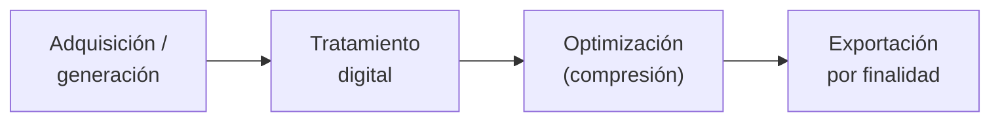

# Diseño de Interfaces Web

## Unidad 19 · Marco legal del contenido multimedia y preparación de archivos

**Módulo 0615 · Diseño de Interfaces Web**  
CFGS Desarrollo de Aplicaciones Web (DAW)

---

## Objetivos de aprendizaje · I

- Explicar qué es el **derecho de autor** (propiedad intelectual) y cómo se aplica al contenido multimedia de la web
- Identificar y distinguir los principales tipos de **licencias**: dominio público, licencias propias y **Creative Commons** (y sus variantes)
- Seleccionar **fuentes legales** de imágenes, audio, vídeo e iconos y documentar la procedencia y licencia de cada activo

Note: Esta unidad aporta la dimensión legal que el RA3 exige y que suele quedar huérfana. Mensaje central: por defecto TODO contenido multimedia que no has creado está protegido. "Es gratis" o "lo encontré en Google" no es permiso.

---

## Objetivos de aprendizaje · II

- Preparar archivos multimedia con el flujo completo: **adquisición → tratamiento → optimización → exportación** al formato según su finalidad
- Reconocer los **riesgos legales** y aplicar buenas prácticas (atribución, diligencia debida, inventario de activos)
- Vinculación directa con el **RA3** del módulo 0615 (prepara archivos multimedia para la web): cumple el **CE 3.a** «reconocer las implicaciones de las licencias y los derechos de autor» y refuerza CE 3.c–3.g

Note: Complementa a la Unidad 12, que cubre el aspecto técnico (formatos, optimización, integración → RA4). Juntas, U12 + U19 cubren íntegramente los RA3 y RA4. Aquí cerramos el criterio legal 3.a.

---

## Propiedad intelectual y derecho de autor

Protege las **obras originales** desde su creación, sin necesidad de registro.

| | Qué protege | Duración (ES/UE) |
|---|---|---|
| **Derechos morales** | Paternidad de la obra (inalienables) | Vitalicios / irrenunciables en gran parte |
| **Derechos patrimoniales** | Explotación económica (reproducción, distribución…) | Vida del autor + **70 años** |

En web esto es crítico: **copiar una imagen de Google Images, un vídeo de YouTube o una canción de Spotify suele ser infracción**, aunque la web sea educativa.

Note: La excepción no es "no cobro", sino contar con el permiso del titular (compra, licencia o dominio público). El uso académico publicado también puede infringir.

---

## Dominio público y licencias

Una obra entra en **dominio público** al caducar la protección o por renuncia del titular → uso libre (incluso comercial).

Precaución: «parece antiguo» ≠ dominio público; algunas ediciones/fotografías de obras clásicas siguen protegidas.

**Condiciones que hay que leer SIEMPRE en una licencia:**
- **Uso comercial vs no comercial (NC)** · **Modificación permitida o no (ND)** · **Atribución requerida (BY)** · **Términos específicos del banco**

Note: "Gratuito" tiene condiciones. Si el proyecto genera ingresos, las licencias NC lo prohíben. Y si la licencia exige atribución, omitirla incumple el permiso aunque sea gratis.

---

## Creative Commons

| Condición | Significado |
|---|---|
| **BY** | Atribuir la autoría (TATL) |
| **NC** | Uso no comercial |
| **ND** | Sin obras derivadas (no modificar) |
| **SA** | Compartir por igual (mismos términos) |

Combinaciones: **CC BY** (la más libre) · CC BY-SA · CC BY-NC · CC BY-ND. **CC0** = renuncia total (dominio público dedicado).

Regla práctica: para uso comercial o modificable, busca **CC0 / CC BY**; evita **NC/ND**.

Note: Enseñad a leer el sello CC. Para un proyecto que podáis modificar y usar en producción, NC y ND son trampas: la primera bloquea lo comercial, la segunda impide adaptar el activo.

---

## Fuentes legales de contenido multimedia

  
<strong>Imágenes</strong> Unsplash · Pexels · Pixabay (licencias permisivas; lee los términos)

  
<strong>Audio / música</strong> Freesound (CC) · Incompetech (Kevin MacLeod, CC BY)

  
<strong>Vídeo</strong> Pexels · Coverr

  
<strong>Iconos / ilustración</strong> SVG Repo · Heroicons · Flaticon (licencia por icono + atribución)

  
<strong>Tipografías web</strong> Google Fonts (SIL Open Font License: self-hosting y uso comercial) · foundries con licencia web explícita

Criterio de elección: compatibilidad de la licencia con el fin, posibilidad de modificar, atribución y fiabilidad de la fuente.

Note: Cerrad con el criterio: no es "¿es gratis?", sino "¿la licencia encaja con lo que voy a hacer?". Documentad siempre la fuente elegida.

---

## Tipografías, iconos y frameworks: licencias específicas

<strong>Fuentes web:</strong> distinguir *descarga local* de **licencia de embebido/web** (nº de vistas). Self-hostear una fuente comercial sin licencia = infracción.

<strong>Iconos y componentes:</strong> muchos son CC BY o tienen licencias propias que exigen atribución o prohíben ciertos usos (p. ej., logotipos).

El formato del activo **no** implica libertad de uso: un `.woff2` bonito puede estar muy restringido.

Note: Es uno de los riesgos más invisibles: usar una tipografía "descargable" en producción sin la licencia web correspondiente. La OFL (Google Fonts) sí lo permite; otras, no.

---

## Flujo de preparación de archivos multimedia

- **Adquisición:** crear o obtener de fuente legal (documentando la licencia)
- **Tratamiento:** recorte, color, limpieza, redimensionado al tamaño real de uso (CE 3.d–3.e)
- **Optimización:** Squoosh/Sharp (imagen), FFmpeg (audio/vídeo); quitar EXIF; elegir formato (foto → WebP/AVIF · UI/iconos → SVG) (CE 3.g)
- **Animación a partir de imágenes fijas:** sprites, secuencias o Lottie (CE 3.f)

Cada activo deja constancia de su **cadena de custodia**: origen, licencia, autor, fecha y transformaciones.

Note: Este flujo es el núcleo práctico del RA3. La optimización ya se vio en U12; aquí se añade la capa legal (de dónde viene) y la documentación (inventario).

---

## Atribución e inventario de activos

Para **CC BY**, la atribución sigue el patrón **TATL**: Título · Autor · Título de la licencia (con enlace) · "si modificaste, indícalo". *
Ej.: «Fotografía de ciudad» por Ana García, CC BY 4.0 (creativecommons.org/licenses/by/4.0)

| Activo | Origen | Autor | Licencia | Atribución | Uso |
|---|---|---|---|---|---|
| hero-city.jpg | Pexels | (Pexels) | Pexels | No | Portada |
| bg-music.mp3 | Incompetech | K. MacLeod | CC BY 3.0 | Sí (TATL) | Vídeo promo |
| icon-cart.svg | Heroicons | (Heroicons) | MIT | No | Carrito |

El **inventario de activos** alimenta la guía de estilo y es vuestra defensa ante una reclamación (CE 3.h).

Note: El inventario no es burocracia: es la prueba de la diligencia debida. Si mañana llega un takedown, la tabla con origen+licencia es lo que os protege.

---

## Casos reales

- <strong>Wikipedia / Wikimedia:</strong> todo su multimedia se rige por licencias libres (CC BY-SA, CC0 o dominio público) y exige atribución → gestión legal a gran escala.
- <strong>Takedowns:</strong> son frecuentes las sanciones a sitios que usan fotografías "de Google" con copyright; la lección es verificar la fuente y conservar la licencia.
- <strong>Tipografías web:</strong> incidentes por self-hostear fuentes comerciales sin licencia recuerdan que el activo no implica libertad de uso.

Note: El caso de Wikimedia demuestra que hasta una enciclopedia aplica licencias estrictas a cada imagen. Si ellos lo hacen, un proyecto de FP también debe hacerlo.

---

## Actividades propuestas

  
<strong>1. Auditoría legal de un sitio real (RA3 / CE 3.a)</strong> Audita los activos de una web pública: identifica ≥5 imágenes/vídeos/iconos, su probable titular/licencia y riesgos. Informe con recomendaciones.

  
<strong>2. Política de activos para la guía de estilo (CE 3.h)</strong> Define licencias admitidas, fuentes autorizadas, formato de atribución e inventario; intégralo en la guía de estilo (U4).

  
<strong>3. Flujo completo de preparación (CE 3.c–3.g)</strong> De una foto y un clip de audio: tratamiento → optimización → exportación a varios formatos por finalidad, documentando cada paso.

  
<strong>Ampliación</strong> Compara 3 bancos (licencia, calidad, búsqueda, atribución) · estudia las condiciones web de 5 familias tipográficas (OFL vs comerciales).

Note: La actividad 1 evalúa directamente el CE 3.a. Pedid que el inventario incluya al menos un activo con licencia CC BY para practicar la atribución TATL real.

---

## Buenas prácticas

- ✅ **Nunca asumas** que un contenido es libre porque lo encontraste: verifica la licencia
- ✅ **Documenta** origen, autor y licencia de cada activo en un inventario
- ✅ Prefiere **CC0 / dominio público / permisivas** si el uso es comercial o implica modificación
- ✅ **Atribuye** correctamente (TATL) lo que exija BY y conserva el rastro
- ✅ Fija una **política de activos** en la guía de estilo con responsable por recurso

Note: Cinco hábitos que evitan sanciones. El más importante es el primero: ante la duda, sustituye el activo por uno con licencia clara o créalo tú mismo.

---

## Errores frecuentes

- ❌ **«Es gratis, lo uso»**: gratuito ≠ sin condiciones (comercial, atribución, modificación)
- ❌ **Buscar en Google Images y descargar**: casi siempre infringe; usa bancos con licencia explícita
- ❌ **Olvidar la atribución CC BY**: usar el activo sin creditar incumple la licencia
- ❌ **Self-hostear tipografías comerciales** sin licencia web
- ❌ **No dejar rastro documental**: sin inventario no puedes demostrar diligencia debida

Note: El error más común es "lo vi en internet, lo uso". Repetid que la fuente nunca da permiso por sí sola: solo la licencia del titular lo hace.

---

## Resumen · Conceptos clave

- 🎯 **Derecho de autor**: protege obras originales; por defecto todo está protegido (vida + 70 años)
- 🎯 **Dominio público** y **licencias** definen qué puedes hacer: comercial, modificar, atribuir
- 🎯 **Creative Commons**: BY · NC · ND · SA (+ CC0); para lo modificable/comercial, busca CC0/CC BY
- 🎯 **Fuentes legales** por tipo (imagen, audio, vídeo, iconos, tipografía) + leer los términos del banco
- 🎯 **Flujo de preparación**: adquisición → tratamiento → optimización → exportación (CE 3.c–3.g)
- 🎯 **Atribución TATL + inventario de activos** = diligencia debida y política en la guía de estilo (CE 3.a, 3.h)

Note: Cerrad con la idea central: el RA3 no es solo "saber optimizar una imagen", es saber de dónde viene cada activo y bajo qué condiciones. U12 dio el *cómo técnico*; esta unidad da el *marco legal*.

---

## Recursos clave

  
<strong>Licencias y dominio público</strong> Creative Commons · creativecommons.org/licenses Elige tu licencia · choose.cc.es / choosecreativecommons.org OEPM (España) · oepm.es

  
<strong>Bancos de recursos</strong> Unsplash · Pexels · Pixabay (imagen) Freesound · Incompetech (audio) Pexels · Coverr (vídeo) · SVG Repo · Heroicons (iconos) Google Fonts (SIL OFL)

Note: Todo lo citado es gratuito y con licencia clara. Para el proyecto final, recomendad montar desde el día uno la carpeta de inventario de activos con su tabla de licencias.

---

## Próximos pasos · Proyecto final integrador

La unidad 19 **cierra la secuencia** del módulo 0615

- <strong>Proyecto final:</strong> aplicar lo aprendido en las unidades 01-19
  - Planificación, arquitectura de la información y UX (U01-U06, U16)
  - HTML semántico, CSS profesional, Flexbox/Grid y responsive (U07-U11)
  - Multimedia e interactividad accesibles (U12, U13)
  - Accesibilidad WCAG y usabilidad (U14, U15)
  - Estilos con Tailwind 4 y preprocesadores (U17, U18)
  - **Marco legal del contenido multimedia** (U19)
- Continuación del itinerario DAW: desarrollo frontend con **Angular**

Note: Presenta el proyecto final como la integración de todo el módulo: de la planificación a la maquetación, pasando por accesibilidad y el marco legal de los activos. Avanza la siguiente fase con Angular, donde Tailwind encaja de forma natural.

---

## ¿Preguntas?

Unidad 19 · Marco legal del contenido multimedia y preparación de archivos

0615 · DAW · Curso 2025/2026

Note: Cierre del módulo. Recoged dudas sobre licencias y el proyecto final, y recordad que los apuntes de las 19 unidades y la documentación oficial quedan disponibles para el trabajo integrador.
